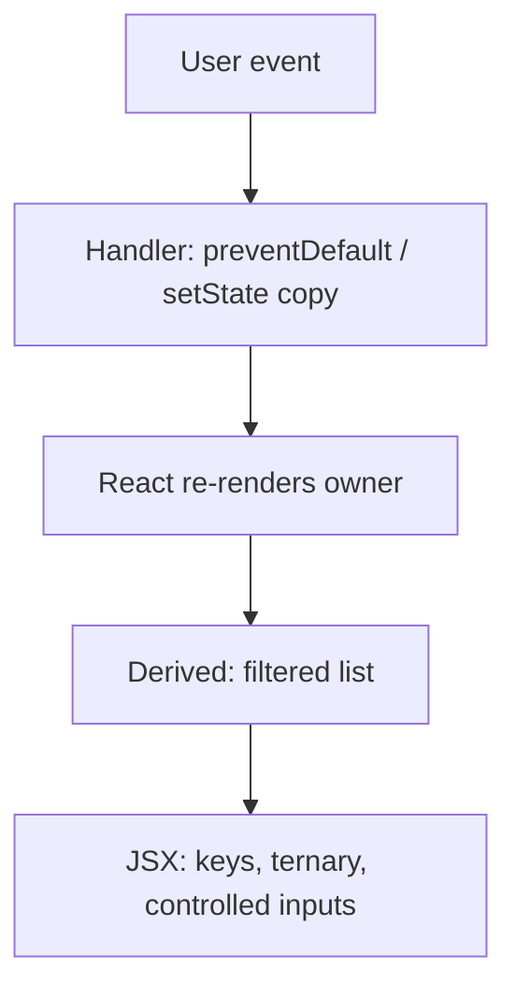
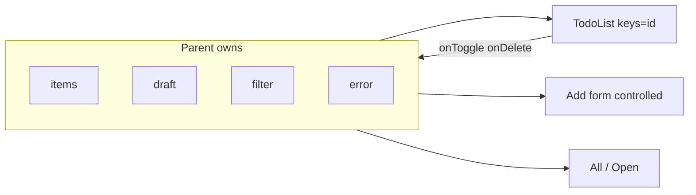

# Month 6 · Week 2 · Day 3
# From Memory: State, Lists, and a Todo-Shaped Form

**Month index:** [../../README.md](../../README.md)  
**Week 2:** [1](day-01.md) · [2](day-02.md) · Day 3 (today) · [4](day-04.md) · [5](day-05.md) · [6](day-06.md) · [7](day-07.md)  
**Week rhythm today:** Implement from memory  
**Study time:** 3–4 focused hours  
**Student state:** You queued re-renders with `useState` and keyed a list. Today those ideas must live in your fingers.  
**Days 1–2 of this week:** closed during the drills. Repair from **those day files in this textbook**, not from react.dev as the teacher.

This is **not** Project 4. You will not paste a dashboard. You will build a small **todo-like** list in a new Vite app (or a clean folder inside `week-02-state` — prefer a **new** app so you scaffold from memory).

---

## How to read this chapter

Day 1 and Day 2 had type-along scripts. During the drills they stay **closed**. This file contains a recap so you are not sent to another site to learn.

A React screen that changes is **state** plus **events** plus a **tree**. Today you rebuild that from this page.



Allowed:

- The complete explanation in this file
- Your own notes in `fullstack-lab`
- The error in front of you (`tsc`, infinite loop, page reload)

Not allowed:

- Pasting a finished `App.tsx` from AI
- Copying Day 1–2 lab files
- Browsing react.dev as the teacher

If you are stuck **more than 25 minutes** on one task, open **only** the matching Day 1 or Day 2 section **in this textbook**, read it, close it, continue from memory. Record what you had to look up in `lookups.txt`. That list is tomorrow’s repair list.

There is **no complete solution** in this file. The app is specified. You write it.

---

## Complete explanation (state + lists + forms)

This section **is** the lesson. Read a paragraph. Close it. Say it in one honest sentence. Then type the spec.

### State is memory React knows about

`const [value, setValue] = useState(initial)` returns the **current** value and a **setter**. The setter **queues a re-render**. It does not return the new value. The `value` binding in this function call stays the old snapshot.

```tsx
setCount(count + 1);
// count is still the old number here
```

When the next value **depends on** the previous, use the function form so queued updates chain:

```tsx
setCount((n) => n + 1);
setItems((current) => [...current, next]);
```

**Wrong belief:** “`let n = 0` in the component is state.”  
**Correct:** `let` resets every render. React does not subscribe to it. `useState` is the subscription.

Call `useState` at the **top level** of the function component, not inside `if`. Two instances of the same component do not share state.

### Events — pass the function

`onClick={handle}` passes a function. `onClick={handle()}` **calls** it during render. That can loop if the handler sets state.

`onChange` on an input: `event.target.value` is a string.  
`onChange` on a checkbox: `event.target.checked` is a boolean.  
`onSubmit` on a form: `event.preventDefault()` or the document **reloads** and RAM state dies.

**Wrong belief:** “React stopped HTML form navigation.”  
**Correct:** you stop it. Every time.

### Values down, callbacks up; lift when sharing

State lives in the component that called `useState`. Children receive **props**: the value, and a function to request a change. If two children need the same data, **lift** `useState` to the nearest common parent.

Do not mutate props. Do not `items.push`. Copy:

```tsx
[...items, next]
items.filter((item) => item.id !== id)
items.map((item) => (item.id === id ? { ...item, done: !item.done } : item))
```

### Derived, not stored

`const filtered = items.filter(...)` during render. Do not `useState` for the filtered array. Do not store `items.length` as state if `items` is already state.

Month 3 **`isBlank`**: `s.trim() === ""`. `"0"` is not blank. `"   "` is.

### Conditional rendering

- Ternary for if/else UI: `{done ? "Done" : "Open"}`.
- `null` to render nothing.
- `{count && <X />}` **paints `0`**. Write `count > 0 &&` or a ternary.

### Keys

`key={item.id}` on the element returned from `map`. Ids assigned **when the item is created**, not `Math.random()` inside `map`, not the **index** if the list inserts, deletes, or filters in a way that reorders.

Index keys make React reuse the wrong row. Random keys remount every render (focus lost, toggles reset).

### Controlled inputs

```tsx
<input value={draft} onChange={(event) => setDraft(event.target.value)} />
<input type="checkbox" checked={item.done} onChange={() => onToggle(item.id)} />
```

React state is the source of truth. Uncontrolled + ref is Week 3. Prefer controlled this month.

Show errors as **JSX text** (`<p role="alert">{error}</p>`). Never `dangerouslySetInnerHTML`. JSX text is `textContent`.

Type props. No `any`. Function components + hooks only.



Worked add handler (you type this into **your** names):

```tsx
function handleSubmit(event: React.FormEvent<HTMLFormElement>) {
  event.preventDefault();
  const title = draft.trim();
  if (title === "") {
    setError("Title is required.");
    return;
  }
  setError("");
  const next: Todo = {
    id: crypto.randomUUID(),
    title,
    done: false,
  };
  setTodos((current) => [...current, next]);
  setDraft("");
}
```

Toggle must copy the **item**, not flip a field on the existing object:

```tsx
function handleToggle(id: string) {
  setTodos((current) =>
    current.map((todo) =>
      todo.id === id ? { ...todo, done: !todo.done } : todo,
    ),
  );
}
```

**Wrong belief:** “`todo.done = !todo.done; setTodos(todos)` is an update.”  
**Correct:** same array, same object. React may skip the paint. Even if DevTools looks dirty, you lied about identity.

**Wrong belief:** “Filter belongs in `useEffect` so I do not compute during render.”  
**Correct:** `const visible = filter === "open" ? todos.filter((t) => !t.done) : todos` is render. An effect that `setVisible`s is two sources of truth. Week 3 will punish that habit.

If the add field is `value={draft}` and letters do not appear, you forgot `onChange`. If the page flashes empty after submit, you forgot `preventDefault`. If a checkbox you ticked jumps to a new first row, you used `key={index}`.

Filter controls that sit **inside** the add `<form>` will submit the form unless they are `type="button"`. Prefer the filter **outside** the form. That is not decoration; it is HTML.

`BOUNDARY.md` must name who owns `todos`, `draft`, `filter`, and `error`. The list child receives `todos` (or `visible`) and `onToggle`. It does not call `useState` for the array.

---

## Today's contract

Rebuild Week 2 skills as if this were a lab exam.

**Today's gate**

> A todo-like list I wrote without looking at Day 1–2: add, toggle done, filter all/open, controlled inputs, id keys, no in-place mutation, submit does not reload.

If you cannot, stay here. Day 4’s widget will not hide a mushy key story.

---

## Time box

| Block | Minutes | Work |
|---|---|---|
| A | 25 | Closed-book oral review (no typing yet) |
| B | 40 | Memory drills: setter snapshot, `&&`, keys |
| C | 80 | Spec: todo-like list |
| D | 40 | Debug the reload and a mutation if they appear |
| E | 20 | Git + lookups |

---

# Block A — Speak first

Out loud, no notes, no editor:

1. What `useState` returns, and why `setCount` does not give you the next number on the next line.
2. When `setN(n => n + 1)` is required.
3. Why `onClick={fn()}` is a bug.
4. What `preventDefault` prevents on submit.
5. Why index keys fail when you insert at the top.
6. Why `{count && <p>{count}</p>}` can show `0`.
7. Controlled input in one sentence.
8. Why `filtered` is not state.

If any answer is mush, re-read that subsection above. Do not start the spec yet.

---

# Block B — Memory drills

Create `~\fullstack-lab\month-06\week-02-memory\` notes (a text file is enough) **before** scaffolding if you want; then scaffold.

`PREDICT.txt` — write answers **before** you run code:

1. After `setCount(0)` then two `setCount(count + 1)` in one click, what number shows? What if both are functional?
2. Will `{0 && <span>go</span>}` show “go”, show “0”, or show nothing?
3. If `key={index}` and you unshift a new todo, what happens to a checkbox you ticked on the old first row?

Then prove (1) and (2) with a **tiny** component you delete or keep labeled as drill. Write `ACTUAL.txt`. Science, not hope.

---

# Spec: todo-like list

Scaffold from memory (PowerShell, extra `--`):

```powershell
cd ~\fullstack-lab\month-06
npm create vite@latest week-02-memory -- --template react-ts
cd week-02-memory
npm install
npm run dev
```

Delete the Vite demo. Build this product — **not** Project 4, not a paste of Day 2’s service list.

**Item shape** (you type the `type`):

```ts
type Todo = {
  id: string;
  title: string;
  done: boolean;
};
```

**Behavior:**

1. **Add** — form with a labeled controlled text field. `onSubmit` → `preventDefault` → trim → `isBlank` → set a text error **or** append `{ id: crypto.randomUUID(), title, done: false }` with a **copied** array (spread or functional `setTodos`). Clear the draft on success.
2. **Toggle done** — checkbox **controlled** by `todo.done`. Parent updates with `map` + `{ ...todo, done: !todo.done }`. No `todo.done = true`.
3. **Filter** — control with two options at minimum: **all** and **open** (`done === false`). A third “done” filter is optional. Store the **filter name** in state (`"all" | "open"`). The visible list is **derived**.
4. **Keys** — `key={todo.id}` on the row. Never index. Never random-in-map.
5. **Empty** — when the derived list is empty, show a short message. Do not use `{length && ...}` if length can be `0`.
6. **Types** — no `any`. Props typed. `isBlank` in its own `.ts` file if you want tests later; inlined trim is allowed if you still treat `"0"` as a valid title.
7. **A11y** — real `<button>` / `<input type="checkbox">` / `<form>`. Labels. Error `role="alert"`.
8. Start with **zero or two** seed todos — your choice. If you seed, give them real ids.

`BOUNDARY.md`: who owns `todos`, `draft`, `filter`, `error`.

`NOTES.txt`: one paragraph — why toggle must copy the item object, not mutate `done` in place.

Stretch: delete with a callback. Stretch is optional; add/toggle/filter are not.

---

# Block D — If it “doesn’t work”

| Observation | Likely cause (from this week) |
|---|---|
| Flash then empty list; `?` in the URL | Missing `preventDefault` |
| Checkbox does not move; DevTools state unchanged | Mutated the object; same reference |
| Typed in add box, letters do not appear | Missing `onChange` on a `value={...}` input |
| Count of open items shows a stray `0` | `openCount &&` |
| Toggles follow the wrong row after add-at-top | `key={index}` |

Fix from this recap. Write the cause in `DEBUG.txt` if you hit one.

```powershell
cd ~\fullstack-lab
git add month-06/week-02-memory
git commit -m "Month 6 Day 3: todo-like list from memory."
```

---

# Block E — Recall and lookups

Close the files. Answer:

1. Functional update vs `setItems([...items, next])` in one click-handler — when does the spread-from-render snapshot lose?
2. Why `"   "` fails add and `"0"` must succeed.
3. Why the filter buttons should be `type="button"` if they sit inside the add form — or why the filter should live **outside** the form.

If you opened Day 1 or Day 2, `lookups.txt` lists the section titles.

---

## Definition of done

- [ ] Add, toggle, all/open work without looking at Day 1–2
- [ ] Controlled inputs; keys are ids
- [ ] No in-place mutation
- [ ] Submit does not reload
- [ ] PREDICT written before ACTUAL on the drills
- [ ] BOUNDARY.md and NOTES.txt exist
- [ ] Commit exists

---

## Optional review links

State, keys, and controlled inputs are explained in this chapter. These pages are for later checking, not for first learning.

- [React: State — a component's memory](https://react.dev/learn/state-a-components-memory)
- [React: Rendering lists](https://react.dev/learn/rendering-lists)
- [React: Conditional rendering](https://react.dev/learn/conditional-rendering)

---

## Tomorrow

A **search + list** widget you could drop on a shell: typed `Item`, empty state (Week 1 composition), keyboard submit. Still no fetch.
