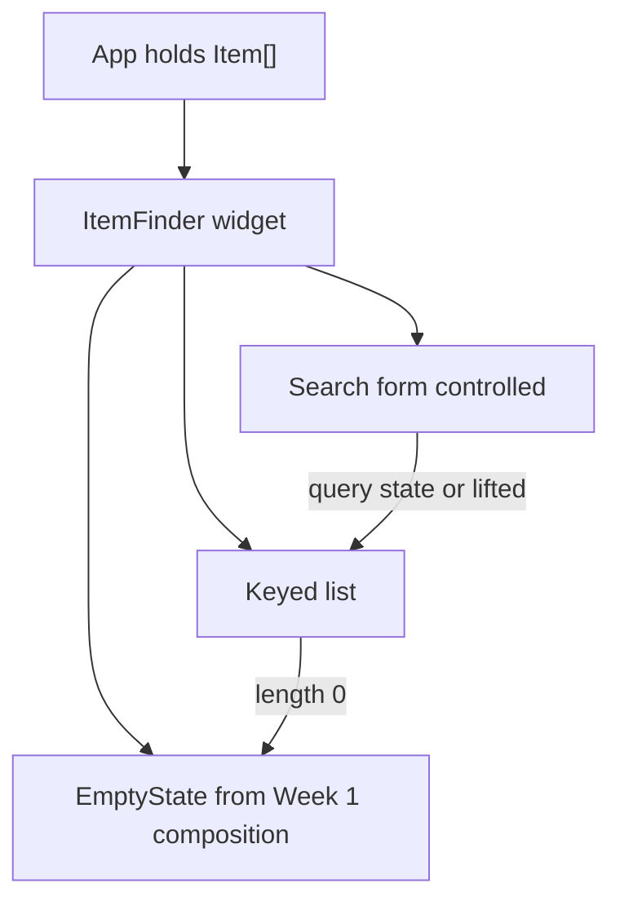

# Month 6 · Week 2 · Day 4
# Lab Feature: A Searchable List Widget

**Month index:** [../../README.md](../../README.md)  
**Week 2:** [1](day-01.md) · [2](day-02.md) · [3](day-03.md) · Day 4 (today) · [5](day-05.md) · [6](day-06.md) · [7](day-07.md)  
**Week rhythm today:** Add a real feature  
**Study time:** 3–4 focused hours  
**Prereq:** Day 3 gate. You can add, toggle, and filter from memory with controlled inputs and id keys.

Project 4 will need a **list you can search**. Start that habit now as a **widget**, not as the dashboard repo. This textbook will **not** give you Project 4 source. You will not fetch. Loading UI is Week 3 / Week 4. Today the data is **in memory**.

Week 1 taught composition: small components, typed props, `children`, a **boundary**. Today those pieces become a search box + a list + an **empty state** the parent can reuse.

---

## How to read this chapter

Until yesterday, a list and a form could live in `App`. A widget you could imagine on a future dashboard **shell** has a clearer boundary: the parent owns the **array of items**; the widget owns **how you search and show** them — or the parent owns search too, if two widgets share a query. You will choose and write it down.

Picture a card on an operations page: a heading, a search field, rows. No router. No query library. Enter in the search field is **form submit** (apply / announce), and **typing** may already filter because the input is controlled. Both can be true: filter on each `onChange`, and `onSubmit` still `preventDefault` so Enter does not reload. That is the keyboard path.



Read Block A until you can say what the widget **owns** and why `EmptyState` is presentational. Then type the spec. Do not paste.

---

## Today's contract

By the end of this day you will be able to:

1. Type an **`Item`** and keep a list of them in state (or as a constant array if the lab never adds — this spec **does** search; adding is welcome if it stays a widget).
2. Compose **SearchField**, **ItemList**, and **EmptyState** with typed props.
3. Filter as a **derived** array. Show empty UI when nothing matches — including a **zero-item catalog**, and including “no matches for this query.”
4. Use a **`<form>`** so **Enter** submits; `preventDefault`; do not require a mouse.
5. Reuse Week 1 ideas: `children`, one `h1` / heading hierarchy, no `innerHTML`.

**Today's gate**

> A searchable list widget with a typed `Item`, id keys, an empty state component, and a form that does not reload on Enter. No fetch. No loading spinner required.

If the page reloads on Enter, you have not finished the keyboard path. Stay here.

---

## Time box

| Block | Minutes | Work |
|---|---|---|
| A | 50 | Theory: widget boundary, empty vs loading, keyboard submit |
| B | 40 | Type-along: `EmptyState` + controlled search |
| C | 80 | Feature spec: `week-02-widget` |
| D | 25 | Git |
| E | 15 | Recall |

---

# Block A — Theory

## 1. A widget is a boundary, not a folder religion

Week 1: **what does this function own?** A searchable list might own:

| Owns | Receives |
|---|---|
| The draft `query` string (if search is private to this card) | `items: Item[]` from a parent |
| How rows look | `title` for the card heading |
| Which empty message to show | optional `onQueryChange` if the parent must know the query |

Or the **parent** owns `query` because a sibling heading says “3 matches.” That is Day 1 **lift**. Both designs are honest. **Two** `useState`s for the same query are not.

**Wrong belief:** “I’ll put everything in `App` until Project 4.”  
**Correct:** the widget split is how you practice the boundary **before** routes exist. `App` can still be the parent that holds the array.

Name the component after the job (`CatalogPanel`, `ItemFinder`), not after a CSS framework.

---

## 2. Typed `Item` — Month 5 still applies

```ts
export type Item = {
  id: string;
  title: string;
  summary: string;
};
```

- **`id`** is for keys and for any later detail view. It is not optional today.
- **`title` / `summary`** are strings you render as **text**.
- Do not type `Item` as `any`. Do not use a class. Do not invent twenty optional flags (`isLoading`, `isDashboard`, `isProject4`).

A **constant seed** of six or more items is fine as `const INITIAL: Item[] = [...]`. Pass it into `useState(INITIAL)` if you will add/remove; keep it as a module constant if the list is read-only for this lab. Search works either way. If the list is read-only, `useState` for **items** is unnecessary — `useState` for **query** still is.

**Derived filter:**

```tsx
function matches(item: Item, query: string): boolean {
  const q = query.trim().toLowerCase();
  if (q === "") {
    return true;
  }
  return (
    item.title.toLowerCase().includes(q) ||
    item.summary.toLowerCase().includes(q)
  );
}
```

`q === ""` means “show all.” That is not `isBlank` rejecting submit — a blank search is a **valid** “show everything.” `isBlank` belongs on **add title**, not on search, unless you invent an error for blank search (you should not: empty query is a real state).

Month 3: `"0"` is a query. If an item title contains `0`, it can match. Do not write `if (!query)` and treat `"0"` wrongly — `"0"` is truthy anyway; the trap is `Number` or skipping trim. Trim for matching; do not coerce to number.

---

## 3. Empty state is not loading, and not an error

Three different UIs (Month 6 README: you will own loading/empty/error; **loading is not required today** because there is no fetch):

| Situation | UI |
|---|---|
| You have items and some match | the list |
| You have items and **none** match this query | empty **search** — “No items match. Try another word.” |
| You have **zero** items at all | empty **catalog** — “Nothing here yet.” |
| Network in flight | loading — **not today** |
| Fetch failed | error — **not today** |

**Wrong belief:** “I’ll show a spinner because dashboards have spinners.”  
**Correct:** a spinner without a wait is a lie. No `useEffect`. No fake `setTimeout` loading unless you label it a stretch **and** you understand it is fake.

Week 1 composition: **`EmptyState`** is presentational. It does not know about search. It receives a **title** and optional **`children`** (a hint paragraph, a link-looking span that is not a router link).

```tsx
import type { ReactNode } from "react";

type EmptyStateProps = {
  title: string;
  children?: ReactNode;
};

export function EmptyState({ title, children }: EmptyStateProps) {
  return (
    <div role="status">
      <p>{title}</p>
      {children}
    </div>
  );
}
```

`role="status"` is polite live-region-ish for “the results changed to empty.” Do not copy-paste ARIA you cannot name; this one you can: the status of the list.

If you already built `EmptyState` in Week 1, **copy the idea into this app** (this is a new Vite project — you type it again, you do not import across apps). Same props. Same boundary: it does **not** invent the message; the parent passes the title.

```tsx
{visible.length === 0 ? (
  <EmptyState title={query.trim() === "" ? "No items yet." : "No matches."}>
    {query.trim() === "" ? null : <p>Try a different search.</p>}
  </EmptyState>
) : (
  <ItemList items={visible} />
)}
```

Use a **boolean** for the condition (`visible.length === 0`), not `{visible.length && ...}`.

---

## 4. Keyboard: the form is the submit path

Month 2 / Month 3: users submit with **Enter**. A search box that only filters on `onChange` already updates as they type — good. Wrap it in `<form onSubmit={handleSubmit}>` anyway.

```tsx
function handleSubmit(event: React.FormEvent<HTMLFormElement>) {
  event.preventDefault();
  // query is already in state; filter is already derived.
  // Submit may move focus to the list, or do nothing but not reload.
}
```

A submit button labeled **Search** (or visually hidden text with an accessible name) makes the control discoverable. `type="submit"` is the default for a button in a form — **say it anyway**. Any extra button that must not submit is `type="button"`.

**Wrong belief:** “Filtering on each keystroke means I don’t need a form.”  
**Correct:** without a form, Enter in the input may still do the browser’s default (reload / navigate). The form is how you **own** Enter.

Do not use `onKeyDown` on the input as your only submit hack (`if (key === "Enter")`). Use the form. `onKeyDown` fights IME and duplicates what HTML already does.

---

## 5. List rows stay components

```tsx
type ItemListProps = {
  items: Item[];
};

export function ItemList({ items }: ItemListProps) {
  return (
    <ul>
      {items.map((item) => (
        <ItemRow key={item.id} item={item} />
      ))}
    </ul>
  );
}

function ItemRow({ item }: { item: Item }) {
  return (
    <li>
      <h3>{item.title}</h3>
      <p>{item.summary}</p>
    </li>
  );
}
```

`key` goes on `ItemRow` in the `map`, not inside `ItemRow`. Keys are for the **array** React sees.

Titles and summaries are **text**. A summary that contains `<b>` must show angle brackets, not bold.

---

## 6. Worked filter — what the screen should do

Hard-code six items. You will type your own titles; this table is the **decision**, not the product:

| Query (after trim) | Matches |
|---|---|
| `""` (empty) | all six |
| `"  "` then trim → `""` | all six |
| `"lamp"` | every item whose title **or** summary contains `lamp` (case-insensitive) |
| `"0"` | items that contain the character `0`, or **none** — empty state, not an error |
| `"zzzz"` | none → `EmptyState` “No matches.” |

Do not `toLowerCase` the **items array in state**. Lowercase a **local** copy of the query and compare. Mutating `item.title` to lowercase would destroy the heading on the next render that reads state.

**Wrong belief:** “I’ll `setItems` to the filtered array so I don’t have to filter again.”  
**Correct:** then clearing the search cannot bring rows back unless you kept a second copy. Keep the full catalog. Derive `visible`.

Count line: `{visible.length} matches` is derived. Do not `useState` for the number. If you render `{visible.length && <p>…</p>}` you will paint **0** when empty — Day 2 trap. Write `{visible.length === 0 ? <EmptyState … /> : <ItemList … />}`.

---

## 7. Headings, landmarks, and tomorrow’s tests

One **`h1`** for the page (studio or “Toolkit”). The widget heading is **`h2`**. Row titles **`h3`** if they are headings, or a `<p>` / `<span>` if they are not a new section. Do not put `h1` inside every card.

`<form role="search">` or the HTML `<search>` element gives a landmark. Label the input with visible text “Search” (or “Filter tools”). Prefer `type="search"` so Testing Library can `getByRole("searchbox")` on Day 5. If you use `type="text"`, Day 5 queries `textbox` — either is honest; **searchbox** matches the job.

`htmlFor` + `id` (or wrap the input in `<label>`). Day 5 is not a reason to add `data-testid="search"` as the first move.

Submit button accessible name: “Search” even if you also filter on each keystroke. The name is what `getByRole("button", { name: /search/i })` will use.

---

## 8. What you are not building

| Not today | When |
|---|---|
| `fetch` / `useEffect` | Week 3 |
| React Router | Week 4 |
| TanStack Query, RHF, Zod | Month 7 |
| Redux | not this month |
| Project 4 screens | its own repo, later |
| `dangerouslySetInnerHTML` | not this course month |

If you feel the urge to add a sidebar layout from a template, stop. CSS you type. One column is enough.

**Wrong belief:** “A widget needs loading because dashboards load.”  
**Correct:** loading is a UI for **waiting**. There is no wait. Showing a spinner over in-memory data trains you to lie to operators.

---

# Block B — Type-along

## B1 — Scaffold

```powershell
cd ~\fullstack-lab\month-06
npm create vite@latest week-02-widget -- --template react-ts
cd week-02-widget
npm install
npm run dev
```

Delete the demo. Confirm HMR on a heading you typed.

## B2 — `EmptyState`

Type `src/EmptyState.tsx` as above. Render it alone from `App` with a title. Confirm `role="status"` in the Accessibility pane or Elements.

## B3 — Controlled search without a list

One labeled input, `value` + `onChange`, inside a form with `preventDefault`. Echo the query under the field. Enter must **not** reload. Write `ENTER.txt`: what you saw in the URL bar before and after the fix if you forgot `preventDefault` first (forget it on purpose once).

---

# Feature spec

Build a **catalog widget** for a fictional studio toolkit (six tools, six plants, six radio frequencies — **not** Project 4’s entities). Hard-coded `Item[]`.

**Must:**

1. `type Item = { id: string; title: string; summary: string }`.
2. `EmptyState` with `title` + optional `children`.
3. Search `<form>`: labeled field, submit button, `preventDefault`. Filter **as they type** (derived). Enter does not reload.
4. `ItemList` + row component; `key={item.id}`.
5. Empty: distinguish **no items in data** vs **no matches** if you can (two seed modes, or a message that includes the query as **text**).
6. `App` composes the widget. `BOUNDARY.md`: receive / own / must not invent for `App`, `ItemFinder` (or your name), `EmptyState`, `ItemList`.
7. CSS you write: readable type, spacing, a max-width. Semantic `main`, `search` landmark is welcome (`<search>` or `<form role="search">` — if you use `role="search"` on the form, you can name it).
8. No fetch, no loading flag, no Router.

**Should:**

- At least **six** items so a search can hide some.
- `htmlFor` / `id` on the search field so Day 5 can `getByLabelText` / `getByRole('searchbox')`.

**Stretch (optional):** add-item form on the same page (Day 2 skills) **or** a clear-query `type="button"` that `setQuery("")`. Stretch is not a second product.

Suggested file shape:

```
src/
  App.tsx
  main.tsx
  types.ts
  isBlank.ts
  EmptyState.tsx
  ItemList.tsx
  ItemFinder.tsx
  index.css
```

`isBlank` is optional for search. Use it if you add an add-form stretch.

```powershell
cd ~\fullstack-lab
git add month-06/week-02-widget
git commit -m "Week 2 Day 4: searchable list widget with EmptyState."
```

---

# Block E — Recall

Close the files.

1. Why is blank search allowed but blank add-title not?
2. Why no spinner today?
3. Where does `key` go — inside the row component, or on the component in `map`?
4. Why wrap a live-filter input in a `<form>`?
5. What does `EmptyState` own vs receive?

---

## Definition of done

- [ ] Typed `Item`; six+ items; derived filter
- [ ] `EmptyState` used for zero matches (and zero catalog if you distinguished it)
- [ ] Form Enter does not reload
- [ ] Keys are ids
- [ ] BOUNDARY.md exists
- [ ] No fetch, no `any`, no `dangerouslySetInnerHTML`
- [ ] Commit exists

---

## Optional review links

Composition, controlled inputs, and lists are explained in this chapter and Days 1–2.

- [React: Thinking in React](https://react.dev/learn/thinking-in-react)
- [React: Sharing state between components](https://react.dev/learn/sharing-state-between-components)
- [MDN: `<search>`](https://developer.mozilla.org/en-US/docs/Web/HTML/Element/search)

---

## Tomorrow

**Tests** with React Testing Library: type into search, assert rows. Query by **role** and **label**, not CSS class. You will not assert `useState` internals.
