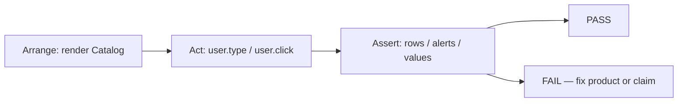

# Month 6 · Week 2 · Day 5
# Tests: Search and Forms Through the User's Eyes

**Month index:** [../../README.md](../../README.md)  
**Week 2:** [1](day-01.md) · [2](day-02.md) · [3](day-03.md) · [4](day-04.md) · Day 5 (today) · [6](day-06.md) · [7](day-07.md)  
**Week rhythm today:** Tests + refactor + documentation  
**Study time:** 3–4 focused hours  
**Student state:** You have a searchable list (Day 4 widget and/or Day 2 add form). Today you **claim** that typing and submitting still work after a refactor.

Week 1 Day 5 introduced a first `render` if you completed it. This file **reteaches** Testing Library enough to test **this week’s** UI. You do not need Week 4’s router tests. You do not test `useState` by name.

---

## How to read this chapter

Month 3’s `node --test` claimed things about **pure functions**. Today the claim is about **what a person can see and do**: a search box, rows, an add form.

React Testing Library (RTL) renders your component into a fake document (`jsdom`) and lets you **find** nodes the way a user (or a screen reader) would: **role**, **label**, **text** — not `div.MuiBox-root:nth-child(3)`.



Read Block A until you can say why `getByRole('textbox', { name: /search/i })` is better than `container.querySelector('#q')`. Then write tests from the **spec**, not from a happy memory of the browser.

If you finish early, do not add Router. Add one more assertion: empty state appears when the query matches nothing.

---

## Complete explanation (component tests this week)

### What we are proving

**A test is a claim that can fail.** Not “I typed in Chrome and it looked right.”

Good claims for this week:

- Typing `north` into the search field **hides** rows whose title/summary do not match and **keeps** a matching row.
- Submitting the add form with a title **adds a list item** the user can read.
- Submitting a blank (or whitespace) title **shows an error** and does **not** add a row.
- Enter on the form does not need a real browser navigation — `preventDefault` is implied if the list is still there and a new row appeared.

Bad claims:

- `useState` was called.
- The `query` hook value is `"north"` (implementation detail).
- A CSS class is `active`.
- `key` equals `svc-1` (keys are not visible; you prove keys **indirectly** if you must — e.g. reorder behavior — not by reading props).

**Wrong belief:** “I’ll export the state setter and call it from the test.”  
**Correct:** the test types and clicks. If you cannot find the control by role or label, the **product** is inaccessible, not just untested.

### Arrange, act, assert

1. **Arrange** — `render(<ItemFinder items={seed} />)` (or render `App` if that is the only export). Seed data should be **small and obvious**: two items with distinct titles (`"Alpha lamp"`, `"Beta chair"`).
2. **Act** — `await user.type(field, "alpha")` or `await user.click(button)`. Use **`@testing-library/user-event`**, not `fireEvent` as your default. `user-event` fires the sequence a user causes (focus, keydown, input, change).
3. **Assert** — `expect(screen.getByRole("listitem", { name: /alpha lamp/i })).toBeInTheDocument()` and `expect(screen.queryByRole("listitem", { name: /beta chair/i })).not.toBeInTheDocument()`.

`getBy…` **throws** if missing (good when you expect it present). `queryBy…` returns `null` (good when you expect it **absent**). `findBy…` waits (you do not need waits today — no fetch).

### Queries you will use — role and label

| You want | Query |
|---|---|
| Search box | `getByRole("searchbox", { name: /search/i })` **or** `getByRole("textbox", { name: /search/i })` |
| Labeled input | `getByLabelText(/title/i)` |
| Submit | `getByRole("button", { name: /add/i })` |
| List | `getByRole("list")` |
| Row | `getByRole("listitem", { name: /…/i })` if the accessible name includes the title |
| Error | `getByRole("alert")` |

The **accessible name** of a textbox comes from `<label>` (wrapping or `htmlFor`). If the test cannot find it, add a real label — do not add `data-testid` as the first move. `data-testid` is a last resort this course barely needs this month.

A `<input type="search">` exposes role **searchbox**. A plain `type="text"` exposes **textbox**. Match what you actually rendered. If the test fails with “Unable to find role=searchbox”, you used `type="text"` — query `textbox`, or change the input type **because search is search**, not because the test nagged you into a lie.

**Wrong belief:** “I’ll `getByTestId('row-0')` like Cypress tutorials.”  
**Correct:** role and label survive a class rename. They also force you to ship a label.

### What `userEvent.setup()` is

```tsx
const user = userEvent.setup();
await user.type(screen.getByLabelText(/search/i), "alpha");
```

Call **`setup()` once per test** (or in a helper). Do not use the leftover default export `userEvent.type` style as your mental model — the setup object is the current API. `type` is **async**; **await** it.

`user.click(submit)` on a `type="submit"` button submits the form if the button is in the form. That is what you want: you are testing the **form**, not a private `handleSubmit`.

### Do not test internals

| Do not | Do |
|---|---|
| Spy on `useState` | Type and read the DOM |
| Read `result.current` from a hook test library | You are not testing a hook in isolation today |
| Snapshot a huge HTML dump | Assert the row text / count of listitems |
| `container.firstChild.className` | Role queries |

If a refactor from one `useState` to two (lift query) **breaks** a test that only cared about visible rows, the test was coupled to structure. Keep tests on **behavior** so lifting stays a refactor, not a rewrite of the suite.

### Typed search test (adapt names)

```tsx
import { expect, test } from "vitest";
import { render, screen } from "@testing-library/react";
import userEvent from "@testing-library/user-event";
import { ItemFinder } from "./ItemFinder";

const seed = [
  { id: "1", title: "Alpha lamp", summary: "Warm light" },
  { id: "2", title: "Beta chair", summary: "Quiet office" },
];

test("typing alpha hides the chair", async () => {
  const user = userEvent.setup();
  render(<ItemFinder items={seed} />);
  await user.type(screen.getByLabelText(/search/i), "alpha");
  expect(screen.getByText(/alpha lamp/i)).toBeInTheDocument();
  expect(screen.queryByText(/beta chair/i)).not.toBeInTheDocument();
});
```

**Wrong belief:** “I’ll `fireEvent.change` because it is shorter.”  
**Correct:** `user-event` is the default this month. It focuses and types. `fireEvent` is a sharper tool you do not need today.

**Wrong belief:** “Empty submit is tested by calling `handleSubmit` with a fake event.”  
**Correct:** click the real submit **button**. If the test cannot find that button by role, the product is the bug.

Windows install (PowerShell) still needs you `cd` into **this** app. Do not install into `month-06` itself.

### Deliberate fail

Break the filter on purpose (always return `true`). Run tests. See red. Restore. If nothing goes red, you asserted the wrong thing (e.g. you only checked that the search box exists).

---

## Today's contract

By the end of this day you will be able to:

1. Install Vitest, jsdom, Testing Library, and jest-dom matchers in a Vite `react-ts` app.
2. Write a test that **types into search** and asserts which rows remain.
3. Write a test for the **add form** (happy path + blank error) if your app has add; if the widget is search-only, test **empty state** instead of add, **and** add a tiny controlled add form **or** test Day 2’s app — you must test **an add form** today.
4. Query by **role** or **label** only.
5. Break a behavior, watch red, restore.

**Today's gate**

> `npm test` (or `npx vitest run`) is green for search-and-rows, I have tested an add form, and I have seen a test fail on purpose. I never asserted `useState`.

---

## Time box

| Block | Minutes | Work |
|---|---|---|
| A | 35 | Theory: RTL queries, user-event, what not to test |
| B | 50 | Install + first search test |
| C | 50 | Add-form tests + deliberate fail |
| D | 30 | `TESTS.md` + tighten labels |
| E | 15 | Recall |

---

# Block A note

You already read the complete explanation. Speak it: arrange / act / assert; `getBy` vs `queryBy`; why labels matter.

---

# Block B — Install (Windows PowerShell)

Work in `week-02-widget` (preferred) **or** `week-02-state` if that is where add+search live. One app must have **search + list**. Another test file may live in the app that has **add** — or add a minimal add form to the widget so one suite covers both. Simplest: **widget has search**; you **add** a small add form today if missing, then test both.

```powershell
cd ~\fullstack-lab\month-06\week-02-widget
npm install -D vitest jsdom @testing-library/react @testing-library/user-event @testing-library/jest-dom
```

`package.json` scripts: add `"test": "vitest run"` and `"test:watch": "vitest"`.

`vite.config.ts` — extend whatever Vite already generated. You need a **test** block. Typical shape (adjust imports if your file already imports `defineConfig` from `vite`):

```ts
/// <reference types="vitest/config" />
import { defineConfig } from "vite";
import react from "@vitejs/plugin-react";

export default defineConfig({
  plugins: [react()],
  test: {
    environment: "jsdom",
    setupFiles: "./src/test/setup.ts",
  },
});
```

If TypeScript complains about `test`, the triple-slash reference or `vitest/config` types are the fix — not `any`.

`src/test/setup.ts`:

```ts
import "@testing-library/jest-dom/vitest";
```

That teaches `expect(...).toBeInTheDocument()`.

`tsconfig` — if `vitest` types are missing on `describe`/`expect`, import them from `"vitest"` in each test file (this course **prefers explicit imports**):

```ts
import { describe, expect, test } from "vitest";
```

Do not set `"types": ["vitest/globals"]` as a superstition if you have not read what it does.

---

# Spec: tests you must write

`src/ItemFinder.test.tsx` (names may match your components).

**Seed** (in the test file, not a mystery database):

```ts
const seed: Item[] = [
  { id: "1", title: "Alpha lamp", summary: "Warm light" },
  { id: "2", title: "Beta chair", summary: "Quiet office" },
];
```

### Claim 1 — search filters rows

- Render the widget with `seed`.
- Assert **both** titles are in the document (use listitem or heading/text — prefer role).
- `userEvent.setup()`, type a unique substring (`alpha`) into the field found by **label** or **role**.
- Assert Alpha remains, Beta is absent (`queryBy…`).

### Claim 2 — empty state

- Type a query that matches nothing (`zzzz`).
- Assert a **status** (your `EmptyState` `role="status"`) or the empty title text.
- Assert no `listitem` for Alpha.

### Claim 3 — add form

If the widget had no add form, add a **small** one (controlled title, `preventDefault`, `isBlank`, id from `crypto.randomUUID()`). Tests:

- Fill title `Gamma desk` via label, click Add (role `button`).
- Assert a listitem / text **Gamma desk**.
- Second test: submit whitespace, assert `role="alert"`, assert Gamma is **not** in the document (use a fresh render).

`crypto.randomUUID` in jsdom: modern Node has it. If a test environment lacks it, that is a setup bug to read, not a reason to use array index as id.

### Claim 4 — query by role, not class

Grep your test file for `querySelector`, `getByTestId`, `.className`. Remove them.

---

# Deliberate fail + docs

1. Change filter to always return every item. Run `npm test`. Record the failing test **name** in `TESTS.md`. Restore.
2. Optional: remove a `<label>` and watch the query fail. Restore. That is the a11y loop.

`TESTS.md`:

| Command | Claim | Result |
|---|---|---|
| `npm test` | search filters; add works; blank errors | PASS (date) |

Plus the deliberate fail note.

Refactor: if tests forced you to wrap the control in a `<label>`, that is a **product** fix. Commit it.

```powershell
cd ~\fullstack-lab
git add month-06/week-02-widget
git commit -m "Week 2 Day 5: RTL tests for search and add form."
```

---

# Block E — Recall

1. `getBy` vs `queryBy`.
2. Why `user-event` instead of calling `onChange` with a fake event object you invented.
3. Why testing `useState` is the wrong layer.
4. Where the accessible name of an input comes from.
5. Why a failing test after you break the filter is a gift.

---

## Definition of done

- [ ] Vitest runs in jsdom
- [ ] Search test types and asserts rows
- [ ] Add form tested (success + blank)
- [ ] Queries are role/label
- [ ] Deliberate fail recorded
- [ ] TESTS.md exists
- [ ] No `any`
- [ ] Commit exists

---

## Optional review links

Testing Library queries are explained in this chapter.

- [Testing Library: Cheatsheet](https://testing-library.com/docs/react-testing-library/cheatsheet)
- [Testing Library: Which query?](https://testing-library.com/docs/queries/about/#priority)
- [user-event](https://testing-library.com/docs/user-event/intro)
- [Vitest](https://vitest.dev/guide/)

---

## Tomorrow

Independent: a **workshop signup** list (name + slot) — not Project 4 — plus a 400+ word teach-back on **controlled vs uncontrolled** and **keys**.
