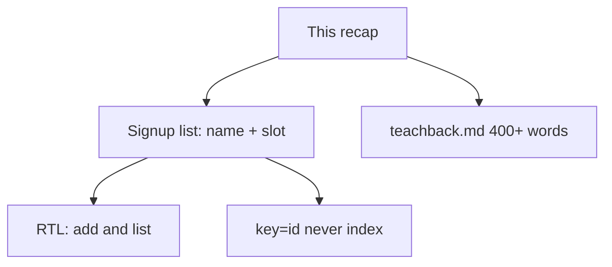
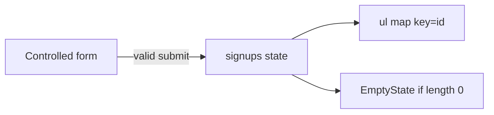

# Month 6 · Week 2 · Day 6
# Independent: Workshop Signup List

**Month index:** [../../README.md](../../README.md)  
**Week 2:** [1](day-01.md) · [2](day-02.md) · [3](day-03.md) · [4](day-04.md) · [5](day-05.md) · Day 6 (today) · [7](day-07.md)  
**Week rhythm today:** Independent project work  
**Study time:** 3–4 focused hours  
**Days 1–5 textbook files:** closed for the *challenges*. Repair from **this recap**, or if stuck 25+ minutes, one section of Day 1 or Day 2 **in this book**.

This is **not** Project 4. Do not copy dashboard entities, routes, or mock auth. You are building a **workshop signup** list: a name and a time slot.

---

## How to read this chapter

Today you prove Week 2 without a type-along. The complete explanation below **is** the lesson. Read a section. Close it. Say it in one sentence. Then write the app **before** the tests, or a failing test **before** the row appears — either order is honest if you do not paste.

If you catch yourself copying `ItemFinder` line for line into `SignupBoard`, stop. A signup is a different question (name + slot, two controlled fields). Same *rules*, new *shape*.



Allowed during challenges: this file, your notes, the error in the terminal.  
Not allowed: Day 1–5 files as a paste source, react.dev as the teacher, AI writing the components.

If you are stuck more than 25 minutes, open **only** Day 1 or Day 2 **in this textbook**, read one section, close it, continue. Record the lookup.

---

## Complete explanation (this book is the lesson)

You already practiced these ideas. Here they are again in full, so a later review never requires another page.

### State and setters

**`useState`** is how a function component keeps memory across renders. `const [signups, setSignups] = useState<Signup[]>([])` infers or uses your type. `setSignups` **queues** a re-render. The next line still sees the old `signups`. Do not write `const next = setSignups(...)`.

When the new array **depends on** the old one, use **`setSignups(current => [...current, row])`**. Two submits close together will not both spread the same stale snapshot.

State lives in the component that called `useState`. Two children that need the list do not each call `useState([])`. **Lift** to the parent. Pass the array down. Pass `onAdd` / `onRemove` **up**.

**Wrong belief:** “Hooks are global.”  
**Correct:** each mounted component instance has its own state.

### Events

Pass functions: `onClick={handle}`, `onSubmit={handleSubmit}`, `onChange={handleChange}`. **Do not** `onClick={handle()}`. Parentheses run during render.

`preventDefault` on submit. Missing it reloads the page; the signup list in RAM vanishes; you may see `?name=` in the URL. Month 3 again.

`type="button"` on delete and on any control that must not submit the surrounding form.

### Copy, do not mutate

```tsx
setSignups((current) => [...current, next]);
setSignups((current) => current.filter((row) => row.id !== id));
```

No `.push`, no `.splice` on state, no `row.slot = "afternoon"`. Replace the object with `{ ...row, slot: nextSlot }` if you ever edit.

Derived lists (`const morning = signups.filter(...)`) are **not** state.

### Conditional rendering

Ternary for two UIs. `null` for nothing. **`signups.length && <List />` leaks `0`**. Write `signups.length === 0 ? <EmptyState /> : <List />`.

### Keys

`key={signup.id}`. Create `id` **once** when the row is born (`crypto.randomUUID()`). Do not `key={index}`: insert/reorder/delete will attach the wrong row state (a checkbox, an open editor, focus). Do not `key={Math.random()}` in `map`: every render remounts every row.

**Wrong belief:** “`key={index}` is fine because I only append.”  
**Correct:** append is the case where index often *appears* to work — until you delete the middle row or sort. Assign ids on create from day one.

### Controlled vs uncontrolled (you must teach this today)

**Controlled:** React state is the source of truth.

```tsx
<input value={name} onChange={(event) => setName(event.target.value)} />
<select value={slot} onChange={(event) => setSlot(event.target.value)}>
```

Every keystroke updates state; every render pushes `value` back to the DOM. You can disable submit when `isBlank(name)`, show the draft in a sibling, or test by typing.

**Uncontrolled:** the DOM owns the value after mount. `defaultValue` / `defaultChecked`, later a **ref** to read on submit (Week 3). Fine for some large forms and for `<input type="file">`. This month you **prefer controlled**.

Mixing `value={name}` with no `onChange` **locks** the box. Mixing `value` and `defaultValue` warns. Pick one.

**Wrong belief:** “I’ll skip `value=` and read the DOM on submit — fewer renders.”  
**Correct:** that is uncontrolled. This month you prefer controlled so the draft is visible to siblings, tests, and validation *as they type*. Week 3 refs exist for a reason; they are not today’s shortcut.

A **checkbox** is controlled with `checked` + `onChange` (`event.target.checked`), not with `value` as the boolean.

### Forms and blank

Trim. `isBlank` from Month 3: whitespace is blank; `"0"` is a legal name if someone signs up as `0` (odd, but your blank rule is trim, not truthiness). Show errors as **JSX text** in `role="alert"`. No `dangerouslySetInnerHTML`.

Both fields controlled: after success, `setName("")` and reset `slot` to `""` so the form is empty for the next person.

### Types

```ts
type Slot = "morning" | "afternoon" | "evening" | "";

type Signup = {
  id: string;
  name: string;
  slot: Exclude<Slot, "">;
};
```

Or keep `slot: string` if unions still feel heavy — then validate on submit that slot is one of the three. No `any`. No class components.

### Tests (Day 5 habits)

RTL: `userEvent.setup()`, `getByLabelText` / `getByRole`, assert listitems. Do not assert `useState`. One test: add a named person to a slot. One test: blank name shows an alert.

### EmptyState

Week 1 composition: a presentational empty component with a title (and optional `children`). Use it when there are no signups.



### Typed submit you must be able to write

```tsx
function handleSubmit(event: React.FormEvent<HTMLFormElement>) {
  event.preventDefault();
  if (name.trim() === "" || slot === "") {
    setError("Name and slot are required.");
    return;
  }
  setError("");
  setSignups((current) => [
    ...current,
    { id: crypto.randomUUID(), name: name.trim(), slot },
  ]);
  setName("");
  setSlot("");
}
```

`slot` should be a union (`"morning" | "afternoon" | "evening" | ""`). After success, reset to `""` so the next person is not stuck on “evening.”

**Wrong belief:** “I’ll `signups.push(row)` because I already called `setSignups`.”  
**Correct:** copy. `push` mutates. Functional update with spread is the default.

**Wrong belief:** “Empty state is `{signups.length && <List />}` inverted.”  
**Correct:** `{signups.length === 0 ? <EmptyState /> : <ul>…</ul>}`. `length &&` still paints `0`.

Index-key story you must teach in the 400 words: Ada and Bea on the list. Bea has a nested note field (or you imagine a checkbox). You insert Zo at the top. Index `0` was Ada; now it is Zo. React keeps the **row state** on index `0`. Zo shows Ada’s note. Ids assigned at **create** would have kept Ada’s note on Ada.

Random-key story: `key={Math.random()}` inside `map`. Every parent render remounts every row. The cursor in a nested input jumps to the start. That is not “React being weird.” That is you destroying identity every paint.

Vitest reminder if you install today:

```powershell
npm install -D vitest jsdom @testing-library/react @testing-library/jest-dom @testing-library/user-event
```

`environment: "jsdom"`. Query by **label** for Name and Slot. Assert a `listitem` after submit. Do not assert `useState`.

---

## Today's contract

By the end of this day you will be able to:

1. Ship a workshop signup list (name + slot) with controlled inputs, id keys, and no mutation.
2. Cover add (and blank) with RTL **or** a honest manual checklist **plus** at least one RTL test if Vitest is already installed from Day 5 — **prefer tests**.
3. Teach controlled vs uncontrolled **and** keys in **400+ words** of prose.

**Today's gate**

> Signups appear in a keyed list after a form submit that does not reload; the teach-back is paragraphs a human would speak, not a glossary.

---

## Time box

| Block | Minutes | Work |
|---|---|---|
| A | 20 | Read this recap; speak controlled vs key=id |
| B | 80 | Challenge 1 — signup app |
| C | 40 | Tests or checklist + one RTL test |
| D | 50 | Challenge 2 — teach-back prose |
| E | 20 | Git |

---

# Challenge 1 — Workshop signup

Scaffold (PowerShell):

```powershell
cd ~\fullstack-lab\month-06
npm create vite@latest week-02-independent -- --template react-ts
cd week-02-independent
npm install
npm run dev
```

If you already have Vitest habits from Day 5, install the same test stack here. If time is short, one RTL test still beats zero.

**Product spec:**

1. Heading: a workshop name you invent (not Project 4’s product name).
2. Form: **Name** (text, labeled, controlled), **Slot** (select: morning / afternoon / evening, labeled, controlled). Submit button.
3. `preventDefault`. Trim name. `isBlank(name)` → alert text, no row. Empty slot → alert, no row.
4. On success, append `{ id, name: trimmed, slot }` with a **new** array. Clear the form fields.
5. List of signups: name and slot as **text**. `key={id}`. Optional delete `type="button"` + filter copy.
6. `EmptyState` when there are zero rows.
7. `BOUNDARY.md`. CSS you type.
8. No Router, no fetch, no Redux, no RHF.

**Not the spec:** waitlists, payments, auth, dashboards.

Select is controlled like text: `value={slot}` and `onChange` that `setSlot`. Options need values that match the union. A blank first option (`value=""`) lets you detect “no slot chosen.”

```tsx
<label htmlFor="slot">Slot</label>
<select
  id="slot"
  value={slot}
  onChange={(event) => setSlot(event.target.value as Slot)}
>
  <option value="">Choose a slot</option>
  <option value="morning">Morning</option>
  <option value="afternoon">Afternoon</option>
  <option value="evening">Evening</option>
</select>
```

If you dislike the `as Slot` assertion, validate on submit that `slot` is one of the three strings — that is honest. Do not `as any`.

RTL sketch:

```tsx
test("adds a named signup", async () => {
  const user = userEvent.setup();
  render(<App />);
  await user.type(screen.getByLabelText(/name/i), "Ada");
  await user.selectOptions(screen.getByLabelText(/slot/i), "morning");
  await user.click(screen.getByRole("button", { name: /add/i }));
  expect(screen.getByText(/ada/i)).toBeInTheDocument();
});
```

---

# Challenge 2 — Teach-back

`teachback.md` (**400 words minimum**, 400–800 is the honest band):

Explain **controlled vs uncontrolled** inputs and **list keys** as if a classmate missed Days 1–2.

Must include, in prose (not a bullet dump of APIs):

- What “source of truth” means for a text field.
- What happens if you set `value` and forget `onChange`.
- Why this month prefers controlled, and what Week 3 refs are for (one honest paragraph — not a refs tutorial).
- Why index keys fail on insert/reorder (tell a story with two names and a checkbox or an input inside the row).
- Why random keys remount every render.
- Why ids are assigned at **creation**.

Not a paste of this file. Not Project 4. If you cannot write 400 words, you do not yet own the week. Re-read **this file’s** complete explanation, then write.

---

# Challenge 3 — One proof

Either:

- RTL: type a name, choose a slot, submit, assert a listitem, **or**
- If install time exploded: `CHECKLIST.md` you actually executed **and** a note that Day 5’s suite still passes on the widget — then install Vitest here tomorrow in the review if you skipped.

Prefer the RTL path. Query by label/role.

```powershell
cd ~\fullstack-lab
git add month-06/week-02-independent
git commit -m "Independent Week 2: workshop signup and teach-back."
```

---

## Definition of done

- [ ] Name + slot form is controlled; submit does not reload
- [ ] Keys are ids; no in-place mutation
- [ ] Empty state when zero signups
- [ ] Teach-back is 400+ words of prose covering controlled/uncontrolled **and** keys
- [ ] At least one behavioral proof (RTL preferred)
- [ ] No `any`, no `dangerouslySetInnerHTML`, not Project 4
- [ ] Commit exists

---

## Optional review links

Controlled inputs and keys are explained in this chapter.

- [React: Controlling a component with state](https://react.dev/learn/sharing-state-between-components#controlling-a-component)
- [React: Rendering lists](https://react.dev/learn/rendering-lists)
- [Testing Library: Which query?](https://testing-library.com/docs/queries/about/#priority)

---

## Tomorrow

Week review: synthesis, a small mini-build, **five debug stories** (mutate state, missing preventDefault, key=index, `&&` with 0, `onClick={handle()}`). Repair the weakest hole today if the teach-back already showed it.
