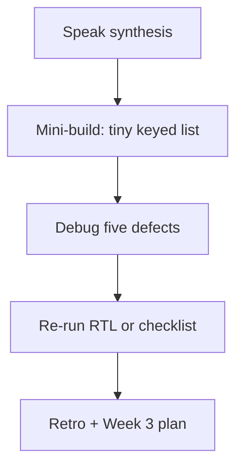

# Month 6 · Week 2 · Day 7
# Week Review — State, Events, Lists, and Forms

**Month index:** [../../README.md](../../README.md)  
**Week 2:** [1](day-01.md) · [2](day-02.md) · [3](day-03.md) · [4](day-04.md) · [5](day-05.md) · [6](day-06.md) · Day 7 (today)  
**Week rhythm today:** Review, repair, plan Week 3  
**Study time:** 3–4 focused hours  
**Student state:** You queued `setState`, keyed lists, and controlled a form. Today those ideas must still live in your head — from **this file**.

Do not start Week 3 because the calendar moved. `useEffect` on a list that still mutates arrays and uses `key={index}` will multiply bugs, not fetch them.

---

## How to read this chapter

This is a **closed-book teaching day**. The synthesis **is** the Week 2 lesson.

1. Read a section. Close it. Say the idea in one honest sentence.
2. Then do the review blocks in order. During the mini-build, Days 1–6 stay closed. If you go blank, re-read **this synthesis**, not a random article.
3. Repair the weakest topic **today**. Week 3 (effects, refs, Context) assumes controlled inputs and copies are automatic.



---

## Week synthesis (the lesson, in this book)

A component is still a **function**. This week it is a function of **props and state**.

**`useState(initial)`** returns `[value, setValue]`. `setValue` **queues a re-render**. It does not return the next value. The `value` in this call is a snapshot. When the next state depends on the previous, **`setValue(prev => …)`**.

**Events:** pass the function (`onClick={fn}`). Do not call it (`onClick={fn()}`). `onChange` writes strings (or `checked` for checkboxes). `onSubmit` must **`preventDefault`** or the page reloads and RAM state dies.

**Ownership:** state lives where `useState` was called. **Lift** to the common parent when two children share data. Values down, callbacks up.

**Immutability:** copy arrays and objects (`[...items]`, `{...item}`). In-place `push` / property assign can skip updates (same reference) and corrupt snapshots.

**Derived:** `filter` / `map` during render. Do not store `filtered` in state.

**Conditionals:** ternary; `null` for nothing; **`count && <X />` paints `0`**.

**Keys:** stable **ids**. Index keys fail on insert/reorder. Random keys remount every render.

**Controlled inputs:** `value` + `onChange` (checkbox: `checked` + `onChange`). Uncontrolled + ref is Week 3. Errors as **JSX text**. `isBlank` after trim. `"0"` is not blank.

**Tests:** RTL types and clicks; query by role/label; do not test `useState` internals.

The rest of this file unpacks each sentence so a student who only has **today’s file** can still teach the week.

---

## Today's contract

By the end of this day you will be able to:

1. Teach Week 2 aloud from the synthesis, without opening Days 1–6.
2. Mini-build a tiny list+form from this spec.
3. Diagnose **five** defects: mutate-then-set, missing `preventDefault`, `key={index}`, `&&` with `0`, `onClick={handle()}`.
4. Re-run tests or a checklist on one lab from this week.
5. Write a retro and a Week 3 plan; repair the weakest hole today.

**Today's gate.** Closed-book:

> I can explain setState snapshots, lifting, controlled inputs, and id keys, and I have written the five debug causes in full sentences.

If you cannot, stay on Week 2. Effects will not stabilize a mutated array.

---

## Time box

| Block | Minutes | Work |
|---|---|---|
| 1 | 40 | Closed-book: speak the synthesis |
| 2 | 50 | Mini-build |
| 3 | 40 | Debug five defects on paper (and one in code if you want) |
| 4 | 25 | Review independent code — one fix |
| 5 | 20 | Re-run `npm test` or widget checklist |
| 6 | 20 | Design: what is state vs derived |
| 7 | 25 | Retro + Week 3 plan + repair |

---

# Complete explanation — React you must still own

## 1. State is React’s memory, not yours

`let` inside the function is a new box every render. `useState` is a box React **keeps**. First render uses `initial`. Later renders ignore `initial`.

```tsx
const [n, setN] = useState(0);
setN(n + 1); // request: next n is snapshot + 1
setN(n + 1); // same snapshot — still + 1 total
setN((c) => c + 1); // uses latest queued value
```

**Wrong belief:** “I can read `setN`’s return.”  
**Correct:** there is no useful return. Wait for the next render, or compute `const next = n + 1` yourself for use **in this handler** (and still `setN(next)`).

## 2. Events and forms

React calls your function with a synthetic event. You need `preventDefault` on **submit**. You need `type="button"` on non-submit buttons inside a form.

`onClick={handle()}` runs `handle` **now**. If `handle` sets state, render loops. Pass `handle` or `() => handle(id)`.

## 3. Lift and boundaries

Search query used by a list and a “N matches” heading lives in the parent. The input child is often controlled **from above**: `value={query} onChange={...}`.

## 4. Copy

React checks state with `Object.is`. Same array mutated in place may not re-render. Even if it does, you lied about history.

Toggle: `map` + `{ ...item, done: !item.done }`. Delete: `filter`. Add: spread.

## 5. Lists, keys, conditionals

`items.map` → elements with `key={item.id}`. Id created with the item.

**Index key story:** list `[Ada, Bea]`. User checks Ada’s checkbox (row state tied to index 0). Insert Zo at front. React reuses key `0` for Zo. The check stays on the first **row**, now Zo.

**Random key story:** `key={Math.random()}` inside map. Every parent render, every row is a new mount. The cursor in a nested input jumps to the start.

`{0 && <p>Items</p>}` shows **0**. `{items.length > 0 && <List />}` is a boolean left-hand side.

## 6. Controlled inputs

Source of truth: React. `value` / `checked` from state. Uncontrolled (`defaultValue`, refs) waits until Week 3. This month, if you cannot see the string in state, you do not own the form.

`isBlank(s)` ⇒ `s.trim() === ""`. Error node: `{error}` as children, `role="alert"`. Never `innerHTML`.

## 7. Tests

`render`, `userEvent.setup()`, `getByRole` / `getByLabelText`. Assert rows. Do not spy on setters.

### Worked filter (derived)

```tsx
const visible = items.filter((item) =>
  item.label.toLowerCase().includes(query.trim().toLowerCase()),
);
```

`query` is state. `visible` is not. An effect that `setVisible`s this array is the Week 3 bug you must already be able to refuse.

**Wrong belief:** “I’ll store `visible.length` in state so the heading is fast.”  
**Correct:** `visible.length` is math. Storing it means you can forget to update it.

**Wrong belief:** “`onClick={handle()}` is how you pass arguments.”  
**Correct:** `onClick={handle}` or `onClick={() => handle(id)}`. Parentheses without an arrow run **now**.

**Wrong belief:** “React forms do not navigate.”  
**Correct:** they do, unless `preventDefault`. The `?` in the address bar is the clue.

Mini-build scaffold if you want a clean tree:

```powershell
cd ~\fullstack-lab\month-06
npm create vite@latest week-02-review -- --template react-ts
cd week-02-review
npm install
npm run dev
```

Extra `--` before `--template`. HTTP. No Router. No fetch. No TanStack Query.

---

Closed-book: speak the synthesis.

---

# Mini-build

Folder: `~\fullstack-lab\month-06\week-02-review\`.

New Vite `react-ts` app **or** a small folder inside an existing lab if you are exhausted — a new app is the honest exam.

**Spec:** three hard-coded items in state. A controlled filter box. Derived list. EmptyState (or a paragraph) when nothing matches. Form wrap + `preventDefault`. Keys = ids. Optional: add one item with `isBlank`.

Not Project 4. Not yesterday’s workshop paste — type it again from **this** spec.

---

# Debug (write the cause, from this week)

`DEBUG.txt` — full sentences. For each: what you **observe**, why a beginner believes the wrong fix, what the actual rule is.

### 1. setState mutate

You `items.push(next); setItems(items);`. Clicks do nothing, or DevTools looks like the array grew but the list does not. Beginner adds `forceUpdate`. **Cause:** same reference. **Fix:** new array.

**Wrong belief:** “I called `setItems`, so React must paint.”  
**Correct:** React may see the **same** array and skip. Copy first.

### 2. Missing preventDefault

Add “works” then the list resets; URL has `?`. **Cause:** HTML submit navigated. **Fix:** `event.preventDefault()` on the form handler.

**Wrong belief:** “SPA frameworks ignore form GET.”  
**Correct:** the browser still navigates unless you prevent the default. React is not a special HTML.

### 3. `key={index}` bug scenario

Todos with a done checkbox. Add-at-top (or reverse). The wrong row looks done. **Cause:** index identity. **Fix:** `key={todo.id}`.

**Wrong belief:** “The title text updated, so the key was fine.”  
**Correct:** text can come from props while **row state** (the check) stuck to the index.

### 4. `&&` with `0`

`{count && <p>{count} selected</p>}` with `count === 0` shows a **0**. **Cause:** `&&` returns the falsy left side; React renders `0`. **Fix:** `count > 0 &&` or ternary.

**Wrong belief:** “`&&` hides the paragraph when there is nothing.”  
**Correct:** it hides when the left side is `false`, `null`, or `undefined` — not when it is `0`.

### 5. `onClick={handle()}` immediately

Count climbs without clicks, or “Maximum update depth”. **Cause:** handler ran during render; `setState` → render → run again. **Fix:** `onClick={handle}`.

**Wrong belief:** “I have to call `handle` so the click works.”  
**Correct:** pass the function. Parentheses mean now.

You may **reproduce** one of these in a throwaway component. The write-up is required even if you only reason on paper.

### Mini-build typed skeleton (not a solution)

```tsx
const [query, setQuery] = useState("");
const [items, setItems] = useState<Item[]>(seed);

const visible = items.filter((item) =>
  item.label.toLowerCase().includes(query.toLowerCase()),
);

return (
  <form
    onSubmit={(event) => {
      event.preventDefault();
    }}
  >
    <label htmlFor="q">Filter</label>
    <input
      id="q"
      value={query}
      onChange={(event) => setQuery(event.target.value)}
    />
    {visible.length === 0 ? (
      <p>No matches</p>
    ) : (
      <ul>
        {visible.map((item) => (
          <li key={item.id}>{item.label}</li>
        ))}
      </ul>
    )}
  </form>
);
```

Invent `seed` with three **ids**. The form wrapper exists so you remember `preventDefault` even when there is no add. Filter buttons, if any, are `type="button"`.

Design paragraph prompt (write it, do not skip): `items` and `query` are state; `visible` is derived; `EmptyState` title is a prop. Week 3 will tempt `useEffect(() => setVisible(items.filter(...)), [items, query])`. That effect is the wrong tool because both inputs are already in React.

---

# Review and tests

Open **one** of: widget, memory todo, independent signup. One strength, one defect, one committed fix (a label, a `key`, a leaked `0`). Re-run Day 5 `npm test` if that app exists. Record PASS in `review/TESTS.md` (create `week-02-review` notes if the mini-build is the only new folder).

---

# Design

Write a paragraph: **what belongs in state** vs **what is derived** vs **what is a prop**. Example: `items` and `query` are state (or items are props from a parent); `filtered` is derived; `EmptyState`’s title is a prop. Week 3 will tempt you to `useEffect` to copy `items` into `filtered`. That effect is the wrong tool — say why in the paragraph.

---

# Retro

What was foggy: snapshots, lift, keys, controlled, RTL queries? Repair **one** hole with a ten-line component in `review/repair.tsx` (or a `.txt` if you truly cannot run it).

**Week 3:** `useEffect` and dependency arrays, Strict Mode double-invoke, when **not** to use an effect, Context, `useReducer`, refs (uncontrolled), custom hooks. You will still need everything from this week.

```powershell
cd ~\fullstack-lab
git add month-06
git commit -m "Record Week 2 React state review."
```

---

## Week 2 definition of done

- [ ] useState snapshot + functional update taught from this book
- [ ] Controlled input + preventDefault
- [ ] Id keys; index and random explained as bugs
- [ ] `0 &&` pitfall named
- [ ] `onClick={handle()}` named
- [ ] DEBUG.txt has five causes
- [ ] Mini-build exists
- [ ] Retro names Week 3 without skipping “when not to use an effect”

---

## Optional review links

Week 2 is explained in this chapter. These pages are for later checking, not for first learning.

- [React: State — a component's memory](https://react.dev/learn/state-a-components-memory)
- [React: You might not need an effect](https://react.dev/learn/you-might-not-need-an-effect) (preview of Week 3)
- [React: Rendering lists](https://react.dev/learn/rendering-lists)
- [Testing Library: Cheatsheet](https://testing-library.com/docs/react-testing-library/cheatsheet)

---

## Next week

Open [../week-03/day-01.md](../week-03/day-01.md) when this gate is true. Do not replace Week 3 with a blog tutorial on `useEffect`.
