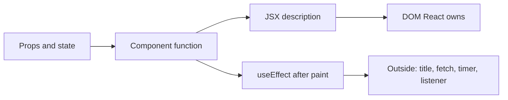
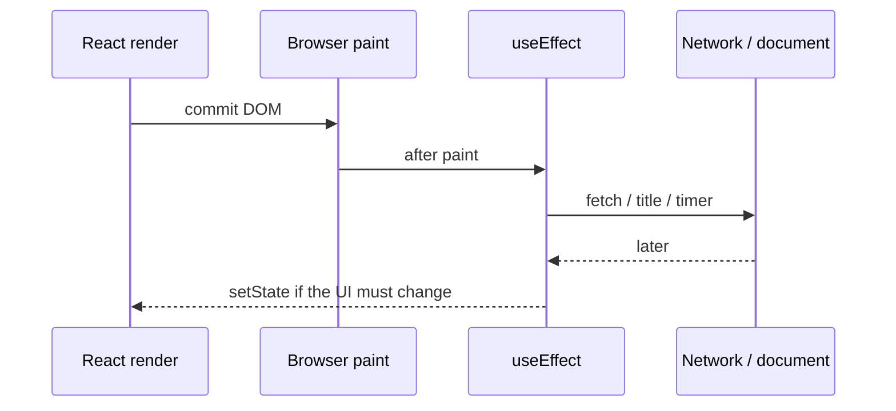
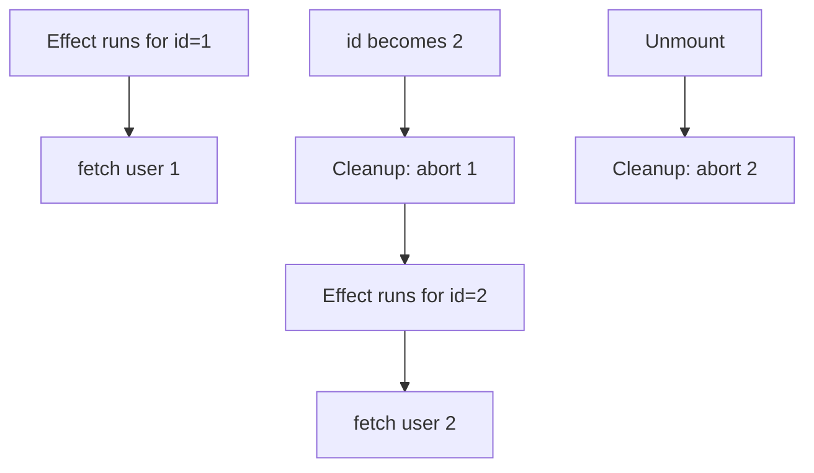
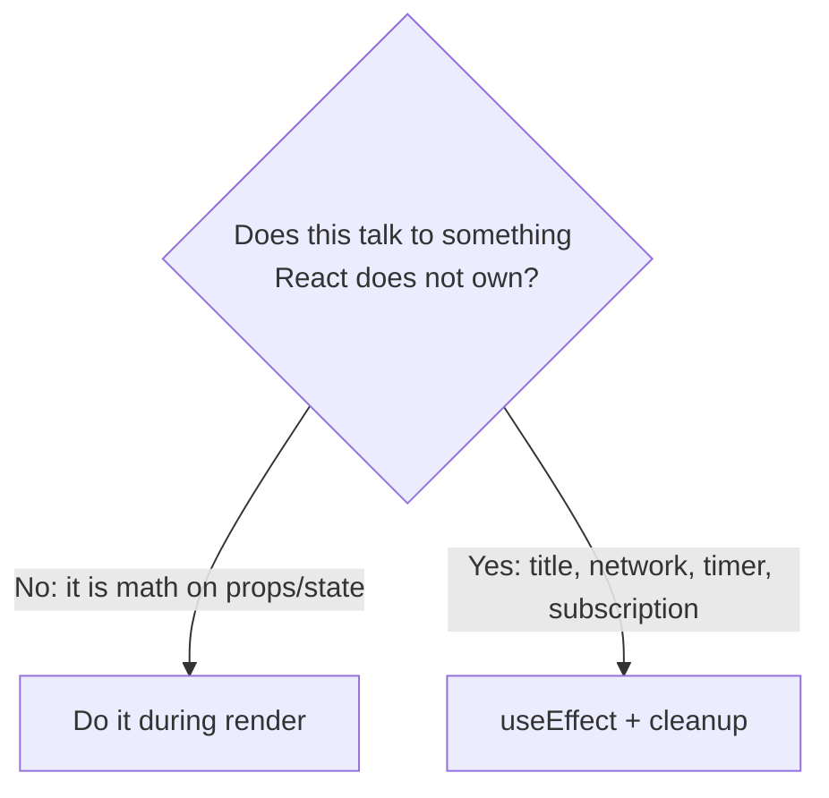

# Month 6 · Week 3 · Day 1
# useEffect for Real: Synchronize, Then Stop

**Program:** Full-Stack Mastery · 18 months  
**Phase:** 2 — Modern frontend  
**Month index:** [../../README.md](../../README.md)  
**Week 3:** Day 1 (today) · [2](day-02.md) · [3](day-03.md) · [4](day-04.md) · [5](day-05.md) · [6](day-06.md) · [7](day-07.md)  
**Week rhythm today:** Learn + type-along  
**Student state:** Week 2 gate ([../week-02/day-07.md](../week-02/day-07.md)). You can type `useState`, a controlled input, a list with stable keys, and a derived filter. You have not been required to fetch from a component yet.  
**Study time:** 3–4 focused hours

**This week covers:** `useEffect`, dependency arrays, cleanup, Strict Mode, `useContext`, `useReducer`, refs, custom hooks — and, louder than any of those names, **when an effect is the wrong tool**.

Today: effects that talk to **something outside React**. Document title. `fetch` with `AbortController` (Month 3). A discriminated `idle | loading | success | error` (Month 5). Filtering a list is **not** an effect. Copying a prop into state with an effect is almost never an effect.

Project 4 is **not** this week. Labs live in `~\fullstack-lab\month-06\`. This textbook will not give you the dashboard. TanStack Query is Month 7. Today you own the request.

---

## How to read this chapter

Week 2 taught you this loop: **state changes → React calls your function again → new JSX → DOM updates**. That loop is enough for anything you can **compute** from props and state: a full name, a filtered list, a disabled button, a character count.

Some work is not a computation. The browser tab’s title is not a React node. A network request is not a React node. A `setInterval` is not a React node. Those live in the **outside world**. An **effect** is how you keep that outside world in sync with your props and state — and how you **stop** when the component leaves or the input changes.



Read. Say it. Type the lab. Deleting `StrictMode` to hide a double fetch fails today’s gate.

---

## Today's contract

By the end of this day you will be able to:

1. Recite `useState` in one sentence, then explain why **derived** values are not a second piece of state.
2. Explain `useEffect` as **synchronization with the outside**, not as “run this later” or “on mount.”
3. Choose a **dependency array**: `[]`, `[id]`, or “I omitted it and that is usually a bug.”
4. Return a **cleanup** function: `abort()`, `clearInterval`, `removeEventListener`.
5. Fetch JSON with `AbortController`, type the body as **`unknown`**, and **guard** it (Month 5).
6. Model remote UI as a **discriminated union**, not `loading` and `error` booleans.
7. Refuse effects that only **filter**, **concatenate**, or **mirror props**.

**Today's gate.** Closed-book:

> An effect syncs React with something React does not own. It runs after paint. Dependencies say *when to sync again*. Cleanup says *stop the previous sync*. Filtering `fullName` and copying props into state are render work, not effects. Double fetch in Strict Mode is a missing abort, not a reason to delete Strict Mode.

If you cannot say that, stay here. Context tomorrow will not rescue a mushy “I put fetch in useEffect because tutorials did.”

---

## Time box

| Block | Minutes | Work |
|---|---|---|
| A | 55 | Theory |
| B | 55 | Type-along: title + aborting fetch |
| C | 70 | Independent: post list, union, guard |
| D | 20 | Git |
| E | 15 | Recall |

---

# Block A — Theory

## 1. useState, one more time (so effects do not steal its job)

```tsx
const [query, setQuery] = useState("");
```

`useState` is a box React **owns**. When you call `setQuery`, React schedules a **re-render**. The next time your function runs, `query` is the new string. The screen can change because the **description** changed.

You already know the rest from Week 2:

- **Events** call setters (`onChange`, `onSubmit`).
- **Lists** come from `.map` with a **stable `key`**.
- **Controlled inputs** use `value={query}` and `onChange` that `setQuery`.
- **Lifting state:** if two children need the same `query`, the nearest common parent owns it and passes it down (or passes a callback).

**Derived** means you can calculate it from data you already have:

```tsx
const visible = posts.filter((post) =>
  post.title.toLowerCase().includes(query.toLowerCase()),
);
const fullName = `${firstName} ${lastName}`;
```

Those lines run during render. They are free. They cannot get stale relative to `posts` and `query`, because they are computed from them **this** time.

**Wrong belief:** “If I need a filtered list, I `useState` for `visible` and `useEffect` to keep it updated.”  
**Correct:** that is two sources of truth. Compute `visible` during render.

Most “I need an effect” instincts this month are **derived state in costume**.

---

## 2. What an effect is for

**`useEffect`** registers a function React will run **after** the browser paints the result of this render. The function is allowed to touch the outside world:

| Outside thing | Typical effect |
|---|---|
| `document.title` | set it from props/state |
| HTTP | `fetch` (abort on cleanup) |
| Timer | `setInterval` / `setTimeout` (clear on cleanup) |
| Event on `window` | `addEventListener` (remove on cleanup) |
| External store / widget | subscribe (unsubscribe on cleanup) |

React does **not** own the tab title. React does **not** own the network. React does **not** own the interval table. If you do that work **during render** (in the function body, every time React calls you), you are causing side effects as a byproduct of describing UI. That fights Strict Mode, concurrent rendering, and your own brain.

**Wrong belief:** “`useEffect` means componentDidMount.”  
**Correct:** “mount” is one *case* of “the outside world should match these values.” An effect with `[id]` is not mount. It is “keep the outside in sync whenever `id` changes.”

**Wrong belief:** “Effects run before the user sees anything.”  
**Correct:** `useEffect` runs **after paint**. The first frame can show “Loading…” before the request even starts. That is intended. (There is `useLayoutEffect` for measuring layout before paint. You do not need it for title or fetch. Do not reach for it to “feel faster.”)



`setState` inside an effect is allowed **when the outside world produced new information** (the response arrived). It is not allowed as a way to **compute** something you already had in props.

---

## 3. The dependency array — three shapes, one meaning

```tsx
useEffect(() => {
  // sync
  return () => {
    // stop the previous sync
  };
}, [/* dependencies */]);
```

Dependencies answer: **when is the previous sync stale?** React compares with `Object.is` (think `===` for primitives).

| You write | React’s meaning | Honest use |
|---|---|---|
| `[]` | Sync once after the first paint (and again after Strict Mode’s **dev remount**) | “This does not depend on props/state” — title that is a constant, a window listener that never changes |
| `[id]` | Sync after first paint, and again when `id` changes | Fetch this user’s posts; set title from `id` |
| omitted | Sync after **every** render | Almost always a bug. You forgot the array. |

**Omitted array** plus `setState` is a classic infinite loop: render → effect → setState → render → effect…

**Wrong belief:** “I’ll omit the array so it always has fresh props.”  
**Correct:** if it needs fresh props, **list those props**. If listing them retriggers too often, you listed an **unstable** value (a new object or function every render) — fix the value, do not hide the array.

**Wrong belief:** “I’ll leave a value out of the array to stop extra fetches.”  
**Correct:** that is a stale closure. The effect will still “see” the old `id`. The linter rule `react-hooks/exhaustive-deps` is trying to save you. Do not disable it to win an argument with reality.

Unstable deps — preview, Day 5 will make you feel it:

```tsx
const options = { userId }; // new object every render
useEffect(() => {
  // fetch using options.userId
}, [options]); // runs every render — options is never the same box
```

Depend on `userId`, the primitive, not on a fresh object.

---

## 4. Cleanup — the previous sync must stop

When the component **unmounts**, or when a **dependency changed** and React is about to run the effect again, React calls the function you **returned** from the previous effect.

That returned function is **cleanup**.

| You started | Cleanup |
|---|---|
| `fetch` | `controller.abort()` |
| `setInterval` | `clearInterval(id)` |
| `window.addEventListener` | `window.removeEventListener` (same function reference) |
| `document.title = …` | restore the previous title if you care |

If you fetch in an effect and skip abort:

1. User opens user `1`, then quickly user `2`.
2. Request `1` is slow. Request `2` is fast.
3. UI shows user 2. Then request `1` arrives and `setState`s user 1’s posts.

That is Month 3’s **race**. The fix is the same: **AbortController**. Cleanup aborts the in-flight request for the *previous* `id`.



**Wrong belief:** “Cleanup is optional if the component usually stays mounted.”  
**Correct:** Strict Mode will unmount you in development on purpose. Navigation (Week 4) will unmount you in production. Cleanup is part of the effect, not a flourish.

---

## 5. Fetch in an effect — with abort, unknown, and a union

Month 3: `fetch` fulfills on 404; check `response.ok`. Abort rejects with `AbortError`; ignore **that** name only. JSON is untrusted.

Month 5: `const data: unknown = await response.json()`. A **guard** (or a small mapper that checks fields) turns `unknown` into `Post`. `as Post` is a lie.

Month 5: UI state is a **discriminated union**. Illegal combos cannot be typed:

```ts
type PostsState =
  | { status: "idle" }
  | { status: "loading" }
  | { status: "success"; posts: Post[] }
  | { status: "error"; message: string };
```

Empty success is `{ status: "success", posts: [] }`, not `error`. Render with `switch (state.status)` so TypeScript will not let you read `posts` on the error branch.

You **cannot** mark the effect callback `async`. An `async` function returns a `Promise`. React expects `undefined` or a **cleanup function**. Define `async function load()` inside and call it:

```tsx
useEffect(() => {
  const controller = new AbortController();

  async function load() {
    setState({ status: "loading" });
    try {
      const response = await fetch(url, { signal: controller.signal });
      if (!response.ok) {
        throw new Error(`HTTP ${response.status}`);
      }
      const data: unknown = await response.json();
      const posts = parsePosts(data);
      setState({ status: "success", posts });
    } catch (err) {
      if (err instanceof Error && err.name === "AbortError") {
        return;
      }
      const message = err instanceof Error ? err.message : "Request failed";
      setState({ status: "error", message });
    }
  }

  void load();

  return () => {
    controller.abort();
  };
}, [url]);
```

`void load()` means “I am firing this promise on purpose; I am not returning it as cleanup.”

Titles from the API are **text**. In JSX, `{post.title}` is the React equivalent of `textContent`. Do **not** `dangerouslySetInnerHTML` a title. Month 3 XSS still applies. Famous APIs are not trusted.

**Wrong belief:** “I’ll fetch in the component body so it starts sooner.”  
**Correct:** render must be a description. Fetch in an effect (this month) or, in Month 7, in Query. Fetch during render duplicates, races, and breaks Strict Mode.

---

## 6. Strict Mode remounts — double fetch is a signal

In **development**, React 19 `StrictMode` mounts, **unmounts**, and mounts again. Your effect runs, cleanup runs, effect runs again.

If you fetch without abort, the Network panel shows **two** completed requests, and you might `setState` after unmount (React 19 is quieter about that warning than older docs; the race is still real).

If you abort in cleanup, the first request is cancelled. The second (the “real” mount) completes. Two rows in Network can still appear: one aborted, one OK. That is **correct**.

**Wrong belief:** “I’ll remove `<StrictMode>` so fetch runs once.”  
**Correct:** you hid the missing cleanup. Production will still unmount on navigation. Leave Strict Mode on. Teach abort.

---

## 7. When **not** to use an effect

If you can write it as a variable in the function body, it is **not** an effect.

| Temptation | During render instead |
|---|---|
| Filter a list by `query` | `const visible = items.filter(...)` |
| `fullName` from `first` + `last` | `` const fullName = `${first} ${last}` `` |
| Transform props for display (`price.toFixed(2)`) | format in the JSX or a helper |
| “Visible count” next to a list | `visible.length` |
| Toggle a CSS class from a boolean | `className={dark ? "theme-dark" : "theme-light"}` |



**Wrong belief:** “Effects keep things in sync, so I should sync `visible` with `items`.”  
**Correct:** `visible` is not an outside system. It is a sentence about `items`. Write the sentence in the function.

---

## 8. The mirror-props anti-pattern

This looks responsible and is almost always wrong:

```tsx
function Editor({ title }: { title: string }) {
  const [draft, setDraft] = useState(title);

  useEffect(() => {
    setDraft(title);
  }, [title]);

  return <input value={draft} onChange={(e) => setDraft(e.target.value)} />;
}
```

You now have **two** truths: the prop and the state. Every parent render that passes a new `title` string wipes the draft. Typing can fight the effect. You added an effect to copy data React already had.

**Rare legitimate story:** a form that is **local** while you edit **one** record, and must **reset** when the record **id** changes (user picked a different row). Even then, prefer:

```tsx
<Editor key={item.id} title={item.title} />
```

Changing `key` tells React this is a **new** component. State starts fresh. No mirror effect.

If you still write `useEffect(() => setDraft(initial), [itemId])`, you must be able to say out loud: “I am resetting local draft because the **identity** of the thing changed, not because I am copying props as a hobby.” If you cannot say that, delete the effect.

**Wrong belief:** “Initializing state from a prop requires an effect.”  
**Correct:** `useState(title)` uses `title` **once**, on first mount. To reset on identity change, use `key`. To stay controlled, use the prop as `value` and lift the draft.

---

## 9. Lifting state and composition (so you do not “effect” your way around props)

If `FilterBox` and `PostList` both need `query`, **lift** `query` to the parent and pass it down. That is Week 2. Compose a `PostExplorer` if `App` is noisy. You do not need Context for two or three levels (tomorrow: Context is for *rarely changing* values). Siblings do not “listen” with effects. The parent holds the data.

---

# Block B — Type-along

Scaffold a clean tree (do not paste Project 4):

```powershell
cd ~\fullstack-lab\month-06
npm create vite@latest week-03-sync -- --template react-ts
cd week-03-sync
npm install
npm run dev
```

Delete the Vite demo counter and logos. Keep `StrictMode` in `main.tsx`.

### B1 — Document title

`src/DocumentTitle.tsx` — type this:

```tsx
import { useEffect } from "react";

type DocumentTitleProps = {
  title: string;
};

export function DocumentTitle({ title }: DocumentTitleProps) {
  useEffect(() => {
    const previous = document.title;
    document.title = title;
    return () => {
      document.title = previous;
    };
  }, [title]);

  return null;
}
```

In `App`, render `<DocumentTitle title="Northline sync lab" />` plus a heading. Change the string, save, watch the browser tab. The component returns `null` — it has no DOM of its own. That is allowed. The effect is the whole point.

Temporarily **omit cleanup**. Navigate away in your head: you would leak the last title. Restore cleanup.

### B2 — Break the dependency array on purpose

Add a `useState` count button. Write an effect with **no** array that `console.log`s the count. Click. Watch the log after every render. Write one sentence in `DEPS.txt`: omitted array means every render.

Then use `[count]`. Then use `[]` and click — the log should **not** follow the clicks (stale or once-only). Restore a sensible `[title]` on `DocumentTitle`.

### B3 — Fetch with abort + unknown

`src/parsePosts.ts`:

```ts
export type Post = {
  id: number;
  userId: number;
  title: string;
  body: string;
};

function isPost(x: unknown): x is Post {
  if (typeof x !== "object" || x === null) {
    return false;
  }
  const rec = x as Record<string, unknown>;
  return (
    typeof rec.id === "number" &&
    typeof rec.userId === "number" &&
    typeof rec.title === "string" &&
    typeof rec.body === "string"
  );
}

export function parsePosts(data: unknown): Post[] {
  if (!Array.isArray(data)) {
    throw new Error("expected an array of posts");
  }
  const posts: Post[] = [];
  for (const item of data) {
    if (!isPost(item)) {
      throw new Error("unexpected post shape");
    }
    posts.push(item);
  }
  return posts;
}
```

The `as Record<string, unknown>` is the **narrow** assertion after a non-null object check — Month 5. It is not `as Post[]`.

`src/PostList.tsx`: `useState<PostsState>({ status: "idle" })`. An effect that fetches `https://jsonplaceholder.typicode.com/posts?userId=1` with `AbortController`, `parsePosts`, and the union. Render:

- idle / loading: a polite status paragraph (`aria-live="polite"`)
- error: the **message** as text, plus a retry button that changes a `requestId` in the dependency list (or a `useState` nonce you increment)
- success: `<ul>` of `{post.title}` — **JSX text**, never `innerHTML`

Open the Network panel. Refresh. You should see the Strict Mode double-invoke. Confirm the first request is aborted (or cancelled) when cleanup is correct.

Cause a failure: change the URL path to `/posts/does-not-exist-xyz` (or a 404 you invent). You must see **error**, not a crash, not an empty list pretending to be success.

### B4 — The illegal filter effect (then delete it)

Add a controlled search input (`value` + `onChange` — Week 2). **Wrong on purpose:**

```tsx
const [visible, setVisible] = useState<Post[]>([]);
useEffect(() => {
  if (state.status !== "success") return;
  setVisible(state.posts.filter((p) => p.title.includes(query)));
}, [state, query]);
```

It “works.” It is still two sources of truth. Delete it. Derive:

```tsx
const visible =
  state.status === "success"
    ? state.posts.filter((p) =>
        p.title.toLowerCase().includes(query.toLowerCase()),
      )
    : [];
```

Write `DERIVED.txt`: filtering is render. Fetch is an effect.

---

# Block C — Independent

Still in `week-03-sync` (or a second app `week-03-posts` if you want a clean `App` — one app is enough).

Build a **user-switcher + post titles** page (fictional studio, not Project 4):

1. A labeled `<select>` of user ids `1`–`5` (hard-coded options). Controlled: the selected id is `useState`.
2. Fetch `https://jsonplaceholder.typicode.com/posts?userId=${id}` in an effect whose deps include **that id**. Abort on cleanup.
3. Discriminated `PostsState`. Start at `idle`, set `loading` when the effect starts.
4. `parsePosts` on `unknown`. If the guard fails, `error`.
5. Success with zero posts: “No posts” — **not** the error UI.
6. `DocumentTitle`: `Loading posts…` / `3 posts` / `Could not load posts` — derived from the union during render, passed as a **string prop**. The title component’s effect only assigns `document.title`.
7. CSS you type. Semantic `main`. One `h1`.
8. `BOUNDARY.md`: what `PostList` owns (the request + union) vs what `App` owns (the selected user id).
9. `SECURITY.txt`: one paragraph — API titles are untrusted; JSX text is safe; `dangerouslySetInnerHTML` is `innerHTML`.

Do not fetch in render. Do not store `visible` in state. Do not remove Strict Mode.

---

# Block D — Git

```powershell
cd ~\fullstack-lab
git add month-06
git commit -m "Week 3 Day 1: useEffect sync, abort, discriminated fetch UI."
```

---

# Block E — Recall

1. Name three things that belong in `useEffect` and three that do not.
2. When does the effect run relative to paint?
3. What does `[]` mean? `[userId]`? Omitted?
4. What does cleanup do for `fetch`?
5. Why does Strict Mode fetch twice in development?
6. Why is `useEffect(() => setX(propX), [propX])` usually wrong?
7. Why is `JSON` typed `unknown` here?

---

## Definition of done

- [ ] I can say the gate paragraph without looking
- [ ] Title effect with cleanup exists
- [ ] Fetch uses `AbortController`; I watched Network under Strict Mode
- [ ] Remote JSON is `unknown` then guarded
- [ ] UI is a discriminated union; empty success is not error
- [ ] Filter is derived; the illegal effect was deleted
- [ ] No `dangerouslySetInnerHTML`, no `any` to silence JSX
- [ ] `DEPS.txt`, `DERIVED.txt`, `BOUNDARY.md`, `SECURITY.txt` exist
- [ ] Commit exists
- [ ] `StrictMode` is still in `main.tsx`

---

## Optional review links

Effects, dependencies, and “you might not need an effect” are explained in this chapter. These pages are for later checking, not for first learning.

- [React: Synchronizing with Effects](https://react.dev/learn/synchronizing-with-effects)
- [React: You Might Not Need an Effect](https://react.dev/learn/you-might-not-need-an-effect)
- [MDN: `AbortController`](https://developer.mozilla.org/en-US/docs/Web/API/AbortController)

---

## Tomorrow

**Context, `useReducer`, refs, custom hooks.** Theme for many children. A reducer for add/toggle/remove. A ref that focuses an input without becoming secret state. A `use` prefix you write yourself. Composition still beats drilling two levels; Context is not a search box.
