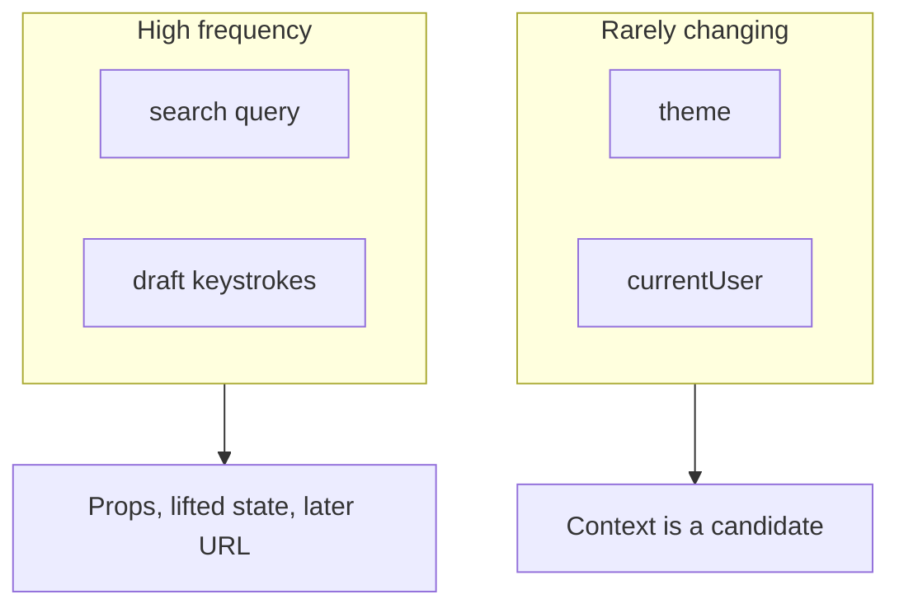
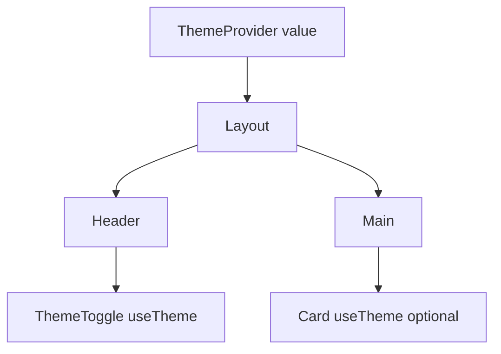

# Month 6 · Week 3 · Day 2
# Context, useReducer, Refs, and Hooks You Write

**Month index:** [../../README.md](../../README.md)  
**Week 3:** [1](day-01.md) · Day 2 (today) · [3](day-03.md) · [4](day-04.md) · [5](day-05.md) · [6](day-06.md) · [7](day-07.md)  
**Week rhythm today:** Exercises + debugging  
**Study time:** 3–4 focused hours  
**Prereq:** Day 1 gate. You can abort a fetch in an effect and you can explain when an effect is the wrong tool.

Yesterday the outside world was the document title and the network. Today the tools multiply: **Context** for a value many deep children need, **`useReducer`** when the next state is a story with several verbs, **`useRef`** for a box that must not re-render, **custom hooks** to share the *logic* without copying the effect. None of these replace props. None of them are Redux. Redux is not this month.

---

## How to read this chapter

Props still flow **down**. If `App` can pass `theme` two levels and the code is still readable, **pass the prop**. That is composition. Context is the tool you reach for when the drilling is a **real pain** and the value **rarely changes** (theme, a mock `currentUser`). A keystroke search query is the opposite: it changes every letter. That stays state + props (Week 4: it may become the URL). Do not put the search box in Context to look advanced.



Read. Type. When `useContext` returns `undefined` because you forgot the Provider, that is the lesson, not a broken React install.

---

## Today's contract

By the end of this day you will be able to:

1. Create a **typed** context whose default is `undefined`, and **throw** in a hook if the Provider is missing.
2. Explain why Context is a bad home for a search query.
3. Write a small **`useReducer`** with add / toggle / remove — a pure function you could test without a DOM (you will, Day 5).
4. Use **`useRef`** to focus an input; refuse to store a search query only in a ref.
5. Mention that **React 19** lets a function component accept `ref` as a prop — no `forwardRef` required.
6. Extract **`useToggle`** and one of `useDocumentTitle` / a tiny `useFetchJson` with the `use` prefix.
7. Prefer **composition** (children, lifting two levels) over Context-for-everything.

**Today's gate.** Closed-book:

> Context is for rarely changing values many descendants need. `useReducer` is `useState` with a named action. A ref is a mutable box that does not re-render. Custom hooks share stateful logic; they start with `use`. I still pass props when two or three levels would do.

---

## Time box

| Block | Minutes | Work |
|---|---|---|
| A | 50 | Theory |
| B | 55 | Type-along: theme, focus, reducer, `useToggle` |
| C | 70 | Independent: compose them on one page |
| D | 20 | Git |
| E | 15 | Recall |

---

# Block A — Theory

## 1. Context — a value the tree can ask for

**Prop drilling** means `App` passes `theme` to `Layout` only so `Layout` can pass it to `Header` only so `Header` can pass it to `ThemeToggle`. Two or three hops is ugly but honest. Ten hops of a value that almost never changes is how people invent Context.

**`createContext`** makes a box. **`Provider`** fills the box for a subtree. **`useContext`** reads the nearest Provider above you.

```tsx
import { createContext, useContext, useMemo, useState } from "react";
import type { ReactNode } from "react";

type Theme = "light" | "dark";

type ThemeContextValue = {
  theme: Theme;
  toggle: () => void;
};

const ThemeContext = createContext<ThemeContextValue | undefined>(undefined);

export function ThemeProvider({ children }: { children: ReactNode }) {
  const [theme, setTheme] = useState<Theme>("light");
  const value = useMemo(
    () => ({
      theme,
      toggle: () => setTheme((t) => (t === "light" ? "dark" : "light")),
    }),
    [theme],
  );

  return (
    <ThemeContext.Provider value={value}>{children}</ThemeContext.Provider>
  );
}

export function useTheme() {
  const ctx = useContext(ThemeContext);
  if (ctx === undefined) {
    throw new Error("useTheme must be used inside ThemeProvider");
  }
  return ctx;
}
```

Default **`undefined`** plus a throw is intentional. If someone renders `<ThemeToggle />` outside the Provider, you want a **loud** failure in development, not a silent fake theme. Do not invent a “default light” context value that hides missing Providers — unless you truly mean the app has a global default with no Provider, which this course does not.

`useMemo` here keeps the object identity stable when `theme` has not changed, so consumers that only depend on `value` do not churn for unrelated parent renders. If that sentence is foggy, you may pass `{ theme, toggle }` without `useMemo` today and still pass the lab. Do not skip the **throw**.

Wrap the tree **above** the consumers — usually in `App` or `main.tsx`:

```tsx
<ThemeProvider>
  <App />
</ThemeProvider>
```

A consumer:

```tsx
function ThemeToggle() {
  const { theme, toggle } = useTheme();
  return (
    <button type="button" onClick={toggle}>
      Theme: {theme}
    </button>
  );
}
```

Apply the theme with a class on a wrapper you own (`className={theme}`), not by `document.body` unless you have a real reason and then that **is** an effect (Day 1: outside world). Prefer a class on `#root`’s inner wrapper in JSX.

**Wrong belief:** “Context replaces props.”  
**Correct:** Context is props for a whole subtree, with a worse paper trail. Use it when the paper trail is the problem.

**Wrong belief:** “I’ll put `query` in Context so the list and the input stay in sync.”  
**Correct:** they stay in sync because **one parent owns `query`**. High-frequency updates through Context re-render every consumer. That is the wrong tool. Lift state. Week 4 may put the query in the URL.

**Wrong belief:** “I need Redux for theme.”  
**Correct:** you need a Provider and a boolean. Stop.



`Main` does not have to mention theme if it does not care. That is the win: **skip the middle**.

---

## 2. useReducer — when the next state is a verb

`useState` is perfect for one value: a string, a boolean, a union. When the next snapshot depends on **which action** happened — add, remove, toggle — a **reducer** names those actions.

A reducer is a **pure function**: `(state, action) => nextState`. Same inputs, same output. No `fetch`. No `document`. That purity is why Day 5 can test it with `expect(reducer(state, action)).toEqual(...)` and no `render()`.

```ts
export type Item = {
  id: string;
  label: string;
  done: boolean;
};

export type ItemAction =
  | { type: "add"; label: string }
  | { type: "toggle"; id: string }
  | { type: "remove"; id: string };

export function itemsReducer(state: Item[], action: ItemAction): Item[] {
  switch (action.type) {
    case "add":
      return [
        ...state,
        { id: crypto.randomUUID(), label: action.label, done: false },
      ];
    case "toggle":
      return state.map((item) =>
        item.id === action.id ? { ...item, done: !item.done } : item,
      );
    case "remove":
      return state.filter((item) => item.id !== action.id);
    default: {
      const _exhaustive: never = action;
      return _exhaustive;
    }
  }
}
```

In a component:

```tsx
const [items, dispatch] = useReducer(itemsReducer, []);

dispatch({ type: "add", label: trimmed });
dispatch({ type: "toggle", id });
dispatch({ type: "remove", id });
```

You still **lift** this state to the parent that owns the list. Children receive `items` and `dispatch`, or receive callbacks. You did not invent a global store.

**Wrong belief:** “useReducer is beginner Redux.”  
**Correct:** Redux is a library with a store, middleware, and a time budget you do not have this month. `useReducer` is a React hook for **one component’s** (or one lifted) state. Do not install Redux. Do not install a Redux tutorial’s folder structure.

**Wrong belief:** “Every `useState` should become a reducer.”  
**Correct:** a boolean toggle can stay `useState`. Use a reducer when several actions share one tree of state and you are tired of `setItems` callbacks that copy-paste `.map`.

Immutable updates still apply: **copy** arrays and objects. Mutating `state.push` inside the reducer will surprise React.

---

## 3. useRef — a box that does not notify React

**`useRef`** returns `{ current: ... }`. Changing `current` does **not** re-render. That is the point.

**DOM refs.** You need the actual `<input>` node to call `.focus()`:

```tsx
const inputRef = useRef<HTMLInputElement>(null);

useEffect(() => {
  inputRef.current?.focus();
}, []);

return <input ref={inputRef} /* ... */ />;
```

`ref={inputRef}` tells React to write the DOM node into `inputRef.current` after commit. Before commit, `current` is `null` — hence `?.`. Focusing in an effect (after paint) is a real outside-world sync: the **focus** lives in the browser, not in your JSX.

**React 19:** a **function component** can take `ref` as a normal prop. You do **not** need `forwardRef` for that. If you write a custom `TextField` and want the parent to pass a ref to the inner input, accept `ref` and put it on the `<input>`. Older blog posts will still say `forwardRef`. Believe React 19 for this course; do not spend the day rewriting `forwardRef` examples.

```tsx
type TextFieldProps = {
  label: string;
  value: string;
  onChange: (value: string) => void;
  ref?: React.Ref<HTMLInputElement>;
};
```

(Exact `Ref` typing can use `useRef<HTMLInputElement>(null)` on the parent and pass `ref={inputRef}`. If TypeScript nags, read the error; do not `as any`.)

**Refs are not secret state.** If the screen must change when the value changes, that value is **state** (or props), not `ref.current`.

| Store here | Why |
|---|---|
| Search query the list filters on | `useState` — the list must re-render |
| “Is the dialog open?” | `useState` |
| Timeout id, previous id, DOM node | `useRef` — no UI from the box itself |
| “I’ll skip a render and read the input from the DOM on submit only” | Uncontrolled input — allowed, but this course prefers **controlled** for forms you are learning |

**Wrong belief:** “Refs are faster so I’ll put `query` in a ref and filter in an effect.”  
**Correct:** the list will not update as the user types unless you `setState` something else. You have built a bug and called it performance. Controlled `query` is the lesson from Week 2.

**Wrong belief:** “I’ll read `inputRef.current.value` on every keystroke via a ref callback instead of `onChange`.”  
**Correct:** that is an uncontrolled input with extra steps. Learn controlled first.

---

## 4. Custom hooks — share the recipe, keep the `use` prefix

A **custom hook** is a function whose name starts with **`use`** and that may call other hooks. The `use` prefix is not fashion. The compiler and the rules-of-hooks linter treat it as “this function is a hook”: you must call it at the top level of a component or of another hook, not inside `if` or loops.

```tsx
export function useToggle(initial = false) {
  const [on, setOn] = useState(initial);
  function toggle() {
    setOn((value) => !value);
  }
  return { on, toggle, setOn };
}
```

```tsx
export function useDocumentTitle(title: string) {
  useEffect(() => {
    const previous = document.title;
    document.title = title;
    return () => {
      document.title = previous;
    };
  }, [title]);
}
```

Yesterday’s `DocumentTitle` component returned `null` and existed only to run an effect. A hook is often the cleaner share: `useDocumentTitle("Posts")` inside `App`. Both are valid. The hook does not render UI. The component does not have to exist.

A small `useFetchJson` can wrap abort + union + `unknown`. If you write it, keep the **guard** outside or pass a `parse(data: unknown): T` argument so the hook does not claim `as T`.

**Wrong belief:** “Custom hooks are for downloading libraries.”  
**Correct:** they are **your** functions. `useToggle` is twelve lines. Write them when you would otherwise paste an effect.

**Wrong belief:** “I’ll name it `fetchJsonHook`.”  
**Correct:** without the `use` prefix, you will eventually call it inside a condition and get a rules-of-hooks violation that looks like witchcraft.

---

## 5. Composition still wins the small cases

```tsx
<Page>
  <Header />
  <Main>
    <ItemList items={items} dispatch={dispatch} />
  </Main>
</Page>
```

That is **composition**. `Page` takes `children`. You did not put `items` in Context. You did not write `useEffect` to copy `items` into `Main`.

Lift state to the nearest common parent. Pass props two or three levels. Reach for Context when a **theme** or **mock current user** would otherwise thread through layout chrome that should not know about it.

---

# Block B — Type-along

New app (keep Day 1’s `week-03-sync` as a museum):

```powershell
cd ~\fullstack-lab\month-06
npm create vite@latest week-03-hooks -- --template react-ts
cd week-03-hooks
npm install
npm run dev
```

Delete the demo. Keep Strict Mode.

### 1. ThemeProvider

Type `ThemeProvider`, `useTheme`, and a `ThemeToggle`. Wrap `App` in the Provider. A wrapper `div` with `className={theme}` and two CSS rules you write (light background / dark background, readable text). Consume `useTheme` in a nested component, **not** only in `App`, so you prove the skip-the-middle story.

Render `<ThemeToggle />` **outside** the Provider once on purpose. Read the throw. Put it back inside. Write `PROVIDER.txt`: default `undefined` + throw found the mistake.

### 2. Autofocus via ref

A labeled text field. `useRef<HTMLInputElement>(null)`. Effect with `[]` that calls `inputRef.current?.focus()`. Load the page; the cursor should be in the field (unless the browser blocks focus in a background tab — bring the window to the front).

Do **not** put the field’s `value` in the ref. The field is **controlled** (`value` + `onChange`) if you also filter or display the text. If this field is only a “name” demo, still control it: Week 2 habit.

### 3. useReducer list

`itemsReducer.ts` exporting the reducer and types (so Day 5 can import it without a component). A tiny UI: labeled input, Add submit (`preventDefault`), list of labels with Toggle and Remove buttons. `dispatch` only. Empty list: an empty state sentence, not a blank hole.

Add a row titled `"<b>x</b>"`. It must show angle brackets as **text**. JSX text. No `dangerouslySetInnerHTML`.

### 4. Extract `useToggle`

Move a boolean (for example “show completed items”) into `useToggle`. Import it from `src/useToggle.ts`. The filter of completed items is **derived** during render. No effect.

Optional: extract `useDocumentTitle` from Day 1’s idea and call it here with `Document title: ${items.length} items`.

---

# Block C — Independent

One page, fictional **ops checklist** (not Project 4):

1. `ThemeProvider` wraps the app. Nested header toggle.
2. Autofocus the “new item” input via ref.
3. `useReducer` for the list.
4. `useToggle` for “show done only” **or** “hide done” — document which. Derived list.
5. Controlled add form. Blank trim rejected. Error `p` `aria-live="polite"`.
6. `BOUNDARY.md`: Provider / list owner / presentational row.
7. `WHEN.txt`: four bullets — when Context, when reducer, when ref, when a custom hook.

Stretch: `useFetchJson` that loads **nothing** until you pass a URL; or skip fetch today — Day 4 is fetch + Context together. Do not install Query.

```powershell
cd ~\fullstack-lab
git add month-06/week-03-hooks
git commit -m "Week 3 Day 2: theme context, reducer list, ref focus, useToggle."
```

---

# Block D — Git

Same as above if you already committed. If not, commit now.

---

# Block E — Recall

1. Why default context `undefined` and throw?
2. Why not Context for search keystrokes?
3. What is a reducer, in one sentence?
4. Why can Day 5 test a reducer without `render`?
5. What does changing `ref.current` **not** do?
6. React 19 and `forwardRef` — what changed?
7. Why must custom hooks start with `use`?

---

## Definition of done

- [ ] `useTheme` throws outside Provider; I caused that error on purpose
- [ ] Theme toggles a nested consumer
- [ ] Input autofocuses via ref
- [ ] List add/toggle/remove through `useReducer`
- [ ] `useToggle` extracted; filter derived
- [ ] No Redux, no Query, no RHF
- [ ] No `dangerouslySetInnerHTML`
- [ ] PROVIDER.txt, BOUNDARY.md, WHEN.txt exist
- [ ] Commit exists

---

## Optional review links

Context, reducers, refs, and custom hooks are explained in this chapter. These pages are for later checking, not for first learning.

- [React: Passing Data Deeply with Context](https://react.dev/learn/passing-data-deeply-with-context)
- [React: Extracting State Logic into a Reducer](https://react.dev/learn/extracting-state-logic-into-a-reducer)
- [React: Referencing Values with Refs](https://react.dev/learn/referencing-values-with-refs)
- [React: Reusing Logic with Custom Hooks](https://react.dev/learn/reusing-logic-with-custom-hooks)
- [React 19: `ref` as a prop](https://react.dev/blog/2024/12/05/react-19#ref-as-a-prop)

---

## Tomorrow

From memory: a page that **fetches** a list with abort, shows **idle / loading / success / error**, and **filters without an effect**. Days 1–2 closed during the drills. Repair from **those files in this book**. Week 2 controlled inputs still apply.
