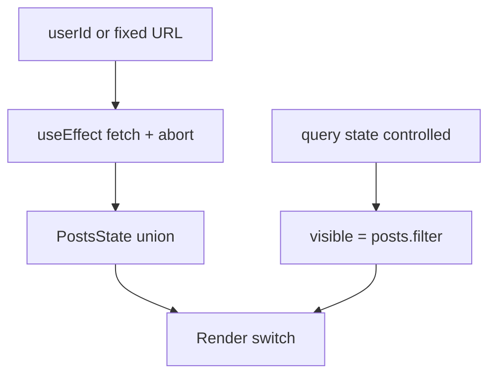

# Month 6 · Week 3 · Day 3
# From Memory: Fetch, Union, Derived Filter

**Month index:** [../../README.md](../../README.md)  
**Week 3:** [1](day-01.md) · [2](day-02.md) · Day 3 (today) · [4](day-04.md) · [5](day-05.md) · [6](day-06.md) · [7](day-07.md)  
**Week rhythm today:** Implement from memory  
**Study time:** 3–4 focused hours  
**Days 1–2 of this week:** closed during the drills. Repair from **those day files in this textbook**. Week 2 controlled-input files stay closed too — the recap below is enough.

---

## How to read this chapter

Type-along pages stay closed. This recap **is** the lesson. You will build a page that loads a remote list, keeps a search box **controlled**, and filters in render. If you put the filter in `useEffect`, you still remember yesterday’s APIs and failed today’s point.



Allowed: this file, notes, the compiler, the Network panel. Not allowed: copying Day 1’s `PostList.tsx` as a paste, MDN as teacher, AI pasting the page.

Stuck 25 minutes: open Day 1 or Day 2 in this book only. Record lookups in `LOOKUPS.txt`.

---

## Complete explanation (effects + Week 2 controls)

**`useState`** is React-owned data that triggers a re-render. A **controlled input** is `value={query}` plus `onChange` that `setQuery`. The input does not own a secret copy. Week 2. If the box you type in does not move the list, you either did not control it or you filtered in a ref.

**Derived** values are expressions during render: `visible`, `fullName`, `visible.length`. They are not state. They are not effects.

**`useEffect`** synchronizes with **something outside React**: document title, `fetch`, timers, subscriptions. It runs **after paint**. The dependency array says when the previous sync is stale: `[]` after first paint (plus Strict Mode remount in dev), `[id]` when `id` changes, omitted = every render (usually a bug).

**Cleanup** returns from the effect: `controller.abort()`, `clearInterval`, `removeEventListener`. Strict Mode remounts in development to **find missing cleanup**. Two Network rows — one aborted — is success. Deleting `StrictMode` is cheating.

**Fetch:** `AbortController` + `signal` on `fetch` (Month 3). Check `response.ok`. `const data: unknown = await response.json()`. Guard fields (Month 5). Do not `as Post[]`. Do not `dangerouslySetInnerHTML` titles — JSX `{post.title}` is text.

**Discriminated UI:**

```ts
type ListState<T> =
  | { status: "idle" }
  | { status: "loading" }
  | { status: "success"; items: T[] }
  | { status: "error"; message: string };
```

Empty success is `success` with `items: []`, not `error`. `switch (state.status)` so you cannot read `items` on the error branch.

The effect callback is **not** `async`. Inner `async function load()`; `void load()`; return cleanup.

**Do not** `useEffect(() => setX(propX), [propX])` to mirror props. Reset a form with `key={id}` if identity changed.

**Context** (Day 2, you may skip it on this page): rarely changing, many descendants, throw if missing Provider. Not for `query`.

**`useReducer`:** pure `(state, action) => next`. Optional today. **`useRef`:** focus is fine; storing `query` only in a ref will not re-render the list.

**Lifting / composition:** `query` and `userId` live in the nearest parent that must own them. Pass props. Do not invent an effect so a sibling can “listen.”

**Wrong belief:** “Filter is a side effect of the list arriving.”  
**Correct:** when the list is in state and `query` is in state, filter is math. Math is render.

**Wrong belief:** “I’ll start idle and never set loading so the UI stays calm.”  
**Correct:** then you cannot tell a slow network from an empty studio. Set `loading` when the request starts.

Worked story: URL for user `1` loads ten posts. You type `qui` in the box. The Network panel does **not** fire again. The ten posts stay in `success`. `visible` shrinks. That is the proof the filter is derived.

Second story: you change a `<select>` of `userId`. Cleanup **aborts** user 1. Effect runs for user 2. Status becomes `loading`, then `success` or `error`. The search box may stay (same `query` applied to the new list) — document that. Do not keep user 1’s posts on screen after you asked for user 2 (unless you still show the old list under a stale flag — this lab: go to `loading` and replace).

Race table (Month 3, now inside a hook):

| Time | User | In flight | UI |
|---|---|---|---|
| 0 | select 1 | request 1 | loading |
| 200ms | select 2 | abort 1, request 2 | loading |
| 400ms | — | 2 arrives | success for user 2 |
| never | — | 1 must not apply | no flicker back to user 1 |

If request 1 still `setState`s after 400ms, cleanup was missing or you ignored the wrong errors.

**Render the union** (shape — you type the real components):

```tsx
switch (state.status) {
  case "idle":
    return <p>Pick a user to load posts.</p>;
  case "loading":
    return <p aria-live="polite">Loading…</p>;
  case "error":
    return <p role="alert">{state.message}</p>;
  case "success":
    if (visible.length === 0) {
      return <p>{query.trim() === "" ? "No posts" : "No matches"}</p>;
    }
    return (
      <ul>
        {visible.map((post) => (
          <li key={post.id}>{post.title}</li>
        ))}
      </ul>
    );
  default: {
    const _x: never = state;
    return _x;
  }
}
```

`visible` is computed **above** the switch from `state` + `query`. You do not fetch inside `case "success"`.

**Week 2 controls, restated:** `htmlFor` / `id`, `value={query}`, `onChange` that `setQuery(event.target.value)`. Submit is not required for filter. Blank query means “show all,” not “error.” `"0"` as a query is a real string — it is not blank after trim.

**Wrong belief:** “I’ll keep `loading` true in a boolean and also keep the old `items` so the list does not flash.”  
**Correct:** flashing to a loading status is honest. If you keep old items, say so (`status: "loading"` plus optional `previous` — that is extra; this lab replaces). Do not leave `error: true` and `items` from last week.

---

## Today's contract

**Today's gate**

> I fetch with abort, I render a discriminated union, my search input is controlled, and the filter is not an effect.

---

## Time box

| Block | Minutes | Work |
|---|---|---|
| A | 20 | Speak the recap: effect vs derive vs control |
| B | 90 | Build the page from the spec |
| C | 30 | `MEMORY.txt` + XSS check |
| D | 20 | Git + lookups |

---

# Spec

New folder. Do not copy Day 1 files. Type from this recap.

```powershell
cd ~\fullstack-lab\month-06
npm create vite@latest week-03-memory -- --template react-ts
cd week-03-memory
npm install
npm run dev
```

Fictional **catalog** page (not Project 4):

1. **Controlled** labeled search input. `query` is `useState("")`.
2. Optional but recommended: labeled `<select>` of `userId` `1`–`3`. Changing it is the dependency that **should** refetch.
3. `useEffect` fetches `https://jsonplaceholder.typicode.com/posts` or `...?userId=${id}`. `AbortController` in cleanup. Inner async function. `unknown` + guard or small runtime mapper (`id`, `userId`, `title`, `body` all checked).
4. State is `idle | loading | success | error` as a **union**. Render each branch. `aria-live="polite"` for status.
5. **No effect for filter.** `visible` from `items.filter` on title (case-insensitive). Typing does not create Network rows.
6. Success + zero visible rows: “No matches” if `query` is non-empty; “No posts” if the server list is empty. Those are still `success`.
7. Error UI with a human sentence. Retry: increment a nonce in the dependency array, or change `userId` and back.
8. Titles as JSX text. Prove with a thought experiment: if a title were `"<b>x</b>"`, you would still see brackets. JSONPlaceholder titles are plain; do **not** add `dangerouslySetInnerHTML` “just in case.”
9. Keep `StrictMode`. Watch abort on `userId` change.
10. Semantic `main`, one `h1`, CSS you type. No Tailwind-as-a-crutch, no Query, no RHF.

`MEMORY.txt` (paragraphs, not a bullet dump):

- When the effect runs relative to paint  
- Why cleanup aborts  
- Why the filter is not in the effect  
- How the search input is controlled  

If you used Context today, write why. If you did not, write why props were enough (they should be).

### Parse shape (type this; do not import Day 1)

```ts
function isPost(x: unknown): x is {
  id: number;
  userId: number;
  title: string;
  body: string;
} {
  if (typeof x !== "object" || x === null) return false;
  const rec = x as Record<string, unknown>;
  return (
    typeof rec.id === "number" &&
    typeof rec.userId === "number" &&
    typeof rec.title === "string" &&
    typeof rec.body === "string"
  );
}
```

Throw from `parsePosts` if not an array of that shape. Catch in the effect and set `error`.

### Controlled input reminder

```tsx
<label htmlFor="q">Filter titles</label>
<input
  id="q"
  value={query}
  onChange={(event) => setQuery(event.target.value)}
/>
```

`htmlFor` matches `id`. Week 1 / Month 2. Uncontrolled (`defaultValue` only) will not drive `visible`.

### Effect skeleton you type from this recap

```tsx
useEffect(() => {
  const controller = new AbortController();

  async function load() {
    setState({ status: "loading" });
    try {
      const response = await fetch(url, { signal: controller.signal });
      if (!response.ok) {
        throw new Error(`Request failed (${response.status})`);
      }
      const json: unknown = await response.json();
      setState({ status: "success", items: parsePosts(json) });
    } catch (error) {
      if (error instanceof DOMException && error.name === "AbortError") {
        return;
      }
      const message = error instanceof Error ? error.message : "Load failed.";
      setState({ status: "error", message });
    }
  }

  void load();
  return () => {
    controller.abort();
  };
}, [userId]);
```

The callback is **not** `async`. Cleanup **aborts**. `userId` is in the deps because the URL uses it. `query` is **not** in the deps because the filter is derived.

**Wrong belief:** “I’ll put `query` in the effect so typing refetches a smaller payload.”  
**Correct:** JSONPlaceholder’s filter is still **your** `.filter` on titles unless you choose a search API. Today typing must not create Network rows.

**Wrong belief:** “AbortError should set `error` so the user knows we cancelled.”  
**Correct:** abort is not a failure. Ignore it. Show error for `!ok` and parse throws.

`visible` above the switch:

```tsx
const visible =
  state.status === "success"
    ? state.items.filter((post) =>
        post.title.toLowerCase().includes(query.trim().toLowerCase()),
      )
    : [];
```

Do not `useEffect` that line.

### Illegal combinations you must not type

```ts
// WRONG — booleans that can both be true
const [loading, setLoading] = useState(false);
const [error, setError] = useState<string | null>(null);
```

You *can* make booleans work with discipline. This course asked you for a **union** so illegal combos are unrepresentable. Use it.

### If fetch “never finishes”

Network tab: pending? Failed CORS? 404? You checked `ok`? You `setState` after abort by ignoring only `AbortError`? You typed `userId` as a string and built a bad URL? Read the error. That *is* the lesson.

### If the list filters only after blur

The input is not controlled, or you filter in a submit handler instead of render. Fix: `value` and `onChange` and `visible` each render.

### Accessibility you already owe

Label the search field and the user select. Status text in a live region. List is a `ul` of `li`, not a pile of `div`s. Focus stays in the search box while typing — do not `focus()` the list on every key.

### Composition on this page

`App` owns `query` and `userId`. A `PostResults` child can receive `state`, `visible`, and `query` as props. That is enough. Context is optional and probably **wrong** here: only one page cares.

### What “from memory” forbids

Do not open Day 1’s `parsePosts.ts` in the editor and copy. Type a guard from the recap. If `tsc` complains that `state.posts` does not exist on `error`, that is Month 5 paying rent — you forgot to narrow.

```powershell
cd ~\fullstack-lab
git add month-06/week-03-memory
git commit -m "Day 3: aborting fetch and derived filter from memory."
```

---

## Definition of done

- [ ] Discriminated idle/loading/success/error on screen
- [ ] Abort on `userId` change or unmount (Network)
- [ ] Filter derived; extra Network rows while typing = fail
- [ ] Controlled search input with a real label
- [ ] Guarded `unknown` JSON
- [ ] MEMORY.txt written
- [ ] No innerHTML of titles
- [ ] Commit exists

---

## Optional review links

This recap is the lesson. Later checking only:

- [React: You Might Not Need an Effect](https://react.dev/learn/you-might-not-need-an-effect)
- [MDN: `AbortController`](https://developer.mozilla.org/en-US/docs/Web/API/AbortController)

---

## Tomorrow

Lab feature: a **mock current user** in Context, and a widget that fetches **that** user’s posts. Abort. Empty and error UI. Not Project 4.
