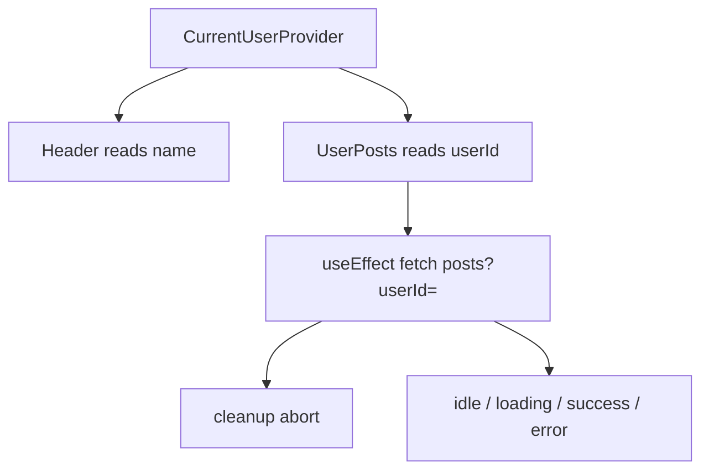
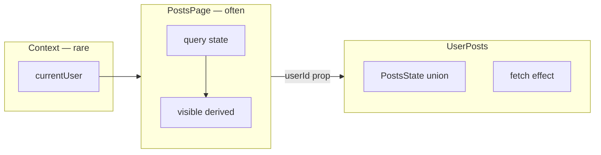

# Month 6 · Week 3 · Day 4
# Lab Feature: Current User Context and Their Posts

**Month index:** [../../README.md](../../README.md)  
**Week 3:** [1](day-01.md) · [2](day-02.md) · [3](day-03.md) · Day 4 (today) · [5](day-05.md) · [6](day-06.md) · [7](day-07.md)  
**Week rhythm today:** Add a real lab feature  
**Study time:** 3–4 focused hours  
**Prereq:** Day 3 page works: aborting fetch, union UI, derived filter. Today those ideas **compose**.

Project 4 is still not this folder. You are not pasting a dashboard. You are wiring **Day 2 Context** to **Day 1 fetch** so a widget does not receive `userId` through six layout components that should not care.

---

## How to read this chapter

A mock **current user** is a value many widgets might need: display name in the header, `userId` for “my posts,” maybe an email in a footer. It **rarely changes** (you will change it with a debug `<select>` to prove the fetch). That is Context’s job.

The widget that lists posts still uses an **effect** because HTTP is outside React. Cleanup still **aborts**. Empty success is still not error. Titles are still **text**.



The Provider does **not** fetch. The widget fetches. Mixing “who is the user” with “what did the network say” in one mega-context is how people invent a global store they cannot test. Keep the user object small and **synchronous** (hard-coded mock). Keep the request in the widget.

---

## Today's contract

By the end of this day you will be able to:

1. Provide a typed **mock current user** (`id`, `name`) and consume it with a hook that **throws** if the Provider is missing.
2. Fetch posts **for that id** with abort and a discriminated union.
3. Show **empty**, **error**, and **success** as different UI.
4. Explain why `userId` belongs in Context here, and why the **post list** does not.
5. Switch user in a debug control and watch cleanup abort the previous request.

**Today's gate**

> The widget reads `userId` from context, fetches with abort, and can render empty or error without lying. The Provider does not own the HTTP state.

---

## Time box

| Block | Minutes | Work |
|---|---|---|
| A | 40 | Theory: what belongs in this context |
| B | 40 | Provider + header (no fetch yet) |
| C | 80 | `UserPosts` widget + abort + empty/error |
| D | 20 | Git |
| E | 15 | Recall |

---

# Block A — Theory

## 1. Mock current user — a value, not a session library

```ts
export type CurrentUser = {
  id: number;
  name: string;
};
```

You will hard-code three operators, e.g. `{ id: 1, name: "Ada North" }`, `{ id: 2, name: "Ben Line" }`, `{ id: 3, name: "Cora Vault" }`. JSONPlaceholder’s users 1–3 exist; their **posts** exist. You are not implementing login. You are not storing passwords. You are not JWT.

A **debug switcher** in the header (a labeled `<select>`) calls `setUser` on the Provider. That is enough to change `id`. Every consumer re-renders. The posts widget’s effect deps include `user.id` and refetch.

**Wrong belief:** “Current user must come from `/api/me` today.”  
**Correct:** mock the object. Month 7+ will do server state. If you fetch the user in the Provider *and* the posts in the child this week, you will drown in unions. One remote list is the feature.

## 2. What the context value is

```ts
type CurrentUserContextValue = {
  user: CurrentUser;
  setUserId: (id: number) => void;
};
```

`setUserId` looks up the mock list and ignores unknown ids (or throws in dev). Do not put `posts`, `status`, or `query` in this object.

Default: `createContext<CurrentUserContextValue | undefined>(undefined)`. `useCurrentUser()` throws: `"useCurrentUser must be used inside CurrentUserProvider"`.

**Wrong belief:** “I’ll default to Ada so I can skip the Provider in tests.”  
**Correct:** tests will wrap with a Provider (Day 5). A fake default hides missing wrappers in the real tree.

## 3. The widget boundary

`UserPosts` **receives nothing required** about the user (or only optional UI props like `heading`). It **asks** context for `user.id`. It **owns** `PostsState`. It **owns** the effect.

That is a boundary:

| Component | Receives | Owns | Must not invent |
|---|---|---|---|
| `CurrentUserProvider` | `children` | which mock user is active | posts, HTTP |
| `Header` | nothing (or children) | chrome markup | fetch |
| `UserPosts` | optional heading | request + union | who the user is |

If `UserPosts` also took `userId` as a **prop**, you could skip Context. Today the point is: layout chrome should not thread `userId` into the widget. Header still needs the **name**; it uses the same hook. Two consumers, one Provider.

You **may** pass `userId` as a prop instead if you want to keep the widget testable without wrapping — then the **page** reads context and passes the id down **one** level. That is composition, and it is valid. Pick one and write it in `BOUNDARY.md`:

- **Hook inside widget** — fewer props, widget requires Provider  
- **Page reads context, passes `userId`** — widget is a function of props, easier to test

Day 5 is easier if the fetch component takes `userId: number` as a **prop** and the page is the one that calls `useCurrentUser()`. That is the design this course recommends for the lab:

```tsx
function PostsPage() {
  const { user } = useCurrentUser();
  return <UserPosts userId={user.id} heading={`${user.name}'s posts`} />;
}
```

Context is still real. The widget stays a function of props (Week 1). Tests can render `<UserPosts userId={1} />` without a Provider. **Do that.**

**Wrong belief:** “If I use Context, every child must call useContext.”  
**Correct:** one reader at the boundary is enough. The rest take props.

## 4. Fetch, abort, empty, error — recap with this URL

```text
https://jsonplaceholder.typicode.com/posts?userId=1
```

Same rules as Day 1:

- `useEffect` depends on `userId` (and a retry nonce if you have one)  
- `AbortController`; cleanup `abort()`  
- Ignore `AbortError` only  
- `unknown` + `parsePosts`  
- Union: `idle | loading | success | error`  
- **Empty:** user 1 has posts; if you filter to a query with no matches, or you point at an id with no posts, success + empty message  
- **Error:** break the URL on purpose (`/postz`) or force `ok === false`

JSONPlaceholder user `1` has posts. Empty UI still must exist in code: `state.status === "success" && state.posts.length === 0`. You can prove it by parsing a mock empty array in a tiny unit path, or by adding a **client filter** (derived) that matches nothing. Do **not** skip the empty branch because the real API is chatty.

**Wrong belief:** “Empty and error are the same red banner.”  
**Correct:** empty means the trip worked. Error means it did not. Operators deserve the difference.

## 5. Security

Post titles go in `{post.title}` or `{post.body}`. Not HTML. Not `innerHTML`. Not markdown rendered with a library you did not audit. `SECURITY.txt` one paragraph.

## 6. Lifting vs context vs composition (decision you must write)

You already lifted `query` on Day 3. Today `user` is **deeper** than a pair of siblings: header and main both need it, and later a third widget might. Context earns its keep.

A search `query` on this page, if you add one, still **does not** go in Context. Lift it in `PostsPage`. Derived filter.



If you later add a third widget that only needs the **name** (a footer “Signed in as …”), it calls `useCurrentUser` too. It does not know about posts. That is the skip-the-middle win.

**Wrong belief:** “Composition means I should pass `children` as a render-prop soup of fetch state.”  
**Correct:** `children` is for layout slots. Fetch state stays in the component that fetched.

---

# Block B — Type-along: Provider first

```powershell
cd ~\fullstack-lab\month-06
npm create vite@latest week-03-user-posts -- --template react-ts
cd week-03-user-posts
npm install
npm run dev
```

Delete the demo. Keep Strict Mode.

Type `src/currentUser.tsx` (shape — names may match yours):

```tsx
import { createContext, useContext, useMemo, useState } from "react";
import type { ReactNode } from "react";

export type CurrentUser = { id: number; name: string };

const MOCK_USERS: CurrentUser[] = [
  { id: 1, name: "Ada North" },
  { id: 2, name: "Ben Line" },
  { id: 3, name: "Cora Vault" },
];

type CurrentUserContextValue = {
  user: CurrentUser;
  setUserId: (id: number) => void;
};

const CurrentUserContext = createContext<CurrentUserContextValue | undefined>(
  undefined,
);

export function CurrentUserProvider({ children }: { children: ReactNode }) {
  const [user, setUser] = useState<CurrentUser>(MOCK_USERS[0]);
  const value = useMemo(
    () => ({
      user,
      setUserId: (id: number) => {
        const next = MOCK_USERS.find((u) => u.id === id);
        if (next) setUser(next);
      },
    }),
    [user],
  );
  return (
    <CurrentUserContext.Provider value={value}>
      {children}
    </CurrentUserContext.Provider>
  );
}

export function useCurrentUser() {
  const ctx = useContext(CurrentUserContext);
  if (ctx === undefined) {
    throw new Error("useCurrentUser must be used inside CurrentUserProvider");
  }
  return ctx;
}
```

Wrap in `main.tsx` **outside** `App` or inside `App` around the shell — the consumers must sit **under** the Provider.

`Header`: `{user.name}` as **text**. Labeled `<select>` whose `value={String(user.id)}` and `onChange` parses the number and calls `setUserId`. Controlled. Month 2 labels still apply (`htmlFor` / `id`).

Cause the throw once: render a consumer outside the Provider. Read the error. Restore.

No fetch yet. The header should switch names without a Network row. That proves Context is not HTTP.

---

# Block C — The widget

`src/parsePosts.ts` — type a guard again (do not paste Project 3 movie guards blindly; this is posts: `id`, `userId`, `title`, `body`). `src/UserPosts.tsx`:

```tsx
type UserPostsProps = {
  userId: number;
  heading: string;
};

type PostsState =
  | { status: "idle" }
  | { status: "loading" }
  | { status: "success"; posts: Post[] }
  | { status: "error"; message: string };
```

Effect on `[userId]` (and optional `retryNonce`):

1. Create `AbortController`.  
2. `setState({ status: "loading" })`.  
3. `fetch(\`https://jsonplaceholder.typicode.com/posts?userId=${userId}\`, { signal })`.  
4. Check `ok`. Parse `unknown` with `parsePosts`.  
5. `setState({ status: "success", posts })` or `{ status: "error", message }`.  
6. Catch: if `err.name === "AbortError"`, return; else error.  
7. Cleanup: `controller.abort()`.

Union render:

- loading: `<p aria-live="polite">Loading posts…</p>`  
- error: `<p role="alert">{message}</p>` plus Retry (`type="button"`) that increments nonce  
- success empty: “No posts for this user.”  
- success: `<ul>` of `{post.title}` — never `dangerouslySetInnerHTML`

`PostsPage`: `useCurrentUser()`, pass `userId` and heading. `App` composes `Header` + `PostsPage`.

Switch from user 1 to 2 quickly. Network: abort then a new request. If both complete and the UI flickers the wrong list, cleanup is missing.

Add a **controlled** filter in `PostsPage` or `UserPosts` — derived, no effect. Optional but it proves you did not regress Day 3. If the filter lives in `UserPosts`, it resets when `userId` changes (new mount if you `key={userId}`, or same state if you do not). Document the choice. Prefer **not** putting `query` in Context.

**Proving empty:** JSONPlaceholder users 1–3 have posts. Still write the empty branch. Prove it with a derived filter that matches nothing (`query` = `zzzzz`), or a temporary parse of `[]` in a test tomorrow. The empty **copy** must differ from the error **copy**.

**Proving error:** change the path to `/postz?userId=` once, see the alert, restore. Or Retry against a broken URL you toggle with a debug checkbox — optional. Do not leave the lab on a broken URL.

Write `BOUNDARY.md` (Provider vs page vs widget) and `SECURITY.txt` (titles are text).

CSS you type. Semantic `header` / `main`. One `h1` on the page (the heading prop can be `h2` if `App` already has `h1`).

Stretch: `useDocumentTitle` with the user name. Still not Project 4. Still not Query.

**Wrong belief:** “I’ll fetch posts in the Provider so every widget shares the list.”  
**Correct:** then every consumer re-renders on every HTTP tick, and you cannot render `UserPosts` with a fake `userId` in a test without mocking the whole user+network blob. Keep HTTP in the widget.

```powershell
cd ~\fullstack-lab
git add month-06/week-03-user-posts
git commit -m "Week 3 Day 4: mock current user context and aborting UserPosts."
```

---

# Block D — Git

If the commit above is done, skip. Never commit `node_modules`.

---

# Block E — Recall

1. Why is mock `currentUser` a Context candidate and `query` is not?
2. Why did this lab pass `userId` as a **prop** into `UserPosts`?
3. Who owns HTTP state?
4. Empty vs error?
5. What happens in cleanup when you switch users?

---

## Definition of done

- [ ] Provider + `useCurrentUser` throw if missing
- [ ] Header shows name; switcher changes id
- [ ] `UserPosts` fetches by `userId` prop with abort
- [ ] Empty and error UI exist and are distinct
- [ ] Guarded `unknown` JSON; titles as text
- [ ] BOUNDARY.md and SECURITY.txt exist
- [ ] No Redux, Query, RHF, Project 4 paste
- [ ] Commit exists

---

## Optional review links

Context and effects are explained in Days 1–2 and this chapter.

- [React: Passing Data Deeply with Context](https://react.dev/learn/passing-data-deeply-with-context)
- [React: Synchronizing with Effects](https://react.dev/learn/synchronizing-with-effects)

---

## Tomorrow

Tests: mock `fetch` with `vi.fn` (loading then success). Pure **reducer** tests with no DOM. Debug lab: an effect that **infinite-loops** — you cause it, then you fix it.
