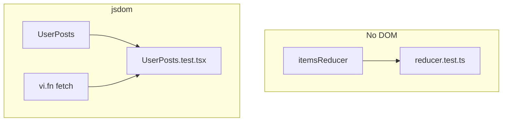
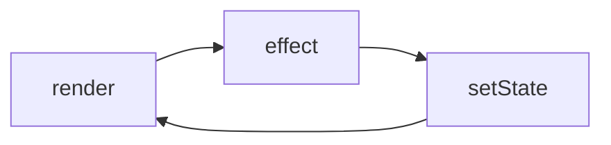

# Month 6 · Week 3 · Day 5
# Tests and Debug: Mock Fetch, Pure Reducers, Infinite Effects

**Month index:** [../../README.md](../../README.md)  
**Week 3:** [1](day-01.md) · [2](day-02.md) · [3](day-03.md) · [4](day-04.md) · Day 5 (today) · [6](day-06.md) · [7](day-07.md)  
**Week rhythm today:** Tests + refactor + documentation  
**Study time:** 3–4 focused hours  
**Student state:** `UserPosts` fetches. `itemsReducer` (Day 2) is a pure function. Today you **prove** both, then you **break** an effect on purpose.

Week 4 will deepen React Testing Library (roles, click, submit). Today you need enough RTL to assert **user-visible** loading then success, and enough Vitest to mock `fetch`. You do not need to test CSS classes. You do not need Redux DevTools.

---

## How to read this chapter

Two different claims need two different tests:

1. **Reducer:** given this state and this action, the next array is that array. No browser. No `render`. This is why reducers exist.
2. **Fetch UI:** given a fake `fetch` that does not resolve yet, the user sees loading; then it resolves, the user sees a title. That needs a component and a mocked network.



The debug lab is separate: an effect that `setState`s a value that is in its own dependency list. The tab will suffer. You will fix it. Do not commit the broken version as the app’s homepage.

---

## Today's contract

By the end of this day you will be able to:

1. Install and run **Vitest** + **Testing Library** + **jsdom** in a Vite React app if Week 1 Day 5 did not already.
2. Test a reducer as a **pure function**.
3. Mock `fetch` with `vi.fn` (or `vi.spyOn`) and assert **loading then success**.
4. Query the screen by **role** and **name**, not by CSS class.
5. Cause an **infinite effect loop**, explain it, and fix it.

**Today's gate**

> Reducers are tested without `render`. Fetch tests fake the network. An effect that sets state listed in its deps will loop until I fix the deps or delete the effect.

---

## Time box

| Block | Minutes | Work |
|---|---|---|
| A | 40 | Theory: why mock fetch, why pure reducers |
| B | 50 | Reducer tests + Vitest wiring |
| C | 55 | `UserPosts` loading → success |
| D | 35 | Infinite-loop lab |
| E | 15 | Recall + git |

---

# Block A — Theory

## 1. Reducers are easy to test — that is a feature

```ts
const start: Item[] = [];
const added = itemsReducer(start, { type: "add", label: "Calibrate" });
```

You cannot easily assert `crypto.randomUUID()` equals a fixed string. Assert **length**, **label**, **done: false**, and that `start` was **not mutated** (`start.length === 0` still).

Toggle: given an item `{ id: "a", label: "X", done: false }`, dispatch `{ type: "toggle", id: "a" }`, expect `done: true`. Toggle again, `false`. Unknown id: array unchanged (same contents).

Remove: filter out `id`. Do not mutate the original array (`toEqual` on a frozen copy if you want to be strict — `Object.freeze` on items, then reducer must copy).

No `document`. No `waitFor`. If this test needs `render`, you coupled the reducer to React and missed the point.

**Wrong belief:** “I’ll test add by clicking the button only.”  
**Correct:** click tests are slower and they mix form code with reducer code. Do both if you have time. The **pure** test is mandatory today.

## 2. Mock `fetch` — the component must not hit JSONPlaceholder in CI

`fetch` is on `globalThis`. In Vitest:

```ts
const fetchMock = vi.fn();
vi.stubGlobal("fetch", fetchMock);
```

or

```ts
vi.spyOn(globalThis, "fetch").mockImplementation(fetchMock);
```

Return a **Response-shaped** object the component actually uses. If your component reads `response.ok` and `response.json()`, the mock must provide those:

```ts
function okJson(data: unknown) {
  return Promise.resolve({
    ok: true,
    status: 200,
    json: () => Promise.resolve(data),
  } as Response);
}
```

`as Response` here is a test double, not a substitute for guarding API JSON in production. The **payload** should still look like posts so `parsePosts` accepts it.

**Loading then success** needs a **paused** `json()` (or a paused outer promise):

```ts
let resolveJson: (value: unknown) => void;

fetchMock.mockImplementation(() =>
  Promise.resolve({
    ok: true,
    status: 200,
    json: () =>
      new Promise((resolve) => {
        resolveJson = resolve;
      }),
  } as Response),
);
```

Render `<UserPosts userId={1} heading="Ada's posts" />`. Assert loading text is on the screen (`getByText` / `getByRole`). **Then** call `resolveJson([{ id: 1, userId: 1, title: "Hello", body: "…" }])`. **Then** `await findByText("Hello")` (or `waitFor`).

If you resolve immediately, you may never catch loading — React can flush too fast. The pause makes loading **testable**.

Cleanup: `vi.unstubAllGlobals()` or `restoreAllMocks` in `afterEach`. Otherwise the next test inherits a fake `fetch`.

**Wrong belief:** “I’ll call the real JSONPlaceholder in tests so it is more real.”  
**Correct:** tests become slow, flaky, and network-dependent. Mock. The guard tests can still pass a **local** `unknown` blob to `parsePosts` without `fetch`.

## 3. Testing Library — user-visible

Prefer:

- `screen.getByRole("heading", { name: /ada's posts/i })`  
- `screen.getByRole("status")` if you used `role="status"` or `aria-live` on a region  
- `screen.getByText("Loading posts…")` when that string is what the user sees  

Avoid:

- `container.querySelector(".spinner")`  
- snapshotting the whole DOM as your only assertion  

Week 4 will insist on this harder. Start now.

`await findBy*` retries until timeout — use it for success after resolve. `getBy*` throws immediately if missing — use it for loading **before** you resolve.

## 4. The infinite loop — mechanics

```tsx
const [count, setCount] = useState(0);

useEffect(() => {
  setCount(count + 1);
}, [count]);
```

Render: `count` is 0. After paint, effect runs, `setCount(1)`. Re-render. `count` changed, effect runs, `setCount(2)`. Forever. The browser may freeze. React 19 may scream in the console.

A cousin:

```tsx
const options = { userId };
useEffect(() => {
  setState({ status: "loading" });
  // even without fetch, this setState re-renders
}, [options]);
```

`options` is a **new object every render**. `Object.is` says it changed. Effect runs. `setState` even to a similar union still schedules work. Loop (or “loop enough to hurt”).

**Fixes:**

- Do not put derived updates in an effect; compute during render.  
- Depend on `userId`, a primitive.  
- If you must set state from an effect, set it from **outside** data (the fetch result), and do not list the state you just set as the thing that retriggers unless you have a real progression (you almost never do for this).  
- Functional updates (`setCount((c) => c + 1)`) still loop if `[count]` is in the deps — the new count still changes the dep.

**Wrong belief:** “I’ll add `if (count > 100) return` to stop it.”  
**Correct:** that is a bandage on a design error. Remove the effect or fix deps.

**Wrong belief:** “Strict Mode caused the loop.”  
**Correct:** Strict Mode doubled a loop you already wrote. The deps are the bug.



That cycle is legal **once** when a fetch returns (outside → setState → render → **same deps** → effect does not re-run). It is illegal when setState **changes a dep**.

A **legal** fetch effect sets `loading` then `success`. Why is that not an infinite loop? Because `userId` (the dep) did **not** change when success arrived. React runs the effect again only when deps change (or on Strict remount). `setState` to `{ status: "success", posts }` re-renders the UI; it does not change `userId`.

An **illegal** cousin: putting `state` in the dependency array, then `setState({ status: "loading" })` at the top of the effect. Every new state object retriggers the effect. That is today’s debug lab in another costume.

---

# Block B — Vitest wiring + reducer tests

Work in `~\fullstack-lab\month-06\week-03-hooks` for the reducer (copy `itemsReducer.ts` into `week-03-user-posts` if you want one app — pick **one** home and document it). Fetch tests belong next to `UserPosts`.

If Vitest is not installed (Week 1 Day 5 may have done this):

```powershell
cd ~\fullstack-lab\month-06\week-03-user-posts
npm install -D vitest jsdom @testing-library/react @testing-library/jest-dom @testing-library/user-event
```

`vite.config.ts` — merge `test` into the existing Vite config (do not delete the React plugin):

```ts
/// <reference types="vitest/config" />
import { defineConfig } from "vite";
import react from "@vitejs/plugin-react";

export default defineConfig({
  plugins: [react()],
  test: {
    environment: "jsdom",
    globals: true,
  },
});
```

`package.json` script: `"test": "vitest"`.

If `globals: true`, you can use `describe` / `it` / `expect` without importing them. Importing from `vitest` is also fine and clearer.

`src/itemsReducer.test.ts` (copy the reducer file if needed). Shape:

```ts
import { describe, expect, it } from "vitest";
import { itemsReducer } from "./itemsReducer";
import type { Item } from "./itemsReducer";

describe("itemsReducer", () => {
  it("adds without mutating the original array", () => {
    const start: Item[] = [];
    const next = itemsReducer(start, { type: "add", label: "Calibrate" });
    expect(start).toHaveLength(0);
    expect(next).toHaveLength(1);
    expect(next[0]?.label).toBe("Calibrate");
    expect(next[0]?.done).toBe(false);
  });

  it("toggles by id", () => {
    const start: Item[] = [{ id: "a", label: "X", done: false }];
    const once = itemsReducer(start, { type: "toggle", id: "a" });
    expect(once[0]?.done).toBe(true);
    expect(start[0]?.done).toBe(false);
    const twice = itemsReducer(once, { type: "toggle", id: "a" });
    expect(twice[0]?.done).toBe(false);
  });

  it("removes by id", () => {
    const start: Item[] = [{ id: "a", label: "X", done: false }];
    const next = itemsReducer(start, { type: "remove", id: "a" });
    expect(next).toEqual([]);
  });
});
```

If `crypto.randomUUID` is missing in your test environment, the add test should not assert a specific id — or polyfill in the test file. Do not `as any`. Do not invent a fake `{ type: "nope" }` action to test `never`.

Run:

```powershell
npm test -- --run
```

`--run` once (CI style). Watch mode is optional. If `vite.config.ts` already has `test`, **merge** — do not replace the React plugin with an empty config.

---

# Block C — Fetch test: loading then success

`src/UserPosts.test.tsx` — you type this; names must match your strings:

```tsx
import { render, screen, cleanup } from "@testing-library/react";
import { afterEach, beforeEach, describe, expect, it, vi } from "vitest";
import { UserPosts } from "./UserPosts";

describe("UserPosts", () => {
  const fetchMock = vi.fn();

  beforeEach(() => {
    vi.stubGlobal("fetch", fetchMock);
  });

  afterEach(() => {
    cleanup();
    vi.unstubAllGlobals();
    vi.clearAllMocks();
  });

  it("shows loading, then a title on success", async () => {
    let resolveJson: (value: unknown) => void = () => {};
    fetchMock.mockImplementation(() =>
      Promise.resolve({
        ok: true,
        status: 200,
        json: () =>
          new Promise((resolve) => {
            resolveJson = resolve;
          }),
      }),
    );

    render(<UserPosts userId={1} heading="Ada's posts" />);
    expect(screen.getByText(/loading posts/i)).toBeTruthy();
    expect(
      screen.getByRole("heading", { name: /ada's posts/i }),
    ).toBeTruthy();

    resolveJson([{ id: 1, userId: 1, title: "Hello", body: "x" }]);
    expect(await screen.findByText("Hello")).toBeTruthy();
    expect(screen.queryByText(/loading posts/i)).toBeNull();
  });
});
```

If `getByRole("heading")` fails, you used a `p` for the heading — use `h2` for `heading` or query the text you actually rendered. Do not switch to `.card-title` CSS.

Second test (recommended): `ok: false` → error message visible. Third: `json` body `[{ title: 1 }]` fails the guard → error, not a crash. Still no real network.

`parsePosts` unit tests (no DOM): happy array; `"nope"` throws; `[{ title: 1 }]` throws. These can live in `parsePosts.test.ts`. They are cheaper than RTL and they pin the Month 5 boundary.

Do not assert aborted Strict Mode double-fetch unless you want pain; in tests, Strict Mode may still double-invoke. Your mock should allow **two** calls (`mockImplementation` that always returns a paused or resolved response). If the test flakes on double mount, return `okJson` immediately for a simpler **success** test **and** keep **one** paused test. Document what you saw in `TESTNOTES.txt`.

Parse unit test (no DOM): `parsePosts([{ id: 1, userId: 1, title: "t", body: "b" }])` length 1; `parsePosts("nope")` throws; `parsePosts([{ title: 1 }])` throws.

---

# Block D — Debug lab: infinite loop

`src/InfiniteBroken.tsx` — you **type** the broken effect (`setCount(count + 1)` with `[count]`). Render it **only** from `src/InfiniteBroken.md` instructions: temporarily point `App` at it, **save**, observe (console + maybe a frozen tab). Restore `App` immediately.

`DEBUG.txt` full sentences:

- What you observed (fan of logs, frozen UI, React warning)  
- Why the dependency made the effect retrigger  
- The fix (`const next = count + 1` during an event, not an effect; or delete the effect; or depend on something that is not the state you set)  

Second bug (required): object-in-deps. `const options = { userId: 1 }; useEffect(() => { setTick((n) => n + 1); }, [options]);`. Cause, observe, fix by depending on `userId` or deleting the pointless `setTick`.

Do not “fix” by removing Strict Mode. Do not commit `App` stuck on the broken component.

Grep for `dangerouslySetInnerHTML` and `innerHTML` in the lab:

```powershell
Select-String -Path src\*.tsx,src\*.ts -Pattern "innerHTML"
```

Zero hits.

---

# Block E — Recall + git

1. Why test reducers without DOM?  
2. Why pause `json()` to see loading?  
3. Why not real JSONPlaceholder in unit tests?  
4. Draw the render → effect → setState → render loop.  
5. Why is an object literal in the dependency array dangerous?

```powershell
cd ~\fullstack-lab
git add month-06
git commit -m "Week 3 Day 5: reducer tests, mocked fetch, infinite-effect debug."
```

---

## Definition of done

- [ ] `npm test -- --run` green for reducer + `parsePosts` + UserPosts loading/success
- [ ] `TESTNOTES.txt` on Strict Mode double fetch if it appeared
- [ ] `DEBUG.txt` explains both loops and the fixes
- [ ] Broken infinite component is not the running `App`
- [ ] Queries by visible text/role, not CSS class as the only strategy
- [ ] No real network in tests
- [ ] Commit exists

---

## Optional review links

Testing Library and Vitest mocks are sketched here. Later checking:

- [Vitest: Mocking](https://vitest.dev/guide/mocking.html)
- [Testing Library: Async](https://testing-library.com/docs/dom-testing-library/api-async/)
- [React: You Might Not Need an Effect](https://react.dev/learn/you-might-not-need-an-effect)

---

## Tomorrow

Independent: you write **`useDebouncedValue`** or **`useLocalStorage`** (JSON.parse `try/catch`, Month 3). Teach-back: when effects are wrong. Not Project 4.
