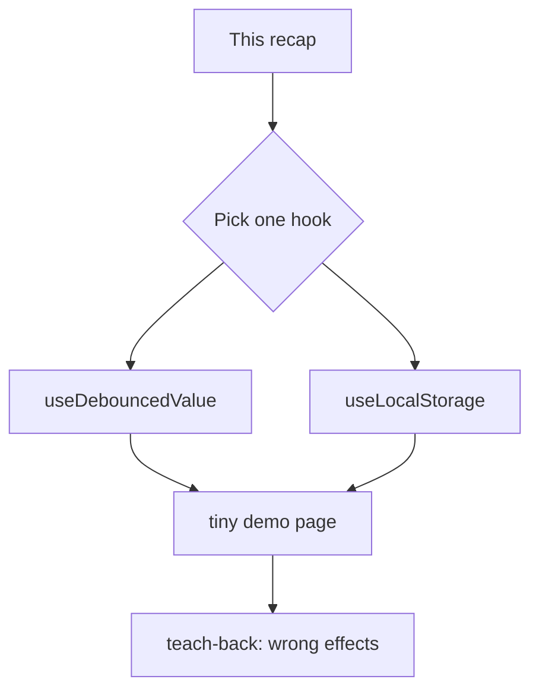
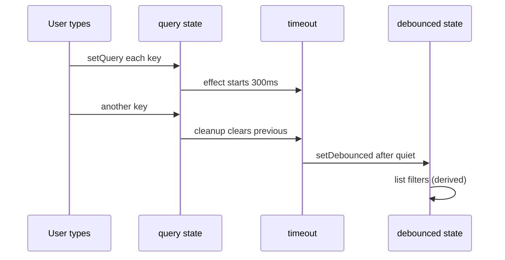

# Month 6 · Week 3 · Day 6
# Independent: A Hook You Can Defend

**Month index:** [../../README.md](../../README.md)  
**Week 3:** [1](day-01.md) · [2](day-02.md) · [3](day-03.md) · [4](day-04.md) · [5](day-05.md) · Day 6 (today) · [7](day-07.md)  
**Week rhythm today:** Independent project work  
**Study time:** 3–4 focused hours  
**Days 1–5 textbook files:** closed for the *hook implementation*. Repair from **this recap** and, if stuck 25 minutes, Days 1–2 in this book only.

You pick **one**: `useDebouncedValue` **or** `useLocalStorage`. Not both unless you finish early. Not Project 4. Not TanStack Query. The teach-back is how we know you understood **when effects are wrong**, not only how to copy a hook snippet.

---

## How to read this chapter

A custom hook is still `useState` + `useEffect` (and maybe `useRef`) with a **`use` prefix**. The rules of hooks still apply. Cleanup still matters. JSON from `localStorage` is still **untrusted** (Month 3). Debouncing is **not** aborting: debounce **waits to start**; abort **cancels an already started** request.



Stuck: Day 1 (effects, cleanup) or Day 2 (custom hooks, refs). Not a blog named “usehooks.”

---

## Complete explanation (you need this to type without Day 1 open)

**Effects** sync React with the outside. Timers and `localStorage` are outside. **Derived** filter/`fullName`/display formatting are inside — **no effect**.

**Dependencies** list the values the sync uses. A new object every render is a fake change. Cleanup runs before the next sync and on unmount. Strict Mode remounts in dev.

**`useDebouncedValue(value, delayMs)`:** the returned value **lags** the input. While the user types, `value` changes every key. You start a `setTimeout`. Cleanup `clearTimeout` on the next key. Only after quiet for `delayMs` do you `setDebounced(value)`. The **input** stays controlled with the immediate `value`. The **expensive work** (later: fetch) uses `debounced`. Today you may filter a **local** list with the debounced string to *see* the lag — or you may fetch with the debounced string **and** abort (compose Day 1). If you fetch, abort is still required; debounce does not replace it.

**`useLocalStorage(key, fallback, isT)`:** initialize state with a **function** (`useState(() => …)`) so you do not parse JSON every render. `getItem` may be `null` → fallback. `JSON.parse` in `try/catch` → fallback. Parsed value is **`unknown`** → `isT` guard → fallback if false. To write: `setItem(key, JSON.stringify(value))` in an effect that depends on `key` and `value`. `setItem` can throw (quota) — catch and surface a message; do not white-screen. This is **not** a vault (Month 3). No passwords. `127.0.0.1` and `localhost` are different origins.

**Wrong belief:** “I’ll `JSON.parse` in render without try/catch.”  
**Correct:** garbage in DevTools must not crash the tree.

**Wrong belief:** “Generic `useLocalStorage<T>` can trust `as T` after parse.”  
**Correct:** pass a **type guard**. Month 5 still applies.

**Wrong belief:** “Debounce belongs in `onChange` with a module-level `let timer`.”  
**Correct:** that can work and also leak across Strict Mode and unmount. An effect with cleanup is the React-shaped version. (You may store the timeout id in a ref; the effect cleanup is still the source of truth.)

**Refs:** a timeout id may live in a ref. The **debounced string** must be **state** if the UI (or a child fetch) must update when it settles. If you only store the debounced string in a ref, the list will not re-render.

**Context:** do not put the keystroke `value` in Context. The hook returns `[debounced]` to the component that owns the input.

**Reducer:** not required today.

**Composition:** a `SearchBox` can own the immediate query and call `onDebouncedChange(debounced)` up, or the parent can call the hook. Either is a boundary you can name.



Typing `q`, `u`, `i` in 100ms: three `query` values, **one** debounced update to `"qui"` (plus maybe an initial sync). Network: still none if you only filter locally.

**Debounce vs abort vs derived** — three different clocks:

| Tool | Question it answers |
|---|---|
| Derived filter | “What subset of data I already have matches `query`?” |
| Debounce | “Has the user paused long enough that I should treat this string as serious?” |
| Abort | “The previous HTTP trip is obsolete; cancel it.” |

You may combine debounce + abort when you fetch on the **debounced** string: effect deps `[debounced]`, cleanup aborts. You must **not** combine “filter in an effect” with anything. Filter stays render.

**Wrong effects you will be tempted to write today**

| Temptation | Why it is wrong | Instead |
|---|---|---|
| `useEffect(() => setVisible(filter(items, debounced)), [items, debounced])` | Two truths | `const visible = filter(items, debounced)` |
| `useEffect(() => setFullName(first + last), [first, last])` | Math | Template during render |
| `useEffect(() => setQuery(propQuery), [propQuery])` | Mirror | Controlled from parent, or `key` |
| Debounce without cleanup | Overlapping timers; stale `setDebounced` | `clearTimeout` in cleanup |
| `localStorage` parse with `as T` | Lie | Guard `unknown` |

**Rules of hooks still apply.** `useDebouncedValue` is called at the top of a component (or another hook), not inside `if (enabled)`. If delay is 0, you still write the effect — or skip the hook and use `value` directly. Do not call hooks conditionally.

**SSR note (honesty):** `localStorage` does not exist on a Node render. This course’s Vite SPA runs in the browser. `window.localStorage` in `useState(() => …)` is fine here. Do not invent Next.js today.

---

## Today's contract

**Today's gate**

> I shipped one custom hook I can explain, with cleanup, and a teach-back that names wrong effects — not a dashboard.

---

## Time box

| Block | Minutes | Work |
|---|---|---|
| A | 20 | Speak recap; choose the hook |
| B | 100 | Build hook + demo page |
| C | 45 | Teach-back 400+ words |
| D | 20 | Git |

---

# Spec — shared

```powershell
cd ~\fullstack-lab\month-06
npm create vite@latest week-03-independent -- --template react-ts
cd week-03-independent
npm install
npm run dev
```

Fictional **studio utility** page. Not Project 4. Not a paste of Day 4. Keep Strict Mode. JSX text only. Windows / Vite / TypeScript.

`HOOK.md`: which hook you chose and why (ten lines).

`teachback.md`: **400+ words**, prose. Required arguments (see below). Not a bullet dump of APIs.

---

## Option A — `useDebouncedValue`

```ts
export function useDebouncedValue<T>(value: T, delayMs: number): T {
  const [debounced, setDebounced] = useState(value);

  useEffect(() => {
    const id = window.setTimeout(() => {
      setDebounced(value);
    }, delayMs);
    return () => {
      window.clearTimeout(id);
    };
  }, [value, delayMs]);

  return debounced;
}
```

You type it. You understand why `value` is in the deps: a new character **should** restart the timer. You understand why cleanup clears the previous timer: otherwise every keystroke would eventually fire.

Demo:

1. Controlled labeled input (`query`).  
2. `debounced = useDebouncedValue(query, 300)` (or 400).  
3. Show both strings on screen: “Now: …” and “Debounced: …” so the lag is visible.  
4. Filter a **hard-coded** array of titles with `debounced` (derived `.filter`). Typing fast should not filter on every letter — only after pause.  
5. Optional stretch: fetch JSONPlaceholder `posts?userId=1` once (abort on unmount), then filter locally with debounce — still **no** filter effect.  
6. Optional stretch: fetch when **`debounced`** changes, with abort. Then you have **two** effects: load vs debounce. Do not merge them into soup.

Test (required if you can reuse Day 5 Vitest; otherwise a checklist in `HOOK.md`):

- After render, before timers, debounced equals initial.  
- `vi.useFakeTimers()`; type a change; `vi.advanceTimersByTime(299)` — still old; advance past delay — new value.  
- Unmount before fire — no `setState` on unmounted component crash (cleanup).  

If fake timers fight you, write the checklist and a manual proof. Prefer a real test.

Fake-timer sketch:

```ts
it("lags until the delay elapses", () => {
  vi.useFakeTimers();
  const { rerender, result } = /* renderHook if you add it, or a tiny harness component */;
  // initial debounced === "a"
  // rerender with value "ab"
  vi.advanceTimersByTime(299);
  // still "a"
  vi.advanceTimersByTime(1);
  // now "ab"
  vi.useRealTimers();
});
```

You do **not** need `@testing-library/react`’s `renderHook` if it is not installed. A harness `<Probe value={v} />` that writes `debounced` into a `data-testid` is enough. Week 4 will polish queries; today prove the clock.

Accessibility: the input stays labeled. Showing “Now” and “Debounced” as text is fine; do not `aria-live` every keystroke (noisy). Live-region the **result count** if you want, politely.

**Wrong belief:** “I’ll debounce by putting `query` in a ref and filtering in an effect on an interval.”  
**Correct:** that is a harder version of the same idea plus a derived-state smell. Use the hook above.

**Wrong belief:** “300ms means I should `fetch` on every `query` change and abort.”  
**Correct:** that works and hammers the server. Debounce **then** fetch (deps = `[debounced]`). Stretch only.

---

## Option B — `useLocalStorage`

Month 3 physics, React clothes.

```ts
export function useLocalStorage<T>(
  key: string,
  fallback: T,
  isT: (x: unknown) => x is T,
): [T, (next: T) => void] {
  const [value, setValue] = useState<T>(() => {
    try {
      const raw = window.localStorage.getItem(key);
      if (raw === null) {
        return fallback;
      }
      const parsed: unknown = JSON.parse(raw);
      if (!isT(parsed)) {
        return fallback;
      }
      return parsed;
    } catch {
      return fallback;
    }
  });

  useEffect(() => {
    try {
      window.localStorage.setItem(key, JSON.stringify(value));
    } catch {
      // quota or private mode — do not crash the tree
    }
  }, [key, value]);

  return [value, setValue];
}
```

Guard example for a theme or a list of strings — pick a **small** `T`:

```ts
function isTheme(x: unknown): x is "light" | "dark" {
  return x === "light" || x === "dark";
}
```

or `Array.isArray` + every element `typeof === "string"` for a note list.

Demo:

1. A control that updates `T` (theme toggle **or** a tiny notes list with add — if notes, **controlled** input, trim blank, `useReducer` optional).  
2. Refresh: value survives.  
3. DevTools: set the key to `NOT JSON`. Reload. Fallback. Page alive.  
4. `parse` tests **without** React: extract `readStored(raw: string | null): T` if that keeps tests honest — `JSON.parse` try/catch + guard. `node`/Vitest: garbage → fallback; good JSON → value.  

**Wrong belief:** “The effect should `setValue` from `getItem` on every key change **and** write — I’ll list `value` and also read in the same effect.”  
**Correct:** initialize in `useState(() => …)`. The effect **writes**. If you read and write in one effect on `[value]`, you can loop or fight. If `key` changes, you may reset from storage in an effect **on `[key]` only** — that is a rare identity change, like Day 1’s `key={id}` story. Document it. Today one key is enough.

Do not store passwords. Do not `innerHTML` stored titles.

Persistence schema if you store notes:

```json
{ "version": 1, "items": ["Calibrate sensors"] }
```

Then `isT` checks `version === 1` and an array of strings — Month 3 habit. A bare `string[]` in the key is allowed if you document it; garbage still falls back.

Quota: fill storage in DevTools until `setItem` throws (optional). Your `try/catch` in the write effect must keep the page alive. Write `QUOTA.txt` if you tried it, or write “not tried — catch still present.”

Theme variant: `useLocalStorage("theme", "light", isTheme)` plus Day 2’s className wrapper. Refresh keeps dark. That is a complete demo in twenty lines of UI.

**Wrong belief:** “I’ll sync storage with an effect that both reads and `setValue`s on `[value]`.”  
**Correct:** that is how you get a loop or a stale overwrite. Read once on init. Write on change.

---

## Teach-back (both options) — 400+ words

Close the day files. Write `teachback.md` in prose. A TA should believe you could teach a junior.

You **must** include:

1. Three effects that are **wrong** (filter a list, `fullName`, `useEffect(() => setX(propX), [propX])`) and what to do instead.  
2. Why Strict Mode double-fetch is a **cleanup** lesson.  
3. Why a **ref** holding the search query will not update the list.  
4. Why Context for every keystroke is the wrong size of tool.  
5. How **your** hook uses an effect **legitimately** (timer or storage) and what cleanup does.  
6. Empty success vs error, in one paragraph, even if today’s demo did not fetch.

Do not paste this chapter. If the essay never says “derived,” it is incomplete.

### Folder and files

```
week-03-independent/
  src/
    App.tsx
    useDebouncedValue.ts    # or useLocalStorage.ts
    parseStored.ts          # if option B: guard + try/catch, testable
  HOOK.md
  teachback.md
```

One `h1`. Semantic `main`. CSS you type. Labels on inputs. `npm run dev` on Windows PowerShell. Commit from `~\fullstack-lab`.

If you finish early: extract `useToggle` from Day 2 from memory (not a second project). Still not Project 4.

**Security:** stored notes and API titles stay JSX text. `Select-String` for `innerHTML` in `src`. Zero hits.

Worked storage failure: DevTools Application → Local Storage → set your key to `NOT JSON` → refresh. The hook’s `catch` returns `fallback`. The page still shows the toggle or empty list. If you see a white screen, `JSON.parse` escaped. Write that observation in `HOOK.md`.

Worked debounce failure: cleanup missing. Type `a`, then `ab` at 50ms. Two timeouts fire; debounced may flicker `a` then `ab` after the first timer was supposed to be dead. Restore `clearTimeout`.

---

## Definition of done

- [ ] One hook, `use` prefix, typed, no `any`
- [ ] Cleanup exists (timeout clear **or** you can explain why storage write has nothing to abort)
- [ ] Demo page proves the hook (lag visible **or** refresh + garbage JSON)
- [ ] `teachback.md` 400+ words with the six required arguments
- [ ] `HOOK.md` names the choice
- [ ] No Project 4, Query, RHF, Redux
- [ ] No `dangerouslySetInnerHTML`
- [ ] Commit exists

```powershell
cd ~\fullstack-lab
git add month-06/week-03-independent
git commit -m "Independent: custom hook with cleanup and effects teach-back."
```

---

## Optional review links

Hooks and storage/timers are explained in this chapter. Later checking:

- [React: Reusing Logic with Custom Hooks](https://react.dev/learn/reusing-logic-with-custom-hooks)
- [MDN: `Window.setTimeout`](https://developer.mozilla.org/en-US/docs/Web/API/Window/setTimeout)
- [MDN: `localStorage`](https://developer.mozilla.org/en-US/docs/Web/API/Window/localStorage)

---

## Tomorrow

Week review: synthesis, four debug stories (missing cleanup; derived state in `useEffect`; Context for everything; ref as secret search state). Then Week 4 Router.
