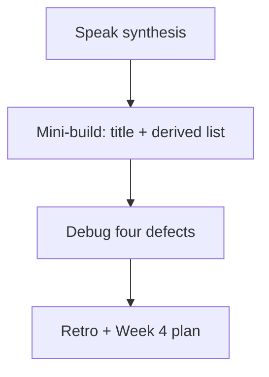
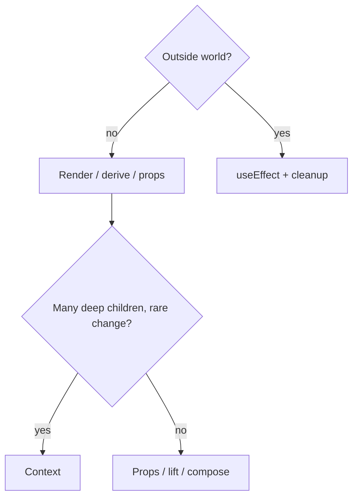

# Month 6 · Week 3 · Day 7
# Week Review — Effects, Context, Reducers, Refs, Hooks

**Month index:** [../../README.md](../../README.md)  
**Week 3:** [1](day-01.md) · [2](day-02.md) · [3](day-03.md) · [4](day-04.md) · [5](day-05.md) · [6](day-06.md) · Day 7 (today)  
**Week rhythm today:** Review, repair, plan Week 4  
**Study time:** 3–4 focused hours  
**Student state:** You fetched with abort, provided a mock user, tested a reducer, and wrote a hook. Today those ideas must still live in your head — from **this file**.

Do not start Week 4 because the calendar moved. A routed app that copies props into state with an effect is still a Week 3 defect.

---

## How to read this chapter

This is a **closed-book teaching day**. The synthesis **is** the Week 3 lesson.



Days 1–6 closed during mini-build. Repair from **this** recap.

---

## Week synthesis (this book)

**`useState`** owns data that should re-render. **Controlled inputs** pair `value` with `onChange`. **Derived** values (`visible`, `fullName`, counts) are expressions during render — not state, not effects.

**`useEffect`** synchronizes with **something outside React**: document title, `fetch`, timers, listeners. It runs **after paint**. Deps: `[]` first paint (+ Strict Mode remount in dev), `[id]` when `id` changes, omitted = every render (usually a bug). Cleanup **stops** the previous sync: `abort()`, `clearInterval`, `removeEventListener`. Strict Mode remounts to find missing cleanup. Double fetch in dev is a signal to **abort**, not to delete `StrictMode`.

**Not an effect:** filtering, concatenating names, formatting props for display, mirroring props with `setX(propX)`. Rare reset-when-id-changes: prefer `key={id}` on the form.

**Fetch this month:** `AbortController`, `response.ok`, `unknown` + guard, discriminated `idle | loading | success | error`. Empty success ≠ error. Titles as JSX **text**. No Query yet.

**Context:** rarely changing values many deep children need (theme, mock `currentUser`). Default `undefined`, hook **throws** if missing Provider. Not for high-frequency search query. Composition and lifting still beat drilling two or three levels.

**`useReducer`:** pure `(state, action) => next` when several verbs share a tree (add/toggle/remove). Not Redux. Easy to test without a DOM.

**`useRef`:** mutable box, no re-render. DOM `focus()`. React 19: `ref` can be a prop on function components (`forwardRef` not required). Do not store the search query only in a ref.

**Custom hooks:** `use` prefix; share effect/state logic (`useToggle`, `useDocumentTitle`, `useDebouncedValue`, `useLocalStorage`). `JSON.parse` still `try/catch`. Debounce waits to start; abort cancels in flight.

**Lifting / composition:** nearest common parent; `children` for arbitrary regions; Context when chrome should not thread a rare value.



**Wrong belief:** “Hooks are a menu; I pick as many as possible.”  
**Correct:** you pick the smallest tool that keeps **one** source of truth.

Worked map for a “search my posts” screen:

| Piece | Tool |
|---|---|
| Selected mock user | Context (rare) or lifted state |
| Search box letters | `useState` + controlled input |
| Filtered rows | Derived during render |
| HTTP list | `useEffect` + abort + union |
| Tab title | `useEffect` or `useDocumentTitle` |
| Add/toggle/remove local rows | `useReducer` (if you have local rows) |
| Autofocus the box | `useRef` + effect `[]` |
| Share toggle logic | `useToggle` |

If two rows of that table both claim the same data, you have a bug.

**Today's gate.** Closed-book:

> I can explain effect vs derive vs context vs ref, abort a fetch on unmount, and name four bugs from this week without opening Days 1–6.

---

## Time box

| Block | Minutes | Work |
|---|---|---|
| 1 | 40 | Speak the synthesis |
| 2 | 50 | Mini-build |
| 3 | 35 | Debug four defects (write causes) |
| 4 | 20 | Re-run Day 5 tests if they exist |
| 5 | 20 | Design paragraph |
| 6 | 20 | Retro + Week 4 plan |

---

# Complete explanation — hooks you must still own

## 1. After paint, not during render

React calls your function to **describe** UI. After the browser paints, effects run. Fetching during render duplicates work and fights Strict Mode. Computing `visible` during render is cheap and correct.

## 2. Cleanup is part of the effect

If you subscribed, you unsubscribe. If you fetched, you abort. If you started a timer, you clear it. Missing cleanup is a leak and a **race**. Strict Mode is a flashlight, not an enemy.

## 3. Unions, not boolean soup

`loading && error` is a bug you can type. `{ status: "error"; message: string }` cannot also hold `posts`. Empty list is success with length 0.

## 4. Context is a skip-the-middle cable

Theme and mock user: yes. Search box: no. Throw if the cable is unplugged (no Provider). Prefer passing `userId` **one** hop into a fetch widget so tests do not need the whole tree.

## 5. Reducers and refs

Reducer: named actions, copies not mutations, tests without `render`. Ref: focus, timeout ids, previous values. Ref as the only home of `query`: the filtered list never updates, because nothing re-rendered.

## 6. Worked mini-build (in words)

A page with a controlled filter and a hard-coded list of five service names (or a fetch with abort if you want to prove Day 1 again — **one** remote list max). `document.title` shows how many are visible. Title updates in an **effect**. Filter does **not**. If you fetch, switching a mock user id (prop or context) aborts. Malformed JSON guard: if you fetch, `unknown` then check fields.

Malformed title `"<b>x</b>"` in the hard-coded list shows brackets.

If you fetch: `unknown` → guard → union. If JSONPlaceholder is unreachable, error UI, not a white screen. Retry optional.

### Title effect vs filter (the pair you must still own)

```tsx
useEffect(() => {
  document.title = `${visible.length} services`;
}, [visible.length]);
```

That effect talks to **`document`**, which is outside React. The list filter is **inside** React. Two tools.

**Wrong belief:** “I’ll `useEffect` both the title and the filter so they stay in sync.”  
**Correct:** the filter is `const visible = items.filter(...)`. The title effect depends on `visible.length`. Sync is the definition of an effect; math is not.

**Wrong belief:** “Context is how Week 3 shares everything.”  
**Correct:** Context is a cable for **rare, stable** values. `query` is neither. Lift the string one hop.

**Wrong belief:** “A ref of the query is an optimization because it avoids renders.”  
**Correct:** avoiding the render **is** the bug. The list never updates.

Custom hook reminder:

```tsx
function useDocumentTitle(title: string) {
  useEffect(() => {
    document.title = title;
  }, [title]);
}
```

You may call this from the review page. You must still explain the effect inside it.

Scaffold:

```powershell
cd ~\fullstack-lab\month-06\week-03
npm create vite@latest review -- --template react-ts
cd review
npm install
npm run dev
```

---

# Mini-build

`~\fullstack-lab\month-06\week-03\review\` — new Vite app **or** a folder in an existing Week 3 app. Not Project 4.

Spec:

- Controlled labeled filter. Derived visible list.  
- `useDocumentTitle` or a title effect: `` `${visible.length} services` ``.  
- One of: hard-coded items **or** aborting fetch + union.  
- If fetch: empty and error UI.  
- No filter effect. No prop-mirroring effect.  
- `StrictMode` on.  
- JSX text only.

Speak the synthesis out loud before you type. If you cannot, read the synthesis again — not Day 1.

Folder: `~\fullstack-lab\month-06\week-03\review\` with `npm create vite@latest review -- --template react-ts` if you want a clean tree (then `cd` into it). HTTP via Vite. `node_modules` untracked.

`REVIEW.txt`: one paragraph you **speak** — effect vs derive vs context vs ref. If that paragraph names Query or Redux, rewrite it.

---

# Debug (write the cause, from this week)

`DEBUG.txt` — **full sentences**. What you would **observe**, then the **cause**, then the **fix**. The four required defects:

### 1. Missing cleanup

A `setInterval` that `setCount`s every second, no `clearInterval`. Or a fetch with no `abort`. Observe: extra intervals after unmount (or Strict Mode double interval); wrong user posts winning a race (user 1’s slow response paints after you asked for user 2). Fix: return cleanup that `clearInterval`s or `abort()`s. Strict Mode making two intervals is the flashlight.

### 2. Derived state in `useEffect`

`useEffect(() => setVisible(items.filter(...)), [items, query])`. Observe: it “works,” extra renders, possible loops if you listed `visible`. The Network panel is quiet, so you think you are clever — you have still split the truth. Fix: `const visible = items.filter(...)` during render. Same family: `fullName` in an effect.

### 3. Context for everything

`query` on every keystroke in a Context that wraps the whole app, including a heavy tree that does not care. Observe: everything re-renders; the “API” looks global; you cannot see who owns the box; tests wrap the world to type one letter. Fix: lift `query` to the nearest parent; Context for theme/user. Two or three prop hops is not a crisis.

### 4. Ref to store search query without render

`queryRef.current = event.target.value` and filter reads the ref during render. Observe: typing does not update the list until something else `setState`s (a theme toggle magically “fixes” search — that is the clue). Fix: `useState` for `query`; controlled input. Refs are for DOM nodes and boxes that must **not** notify React.

Do **not** ship these bugs. You may reproduce #2 and #4 for thirty seconds if it helps you write the observation. Restore `App`.

Optional fifth: `useEffect(() => setDraft(title), [title])` wiping a form while the user types because the parent passed a new string identity. Observe: the caret jumps; draft dies. Fix: control from parent or `key={id}` when the **record** changes.

**Wrong belief:** “I’ll remove Strict Mode so debug #1 looks clean.”  
**Correct:** you broke the flashlight. Leave it on.

### Abort vs debounce vs derive (say this in REVIEW.txt)

| Clock | Job today |
|---|---|
| Derived `visible` | Subset of data you already have |
| Title `useEffect` | Write `document.title` after paint |
| Fetch `useEffect` | HTTP + abort (optional on this mini-build) |
| Ref | Focus the box once; **not** the query string |

If two rows claim the same data, you have a bug. `useReducer` is optional on the review page; if you add local add/toggle, the reducer must **copy** arrays. Test the reducer without `render` if you already have Day 5 habits.

Week 4 preview you must not skip: React Router will **name screens with URLs**. Effects still abort. Filters still derive. Context still is not a list cache. Query still waits until Month 7.

---

# Review, tests, design

Re-run Day 5 `npm test -- --run` if that app still exists. One committed fix if a test was skipped.

**Design paragraph** (`DESIGN.txt`): why `UserPosts` should take `userId` as a prop even when the page reads Context. Why the Provider must not hold `PostsState`.

**Retro** (`RETRO.md`): hours this week; solid vs weak (abort? unions? context overuse?); honest Week 4 readiness. **Week 4:** React Router (nested routes, `Outlet`, params, 404, protected mock-auth UI), error/loading at route edges, Testing Library by role — explained in Week 4 day files. Still no Query, no RHF, no Redux.

```powershell
cd ~\fullstack-lab
git add month-06/week-03/review
git commit -m "Record Week 3 effects and hooks review."
```

---

## Week 3 definition of done

- [ ] Gate paragraph spoken without Days 1–6
- [ ] Mini-build: derived filter + title effect (and abort if you fetched)
- [ ] DEBUG.txt covers all four defects with observations
- [ ] DESIGN.txt on context vs fetch state
- [ ] RETRO.md does not skip Week 4 Router
- [ ] No `dangerouslySetInnerHTML` of API or user titles
- [ ] Commit exists

Speak the four debug stories to a rubber duck. If you cannot name the observation for #4 (list stuck until another `setState`), stay — that bug is how people “optimize” forms and then ship a broken search box.

### Union reminder (still Week 3)

```ts
type ListState<T> =
  | { status: "idle" }
  | { status: "loading" }
  | { status: "success"; items: T[] }
  | { status: "error"; message: string };
```

Empty success is `success` with `items: []`. You cannot read `items` on the error branch. If the mini-build uses a hard-coded list, you still **say** this union aloud — Week 4’s route-level loading is the same idea.

`useReducer` tests without a DOM: given `[]` and `{ type: "add", label: "Calibrate" }`, length is 1 and the original array is untouched. If you skip a reducer today, write “no local verbs” in `REVIEW.txt`. Do not invent Redux.

Context throw:

```tsx
function useTheme() {
  const value = useContext(ThemeContext);
  if (value === undefined) {
    throw new Error("useTheme must be used under ThemeProvider");
  }
  return value;
}
```

The review page does **not** need theme. If you add it, keep `query` out of that context.

### Fetch optional on the mini-build

If you fetch, the effect still uses `AbortController`, an inner `async` function, `unknown` JSON, and a discriminated union. Typing in the filter must **not** add Network rows. Changing a mock `userId` must abort. Strict Mode stays on.

If you do **not** fetch, five hard-coded service names are enough. Title effect still runs. Filter still derives. That pair is the week.

```tsx
const visible = services.filter((row) =>
  row.label.toLowerCase().includes(query.trim().toLowerCase()),
);

useDocumentTitle(`${visible.length} services`);
```

Week 4 Router will name screens with URLs. You will still derive filters. You will still abort fetches until Month 7 Query. Do not skip “when not to use an effect” because a route file is coming.

`DESIGN.txt`: `UserPosts` takes `userId` as a **prop** even when the page reads Context, so tests can pass `userId={1}` without wrapping the world. The Provider must not hold `PostsState`.

---

## Optional review links

Week 3 is explained in this chapter. These pages are for later checking, not for first learning.

- [React: You Might Not Need an Effect](https://react.dev/learn/you-might-not-need-an-effect)
- [React: Synchronizing with Effects](https://react.dev/learn/synchronizing-with-effects)
- [React: Passing Data Deeply with Context](https://react.dev/learn/passing-data-deeply-with-context)
- [React: Extracting State Logic into a Reducer](https://react.dev/learn/extracting-state-logic-into-a-reducer)
- [React: Referencing Values with Refs](https://react.dev/learn/referencing-values-with-refs)
- [React: Reusing Logic with Custom Hooks](https://react.dev/learn/reusing-logic-with-custom-hooks)

---

## If this week is true

Week 4 starts at [../week-04/day-01.md](../week-04/day-01.md). Router, nested layouts, params, protected UI, then Project 4 **start**. You still write loading/empty/error yourself.
