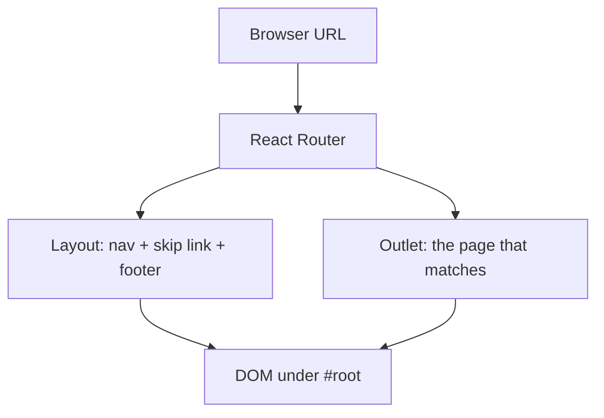
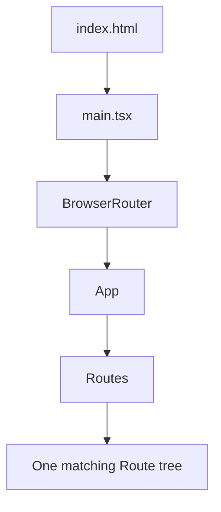
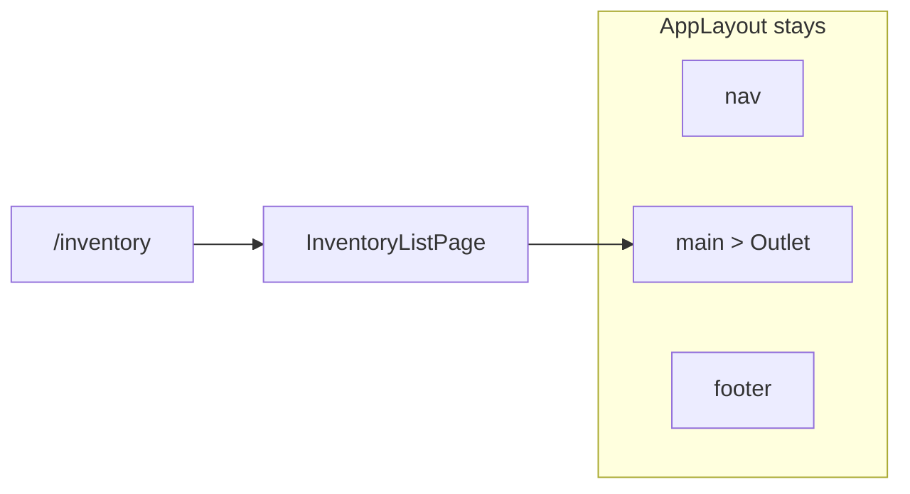

# Month 6 · Week 4 · Day 1
# React Router: The URL Is a Screen

**Program:** Full-Stack Mastery · 18 months  
**Phase:** 2 — Modern frontend  
**Month index:** [../../README.md](../../README.md)  
**Week 4:** Day 1 (today) · [2](day-02.md) · [3](day-03.md) · [4](day-04.md) · [5](day-05.md) · [6](day-06.md) · [7](day-07.md)  
**Week rhythm today:** Learn + type-along  
**Student state:** Week 3 gate passed. You can type components, controlled state, effects, and a context provider. The address bar still does not mean a screen.  
**Study time:** 3–4 focused hours

**This week covers:** React Router (nested routes, params, protected UI), error/loading you own, component tests, the start of Project 4, and the Month 6 exam.

Today: why a **single-page app** still needs real URLs, how **`BrowserRouter` / `Routes` / `Route`** map a path to a component, why **`Link`** is not `<a>`, how a **layout route** keeps the chrome while **`Outlet`** swaps the page, how **`useParams`** reads `:id`, and how **`path="*"`** is a 404.

Protected routes, search params, and mock login are **Day 2**. Do not skip them. If you only memorize “put `Route` tags in `App`,” tomorrow’s `Navigate` will feel like a special case instead of the same idea.

Project 4 is **not** today’s lab. Labs live in `~\fullstack-lab\month-06\`. This textbook will not give you the dashboard. TanStack Query, React Hook Form, and Zod are **Month 7** — named here only so you do not install them this week.

---

## How to use this textbook

This is not a video transcript and not a tutorial to skim.

1. Read a section. Close it. Say the idea in your own words.
2. Type every lab. Do not paste a generated router tree you cannot explain.
3. When the compiler or the browser errors, **read the error**. Then fix it. That *is* the lesson.
4. Do not keep an explanation you cannot repeat without looking.
5. AI may explain or review. It may not replace your reasoning.

If you finish early, do the stretch — not another “React Router crash course” tab.

---

## How to read this chapter

In Weeks 1–3 you built **one** React tree. Clicking a button changed **state**. The URL stayed `/`. That is fine for a widget. It is a lie for an app.

An operator who bookmarks “the pallet with id `oak-04`” must land on **that** pallet after a refresh. Sharing a link must share a **screen**, not a shrug. The back button must mean “the previous screen,” not “leave the site.”

**React Router** is the library that keeps the **address bar** and the **component tree** in sync, **without** asking the server for a new HTML document on every click.

If that is still abstract, use this picture. A theater has one building (your Vite app, one `index.html`). The marquee on the street is the **URL**. Changing the marquee should change which **set** is on stage. The lobby (nav, skip link, footer) stays. The stage is **`Outlet`**.



Read each section. Close it. Say it in one sentence. Then type the lab. When a full reload wipes your React state, that is `<a href>` doing what `<a>` always did — not a broken install.

---

## Today's contract

By the end of this day you will be able to:

1. Explain why an SPA still needs **real URLs**, and why `if (page === "inventory")` is not routing.
2. Scaffold a Vite **`react-ts`** app, install **`react-router`**, and wrap the tree in **`BrowserRouter`**.
3. Declare **`Routes`** and **`Route`**: a layout at `/`, an **index** child, `inventory`, `inventory/:id`, and `*`.
4. Use **`Link`** and **`NavLink`** (active class) instead of raw `<a>` for in-app screens.
5. Render nested UI through **`Outlet`**.
6. Read **`useParams`** with an honest type (`id` is `string | undefined`).
7. Show a **404** page for unknown paths.
8. Keep Month 2 accessibility in the layout: **skip link**, real `<nav>`, visible **`:focus-visible`**.

**Today's gate.** Closed-book:

> The URL is a screen. `BrowserRouter` watches the address bar. `Routes` picks one match. A layout route renders chrome and `<Outlet />` for the child. `Link` changes the URL without a full reload. `:id` is a param; `*` is “nothing else matched.”

If you cannot say that, stay here. Day 2’s protected wrapper is just another component that **chooses** a `Navigate`. It will not rescue a mushy “Router is magic tags.”

---

## Time box

| Block | Minutes | Work |
|---|---|---|
| A | 50 | Theory |
| B | 55 | Scaffold `week-04-router` + nested routes |
| C | 70 | Independent: three pages in a layout, typed param, 404 |
| D | 20 | Git |
| E | 15 | Recall |

---

# Block A — Theory

## 1. What problem routing solves

A **multi-page website** (Month 2) already had URLs: each HTML file was a document. The browser requested that file from the server.

A **single-page application** ships **one** HTML file. React then draws every screen into `#root`. If you fake screens with state only:

```tsx
const [page, setPage] = useState<"home" | "inventory">("home");
// ...
<button type="button" onClick={() => setPage("inventory")}>Inventory</button>
{page === "inventory" ? <Inventory /> : <Home />}
```

…then refresh always returns **home**, the back button leaves the app, and nobody can send a link to a pallet.

**The problem:** the **URL** must mean a **screen** (and later, Day 2, a **search**). React state is the wrong place to store “which page am I on?” when the user, the bookmark, and the back button all speak URL.

**React Router’s bet:** you declare a **table** of paths → components. The library reads `window.location`, matches a row, and renders that row’s element. Clicks on `Link` call **history** APIs (`pushState`) instead of asking the server for new HTML.

**Wrong belief:** “SPA means the URL does not matter.”  
**Correct:** SPA means the **server** does not send a new document per click. The URL still matters **more**, because it is the only shareable name for a screen.

**Wrong belief:** “I will `if` my way through pages and set `window.location` by hand.”  
**Correct:** a tangle of `if (page === ...)` does not nest, does not 404 cleanly, and fights the back button. A **route table** is the map. Conditionals belong **inside** a page (loading vs empty), not as the app’s entire navigation system.

---

## 2. What React Router is (this month’s mode)

This course uses **declarative** routing in a Vite SPA:

- Package: **`react-router`** (v7). You install **`react-router`**, not a second product named `react-router-dom`.
- You wrap the app in **`BrowserRouter`**.
- You declare **`Routes`** / **`Route`** in JSX.
- Pages still **fetch in `useEffect`** (Week 3) or use mock arrays. That is allowed.

Older tabs will say `npm install react-router-dom` and `from "react-router-dom"`. That was v6. In v7 the packages simplified: **import from `"react-router"`**. If a snippet imports `RouterProvider` from `"react-router/dom"`, that is the **data-router** API (`createBrowserRouter`, loaders). **Not** this month’s main path.

**Loaders and actions** (route modules that fetch before render) exist. They fight Month 7’s job: **TanStack Query** as the server-state layer. Do not make loaders the way you load lists this month. Client-side routes + components that fetch in effects (or mock data) is the honest Month 6 path.

**Wrong belief:** “I need Next.js to have more than one page.”  
**Correct:** Next.js is a **framework** you will meet later for literacy. Vite + React Router is enough for a client-rendered admin shell.

---

## 3. The boot sequence with a router

Same as Week 1, plus one wrapper:

1. `index.html` still has `#root`.
2. `main.tsx` still `createRoot(...).render(...)`.
3. **`BrowserRouter`** wraps **`App`** (or wraps the routes). It subscribes to the history stack.
4. **`App`** (or a `AppRoutes` component) renders **`Routes`**.
5. The matching **`Route`**’s `element` is the React tree for this URL.

```tsx
import { StrictMode } from "react";
import { createRoot } from "react-dom/client";
import { BrowserRouter } from "react-router";
import App from "./App";
import "./index.css";

createRoot(document.getElementById("root")!).render(
  <StrictMode>
    <BrowserRouter>
      <App />
    </BrowserRouter>
  </StrictMode>,
);
```

`BrowserRouter` must be an **ancestor** of every `Link`, `Routes`, and `useParams()`. If a hook says it cannot find a router context, you rendered the hook **outside** this wrapper — or you wrapped twice in a confusing way (tests will use `MemoryRouter` on Day 4 instead of `BrowserRouter`).



**Wrong belief:** “`App.tsx` is still one page.”  
**Correct:** `App` is often the **route table** plus maybe a layout. Each URL is a different child tree.

---

## 4. `Routes` and `Route`

```tsx
import { Routes, Route } from "react-router";
import { AppLayout } from "./layout/AppLayout";
import { HomePage } from "./pages/HomePage";
import { InventoryListPage } from "./pages/InventoryListPage";
import { InventoryDetailPage } from "./pages/InventoryDetailPage";
import { NotFoundPage } from "./pages/NotFoundPage";

export default function App() {
  return (
    <Routes>
      <Route path="/" element={<AppLayout />}>
        <Route index element={<HomePage />} />
        <Route path="inventory" element={<InventoryListPage />} />
        <Route path="inventory/:id" element={<InventoryDetailPage />} />
        <Route path="*" element={<NotFoundPage />} />
      </Route>
    </Routes>
  );
}
```

Read it like a table:

| Path | What renders |
|---|---|
| `/` | `AppLayout` **and** `HomePage` in the layout’s `<Outlet />` |
| `/inventory` | `AppLayout` + list page |
| `/inventory/oak-04` | `AppLayout` + detail; param `id` is `"oak-04"` |
| `/nope` | `AppLayout` + 404 (because `*` is a **child** of the layout) |

**`index`** means “the parent’s own URL.” `path="/"` on the parent already is `/`. The index child is “what fills the outlet **at** `/`.” Without an index, `/` would show the layout with an **empty** outlet.

**Child paths are relative** by default. Parent `path="/"` + child `path="inventory"` → `/inventory`. You do **not** write `path="/inventory"` on the child unless you mean an **absolute** path (advanced; skip it today).

**`path="*"`** is the splat / catch-all: nothing else matched. Put it **last** among siblings. It is not “a wildcard in the middle of a word.”

**Wrong belief:** “Every `Route` is a full page that replaces the whole app.”  
**Correct:** **nested** routes compose. The parent can stay mounted while the child swaps. That is the layout.

---

## 5. Layout routes and `Outlet`

A **layout route** is a parent `Route` whose element is chrome: skip link, header, nav, `<main>`, footer. Where the page goes, you render:

```tsx
import { Outlet } from "react-router";

export function AppLayout() {
  return (
    <>
      <a href="#main" className="skip-link">
        Skip to content
      </a>
      <header>
        <p>
          <a href="#main">Northline Yard</a>
        </p>
        {/* nav with NavLink — next section */}
      </header>
      <main id="main">
        <Outlet />
      </main>
      <footer>
        <p>Training yard — not Project 4.</p>
      </footer>
    </>
  );
}
```

**`Outlet`** is a placeholder: “render the matched **child** route here.” If you forget it, every URL shows the header and an empty hole. That is the most common first bug. It is not a broken package.

A parent **without** `path` is also a layout: it groups children without adding a URL segment. You do not need that today. You need **one** parent at `/` with an outlet.



**Wrong belief:** “I will copy-paste the header into every page component.”  
**Correct:** that is how the header drifts. One layout. One skip link. Pages own only the **main** content.

---

## 6. `Link` vs `<a>` vs `NavLink`

### 6.1 Full reload vs client navigation

`<a href="/inventory">` is HTML. The browser **navigates to a document**. Vite’s dev server may still serve `index.html` for that path (history fallback), then React **boots again**. All `useState` dies. You see a flash. It “works” the way a hammer works on a screw.

**`Link`** renders an `<a>` in the DOM (good for open-in-new-tab, crawlability, and “what is this control?”) but its click is intercepted: React Router updates the history stack and re-renders the matching route. **No full reload.**

```tsx
import { Link } from "react-router";

<Link to="/inventory">Inventory</Link>
<Link to={`/inventory/${id}`}>Open pallet</Link>
```

`to` is a **path in your app**, not a filename.

Use a real `<a href="https://...">` for **leaving** the site. Use `Link` for **inside** the app.

### 6.2 `NavLink` and the active class

**`NavLink`** is `Link` plus “am I the current screen?”

```tsx
import { NavLink } from "react-router";

<NavLink
  to="/"
  end
  className={({ isActive }) => (isActive ? "nav-link is-active" : "nav-link")}
>
  Home
</NavLink>
<NavLink
  to="/inventory"
  className={({ isActive }) => (isActive ? "nav-link is-active" : "nav-link")}
>
  Inventory
</NavLink>
```

`className` can be a **function** of `{ isActive, isPending, isTransitioning }`. Today you need **`isActive`**.

**`end`** on the home link matters. Without it, `/` is a **prefix** of every path, so Home stays active on `/inventory` too. `end` means “active only when this is the whole match.”

Style `.is-active` in CSS you type: underline or a left border in accent color. Do not test “the CSS class string” as your only proof later (Day 4): the **accessible name** and the **URL** are the user-visible facts. The class is a courtesy for sighted users.

**Wrong belief:** “I’ll `useState` a `currentPage` and add `className` myself.”  
**Correct:** the URL already knows. `NavLink` reads it. A second source of truth will drift.

---

## 7. Route parameters and `useParams`

A segment that starts with **`:`** is dynamic:

```tsx
<Route path="inventory/:id" element={<InventoryDetailPage />} />
```

URL `/inventory/oak-04` → the param object includes `id: "oak-04"`.

```tsx
import { useParams, Link } from "react-router";

export function InventoryDetailPage() {
  const { id } = useParams();

  if (typeof id !== "string") {
    return <p>Missing item id.</p>;
  }

  return (
    <>
      <h1>Pallet {id}</h1>
      <p>
        <Link to="/inventory">Back to inventory</Link>
      </p>
    </>
  );
}
```

**`id` is `string | undefined`.** TypeScript is telling the truth: this component *could* be rendered without that param if you reuse it badly. Do not write `useParams<{ id: string }>()` and then pretend `id` is always there. Narrow: `typeof id !== "string"` (or `id === undefined`) and show a small fallback. A lie with `as string` is the Month 5 `as Movie` lesson in a new coat.

Params are **strings**. They come from the URL. `"42"` is not `42`. Convert on purpose if you need a number — and still treat unknown ids as **not found** (Day 2’s page-level empty/error).

**Wrong belief:** “`useParams` returns the database row.”  
**Correct:** it returns **URL pieces**. You still look up the row in a list, a mock map, or (Week 3) a fetch.

---

## 8. 404 is a route

Unknown paths must not be a blank `Outlet`. A child `path="*"` inside the layout keeps the chrome and shows **Not found** with a `Link` home. That is kinder than a white screen.

One `h1` per page: **Page not found** is a real heading. Do not skip to `h3`.

You can put `*` **outside** the layout if you want a 404 **without** the app nav. Today, **inside** the layout is enough and matches “the building is the same, the room is missing.”

---

## 9. Accessibility in a routed shell (Month 2 still applies)

A layout is a **document** the user lives in:

- **Skip link** first in the tree: “Skip to content” → `#main`. Visible on **focus**.
- One **`h1` per page** (in the child, not also in the header wordmark). The wordmark is a `p` or a `Link` to `/`, not a second `h1`.
- **`nav`** with lists of links. `NavLink` is still an `<a>`.
- **`:focus-visible`** outline on links and buttons (accent, offset). No `outline: none` without a replacement.
- Route changes should land the user in **main**. A skip link is the minimum today. Moving focus to `h1` on every navigation is a later refinement — do not fake it with `tabIndex={0}` on random divs.

JSX text is still **text**. Pallet names from a mock list go in `{name}`, not `dangerouslySetInnerHTML`.

---

## 10. What you are not installing

| Tool | When |
|---|---|
| TanStack Query | Month 7 — server cache |
| React Hook Form + Zod | Month 7 — schema forms |
| Redux | Only if a real shared client-state problem appears (Project 4 says conditional; this month: **no**) |
| Tailwind as the only layout skill | You already own Flex/Grid. A utility file is not a substitute for a layout you can draw. |

Today’s CSS is **your** `index.css`: `system-ui`, a max-width wrapper, Flex header, skip-link styles. No UI kit.

---

# Block B — Type-along

## B1 — Scaffold

In PowerShell:

```powershell
cd ~\fullstack-lab
mkdir month-06 -ErrorAction SilentlyContinue
cd month-06
npm create vite@latest week-04-router -- --template react-ts
cd week-04-router
npm install
npm install react-router
npm run dev
```

The extra `--` after `create vite` is required on Windows PowerShell so `--template` reaches Vite.

If Node is too old, upgrade LTS (Month 5: Vite 7 wants Node 20.19+ or 22.12+). Reopen the terminal after install.

Open the local URL. You should see the Vite demo. Leave the dev server running.

## B2 — Wrap the tree

In `src/main.tsx`, wrap `<App />` in `<BrowserRouter>` as in §3. Import from `"react-router"`, not `"react-router-dom"`.

If the editor cannot find the module, you are in the wrong folder or `npm install react-router` did not run.

## B3 — Files you type (do not generate the tree)

Create (names yours; these are the course defaults):

- `src/layout/AppLayout.tsx`
- `src/pages/HomePage.tsx`
- `src/pages/InventoryListPage.tsx`
- `src/pages/InventoryDetailPage.tsx`
- `src/pages/NotFoundPage.tsx`

Delete the Vite logos and counter from `App.tsx`. Put the **`Routes`** table from §4 in `App.tsx`.

`AppLayout`: skip link, header with wordmark **Northline Yard**, `nav` with `NavLink` to `/` (`end`) and `/inventory`, `<main id="main"><Outlet /></main>`, footer. Type the CSS: skip link off-screen until `:focus`, header Flex `space-between`, `.is-active` underline, `:focus-visible` 3px accent `#0b5fff`.

Each page: **one `h1`**. Home: a short welcome. List: an `<ul>` of three **`Link`s** to `/inventory/oak-04`, `/inventory/pine-11`, `/inventory/steel-2` (hard-coded is fine). Detail: heading `Pallet {id}` after the `typeof id !== "string"` guard, plus a back `Link`. 404: heading and `Link` to `/`.

## B4 — Break it on purpose

1. Comment out `<Outlet />`. Visit `/inventory`. Write one sentence in `ROUTES.txt`: what you saw and why. Restore.
2. Replace one `NavLink` with `<a href="/inventory">`. Click it. Watch the full reload (Network tab, or a `useState` counter in the layout that resets). Write one sentence. Restore `NavLink`.
3. Remove `end` from the Home `NavLink`. Visit `/inventory`. Write whether Home stayed active. Restore `end`.

```powershell
# keep the dev server in that terminal; another terminal:
cd ~\fullstack-lab
git add month-06/week-04-router
git commit -m "Month 6 Week 4 Day 1: BrowserRouter nested layout and params."
```

Add `node_modules` to `.gitignore` if it is not already there. **Never commit `node_modules`.**

---

# Block C — Independent

Still in `week-04-router` (do not start Project 4).

1. **Three pages nested in the layout** — you already have Home, list, detail. Make the list **data-driven**: a `src/data/pallets.ts` module exporting a typed array `{ id: string; label: string }[]`. Map with **stable `id` keys**. Each row is a `Link` to `/inventory/${id}`.
2. Detail looks up the pallet by `id`. If the param is a string but **no row matches**, show a page-level **Not found** message (this is “bad id,” not the `*` route). Link back to the list. Do not crash.
3. Keep `path="*"` for paths that are not inventory at all (`/bananas`).
4. **No** `if (page === ...)` router. **No** TanStack Query. **No** fake backend.
5. `ROUTES.txt`: a markdown table of path → component → what the user sees. Include `/`, `/inventory`, `/inventory/:id`, `*`.
6. Keyboard: Tab to skip link, to nav, to a pallet link, Enter, confirm the detail `h1`.

Stretch: a `useNavigate` button on the detail page, **Back to list**, that calls `navigate("/inventory")`. Then explain in `ROUTES.txt` why a `Link` was already enough. Programmatic navigate is for **after a form succeeds** (tomorrow), not for replacing every link.

---

# Block D — Git

```powershell
cd ~\fullstack-lab
git add month-06/week-04-router
git commit -m "Week 4 Day 1: nested layout, NavLink, params, 404."
```

---

# Block E — Recall

Close the file.

1. Why is `if (page === "inventory")` not enough for an app operators bookmark?
2. What does `BrowserRouter` wrap, and what breaks if you forget it?
3. Why `Link` instead of `<a href="/inventory">`?
4. What does `<Outlet />` do? What do you see if it is missing?
5. Why does the Home `NavLink` need `end`?
6. What is the TypeScript type of `id` from `useParams()`?
7. Why is `path="*"` last?
8. Where does the skip link live — every page, or the layout?

---

## Definition of done

- [ ] I can explain URL → `Routes` → layout + `Outlet` without saying “Router is HTML”
- [ ] `week-04-router` runs; `/`, `/inventory`, `/inventory/oak-04`, `/nope` each show a real `h1`
- [ ] I broke `Outlet` and `<a href>` on purpose and wrote what happened
- [ ] Home `NavLink` uses `end`; active class is visible
- [ ] `id` is narrowed; unknown ids do not crash
- [ ] Skip link, `nav`, `:focus-visible` exist
- [ ] `ROUTES.txt` exists
- [ ] `node_modules` is not committed
- [ ] Commit exists

---

## Optional review links

React Router in declarative (Vite SPA) mode is explained in this chapter. These pages are for later checking, not for first learning.

- [React Router: declarative installation](https://reactrouter.com/start/declarative/installation)
- [React Router: routing](https://reactrouter.com/start/declarative/routing)
- [React: Your first component](https://react.dev/learn/your-first-component) (if JSX is rusty)

---

## Tomorrow

**Protected UI, search params, page-level loading/error.** A `RequireAuth` wrapper will read a mock **AuthContext** (Week 3’s pattern, rebuilt in this app). Unauthenticated visits `<Navigate to="/login" replace />`. `?q=` will be URL state. Query is still not this month.
