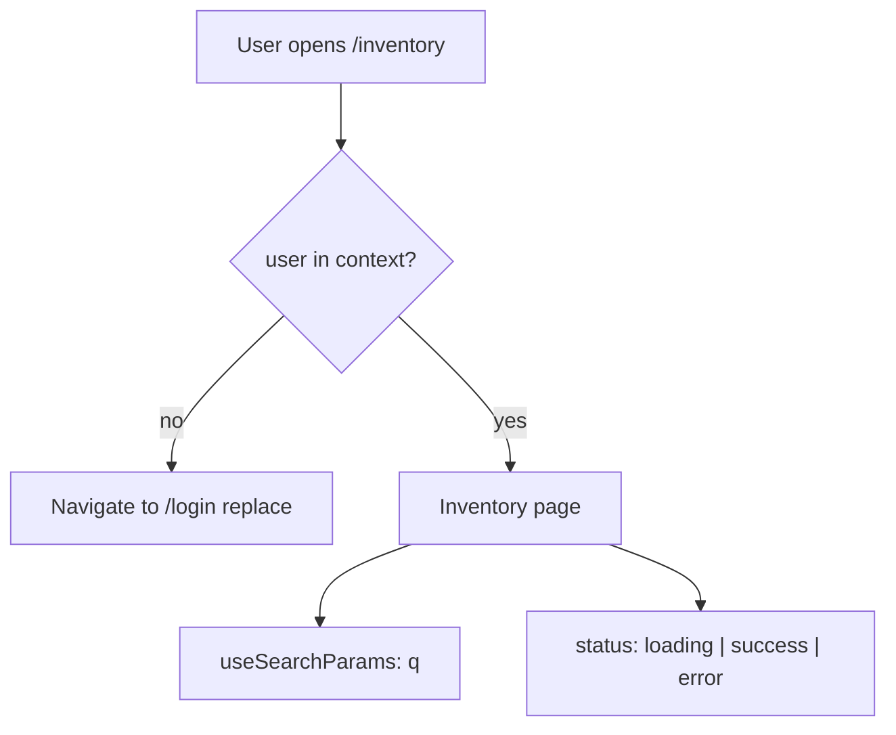
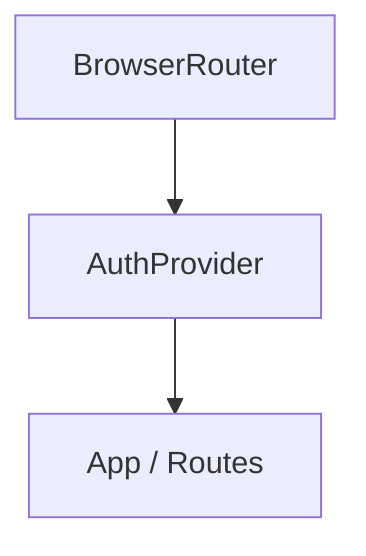
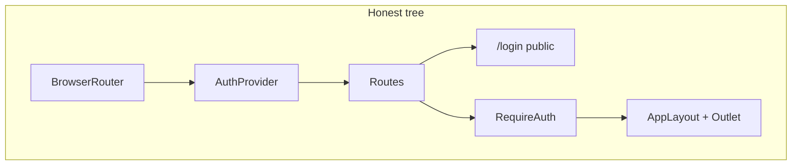

# Month 6 · Week 4 · Day 2
# Protected Routes, Search Params, and Honest Loading

**Program:** Full-Stack Mastery · 18 months  
**Phase:** 2 — Modern frontend  
**Month index:** [../../README.md](../../README.md)  
**Week 4:** [1](day-01.md) · Day 2 (today) · [3](day-03.md) · [4](day-04.md) · [5](day-05.md) · [6](day-06.md) · [7](day-07.md)  
**Week rhythm today:** Exercises + debugging  
**Student state:** Day 1 gate. You have `week-04-router` with a layout, nested pages, params, and a 404. Nothing is locked. Search lives in `useState` if it lives at all.  
**Study time:** 3–4 focused hours  
**Prereq:** Day 1. Week 3 context (provider + hook) — you will **rebuild** a small auth context in this app; do not import Week 3’s files by path.

Today: a **mock login** that writes a user into context; a **`RequireAuth`** wrapper that **`Navigate`s** to `/login` when there is no user; **`useSearchParams`** so `?q=` is shareable; **loading / error / empty** as **page UI** you own (not a library).

TanStack Query is **Month 7**. `errorElement` on a data router is an optional footnote, not the lab.

Project 4 is still not this lab. Do not start `~/ops-dashboard/` until Day 6.

---

## How to read this chapter

Yesterday the URL named a **screen**. Today the URL also names **who may see it** and **what the list is filtered by**.

A lock on a door is not a new building. **`RequireAuth`** is a component that either renders its child (or an `<Outlet />`) or renders **`<Navigate to="/login" replace />`**. Login is another **route**. Mock success is **`setUser`**. There is no FastAPI, no JWT, no cookie. If you treat this as “real security,” you will skip Month 8–12 and ship a costume.

Search in `useState` dies on refresh. Search in **`?q=`** survives refresh, bookmarks, and paste. That is **URL state**.



Read. Close. Say it. Then type. When login “works” but Back returns to a protected URL and bounce-loops, you forgot **`replace`**.

---

## Today's contract

By the end of this day you will be able to:

1. Rebuild a tiny **AuthContext** (user or `null`, `login`, `logout`) and wrap the tree **inside** `BrowserRouter`.
2. Write **`RequireAuth`** that redirects with **`<Navigate to="/login" replace />`**.
3. Build a **controlled** login form (labels, `htmlFor`, submit). Mock success — not a backend.
4. Use **`useNavigate`** after login; use **`replace: true`** so the login page is not sitting under Back.
5. Filter a list with **`useSearchParams`** (`q`), not only `useState`.
6. Show **loading, error, empty, success** on a page that fetches (or fakes a delay). Abort if you fetch (Week 3).
7. Keep the 404. Keep the skip link.

**Today's gate.** Closed-book:

> Protected UI is a wrapper: no user → `<Navigate to="/login" replace />`. Login sets context, then `navigate("/", { replace: true })`. `?q=` is shareable filter state. Loading and error are **page UI**. This auth is a mock.

If you cannot say that, stay here. Day 3’s from-memory app is this plus yesterday, with the textbook closed.

---

## Time box

| Block | Minutes | Work |
|---|---|---|
| A | 50 | Theory |
| B | 55 | Type-along: context, RequireAuth, login, `?q=` |
| C | 70 | Independent: protected dashboard + search + status UI |
| D | 20 | Git |
| E | 15 | Recall |

---

# Block A — Theory

## 1. Mock auth is context, not a server

Week 3 taught **`createContext`**, a **provider**, and a **hook** that throws if you use it outside the provider. Today that object is “who is signed in?”

```tsx
type User = { email: string };

type AuthValue = {
  user: User | null;
  login: (email: string) => void;
  logout: () => void;
};
```

`login` in this lab can be: if the form is non-empty, `setUser({ email })`. You may require a specific mock password (e.g. `yard`) so empty submit fails. You must **not** call a real identity API. You must **not** store a password in context.

**Where the provider sits:**



Router **above** auth is the usual picture: `Navigate` and `useNavigate` need the router. Auth **above** `Routes` so every page can `useAuth()`. Do not put `BrowserRouter` inside a page.

Refresh **clears** this mock unless you later persist (not required today). That is honest: a memory provider is a prop-drilling escape, not a session.

**Wrong belief:** “A hidden nav link is protection.”  
**Correct:** anyone can type `/inventory`. The **route** must refuse. Hiding a `NavLink` is courtesy, not a lock.

**Wrong belief:** “This is how production auth works.”  
**Correct:** production auth is cookies or tokens, HTTP-only, server checks. This is **UI choreography** so you can practice `Navigate`. Month 7 will not make it real either; the backend months will.

---

## 2. `Navigate` vs `useNavigate`

**`<Navigate to="/login" replace />`** is a **component**. When it renders, the router **redirects**. Use it in JSX when the decision is “this tree should not exist for this user.”

**`useNavigate()`** returns a **function**. Call it in an event handler: after a successful mock login, after a create form (Day 6) saves.

```tsx
const navigate = useNavigate();
navigate("/", { replace: true });
```

**`replace`:** replace the **current** history entry instead of pushing. Login should `replace`: the user should not Back into the login form (or into the protected URL that immediately redirects again).

**Wrong belief:** “I’ll `window.location.href = '/login'`.”  
**Correct:** that is a full reload. Use `Navigate` / `navigate`.

---

## 3. `RequireAuth` as a layout

Two shapes. Prefer the **layout** shape — it nests cleanly.

```tsx
import { Navigate, Outlet } from "react-router";
import { useAuth } from "../auth/AuthContext";

export function RequireAuth() {
  const { user } = useAuth();

  if (!user) {
    return <Navigate to="/login" replace />;
  }

  return <Outlet />;
}
```

Route table:

```tsx
<Routes>
  <Route path="/login" element={<LoginPage />} />

  <Route element={<RequireAuth />}>
    <Route path="/" element={<AppLayout />}>
      <Route index element={<HomePage />} />
      <Route path="inventory" element={<InventoryListPage />} />
      <Route path="inventory/:id" element={<InventoryDetailPage />} />
      <Route path="*" element={<NotFoundPage />} />
    </Route>
  </Route>
</Routes>
```

Read it: `/login` is **public**. Everything under `RequireAuth` is **locked**. The layout (nav) only mounts **after** auth, which is what you want — an unauthenticated user should see the login page, not the yard chrome.

If you wrap **only** some children and leave `/` public, be explicit. Today: **login public, the rest protected**, 404 protected (unknown URLs still require a session). That is a teaching choice, not a law.

A wrapper that takes `children` also works (`<RequireAuth><Dashboard /></RequireAuth>`). The outlet layout scales better when many routes share the lock.

**Wrong belief:** “I’ll check `user` inside every page.”  
**Correct:** you will forget one page. That forgotten page is the bug Day 7 asks about. The **route** is the checklist.

---

## 4. Login is a controlled form

Week 2: the input’s **value** is state; `onChange` updates it; submit reads state.

```tsx
<form
  onSubmit={(event) => {
    event.preventDefault();
    // validate, then login(email); navigate("/", { replace: true });
  }}
>
  <div>
    <label htmlFor="email">Email</label>
    <input id="email" name="email" type="email" autoComplete="username" value={email} onChange={...} />
  </div>
  <div>
    <label htmlFor="password">Password</label>
    <input id="password" name="password" type="password" autoComplete="current-password" value={password} onChange={...} />
  </div>
  <button type="submit">Sign in</button>
</form>
```

Visible labels. `htmlFor` / `id`. `preventDefault` or the browser **reloads** and your React state dies — the Month 3 form lesson, still true.

Show a **text** error for empty fields (`aria-live="polite"` is justified). Do not use `alert`.

React Hook Form is **Month 7**. Type the form. Own the state.

If `user` is already set and they visit `/login`, `<Navigate to="/" replace />` is a kindness.

---

## 5. `useSearchParams` — URL state vs `useState`

```tsx
import { useSearchParams } from "react-router";

const [searchParams, setSearchParams] = useSearchParams();
const q = searchParams.get("q") ?? "";
```

The list filter reads `q`. The search field is **controlled by the URL**:

```tsx
<label htmlFor="q">Search pallets</label>
<input
  id="q"
  name="q"
  type="search"
  value={q}
  onChange={(event) => {
    const value = event.target.value;
    setSearchParams(value ? { q: value } : {}, { replace: true });
  }}
/>
```

`replace: true` on each keystroke avoids a history entry per letter. (If you prefer “search” only on submit, `push` once per submit — also fine. Say which you chose in `ROUTES.txt`.)

**When URL, when `useState`:**

| Kind | Lives in | Example |
|---|---|---|
| Shareable / bookmarkable | URL (`path`, params, `?q=`) | which page, which id, list search |
| Ephemeral UI | `useState` | modal open, password field, “show extra columns” |
| Who is signed in (mock) | Context | `user` |
| Server list (later) | Month 7 Query | pallets from an API cache |

**Wrong belief:** “All filters are `useState` in the list component.”  
**Correct:** if the operator will paste the URL, it belongs in the URL.

Derived list: `pallets.filter(...)` during render. **Do not** `useEffect` to copy `q` into a second array. That is Week 3’s “effect for filter” bug. Day 7 will ask it again.

---

## 6. Loading, empty, error — at the **page**, not at the library

A detail page that fetches (jsonplaceholder, or a `setTimeout` mock) has a **status**. Week 3’s discriminated idea still applies:

```tsx
type LoadState =
  | { status: "idle" }
  | { status: "loading" }
  | { status: "success"; label: string }
  | { status: "error"; message: string };
```

Render:

- **loading** — “Loading pallet…” (not a blank main)
- **error** — human sentence, offer a `Link` back
- **success** with missing row — empty/not found, not a thrown crash
- **success** with data — the heading and fields

If you `fetch`, use **`AbortController`** in the effect cleanup (Week 3). Ignore `AbortError`. Do not let a slow response overwrite a newer id.

**`errorElement` / route `ErrorBoundary`:** React Router can show an error **component** when a **data** router loader throws. You are **not** on that path this month. You may read the docs later. Today, **the page** owns status. A React **error boundary** (Week 1 if you met it) is for **render crashes**, not for `fetch` 404 — `fetch` 404 is `ok === false`, a value, not an exception you must throw.

**Wrong belief:** “I’ll install Query so I don’t have to think about loading.”  
**Correct:** Query **encodes** the same states. If you cannot draw them, Query will hide the bug until Month 7’s exam.

A page that uses a **mock delay** is enough to practice the same UI:

```tsx
useEffect(() => {
  let cancelled = false;
  setLoad({ status: "loading" });
  const timer = window.setTimeout(() => {
    if (cancelled) return;
    const row = pallets.find((p) => p.id === id);
    if (!row) {
      setLoad({ status: "error", message: "No pallet with that id." });
      return;
    }
    setLoad({ status: "success", label: row.label });
  }, 400);
  return () => {
    cancelled = true;
    window.clearTimeout(timer);
  };
}, [id]);
```

That cleanup is the same *idea* as abort: “this run is stale.” You still do **not** need Query to show a sentence while waiting.

**Empty vs error:** a successful fetch that returns `[]` is **empty** (“No pallets match this search”). A network failure is **error**. Do not reuse one red banner for both. Operators need to know whether to wait, retry, or change the query.

---

## 7. Nav after auth

When `user` is set, the layout may show the email and a **Sign out** button (`type="button"`) that calls `logout()` and `navigate("/login", { replace: true })`.

Do not leave a `Link` to `/login` in the authenticated nav as the only sign-out. Sign out is an **action**.

---

## 8. Bugs you will hit today (and how to read them)

**`useNavigate() may be used only in the context of a <Router>`**  
You rendered `LoginPage` (or `RequireAuth`) **outside** `BrowserRouter`. Move the router to `main.tsx` so it wraps the provider and the routes.

**Redirect loop**  
`/login` is nested **inside** `RequireAuth`. Logged-out users hit login, `RequireAuth` sends them to login, forever. Login must be a **sibling** of the locked tree, not a child.

**Back button bounce**  
You used `Navigate` without `replace`, or `navigate("/")` without `{ replace: true }`. History still has the protected URL. Back goes there; `RequireAuth` sends you to login again.

**Login has no labels**  
`placeholder="Email"` is not a label. Testing Library (Day 4) will not find `getByLabelText(/email/i)`. Month 2 still applies on a React form.

**Search works until refresh**  
You filtered with `useState` only. The address bar never got `?q=`. `useSearchParams` is the fix, not a “nicer input.”

**404 never appears**  
`path="*"` is not last, or it sits **outside** the tree you think you are matching. Log the URL. Read the table top to bottom.

**Auth provider below a page that calls `useAuth()`**  
The hook throws. Provider must wrap every consumer — usually the whole `App`.



**Wrong belief:** “If the compiler is green, the lock works.”  
**Correct:** TypeScript does not know whether you nested `/login` inside `RequireAuth`. Click logged-out. Paste the URL. That *is* the test until Day 4 writes it down.

---

## 9. Accessibility on the public page

`/login` has **no** app skip link if it has no layout. That is acceptable **if** the form is the page: one `h1`, labeled fields, focus lands on the document in a sensible order (heading then fields). Do not trap focus. The submit button is a real `button`.

When the layout **does** mount, skip link is required again. Do not duplicate `h1` in the header.

---

# Block B — Type-along

Continue in `~\fullstack-lab\month-06\week-04-router`.

## B1 — Auth module

Type `src/auth/AuthContext.tsx`: `createContext`, `AuthProvider`, `useAuth()`. `user` starts `null`. `login(email)` sets `{ email }`. `logout` sets `null`. Throw from `useAuth` if the context value is missing — same Week 3 habit.

In `main.tsx`: `BrowserRouter` wraps `AuthProvider` wraps `App` (or the reverse only if you still have router **outside** pages — prefer Router → Auth → App).

## B2 — `RequireAuth` + route table

Type `src/auth/RequireAuth.tsx` as in §3. Move `/login` **outside** the lock. Keep layout **inside** the lock.

## B3 — Login page

`src/pages/LoginPage.tsx`: controlled email + password, labels, mock rule you write down in `AUTH.txt` (example: password must be `yard`). On success, `login(email)` and `navigate("/", { replace: true })`. On failure, a visible error in a `p`.

## B4 — Search params on the list

Replace any `useState` search with `useSearchParams`. Filter the pallet list with `q`. Confirm: set `?q=oak`, refresh, the input and the list still match.

## B5 — Break it on purpose

1. Remove `RequireAuth`. Open `/inventory` in a private window mindset (or `logout` then paste the URL). Write what a stranger sees. Restore.
2. Login **without** `replace: true`. Press Back. Write the loop or the double login in `AUTH.txt`. Restore `replace`.
3. Put the search query only in `useState`, then refresh. Write one sentence why the URL is the source of truth. Restore `useSearchParams`.

---

# Block C — Independent

1. **Protected home** after login: treat index `/` as a tiny **dashboard** — two sentences and links to inventory, not Project 4 cards copied from a theme.
2. Detail page: if you fetch `https://jsonplaceholder.typicode.com/posts/:id` (or a timeout mock), show loading, error, and success. Abort on unmount / id change. Map JSON to a **small internal type** (Month 5 habit). Unknown local pallet ids still show not-found **without** a network if you keep the mock array — pick **one** data source and stick to it in `AUTH.txt`.
3. 404 still works **while logged in**.
4. Keyboard: login form, then skip link on the layout.
5. `AUTH.txt`: mock password rule; where `replace` is used and why; URL vs state vs context vs “server (Month 7 Query).”

Stretch: after logout, clear `?q=` by navigating to `/login` without leftover params. Not required.

**Forbidden:** TanStack Query, RHF, Zod, copying a GitHub “react-admin” login, storing the password in `localStorage`.

---

# Block D — Git

```powershell
cd ~\fullstack-lab
git add month-06/week-04-router
git commit -m "Week 4 Day 2: mock auth, RequireAuth, search params, page status."
```

---

# Block E — Recall

Close the file.

1. Why is hiding a nav link not protection?
2. What does `replace` on `Navigate` prevent?
3. Why does `RequireAuth` return `<Outlet />` instead of duplicating the layout?
4. Why is `?q=` better than `useState` for list search?
5. Why is filtering in an effect the wrong tool?
6. Where do loading and error live this month?
7. Is this login a backend?

---

## Definition of done

- [ ] Logged-out visit to `/` or `/inventory` lands on `/login`
- [ ] Mock login with labeled fields; success uses `replace`
- [ ] Sign out returns to login
- [ ] `?q=` survives refresh
- [ ] A page shows loading or error without a blank main (fetch or mock delay)
- [ ] `AUTH.txt` exists
- [ ] Commit exists

---

## Optional review links

This chapter is the lesson. Later checking:

- [React Router: navigating](https://reactrouter.com/start/declarative/navigating)
- [React: passing data deeply with context](https://react.dev/learn/passing-data-deeply-with-context)
- [React: synchronizing with effects](https://react.dev/learn/synchronizing-with-effects) (fetch + abort — you learned this in Week 3)

---

## Tomorrow

**From memory:** a small routed app from a spec — layout, list, detail param, 404, one protected route. Days 1–2 closed while you type.
