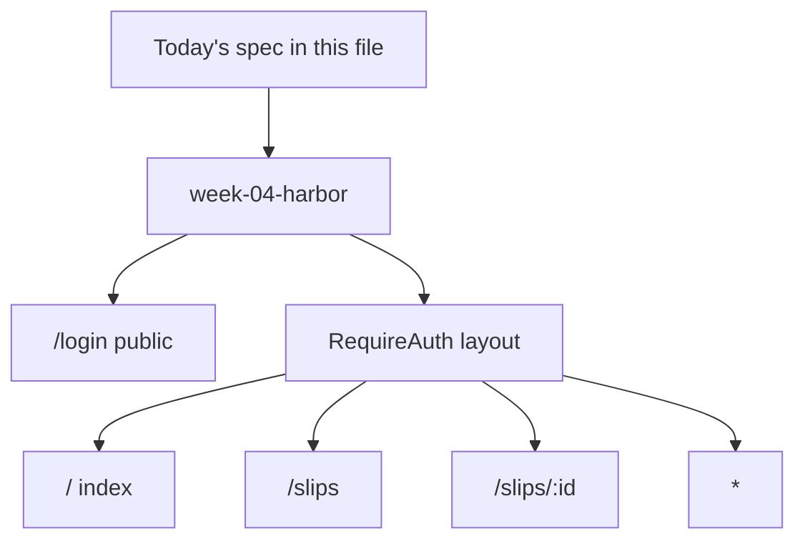
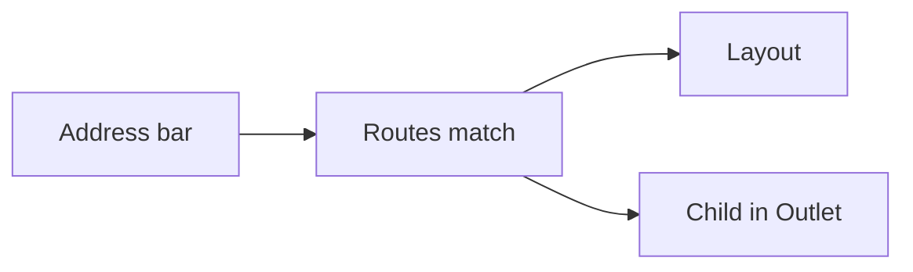
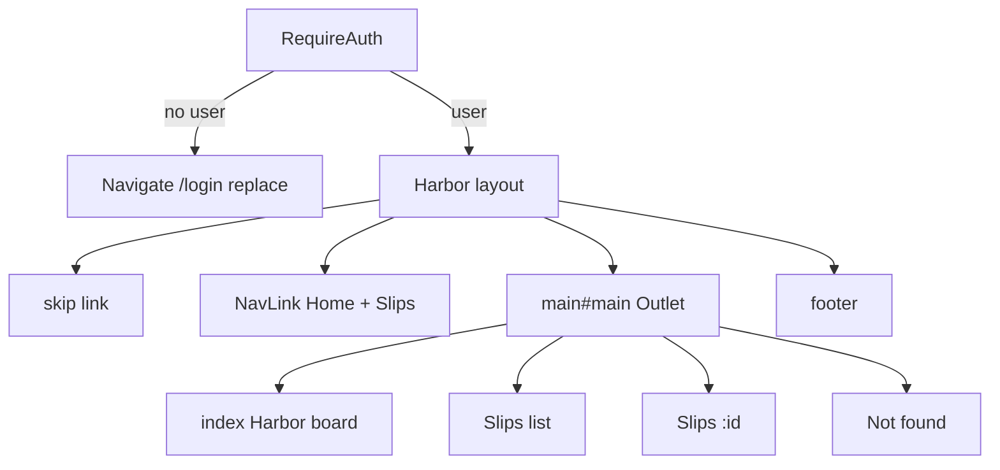

# Month 6 · Week 4 · Day 3
# From Memory: A Mini Routed App

**Program:** Full-Stack Mastery · 18 months  
**Phase:** 2 — Modern frontend  
**Month index:** [../../README.md](../../README.md)  
**Week 4:** [1](day-01.md) · [2](day-02.md) · Day 3 (today) · [4](day-04.md) · [5](day-05.md) · [6](day-06.md) · [7](day-07.md)  
**Week rhythm today:** Implement from memory  
**Student state:** You have routed `week-04-router` with mock auth and `?q=`. Today you prove the same ideas in a **new** Vite app, without looking at Days 1–2 while you type.  
**Study time:** 3–4 focused hours  
**Days 1–2 of this week:** closed during the build. Repair from **this recap**, not from a Router cheatsheet and not from yesterday’s `App.tsx`.

Project 4 stays closed. This is not the ops dashboard. This is a **Harbor Clerk** training app — a different domain on purpose.

---

## How to use this textbook

Read the recap. Say it. Type the spec. When the compiler errors, read the error. AI may not generate `App.tsx`. If you finish early, do the stretch `?q=` — not a second tutorial.

---

## How to read this chapter

Days 1–2 taught the map, then the lock. Today you **choose** both on a new scaffold: layout + `Outlet`, list + `:id`, `*`, and **one** protected branch.

Keep **this file** open. Keep Days 1–2 closed. Write `CHOICE.txt` **before** you decorate: which routes are public, which are locked, where `replace` lives. A missing `Outlet` is allowed **for five minutes** — then you fix it because this recap told you why. Pasting Day 2’s route table is not from memory.



---

## Complete explanation (Router you must still own)

**Problem:** an SPA has one HTML file. Screens must still have **names**. The name is the **URL**. `useState` for `page` does not bookmark, does not share, and fights Back.

**Library (Month 6 mode):** `npm install react-router`. Import **`BrowserRouter`, `Routes`, `Route`, `Link`, `NavLink`, `Outlet`, `useParams`, `useNavigate`, `Navigate`, `useSearchParams`** from **`"react-router"`**. Vite SPA: wrap the tree in **`BrowserRouter`** in `main.tsx`. Do **not** install `react-router-dom` because an old tab said so. Do **not** make **`createBrowserRouter` loaders** your data layer — that fights Month 7 Query. Pages may `fetch` in `useEffect` (with abort) or use a mock array.

**`BrowserRouter`:** ancestor of hooks and `Link`. Missing it → runtime error about router context.

**`Routes` / `Route`:** a table. Nested `Route` elements compose. Parent **layout** renders chrome + **`<Outlet />`**. Child fills the outlet. **`index`** is the child for the parent’s own URL.

**`Link`:** client navigation, no full reload. **`<a href="/path">`** inside the app reloads the document and kills React state. External sites stay `<a href="https://...">`.

**`NavLink`:** `className={({ isActive }) => ...}`. Home needs **`end`** or `/` stays active on every path.

**`useParams`:** `:id` is a **string | undefined**. Narrow before use. Params are not database rows.

**`path="*"`:** last sibling. Unknown URL → 404 page with a `Link` home. One `h1`.

**Protected UI:** mock **AuthContext** (`user | null`, `login`, `logout`). **`RequireAuth`** reads it; if no user, **`<Navigate to="/login" replace />`**; else **`<Outlet />`**. Hiding a nav item is not a lock. This is **not** a real backend.

**`replace`:** login and logout should not leave a Back-button trap.

**Login:** controlled fields, labels, `preventDefault`. Mock rule you can explain. `navigate("/", { replace: true })` after success.

**`useSearchParams`:** `?q=` is shareable. Filter **during render**. Do not `useEffect` to copy the filter into another array.

**Page status:** loading / error / empty / success you render yourself. Query is Month 7.

**A11y:** skip link on the layout, `main id="main"`, real `nav`, labels, `:focus-visible`. Wordmark is not a second `h1`.

**Wrong belief:** “Nested routes are optional sugar.”  
**Correct:** they are how the header stays mounted while the page swaps.

**Wrong belief:** “I’ll protect the dashboard by not linking to it.”  
**Correct:** the user will type the URL. The **route** must `Navigate`.

If Days 1–2 are closed, you still need the table and the lock in full. The next sections are that lesson with pictures — then the spec.

### The URL is the name of the screen



A theater: one building (`index.html`), a marquee (URL), a lobby (layout), a stage (`Outlet`). Changing the marquee should not rebuild the street.

### Relative children

Parent `path="/"` + child `path="slips"` → `/slips`. Child `path="slips/:id"` → `/slips/berth-3`. You do not need a second `BrowserRouter`.

### History

`Link` **pushes**. `Navigate replace` **replaces**. After login, replace so Back does not return to the form. After a failed visit to `/slips` while logged out, replace onto `/login` so Back does not ping-pong.

### Data this month

A typed mock array is enough. If you fetch, `ok` check, abort, map to an internal type. No Query. No RHF.

### Layout + Outlet (draw this before you type)

The parent route’s element **stays mounted** when you go from `/slips` to `/slips/berth-3`. Only the child inside `<Outlet />` changes. That is why the skip link and the wordmark belong in the layout, not copied into each page.

If you forget `<Outlet />`, every protected URL shows the header and an empty `<main>`. The routes **are** matching. You simply did not give the child a place to sit.



**RequireAuth is a door, not a page.** It should not have its own `h1`. It either redirects or renders `<Outlet />`. The layout **inside** the door owns chrome. `/login` lives **outside** the door so a logged-out person can sign in without passing the door.

### Params vs splat — two kinds of “not found”

| Situation | URL example | What should happen |
|---|---|---|
| Path is not in the table | `/bananas` | Child `path="*"` → **Page not found** |
| Path matches `/slips/:id` but id is unknown | `/slips/nope` | Detail page looks up the mock array, finds nothing → **that slip is missing** + link to `/slips` |

Do not throw. Do not render a blank `h1`. Do not use `as string` on `useParams()`.

```tsx
const { id } = useParams();
if (typeof id !== "string") {
  return <p>Missing slip id.</p>;
}
const slip = slips.find((row) => row.id === id);
if (!slip) {
  return (
    <>
      <h1>Slip not found</h1>
      <p>
        <Link to="/slips">Back to slips</Link>
      </p>
    </>
  );
}
```

`id` is still a **string from the URL**, not a row. The row comes from **your** array.

### `Link`, `NavLink`, `end`

Harbor board `NavLink` to `/` needs **`end`**. Without it, `/slips` still prefixes-match `/` and **Home** stays active. Slips does not need `end` unless you later add `/slips/something/else` and want the parent not to highlight — today `/slips` vs `/slips/:id` both “feel” like slips; highlighting **Slips** on the detail page is correct.

In-app: `Link` / `NavLink`. Off-site: `<a href="https://...">`. A harbor footer link to MDN is an `<a>`. A slip row is a `Link`.

### Mock login you can type from this recap

Context value: `{ user: { email: string } | null, login: (email: string) => void, logout: () => void }`. Provider holds `useState`. `useAuth()` throws if missing.

Form: two labeled fields, `preventDefault`, your mock rule (write it in `CHOICE.txt` — example: password `tide`). On success: `login(email)` then `navigate("/", { replace: true })`. On failure: a `p` the user can read. Sign out: `button`, `logout()`, `navigate("/login", { replace: true })`.

**Wrong belief:** “I’ll `localStorage.setItem('token', password)` so refresh stays logged in.”  
**Correct:** you would store a secret in a cookie-jar any XSS can read, and you still would not have a server. Stay in memory for this lab.

### Files (names yours; this is a sane map)

Do not copy files from `week-04-router`. Recreate:

- `src/main.tsx` — `BrowserRouter` → `AuthProvider` → `App`
- `src/App.tsx` — `Routes` table
- `src/auth/AuthContext.tsx`, `src/auth/RequireAuth.tsx`
- `src/layout/HarborLayout.tsx`
- `src/pages/LoginPage.tsx`, `HomePage.tsx`, `SlipsPage.tsx`, `SlipDetailPage.tsx`, `NotFoundPage.tsx`
- `src/data/slips.ts` — typed `{ id: string; name: string }[]`
- `src/index.css` — tokens below

### CSS tokens (Harbor, not Project 4)

You already know this palette from Month 2. Use it so you think about Flex, not a theme pack:

| Token | Value |
|---|---|
| Page | `#f6f4ef` |
| Text | `#1a1a1a` |
| Muted | `#5c5c5c` |
| Accent | `#0b5fff` |
| Header height | `64px`, Flex, `space-between` |
| Focus | `:focus-visible` 3px accent, 2px offset |

Skip link: visually hidden until focus. Wordmark is not `h1`.

### Search params (stretch, still explained)

`const [params, setParams] = useSearchParams(); const q = params.get("q") ?? "";`  
Filter `slips.filter((s) => s.name.toLowerCase().includes(q.toLowerCase()))` **in render**. Input `value={q}`. Updating `q` with `setParams` on each keystroke should use `{ replace: true }` so Back is not one entry per letter.

### What “from memory” allows

You may read **this file**. You may run the compiler and the browser. You may not open Day 1–2. You may not clone a dashboard. If you go blank on `Outlet`, re-read the mermaid above — that is the lesson, not a cheat for `App.tsx`.

---

## Today's contract

By the end of this day you will have a **second** app, `week-04-harbor`, that matches the spec below, explained in `CHOICE.txt`, without copying `week-04-router` file-for-file.

**Today's gate.** Closed-book before you peek at the spec’s file list:

> Layout + Outlet. List and `:id`. 404. RequireAuth + mock login. Link not `<a>` for in-app. Params narrowed.

---

## Time box

| Block | Minutes | Work |
|---|---|---|
| 0 | 20 | Read this recap; say it aloud |
| A | 15 | `CHOICE.txt` — routes and lock |
| B | 90 | Scaffold + build from spec |
| C | 40 | Break Outlet, `<a>`, unprotected URL; restore |
| D | 20 | Git |
| E | 15 | Recall |

---

# Spec — Harbor Clerk (from memory)

Scaffold in PowerShell:

```powershell
cd ~\fullstack-lab\month-06
npm create vite@latest week-04-harbor -- --template react-ts
cd week-04-harbor
npm install
npm install react-router
npm run dev
```

**Domain:** slip (berth) list for a fictional harbor desk. **Not** inventory pallets. **Not** Project 4 items. Invent four slips with string ids (`berth-1` …).

## Required routes

| Path | Auth | UI |
|---|---|---|
| `/login` | public | Controlled form; mock success; labels |
| `/` | protected | Index: one `h1` **Harbor board**, two sentences, `Link` to slips |
| `/slips` | protected | List of slips; each row `Link` to `/slips/:id`; optional `?q=` filter |
| `/slips/:id` | protected | Detail: name the slip; unknown id → not-found copy + link back |
| `*` | protected | `h1` **Page not found**, `Link` to `/` |

## Required structure

- `BrowserRouter` in `main.tsx`.
- `AuthProvider` (rebuild — do not copy-paste a blob you cannot type).
- `RequireAuth` layout with `<Outlet />`.
- **App layout** (inside the lock): skip link, Flex header, wordmark **Harbor Clerk** (not `h1`), `NavLink` Home (`end`) + Slips, `<main id="main"><Outlet /></main>`, footer.
- Sign out button when `user` is set.
- CSS you type: page background `#f6f4ef`, text `#1a1a1a`, accent `#0b5fff`, header ~64px Flex, `:focus-visible`. No Tailwind. No UI kit.

## Required honesty

- `CHOICE.txt`: public vs protected; why `replace`; why `Outlet`; why `id` might be undefined.
- `ROUTES.txt`: table matching the spec, filled with **your** component names.
- `CHOICE.txt` also: one sentence on `Link` vs `<a>`; where the skip link lives.

Write `CHOICE.txt` **before** the CSS. If you decorate first, you will paste a layout you cannot explain.

## Slips list rules

Four slips minimum. Each row is a `Link` whose **accessible name** includes the slip name (the text of the link). `key={slip.id}`. The list page `h1` is **Slips**. Detail `h1` uses the slip’s **name**, not only the raw id, once lookup succeeds.

Login page `h1` is **Sign in**. Do not put the harbor nav on login.

## Forbidden

- Opening `week-04-router/src` while you type.
- TanStack Query, RHF, Zod, Redux.
- Generating the app with AI.
- Copying a GitHub dashboard.
- `if (page === ...)` as the router.
- `as string` on `useParams()`.

## Stretch

`useSearchParams` on `/slips` for `?q=`. Not required if time is short; the lock and the param are required.

---

# Block C — Break and restore (after it works)

In `HARBOR.txt`:

1. Comment out `Outlet` — one sentence.
2. Use `<a href="/slips">` once — one sentence.
3. Remove `RequireAuth` and visit `/slips` logged out — one sentence. Restore all three.

---

# Block D — Git

```powershell
cd ~\fullstack-lab
git add month-06/week-04-harbor
git commit -m "Week 4 Day 3: harbor clerk routed app from memory."
```

---

# Block E — Recall

Close the file.

1. Name the four imports that draw the table (`BrowserRouter` is in `main` — what is in `App`?).
2. Why is `/login` a sibling **outside** `RequireAuth`?
3. What does `end` on Home prevent?
4. Unknown `:id` vs `path="*"` — when is each?
5. Why is hiding the Slips `NavLink` not a lock?
6. What cleanup does a fetch-in-effect need if you added one?

---

## Definition of done

- [ ] Days 1–2 stayed closed while typing (repair only from this file)
- [ ] `week-04-harbor` matches the route table
- [ ] Mock login + protected layout + 404
- [ ] Detail param narrowed; unknown id handled
- [ ] Skip link and labels
- [ ] `CHOICE.txt`, `ROUTES.txt`, `HARBOR.txt`
- [ ] Commit exists

---

## Optional review links

Repair from this recap first.

- [React Router: routing](https://reactrouter.com/start/declarative/routing)
- [React Router: installation](https://reactrouter.com/start/declarative/installation)

---

## Tomorrow

**Component tests:** Vitest + Testing Library + `user-event`. **`MemoryRouter`** wraps the tree in tests. You will assert navigation to detail and a protected redirect — by **role**, not by CSS class.
