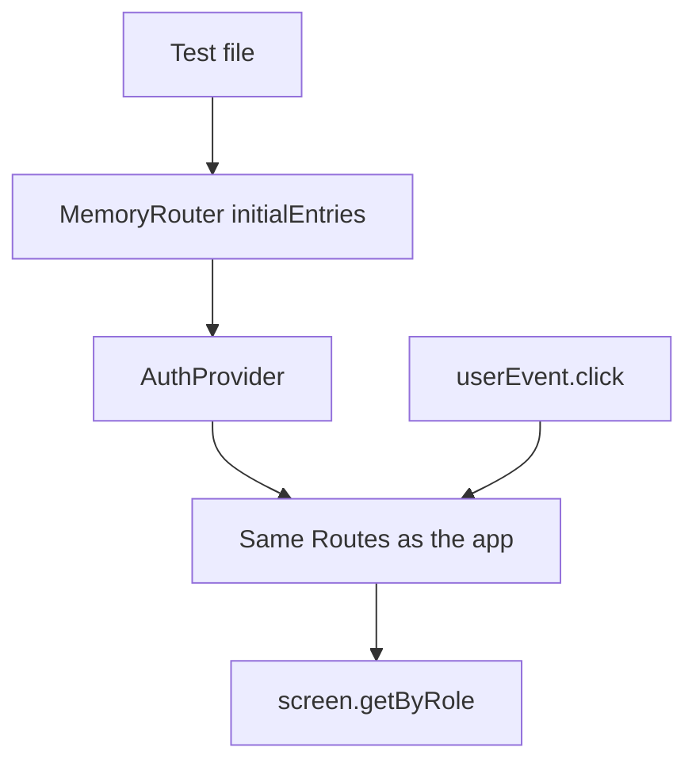

# Month 6 · Week 4 · Day 4
# Testing Routed Components: MemoryRouter and User-Visible Behavior

**Program:** Full-Stack Mastery · 18 months  
**Phase:** 2 — Modern frontend  
**Month index:** [../../README.md](../../README.md)  
**Week 4:** [1](day-01.md) · [2](day-02.md) · [3](day-03.md) · Day 4 (today) · [5](day-05.md) · [6](day-06.md) · [7](day-07.md)  
**Week rhythm today:** Lab feature — tests that click  
**Student state:** You have at least `week-04-router` (and likely `week-04-harbor`). You may have seen a first `render` in Week 1 Day 5. Today tests become how you **prove** routes.  
**Study time:** 3–4 focused hours

Today: **Vitest** + **React Testing Library** + **`user-event`**. Wrap the route tree in **`MemoryRouter`** with **`initialEntries`**. Query by **role** and **label**, not by CSS class. Prove: open a detail screen; unauthenticated visit **redirects** to login.

**axe** (automated accessibility checks) is an optional mention, not a required install.

Project 4 is still not today. Add tests to **`week-04-router`** (primary). Harbor tests are stretch.

---

## How to read this chapter

A test that reads `document.querySelector(".is-active")` is testing **your class string**. A test that `getByRole("link", { name: "Inventory" })` then expects a heading **Pallet oak-04** is testing **what an operator can do**.

The browser is not running. There is no real address bar. **`MemoryRouter`** is an in-memory history: you **choose** the starting URL. That is the whole trick.



Read. Close. Say why `BrowserRouter` is the wrong wrapper in Vitest. Then install and type.

---

## Today's contract

By the end of this day you will be able to:

1. Install Vitest, jsdom, Testing Library, and user-event in the Vite app.
2. Extract a **`AppRoutes`** (or equivalent) that is **not** married to `BrowserRouter`, so tests can wrap `MemoryRouter`.
3. Write a test that **clicks** a list link and sees the **detail** heading.
4. Write a test that opening a **protected** path with `user: null` shows **login** (redirect).
5. Prefer **`getByRole` / `getByLabelText`**. Avoid `container.querySelector(".card")` as the assertion.
6. Explain why the test did **not** need a running `npm run dev`.

**Today's gate.** Closed-book:

> Tests render the route tree inside `MemoryRouter`. I start at a path with `initialEntries`. I click links with `user-event`. I assert headings and form fields by role. I do not assert CSS class names as the behavior.

If you cannot say that, stay here. Day 5 is polish; it will not invent a testing philosophy.

---

## Time box

| Block | Minutes | Work |
|---|---|---|
| A | 45 | Theory |
| B | 55 | Install + first two tests |
| C | 70 | Independent: redirect test + one form test |
| D | 20 | Git |
| E | 15 | Recall |

---

# Block A — Theory

## 1. What we are proving

React Testing Library’s rule: **interact like a user, assert what they can see or hear.**

| Good | Weak |
|---|---|
| `getByRole("heading", { name: /pallet oak-04/i })` | `container.querySelector("h1.detail")` |
| `getByRole("button", { name: /sign in/i })` | `getByTestId("login-btn")` as the first choice |
| `getByLabelText(/email/i)` | `getByPlaceholderText` when a label is missing |

`data-testid` is a last resort for unnamed regions, not a substitute for labels. If the test cannot find a button, **name the button** — that is an accessibility fix, not a test-id fix.

Week 1’s first `render(<Button />)` was a unit of UI. Today the “component” is often the **route table**. That is still a component test: you are not launching Chrome.

---

## 2. Why `MemoryRouter`

**`BrowserRouter`** uses the real `window.location`. In jsdom that is clumsy: tests would stomp each other’s URLs, and `window.history` is not your friend.

**`MemoryRouter`** keeps history in RAM:

```tsx
import { MemoryRouter } from "react-router";

<MemoryRouter initialEntries={["/inventory"]}>
  <AppRoutes />
</MemoryRouter>
```

`initialEntries` is an array of starting locations. Index `0` is the first. You can start **already on** `/inventory/oak-04` without clicking.

**Wrong belief:** “I’ll call `useNavigate` in the test file.”  
**Correct:** the test **clicks** (or starts at a path). The app calls `useNavigate`. Tests that reach into hooks to drive the router are testing the library, not your wiring.

**Wrong belief:** “I must wrap `BrowserRouter` **and** `MemoryRouter`.”  
**Correct:** **one** router. Production: `BrowserRouter` in `main.tsx`. Tests: `MemoryRouter` around `AppRoutes`. If `App` **contains** `BrowserRouter`, tests cannot substitute. **Extract routes.**

```tsx
// App.tsx — routes only
export function AppRoutes() {
  return (
    <Routes>
      {/* ... */}
    </Routes>
  );
}

export default function App() {
  return <AppRoutes />;
}

// main.tsx
<BrowserRouter>
  <AuthProvider>
    <App />
  </AuthProvider>
</BrowserRouter>
```

---

## 3. Auth in tests

`RequireAuth` reads context. The test must provide a provider.

Two honest styles:

1. **Logged-out default** — real `AuthProvider`, `user` is `null`. `initialEntries={["/inventory"]}` → expect heading **Sign in** (or your login `h1`).
2. **Logged-in** — either a test helper `login` via the form (`userEvent.type` + click), or a **`TestAuthProvider`** that accepts an initial user. A helper that types the mock password is more honest. A stub provider is faster. If you stub, still use the **same** `useAuth` hook so `RequireAuth` is the real one.

Do not mock `react-router` itself. You would prove that your mock returns `/login`, not that `Navigate` ran.

---

## 4. `user-event` vs `fireEvent`

**`@testing-library/user-event`** fires a **sequence** closer to real typing (click, pointer, keyboard). Prefer it.

```tsx
const user = userEvent.setup();
await user.click(screen.getByRole("link", { name: /oak-04/i }));
```

Assertions after clicks are **`await`**ed because user-event is async. Vitest’s `expect` stays sync once the DOM has updated; RTL’s `findByRole` **waits** (useful if login navigates).

`waitFor` / `findBy*` if you need to wait for navigation. `getBy*` if it must already be there.

| Query | When |
|---|---|
| `getByRole` / `getByLabelText` | Must be there **now** or the test throws (good — you want the throw) |
| `queryByRole` | May be absent; you assert `not.toBeInTheDocument()` |
| `findByRole` | **Async**: waits until it appears (redirect after submit) or times out |

If login navigates to home, `await user.click(submit)` then `expect(await screen.findByRole("heading", { name: /.../i }))`. `getBy` immediately after click can race.

**`screen.debug()`** prints the DOM when you are lost. Use it to see that you are still on login because `RequireAuth` wrapped the test without a user. Then fix the **arrange** step, not the assertion.

---

## 5. Query by role (the accessibility tree)

The **accessibility tree** is what a screen reader sees. `getByRole("link", { name: "Inventory" })` uses the **accessible name** (the link text, or `aria-label` if you were forced to use one — prefer visible text).

Common roles you will use today:

| Role | HTML |
|---|---|
| `link` | `<a>` / `Link` / `NavLink` |
| `button` | `<button>` |
| `textbox` | `<input>` (search/email) — password may be `textbox` or not listed the same; prefer **`getByLabelText`** |
| `heading` | `h1`–`h6` with `level: 1` |
| `navigation` | `<nav>` |

**Wrong belief:** “I’ll assert `className` includes `is-active`.”  
**Correct:** that is a styling courtesy. Assert the **page heading** or the **location** via what the user reads. (You *may* use `aria-current="page"` if you set it — `NavLink` can; not required today.) Day 7’s debug list includes “test that queries CSS class only” as a **defect**.

---

## 6. What not to test

- Snapshot of the entire HTML string (brittle, unread).
- Implementation: “`useState` was called.”
- Third-party: “`MemoryRouter` updates history” — Remix/React Router’s job.
- **axe** full-page score as a gate — optional later (`vitest-axe` or `@axe-core/react` in dev). If you try it, treat violations as **homework**, not as a reason to slap `aria-hidden` on everything. **Not required this month.**

---

## 7. Common test failures (read the message)

**`useNavigate() may be used only in the context of a <Router>`**  
The test rendered `AppRoutes` without `MemoryRouter`. Wrap it. Do not add `BrowserRouter` “as well.”

**Found multiple elements with the heading role**  
Two `h1`s (wordmark + page). Fix the **app**: wordmark is not an `h1`. The test is doing its job.

**Unable to find an accessible element with the role “textbox” and name `/email/i`**  
The input has no label. Fix the form (`htmlFor` / `id` or wrap the input in `<label>`). Do not `getByPlaceholderText` as the first escape.

**Not wrapped in `act(...)`**  
Usually user-event already wraps. If a `setTimeout` mock login resolves later, `await findByRole` or `await vi.runAllTimersAsync()` if you faked timers. Do not sprinkle `act` until you know what is pending.

**Redirect test still shows inventory**  
You passed a logged-in provider by accident, or `/inventory` is **not** inside `RequireAuth`. The test told you the lock is fake.

**Wrong belief:** “I’ll mock `useAuth` to return a user in every test.”  
**Correct:** one test must use the **real** logged-out provider, or you never prove `Navigate`. Logged-in tests may use a helper. Both are documentation.

A sketch of the redirect test (names yours):

```tsx
test("logged-out inventory shows login, not the list", () => {
  renderApp("/inventory");
  expect(screen.getByRole("heading", { name: /sign in/i })).toBeInTheDocument();
  expect(screen.queryByRole("heading", { name: /inventory/i })).not.toBeInTheDocument();
});
```

You assert **what disappeared** with `queryBy`, not `getBy` (which would throw).

---

## 8. Vitest + Vite wiring

Vitest runs in Node. **`environment: "jsdom"`** gives `document`. A setup file imports **`@testing-library/jest-dom/vitest`** so you get `toBeInTheDocument()`.

`package.json` script: `"test": "vitest run"` (CI-style once) and you may add `"test:watch": "vitest"`.

Typecheck is **`tsc --noEmit`** (Month 5). Tests do not replace it.

---

# Block B — Type-along

Work in `~\fullstack-lab\month-06\week-04-router`.

## B1 — Install

```powershell
cd ~\fullstack-lab\month-06\week-04-router
npm install -D vitest jsdom @testing-library/react @testing-library/user-event @testing-library/jest-dom
```

In `vite.config.ts`, add a Vitest block. At the top of the file:

```ts
/// <reference types="vitest/config" />
```

Inside `defineConfig({ ... })`:

```ts
  test: {
    environment: "jsdom",
    setupFiles: "./src/test/setup.ts",
  },
```

If your Vite major version wants `vitest/config`’s `defineConfig` instead, follow the error message — do not disable typecheck to silence it.

`src/test/setup.ts`:

```ts
import "@testing-library/jest-dom/vitest";
```

`package.json` scripts: add `"test": "vitest run"` and `"typecheck": "tsc --noEmit"` if missing.

## B2 — Extract `AppRoutes`

Move `<Routes>...</Routes>` into `export function AppRoutes()`. `App` returns `<AppRoutes />`. `main.tsx` keeps `BrowserRouter` + `AuthProvider`.

## B3 — Helper

`src/test/renderApp.tsx` — a function `renderApp(path: string)` that renders:

```tsx
<AuthProvider>
  <MemoryRouter initialEntries={[path]}>
    <AppRoutes />
  </MemoryRouter>
</AuthProvider>
```

Import `render` from `@testing-library/react`. Re-export `screen`.

## B4 — First test: nav to detail

`src/pages/InventoryListPage.test.tsx` (or `src/AppRoutes.test.tsx`):

1. `renderApp("/inventory")` — but `/inventory` is **protected**. Either start the helper **after** a test-only login, or start at `/login`, type the mock credentials, submit, then click through. The **login-then-click** path tests more of the real app. If that is too long for the first green test, a `renderLoggedIn(path)` that wraps a provider with a fake user is allowed — document it in `TEST.txt`.
2. Click the link whose name matches **oak-04** (use the accessible name you actually rendered).
3. `expect(screen.getByRole("heading", { level: 1, name: /oak-04/i })).toBeInTheDocument()`.

Run:

```powershell
cd ~\fullstack-lab\month-06\week-04-router
npm test
```

Read failures. Fix the **app** if the link has no name. Do not add `test-id` to hide a missing name.

## B5 — Break a query on purpose

Temporarily assert `document.querySelector(".is-active")`. See it pass while you rename the heading. Write one sentence in `TEST.txt`: why the class assertion was the wrong contract. Remove it.

---

# Block C — Independent

1. **Protected redirect test:** `renderApp("/inventory")` with **no** user. Expect the login **heading** or the email **textbox** (`getByLabelText`). Expect the inventory heading **not** to be there (`queryByRole` + `not.toBeInTheDocument()`).
2. **Login form test:** type email and mock password, click **Sign in**, expect the home `h1`. Use `userEvent`. Labels required — if the test cannot find them, fix the form.
3. `TEST.txt`: list each test in one line: arrange (path, auth), act (click/type), assert (role).
4. Keep tests **off** the network if the list is a mock array. If a page fetches, you may skip that page today or stub `fetch` — do not add MSW unless you already know it; Project 4’s spec mentions MSW for **Month 7** completeness, not today’s homework.

Stretch: harbor app gets the same two tests. Optional **axe**: read what `vitest-axe` is; do not block the day on installing it.

---

# Block D — Git

```powershell
cd ~\fullstack-lab
git add month-06/week-04-router
git commit -m "Week 4 Day 4: MemoryRouter tests for detail nav and auth redirect."
```

---

# Block E — Recall

Close the file.

1. Why `MemoryRouter` in tests instead of `BrowserRouter`?
2. Why extract `AppRoutes`?
3. Why `userEvent` instead of poking `useState`?
4. Why is `getByRole` better than a CSS class?
5. How do you prove a redirect without reading `window.location`?

---

## Definition of done

- [ ] `npm test` passes in `week-04-router`
- [ ] One test clicks to detail and asserts an `h1` by role
- [ ] One test proves logged-out protected URL shows login
- [ ] Queries are role/label-based
- [ ] `TEST.txt` exists
- [ ] Commit exists

---

## Optional review links

This chapter is the lesson. Later checking:

- [Testing Library: queries](https://testing-library.com/docs/queries/about)
- [Testing Library: user-event](https://testing-library.com/docs/user-event/intro)
- [React Router: MemoryRouter](https://reactrouter.com/api/data-routers/MemoryRouter) (if the docs move, search “MemoryRouter” on reactrouter.com)
- [Vitest: getting started](https://vitest.dev/guide/)

---

## Tomorrow

**Quality on the router lab:** typecheck, test, lint (if the Vite template gave you ESLint), and a README **routes table**. Docs are part of the product, not a sticker.
