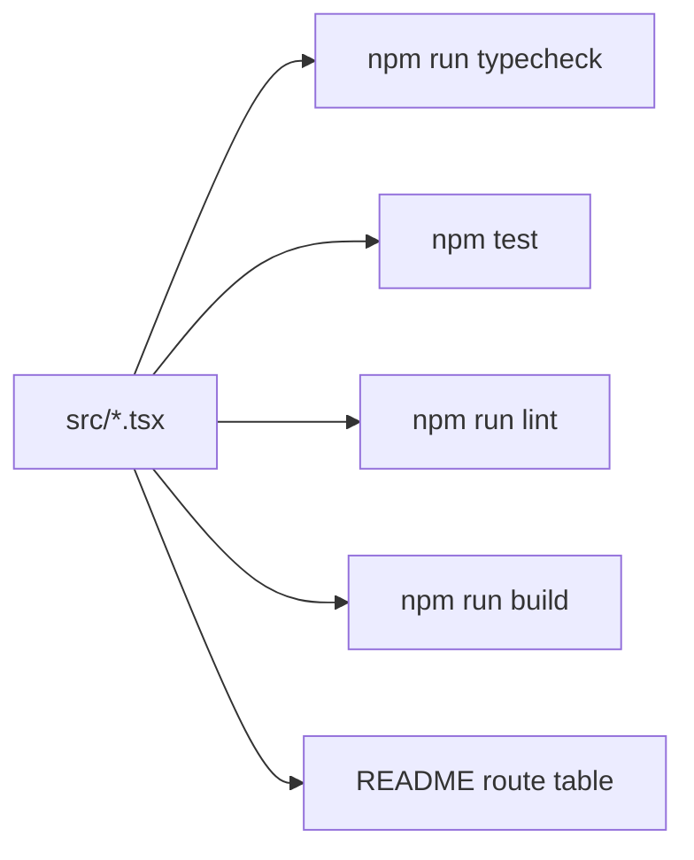

# Month 6 · Week 4 · Day 5
# Typecheck, Tests, Lint, and a Routes README

**Program:** Full-Stack Mastery · 18 months  
**Phase:** 2 — Modern frontend  
**Month index:** [../../README.md](../../README.md)  
**Week 4:** [1](day-01.md) · [2](day-02.md) · [3](day-03.md) · [4](day-04.md) · Day 5 (today) · [6](day-06.md) · [7](day-07.md)  
**Week rhythm today:** Tests + refactor + documentation  
**Student state:** `week-04-router` has nested routes, mock auth, search params, and at least two RTL tests. The README is still Vite’s demo pitch.  
**Study time:** 3–4 focused hours

Today you make the **router lab** look like a small product: scripts that **mean** something, tests you trust, lint you can explain, and a README a classmate could run. You are **not** starting Project 4 until tomorrow. You are **not** installing TanStack Query, React Hook Form, or Zod.

---

## How to use this textbook

Run the scripts. Read the first error. Fix it. Fill the README from the running app, not from memory of a tutorial. AI may review a paragraph; it may not invent a route table that disagrees with `AppRoutes`.

---

## How to read this chapter

Quality is not a sticker you add after features. Month 5 already taught `typecheck`, `test`, `lint`, `build`. React does not suspend those rules. JSX is still TypeScript. Tests are still the contract. Lint is still “catch the silly class of bug before review.”

The README is the **map** of URLs. If the route table in prose disagrees with `AppRoutes`, the prose is wrong — or the code is. Today you make them match.



If a script is missing, you add it. If ESLint was never in the Vite template, you do **not** spend the whole day inventing a config from a blog — see §4.

---

## Today's contract

By the end of this day you will be able to:

1. Run **typecheck**, **test**, and **build** until they pass for a reason you understand.
2. Run **lint** if the project has ESLint; record a skip only if the template truly has none.
3. Refactor names or extract a tiny component **without** changing user-visible behavior (tests stay green).
4. Replace the Vite README with **how to run**, **routes**, **auth mock**, **what is not in this app**.
5. Break one test on purpose, watch it fail, restore.

**Today's gate.** Closed-book:

> `tsc` checks types. Vitest checks behavior. ESLint checks local habits. The README’s route table is the human copy of `AppRoutes`. None of these is Query.

---

## Time box

| Block | Minutes | Work |
|---|---|---|
| A | 40 | Theory |
| B | 50 | Scripts + red/green test |
| C | 70 | README + refactor + a11y pass |
| D | 20 | Git |
| E | 15 | Recall |

---

# Block A — Theory

## 1. Four questions, four commands

| Command | Question it answers |
|---|---|
| `npm run typecheck` | Would `tsc` accept this if Vite were not bundling? |
| `npm test` | Does the user-visible behavior still hold? |
| `npm run lint` | Did I leave `any`, `==`, or an unused trap the team forbids? |
| `npm run build` | Does Vite produce `dist/`? |

Vite **transpiles**. It will bundle files `tsc` would reject if you never run `tsc`. That is why Month 5 insisted on **`tsc --noEmit`** as its own script. Keep it.

**Wrong belief:** “The tests passed, so the types are fine.”  
**Correct:** tests exercise **some** branches. Types watch **every** assignment. You want both.

**Wrong belief:** “`build` is only for deploy.”  
**Correct:** `build` is the first time you see missing assets and some import errors in production mode. This month **deploy is not required**. Running `build` locally still is.

---

## 2. What the tests are for (after Day 4)

Your tests should still say:

- From the list, a **named** link opens a **named** heading.
- A protected URL with no user shows **login**, not the secret list.

If you “fixed” a failing test by switching to `querySelector(".card")`, you made the suite cheaper and **weaker**. Today, restore role queries if you drifted.

A test that only checks `expect(true).toBe(true)` is a lie. Delete it.

Red → green: you will **break** a heading on purpose, see the test name in the failure, restore. That is how you know the test is wired to the app.

---

## 3. Refactor with a net

Safe today:

- Rename a page component (`InventoryListPage` → clearer name) and update imports.
- Extract `PalletLink` if the list row is noisy — only if you can say the **boundary** (it owns the `Link`, receives `id` + `label`).
- Move mock pallets to `src/data/` if they are still inside a page.

Unsafe today:

- Rewriting auth to `localStorage` “so refresh keeps me logged in” without tests for it.
- Introducing Query because a blog said fetching in effects is wrong. Effects are **allowed** this month. Query is **Month 7**.
- Replacing the form with React Hook Form.

Tests stay green. If they go red, you changed behavior or you changed an accessible name. Read the failure. Do not snapshot-update your way out.

---

## 4. ESLint — use it if you have it

The Vite `react-ts` template often includes ESLint and a `"lint": "eslint ."` script (plugin versions change; read **your** `package.json`).

If **`npm run lint` exists**:

- Run it.
- Fix **your** unused imports and obvious mistakes.
- Do not disable `react-hooks/rules-of-hooks` to hide a broken effect.
- `any` to silence JSX is still banned.

If **lint is missing**: write `QUALITY.txt`: “template has no ESLint; typecheck + test + build ran.” Adding a full ESLint + typescript-eslint + Prettier stack is **optional stretch**, not the definition of done. Do not copy a random `eslint.config.js` you cannot explain.

**Wrong belief:** “Lint replaces types.”  
**Correct:** lint is extra eyeballs. `eqeqeq` does not prove `id` is defined.

---

## 5. README as a contract

A classmate clones the lab folder (inside `fullstack-lab`). They need:

1. What this app **is** (training yard, not Project 4).
2. Node/npm, `npm install`, `npm run dev`, `npm test`, `npm run typecheck`.
3. A **routes table**: path, who may open it, what they see.
4. The **mock** login rule (password `yard` or whatever you chose).
5. Honest **not yet**: TanStack Query, RHF, Zod — Month 7.

Screenshots optional. A lying screenshot of a dashboard template is forbidden.

The route table is documentation of **your** `AppRoutes`. If you add `/inventory/new` tomorrow in Project 4, that is a **different repo**. Do not pretend this lab is the product.

A README skeleton you **fill** (do not leave the angle-bracket notes):

```markdown
# Northline Yard (Month 6 lab)

Training app for React Router. **Not** Project 4.

## Run

npm install
npm run dev
npm run typecheck
npm test
npm run build

## Mock auth

Email: any non-empty. Password: (your rule).

## Routes

| Path | Auth | Screen |
|------|------|--------|
| /login | public | Sign in |
| / | protected | Home heading |
| /inventory | protected | List |
| /inventory/:id | protected | Detail; unknown id → missing copy |
| * | protected | Page not found |

Search: `?q=` on the list (yes/no).

## Not in this app yet

TanStack Query, React Hook Form, and Zod wait until **Month 7**.
This month data is a mock array (or fetch in an effect). Forms, if any, are controlled React.
```

If you cannot fill a cell, the app is unfinished — not the README.

---

## 6. Type errors you should still understand

`tsc` will nag `useParams()` because `id` might be missing. That is **correct**. Narrow. Do not `as string`.

A typical message looks like: `Type 'string | undefined' is not assignable to type 'string'`. Quote it in `QUALITY.txt` if you see it today, then show the `typeof id !== "string"` branch.

`Cannot find module 'react-router'` means install did not run in **this** folder, or you imported `'react-router-dom'` from a v6 snippet and the package is not there. Install `react-router`. Import from `"react-router"`.

Unused variables: lint or `tsc` (`noUnusedLocals` if you turned it on). Delete or use them. Do not prefix `_` as a superstition unless your lint rule says so and you can explain it.

---

## 7. Accessibility pass (fifteen minutes)

Walk the lab as Month 2 still owns the chrome:

- Skip link first; visible on focus; target `#main`.
- One `h1` per screen.
- Login labels (`htmlFor` / `id`).
- `:focus-visible` on links and buttons.
- No `outline: none`.
- Pallet names as **text**, not HTML strings.

Record a keyboard pass in `QUALITY.txt`: Tab order from skip → nav → main.

---

## 8. Git hygiene

`node_modules/` and `dist/` stay gitignored. **Lockfile committed.** Do not commit `.env` (you should not need secrets today).

`git status` after `npm run build` should **not** list every file under `dist/` as new. If it does, add `dist` to `.gitignore` (Vite’s template usually already did).

---

## 9. What “quality” is not

It is not a badge in the README (“100% coverage”). It is not installing Query to make loading “professional.” It is not a Prettier war while the login field has no label.

Order of repair today:

1. Typecheck errors you understand.
2. Tests that describe operator behavior.
3. Keyboard / labels.
4. README table matches code.
5. Lint leftovers.

If you only have time for three, take 1, 2, and 4. A pretty linter with a lying README is theatre.

A classmate should be able to clone `fullstack-lab`, `cd` into `month-06/week-04-router`, install, and sign in with **only** the README. If they have to ping you for the mock password, the README is unfinished.

**Wrong belief:** “I’ll document routes after Project 4 exists.”  
**Correct:** this lab is a product of the week. Tomorrow’s repo gets its **own** README. Copy-pasting this table into Project 4 with the word “inventory” swapped is a lie if the paths differ.

---

# Block B — Type-along

```powershell
cd ~\fullstack-lab\month-06\week-04-router
npm run typecheck
npm test
npm run build
npm run lint
```

If `typecheck` is missing, add `"typecheck": "tsc --noEmit"` to `scripts`. If `tsc` is not on PATH, `npx tsc --noEmit` is what the script should run — the local compiler.

In `QUALITY.txt` paste **one real** `tsc` or test error you caused or found this week, in quotes, and one sentence: which two things disagreed. If everything was already green, **break** a prop type (pass a `number` where a `string` id is required), quote `tsc`, restore.

Then **break a test**: change the list link’s visible name without updating the test. Run `npm test`. Quote the failing test **name**. Restore the name. Deleting the test is not a restore.

---

# Block C — Independent

1. **README.md** in `week-04-router` — replace the Vite boilerplate. Must include the routes table:

   | Path | Auth | Screen |
   |---|---|---|
   | `/login` | public | … |
   | `/` | protected | … |
   | `/inventory` | protected | … |
   | `/inventory/:id` | protected | … |
   | `*` | protected | … |

   Fill with **your** headings and mock rule. Add `?q=` if you implemented it.

2. One **refactor** commit-worthy change: extract or rename. Tests still pass.

3. Keyboard notes in `QUALITY.txt`.

4. Confirm `git status` does not want `node_modules` or `dist`.

5. **README “Not yet” paragraph** — name TanStack Query, React Hook Form, and Zod in one sentence as Month 7. If you already installed one “to save time,” uninstall it today and write why in `QUALITY.txt`.

6. If a test uses `querySelector`, rewrite it to a role or label query. That rewrite is the refactor if you need one.

Stretch: `npm run build` and `npx vite preview`, click routes on the preview server. History fallback should still serve the SPA. If a hard refresh on `/inventory` 404s, that is the **preview/host** not rewriting to `index.html` — note it; you do not need to deploy. Production hosts (GitHub Pages, Netlify) need an SPA fallback later; **HTTPS deploy is not this month’s gate**.

---

# Block D — Git

```powershell
cd ~\fullstack-lab
git add month-06/week-04-router
git commit -m "Week 4 Day 5: router lab scripts, README routes table, quality notes."
```

---

# Block E — Recall

Close the file.

1. Why run `tsc` if Vite already started?
2. What does a red test after a heading rename tell you?
3. When may you skip ESLint today?
4. What four columns belong in a routes README?
5. What tools are explicitly **not yet**?
6. Why is `dist/` not a commit?

---

## Definition of done

- [ ] `typecheck` and `test` pass
- [ ] `build` produces `dist/`
- [ ] lint ran **or** `QUALITY.txt` records that the template has none
- [ ] One test was broken on purpose, failure quoted, restored
- [ ] README is yours: run instructions, routes table, mock auth, Month 7 tools named as not yet
- [ ] Keyboard pass noted
- [ ] README “Not yet” names Query, RHF, Zod
- [ ] Commit exists

---

## Optional review links

This chapter is the lesson. Later checking:

- [Vitest: CLI](https://vitest.dev/guide/cli)
- [Vite: build](https://vite.dev/guide/static-deploy.html) (deploy is **optional** this month; read for `preview` / SPA fallback later)
- [Testing Library: guiding principles](https://testing-library.com/docs/guiding-principles)

---

## Tomorrow

**Independent + start Project 4.** Challenge 1 is a **library staff** routed app (new domain). Challenge 2 is a **new git repo** for the ops dashboard: scaffold, README, PLAN, route table, mock auth, owned forms, tests — Query/RHF/Zod still Month 7. This textbook will not give you that app.

Keep `week-04-router` as the lab you can explain. Do not delete it to “make room” for Project 4.

Tomorrow’s product is a **new** repository. Today’s quality bar stays on this one.
