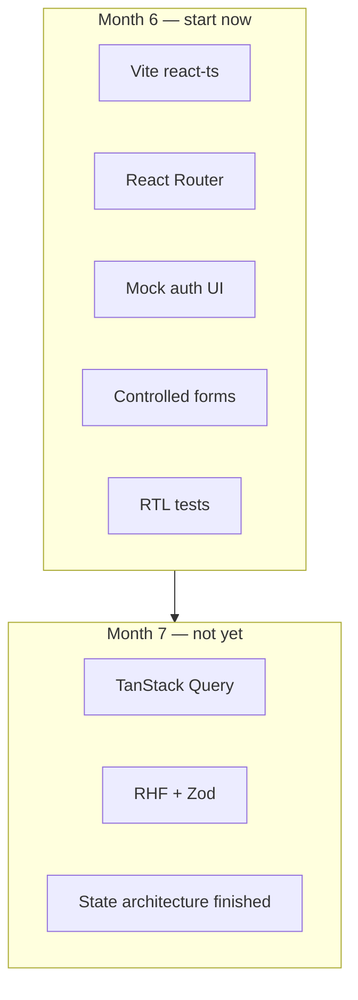
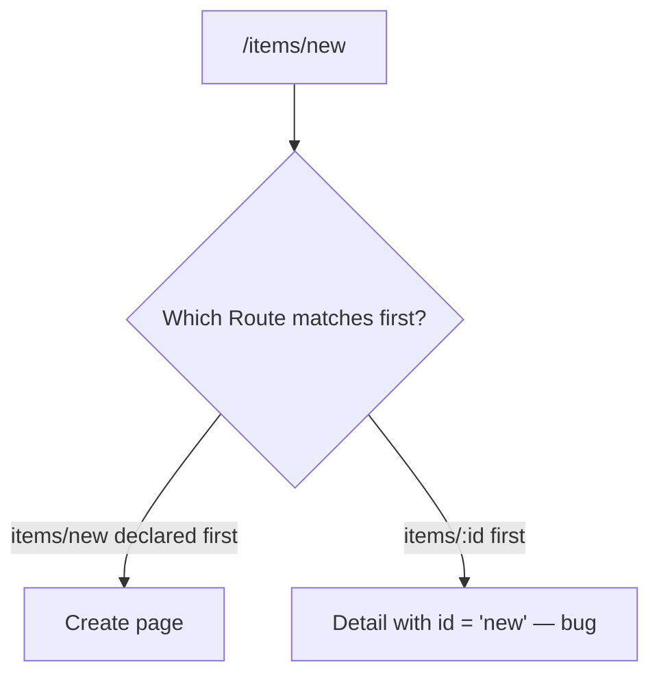

# Month 6 · Week 4 · Day 6
# Independent Routed Lab + Start Project 4

**Program:** Full-Stack Mastery · 18 months  
**Phase:** 2 — Modern frontend  
**Month index:** [../../README.md](../../README.md)  
**Week 4:** [1](day-01.md) · [2](day-02.md) · [3](day-03.md) · [4](day-04.md) · [5](day-05.md) · Day 6 (today) · [7](day-07.md)  
**Week rhythm today:** Independent project work  
**Student state:** You can nest a layout, lock a branch with mock auth, read `:id`, and prove a click with Testing Library. Project 4 has been a destination on paper. Today it becomes a **repo**.  
**Study time:** 3–4 focused hours (Challenge 2 continues after today until the Month 6 gate is honest)

**Lab textbook:** Days 1–5 stay closed for Challenge 1; repair from **this recap**.  
**Challenge 2:** you may open **this file**, [Month 6 README](../../README.md), and `full_stack_project_requirements_2026/project_04_react_admin_dashboard.md`. You may **not** open a GitHub dashboard clone. This textbook will **not** give you the dashboard source.

Two jobs. Neither is “generate the admin template.”

---

## How to read this chapter

Challenge 1 proves you can route **without** copying the yard or the harbor. Challenge 2 **opens** Project 4 as a **separate Git repository**. You will not finish Project 4 today. You will finish a scaffold a stranger could clone, a plan that names pages, and enough UI that the Month 6 gate is **approachable** — list/detail/create/edit as **your** React, not as Month 7 libraries.

The project spec lists TanStack Query, React Hook Form, and Zod. The **roadmap** puts those in **Month 7**. Month 6’s honest slice is in the table below. If you install Query today because the spec’s later sections mention it, you are skipping the month.



---

## Complete explanation (what you must still own)

**SPA routing:** the URL names a screen. `BrowserRouter` in `main.tsx`. `Routes` / `Route` in an `AppRoutes` component. Layout route + **`Outlet`**. **`Link` / `NavLink`** (Home `end`) not in-app `<a href="/...">`. **`useParams`** → `string | undefined`, narrow it. **`path="*"`** last. **`useSearchParams`** for shareable `?q=`.

**Protected UI:** `AuthContext` mock (`user | null`, `login`, `logout`). `RequireAuth` returns `<Navigate to="/login" replace />` or `<Outlet />`. Login is a **controlled** form. `navigate(..., { replace: true })` after success. Not a backend.

**Data this month:** `useState` + a mock array **or** `fetch` (jsonplaceholder or similar) in `useEffect` with **abort**. Loading / empty / error **you render**. **No Query.**

**Forms this month:** controlled inputs, labels, `preventDefault`, field errors as text. **No RHF. No Zod.**

**Tests:** Vitest + RTL + user-event. `MemoryRouter` + `initialEntries`. Query by **role/label**. At least two tests on Project 4 before you call the start “real.”

**Layout:** Flex nav, Grid where you have a **set** of cards, skip link, one `h1` per page, `:focus-visible`. Tailwind is not a substitute for that skill. Redux is **off**.

**Wrong belief:** “Project 4’s spec means I must finish Query this week.”  
**Correct:** the spec is the **destination**. Month 6 gate is a routed app you can explain; Query lands in Month 7 in the **same** repo.

**Wrong belief:** “I’ll copy an open-source admin dashboard and change colors.”  
**Correct:** that fails the gate. You would not be able to explain the tree.

---

## Today's contract

1. Challenge 1: a **library staff** mini-app from the spec in this file.
2. Challenge 2: **`~/ops-dashboard/`** (or similar) exists as its **own** git repo: Vite React TS, README, PLAN.md, routes listed below, mock auth, list/detail/create/edit with **your** state, two RTL tests, `STATE_ARCHITECTURE.md` stub, honest “Query/RHF/Zod in Month 7.”

**Today's gate.** You can point at the new repo and say what each route renders, what is mock, and what waits until Month 7.

---

## Time box

| Block | Minutes | Work |
|---|---|---|
| 0 | 15 | Recap aloud |
| 1 | 70 | Challenge 1 — library staff |
| 2 | 90 | Challenge 2 — open Project 4 repo |
| 3 | 20 | Git (lab + project) |
| 4 | 15 | Recall |

If time is short: **honest PLAN.md + running scaffold + login + one list** beats a generated eight-page costume.

---

# Challenge 1 — Library staff (independent)

**Days 1–5 closed.** This recap + the spec below are enough.

```powershell
cd ~\fullstack-lab\month-06
npm create vite@latest week-04-library -- --template react-ts
cd week-04-library
npm install
npm install react-router
```

**Domain:** a **staff** tool for a fictional branch library (holds, copies, patrons). **Not** an ops dashboard. **Not** Harbor. **Not** Northline Yard inventory.

### Spec

| Path | Auth | Screen |
|---|---|---|
| `/login` | public | Labeled email + password; mock rule in `STAFF.txt` |
| `/` | protected | `h1` **Circulation desk**; two sentences; links into the catalog |
| `/titles` | protected | List of at least four titles; `Link` to detail; optional `?q=` |
| `/titles/:id` | protected | Detail; unknown id handled |
| `*` | protected | Not found |

Layout inside the lock: skip link, wordmark **Cedar Branch**, `NavLink` Desk (`end`) + Titles, Sign out, `main#main` + `Outlet`, footer.

**Data:** `src/data/titles.ts` — at least four `{ id: string; title: string; copies: number }`. List maps with `key={id}`. Detail looks up `id`. Unknown id: heading **Title not found**, `Link` to `/titles`.

**Login:** labels, mock password in `STAFF.txt` (example: `stacks`). `replace` on success and on the lock.

**CSS you type.** Accent may be yours; keep it readable. Flex header. One `h1` per page. `:focus-visible`. No Tailwind-as-the-layout. No Query/RHF/Zod. No AI-generated tree.

`STAFF.txt`: mock password; why this is not Project 4; one sentence on `Outlet`.

If you finish early: `?q=` on `/titles` with `useSearchParams`, filter in render.

Tests not required on Challenge 1 if Challenge 2 needs the hours. A working lock is required.

```powershell
cd ~\fullstack-lab
git add month-06/week-04-library
git commit -m "Week 4 Day 6: independent library staff routed lab."
```

---

# Challenge 2 — Start Project 4 (own repo)

Read the project file: `full_stack_project_requirements_2026/project_04_react_admin_dashboard.md`.

Then **ignore** the Query, Hook Form, Zod, MSW, and performance sections **until Month 7**. You are building the **React + Router + mock auth + owned forms + tests** floor.

This textbook does **not** contain the dashboard. Do not paste a complete app from anywhere.

## C2.1 New repository

Pick an empty folder, e.g. `C:\Users\Universe\ops-dashboard` or `~\ops-dashboard\`. **Not** inside `fullstack-lab` as a dump of the product (labs stay in `fullstack-lab`; the product is its own repo — same rule as Project 3).

```powershell
mkdir ~\ops-dashboard
cd ~\ops-dashboard
npm create vite@latest . -- --template react-ts
npm install
npm install react-router
npm install -D vitest jsdom @testing-library/react @testing-library/user-event @testing-library/jest-dom
git init
```

Vite’s `.gitignore` should already list `node_modules` and `dist`. Keep `package-lock.json`. First commit: the scaffold **before** you invent pages.

Windows: the extra `--` before `--template` is required.

## C2.2 Scripts

In `package.json` at least:

| Script | Meaning |
|---|---|
| `dev` | Vite (template) |
| `build` | Vite production bundle |
| `typecheck` | `tsc --noEmit` |
| `test` | `vitest run` |
| `lint` | template ESLint if present |

Wire Vitest `environment: "jsdom"` as you did in the lab (Day 4 recap: `MemoryRouter` in tests, `BrowserRouter` in `main.tsx`).

## C2.3 README.md (honest)

Must say:

- This is **Project 4 — operations / inventory admin** (your domain name — **Northline Ops** is fine if it is **your** UI, not a copied theme).
- How to `npm install`, `dev`, `typecheck`, `test`, `build`.
- **Mock auth** rule (not a real backend).
- **Month 6 vs Month 7:** *TanStack Query, React Hook Form, and Zod are not in this repo yet. They are Month 7. This month: Router, mock auth, controlled forms, RTL.*
- Deploy: **not required this month** (optional HTTPS later).

## C2.4 PLAN.md

Write **before** you generate a forest of files:

- Pages you will have by the Month 6 gate vs pages that wait.
- **Route table** (must include the paths in C2.5).
- Data: mock array **or** jsonplaceholder (name which). Fetch in effects this month.
- Forms: controlled React; validation you write (required fields, visible messages).
- Flex vs Grid: nav vs card/summary region — one sentence each.
- **Not yet:** Query keys, RHF, Zod, Redux, Tailwind-as-crutch.

## C2.5 Routes you must declare this month

| Path | Role |
|---|---|
| `/login` | Public mock login |
| `/` | Dashboard **shell** (summary cards you compose — even if numbers are mock) |
| `/items` | Entity list |
| `/items/new` | Create form (**declare this before** `/items/:id` so `"new"` is not an id) |
| `/items/:id` | Detail |
| `/items/:id/edit` | Edit form |
| `*` | Not found |

**Order matters.** If `path="items/:id"` is registered **before** `items/new`, the param `id` will be the string `"new"`. Put **static** segments (`new`) above **dynamic** ones (`:id`).



Nested layout: chrome + `Outlet`. `RequireAuth` around the app shell. Skip link on the layout.

Suggested folders (you may rename; do not generate fifty empty files):

```
src/
  auth/          AuthContext, RequireAuth
  layout/        AppLayout (skip, nav, Outlet)
  pages/         Login, Dashboard, ItemList, ItemDetail, ItemNew, ItemEdit, NotFound
  data/          types + mock items OR api.ts fetch helpers
  test/          setup.ts, renderApp.tsx
```

A page file that is 400 lines is a smell. Extract a `ItemForm` that receives values and `onChange` / `onSubmit` — still **controlled**, still not RHF.

## C2.6 Mock auth

Rebuild context in this repo. Login: email + password, labeled, loading **you** simulate (`setTimeout` is enough), success and failure messages. `Navigate` / `navigate` with `replace`. Sign out.

## C2.7 List / detail / create / edit

- **List:** mock items with **stable keys**; search may be `?q=` or local state (prefer URL if you will share filters). Loading / empty / error if you fetch.
- **Detail:** `useParams`, missing entity UI.
- **Create / edit:** **controlled** fields. Submit updates **your** mock array (lift state, or a small module with `useState` in a provider). Then `navigate` to the list or detail. Disabled submit while “saving” if you simulate delay.
- **Do not** install RHF/Zod to “get it over with.”

Create, in words you must be able to type without a library:

1. State for each field (`title`, `qty`, …).
2. Labels.
3. Submit: if `title.trim() === ""`, set an error `p` and return.
4. Otherwise append `{ id, title, ... }` with a **new** array (`setItems((prev) => [...prev, item])`).
5. `navigate(`/items/${id}`)` or `/items`.
6. Do not `items.push`. Do not mutate a row in place on edit — `map` a new array.

Edit loads the row from `id`, puts fields in state **once** when the row is known (an effect that depends on `id` **or** a key on the form `key={id}` so React remounts). Do not loop an effect that copies field state every render.

Dashboard shell: a few **cards** (Grid) with derived numbers from the same mock list (`items.filter(...).length`). Derived during **render**, not in an effect.

Loading on create: disable the submit button while the mock save `setTimeout` is pending. Show **Saving…** as the button text or a status `p`. Then navigate. That is the Month 6 version of “mutation UX.” Query mutations wait until Month 7.

## C2.8 Tests (at least two)

Examples that meet the gate:

1. Logged-out `/items` → login UI (role/label).
2. Logged-in list → click an item → detail heading.

`MemoryRouter`. No class-name-only assertions.

## C2.9 STATE_ARCHITECTURE.md (stub)

Classify with **examples from this repo** (even if some rows say “Month 7”):

| Kind | Example now | Later |
|---|---|---|
| Local UI | create form fields, “menu open” | stays `useState` |
| URL | `/items/:id`, `?q=` | stays Router |
| Context | mock `user` | still not a server session |
| Server | mock array or fetch-in-effect | **TanStack Query in Month 7** |
| Global client | none | Redux only if you can name a real problem (likely never for this app) |

This stub is a **thinking** file. Month 7 will fill it. An empty file named `STATE_ARCHITECTURE.md` is not a stub.

Write four short paragraphs, not only the table: why search belongs in the URL; why the mock user is context (many routes read it) not a prop drilled from `App`; why item rows will become Query later (they come from a server, they go stale, they must refetch after create); why Redux is idle (you do not have a large client-only graph). If you cannot write the Query paragraph yet, write “I do not know Query; I know these rows are server-shaped” — that is honest and enough for Month 6.

## C2.10 Forbidden

- Copying a GitHub “react admin dashboard”
- Tailwind as the **only** layout skill (if you use utilities later, you must still be able to Flex/Grid by hand — this month: **write CSS**)
- Redux
- Generating the app with AI
- Pasting this textbook’s lab `App.tsx` and renaming “pallets” to “items”
- Claiming Month 6 done because Query is “almost” installed

---

# Git

Project repo:

```powershell
cd ~\ops-dashboard
git add .
git commit -m "Start Project 4: Vite React shell, routes planned, mock auth floor."
```

Lab notes only, if any, in `fullstack-lab`:

```powershell
cd ~\fullstack-lab
git add month-06
git commit -m "Week 4 Day 6: library lab notes; Project 4 lives in its own repo."
```

---

# Recall

Close this file.

1. Why is Project 4 a **separate** git repo from `week-04-router`?
2. Why does `/items/new` sit above `/items/:id`?
3. What three libraries wait until Month 7?
4. Where does mock `user` live vs `?q=` vs form `title`?
5. What two tests prove the Month 6 floor?

---

## Definition of done

- [ ] `week-04-library` matches Challenge 1 (or you honestly spent the hours on Challenge 2 after a smaller library)
- [ ] `ops-dashboard` (name yours) is its own repo; `node_modules` not committed
- [ ] README names Month 7 tools as **not yet**
- [ ] PLAN.md + route table
- [ ] Routes declared: login, `/`, list, detail, new, edit, `*`
- [ ] Mock auth + controlled create **or** edit actually works (not a blank `h1`)
- [ ] Two RTL tests pass
- [ ] `STATE_ARCHITECTURE.md` stub has rows, not a title only
- [ ] You can explain the tree without a tutorial

You may keep building this repo after Day 7 until gate item 8 is true. You may **not** start Month 7 because the calendar moved.

---

## Optional review links

Repair from this recap and the project **requirements** file. Later checking:

- [React Router: routing](https://reactrouter.com/start/declarative/routing)
- [React: managing state](https://react.dev/learn/managing-state)
- [Testing Library: queries](https://testing-library.com/docs/queries/about)

---

## Tomorrow

**Month 6 exam + gate.** Textbook closed except the synthesis **in Day 7**, Block G (**Northline Ops** mini spec), and the Project 4 spec for the gate row. Work in `~\fullstack-lab\month-06-exam\`. Do not start Month 7 if the self-mark is false. Deploy is not required this month.
