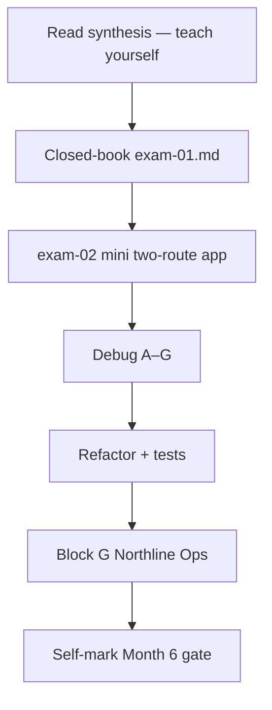
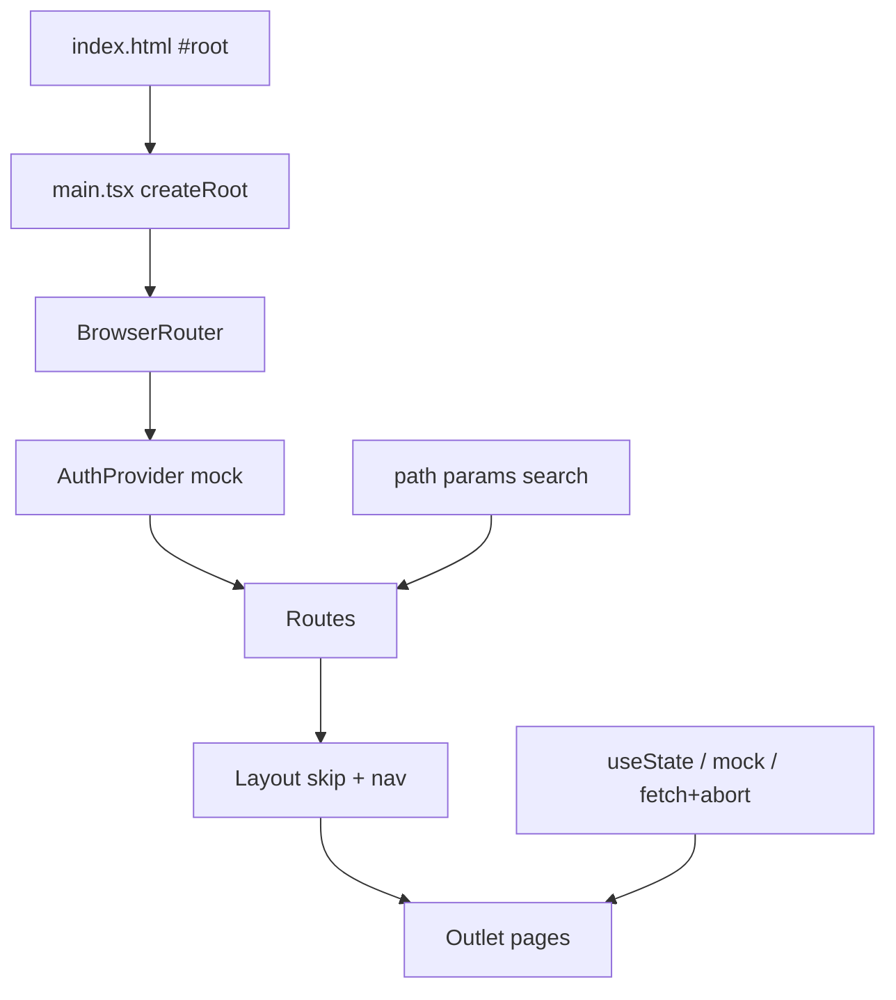

# Month 6 · Week 4 · Day 7
# Month 6 Exam + Gate Layout

**Program:** Full-Stack Mastery · 18 months  
**Phase:** 2 — Modern frontend  
**Month index:** [../../README.md](../../README.md)  
**Week 4:** [1](day-01.md) · [2](day-02.md) · [3](day-03.md) · [4](day-04.md) · [5](day-05.md) · [6](day-06.md) · Day 7 (today)  
**Week rhythm today:** Monthly exam  
**Study time:** 3–4 focused hours (Block G may take a further session — finish it before Month 7)

Textbook files stay **closed** except:

- **this file** (synthesis + exam blocks + **Block G**),
- the **self-mark** table at the end,
- `full_stack_project_requirements_2026/project_04_react_admin_dashboard.md` **only** for gate item 8 (what the repo must contain — not a source to paste).

Repair forgotten facts from **this synthesis**, not from Week 1–4 day files and not from a dashboard tutorial.

Work in `~\fullstack-lab\month-06-exam\` for exam evidence. Block G is a **new Vite app** at `~\fullstack-lab\month-06-exam\gate-northline-ops\` (or `month-06-exam\gate-layout\` — your choice). Do **not** put Block G inside the Project 4 repo. Do **not** start Month 7 because the calendar moved.

Deploy is **not** required this month (optional HTTPS later).

---

## How to read this chapter

This file is the **exam and the teacher**. The synthesis is written so a student whose Weeks 1–4 notes are foggy can still re-learn the month from **today’s pages**, then prove it with the blocks and the gate layout.



During blocks 2–5, Days 1–6 of every week stay closed. If you go blank, re-read **this synthesis**. AI may not write the mini-app, exam-01, or Block G.

---

## Today's contract

By the end of this day you will be able to teach Month 6 aloud from this synthesis and show evidence for every gate row.

**Today's gate** is the Month 6 Gate table below — not “I attended four weeks.”

---

## Time box

| Block | Minutes | Work |
|---|---|---|
| 0 | 25 | Read the complete explanation; speak it |
| 1 | 40 | Closed-book explanation |
| 2 | 35 | Independent mini-build (tiny 2-route app) |
| 3 | 25 | Debug A–G |
| 4 | 20 | Refactor commit (lab or Project 4) |
| 5 | 20 | Run tests; break one; restore |
| 6 | 15 | Design: state kinds |
| 7 | 20 | Retro + self-mark |
| G | further session if needed | Block G — Northline Ops spec |

---

## Month 6 synthesis (the lesson, in this book)

**React:** a **UI library**. Components are **functions** that receive props (and later state) and return a **description** of UI (JSX). React renders that tree into `#root`. JSX is not HTML: `className`, `htmlFor`, one parent or a fragment, `{expressions}`. Types in `.tsx` still **erase**.

**Boot:** `index.html` → `#root` + script → `main.tsx` `createRoot` → `StrictMode` → `App`. Vite is the bundler/dev server, not Create React App.

**Props and composition:** data flows **down**. Props are read-only. `children` is nested JSX. A **boundary** is what a component owns vs what it receives. Do not mutate props.

**State:** `useState` is for values that change **because of interaction** and cannot be computed. **Derived** values are calculated during render (`items.filter(...)`). **Lists** need **stable keys** (ids), not array index if the list reorders. **Controlled inputs** take `value` + `onChange`; the React state is the source of truth. Conditional rendering is `if` / ternary / `&&` with care for `0`.

**Effects:** `useEffect` synchronizes with **something outside React** (fetch, a timer, a subscription). Dependency array: what you **read**. Cleanup: abort fetch, clear timer. Strict Mode may run setup/cleanup twice in development. **Do not** use an effect to copy props into state or to filter a list you can derive. `fetch` without abort can apply a **stale** response.

**Context / reducer / refs / custom hooks (Week 3):** context avoids prop-drilling for **genuinely shared** client data (theme, mock user). It is not a database. `useReducer` when updates are a set of named actions. Refs hold a DOM node or a mutable box that does **not** trigger render. A custom hook is a function that calls hooks — you must still explain it.

**Router (Week 4):** the **URL is a screen**. `BrowserRouter` wraps the tree. `Routes` / `Route` declare the table. Layout route + **`Outlet`**. `Link` / `NavLink` (Home **`end`**) — in-app `<a href="/path">` **full-reloads**. `useParams`: `id` is `string | undefined`. `path="*"` 404. `RequireAuth`: no user → `<Navigate to="/login" replace />` else `<Outlet />`. `useSearchParams` for `?q=`. Loading/error are **page UI**. Import from `"react-router"` after `npm install react-router`. Loaders/actions and TanStack Query are **not** this month’s data path — Query is **Month 7**.

**Tests:** Vitest + Testing Library. `MemoryRouter` + `initialEntries` in tests. Click/submit with `user-event`. Assert **roles and labels**, not CSS classes.

**Project 4:** its **own** repo. Month 6 floor: Vite React TS, those routes, mock auth, **controlled** forms, RTL. Query / RHF / Zod wait. This textbook never contains the complete dashboard.



The rest of this file unpacks those sentences so the exam is not a vocabulary quiz against a ghost month.

---

# Complete explanation — React you must still own

## 1. Components and JSX (Week 1)

A **component** is a PascalCase function. React calls it. It returns JSX (or `null`). You write `<Greeting />`, not `Greeting()`, so React can hook the node.

**JSX** compiles to function calls. Two adjacent tags are two return values — illegal. Wrap with a fragment `<>...</>` or a real element. `{name}` is an expression. Text is **text** (Month 3 `textContent` lesson). `dangerouslySetInnerHTML` is `innerHTML` — forbidden unless you can name a sanitizer you do not have.

**Boot:** the website is still `index.html`. `#root` is empty until React paints. `StrictMode` is a development checker, not a visible extra UI.

**Boundary:** `Header` owns header markup. It does not invent a user object `App` already has — that arrives as **props**.

**Wrong belief:** “React is HTML in JavaScript.”  
**Correct:** it **looks** like HTML. It is a tree description. `class` is `className` because `class` is reserved in JavaScript.

## 2. State, lists, forms (Week 2)

**`useState`** returns the current value and a setter. Setting a **new** value queues a render. Setting the **same** object reference may not look like a change — **do not mutate** then `setState` the same array. Copy: `setItems([...items, next])` or `setItems(items.map(...))`. Mutating `items.push` and calling `setItems(items)` is a bug.

**Derived:** if you can compute it from state/props, do not store it. Filtered lists: `const visible = items.filter(...)` in the body, not in an effect.

**Keys:** `key={item.id}`. Index keys break identity when the list sorts or the first row is removed. Missing keys: React warns; state can attach to the wrong row.

**Controlled form:** `value={title}` `onChange` → `setTitle`. Submit `preventDefault`. Labels: `htmlFor` / `id`. React Hook Form is **Month 7**.

**Wrong belief:** “I’ll keep `filtered` in state and sync it with an effect when `q` changes.”  
**Correct:** that is a second source of truth. Filter while rendering.

## 3. Effects and shared client state (Week 3)

**`useEffect(fn, deps)`:** after paint, run `fn`. If `fn` returns a cleanup, run that before the next effect and on unmount. **AbortController** in the fetch effect: abort on cleanup; ignore `AbortError`.

**When not an effect:** transforming data for display; resetting a field when you could key a component; anything you can do in the event handler.

**Context:** `AuthContext` this week is **mock who is signed in**. Refresh loses it unless you persist (not required). Context is not Query.

**Wrong belief:** “Every API call belongs in render.”  
**Correct:** render must stay a calculation. Fetch is a **side effect**.

## 4. Router, protection, tests (Week 4)

**Declarative SPA routing** (`react-router` v7):

```tsx
import {
  BrowserRouter,
  Routes,
  Route,
  Outlet,
  Link,
  NavLink,
  useParams,
  useNavigate,
  Navigate,
  useSearchParams,
} from "react-router";
```

`BrowserRouter` in `main.tsx`. Tests use **`MemoryRouter`**, so extract **`AppRoutes`**.

**Nested:** parent element is the layout; **`<Outlet />`** is the hole. Forget Outlet → chrome with an empty main.

**`Link` vs `<a>`:** `Link` keeps the SPA alive. `<a href="/items">` asks the browser for a document.

**Params:** `/items/:id` → `useParams()`. Narrow `id`. **`/items/new` must be declared before `/items/:id`** or `id === "new"`.

**Protected:** `RequireAuth` is a layout route. Unauthenticated → `<Navigate to="/login" replace />`. Hiding a nav link is not a lock. `replace` avoids Back-button ping-pong.

**404:** `path="*"` last.

**Search:** `useSearchParams` for `?q=`. Shareable.

**Loading/error:** the **page** renders status. Query is Month 7. Optional `errorElement` on a data router is not your main path.

**Tests:** `getByRole("heading", { name: ... })`. A test that only looks at `.is-active` is testing CSS, not the operator’s screen.

**Wrong belief:** “SPA means URLs are optional.”  
**Correct:** URLs are how humans name screens. React Router keeps the tree matched to the bar.

## 5. Product shape (Project 4, Month 6 floor)

Own repo (`~/ops-dashboard/` or similar). Routes: `/login`, `/`, `/items`, `/items/new`, `/items/:id`, `/items/:id/edit`, `*`. Mock auth. Dashboard shell. List/detail. Create/edit **you own**. Two RTL tests. `STATE_ARCHITECTURE.md` stub. README: Query/RHF/Zod **in Month 7**. No copied GitHub admin, no Redux, no AI-generated product.

Worked month-in-one-picture: operator opens `/items` → `RequireAuth` sees no user → login form → mock `login` → `navigate("/", { replace: true })` → layout with skip link → list from mock array → `Link` to `/items/oak-04` → detail reads `id` → edit form is controlled state → submit copies a new array → tests click that path without Chrome.

---

## Month 6 Gate

True **without a tutorial**:

1. Scaffold a Vite + React + TypeScript app and explain `index.html` → `main.tsx` → `App.tsx`.
2. Explain a **component** as a function of props (and later state) that returns a UI tree.
3. Type props; compose small components; name a **boundary**.
4. Use **controlled inputs**, lists with **stable keys**, and conditional rendering.
5. Explain `useState` vs **derived** values vs `useEffect` (and when an effect is the wrong tool).
6. Use React Router: layout route, nested routes, `Outlet`, params, a 404, a **protected** wrapper (mock auth).
7. Write at least one **React Testing Library** test that clicks or submits and asserts **user-visible** behavior.
8. Project 4 repo exists with routes for login (mock), dashboard shell, list, detail, create/edit **forms you own** (plain React this month), and tests running.

If any item is false, do not start Month 7.

---

# 1. Closed-book explanation (40 min)

`~\fullstack-lab\month-06-exam\exam-01.md` — teach a beginner. Prose, not an API dump. Must cover:

Week 1: component, JSX, boot sequence, `className`, fragment, boundary  
Week 2: `useState`, derived vs stored, keys, controlled inputs  
Week 3: effect deps, cleanup/abort, when **not** to use an effect, context as mock auth  
Week 4: URL as screen, `Outlet`, `Link` vs `<a>`, params, `*`, `RequireAuth` + `replace`, `?q=`, MemoryRouter + role queries  

Include: why types still erase; why Query/RHF/Zod wait. If a paragraph is a bullet list of hook names, rewrite it.

---

# 2. Independent mini-build (35 min)

Textbook closed except this block’s bullet list. **`MemoryRouter` is not required** in the exam mini.

`~\fullstack-lab\month-06-exam\mini\` — a **new** Vite `react-ts` app **or** a tiny folder that already has React from a quick scaffold:

```powershell
cd ~\fullstack-lab\month-06-exam
npm create vite@latest mini -- --template react-ts
cd mini
npm install
npm install react-router
```

**Tiny 2-route app** (not Block G, not Project 4):

- `BrowserRouter` + `Routes`.
- Layout with skip link, Flex nav, `Outlet`.
- `/` — `h1` **Desk**, one paragraph.
- `/note` — `h1` **Note**, one labeled textarea (controlled), a `Link` home.
- `NavLink` with `end` on Desk.
- CSS you type; no Tailwind kit.

No mock auth required in the mini. No Query. Do not paste Project 4.

---

# 3. Debugging (25 min)

`exam-03-debug.md` — full sentences: what you would **see**, the **cause**, what to **write instead**. No exploit payloads.

**A.** A list of cards has **no `key`** (or `key={index}` on a sortable list). What goes wrong when the first item is deleted?

**B.** Search text lives in `q`. An effect copies `items.filter(...)` into `filtered` state whenever `q` changes. Why is that the wrong tool? Where should `visible` be computed?

**C.** Detail page fetches `/posts/${id}` in an effect with **no abort**. The user clicks id 1, then quickly id 2. The slow response for 1 arrives last. What does the UI show? What belongs in cleanup?

**D.** The nav uses `<a href="/items">Items</a>`. What happens to React state on click? What component should they have used?

**E.** Dashboard is “protected” because the nav **hides** the link when `user` is null. The operator pastes `/items`. What is missing?

**F.** `items.push(newItem); setItems(items);` — why might the screen not update? How do you set state with a **new** array?

**G.** A test finds `.card-title` with `querySelector` and asserts `textContent`. You rename the class for CSS. The test fails; the app still works. What should the test have queried instead?

---

# 4. Code review (15 min)

Review **Project 4** or `week-04-router`. One defect you **fix** (a missing label, an index key, an `<a>` in nav, an unprotected route). Commit in **that** repo. Record the commit subject in `exam-04-review.md`.

---

# 5. Testing (20 min)

In Project 4 (preferred) or `week-04-router`:

1. Run `npm test` — record pass.
2. Break a **user-visible** string the test asserts.
3. Show the failure (test **name**).
4. Restore.

Deleting the test is not a restore. Record in `exam-05-tests.md`.

---

# 6. Architecture / design (15 min)

`exam-06-design.md`

- For Project 4 (or the lab): classify **one** example each of local UI, URL, context, server-to-be.
- Why Month 6 forbids finishing the spec’s Query/RHF/Zod chapters early.
- Flex vs Grid: nav vs dashboard cards.

---

# 7. Retrospective (15 min)

`exam-07-retro.md` — hours this month, solid/weak, Project 4 repo path, honest Month 7 readiness. If create/edit is a blank heading, gate 8 is **not** pass.

---

# Block G — Gate layout (the “screenshot”)

This is the roadmap’s **rebuild a supplied layout from a screenshot**. There is no PNG in the repo. This spec **is** the screenshot. Implement it as a **small routed React app** in `gate-northline-ops/`. No looking at Project 4, Harbor, Yard, or library labs while building. No TanStack Query, no RHF, no Zod, no Tailwind-as-the-only-layout, no AI-generated tree.

When you finish, a TA should overlay this spec on your screens and match structure, spacing, color, and **routes**.

This is **not** Project 4. It is a **Northline Ops** shell: layout + login + two protected screens + 404.

## G.1 Canvas and type

| Token | Value |
|---|---|
| Page background | `#f6f4ef` |
| Text | `#1a1a1a` |
| Muted text | `#5c5c5c` |
| Accent | `#0b5fff` |
| Header / footer / card background | `#ffffff` |
| Border | `1px solid #e2ddd4` |
| Radius | `8px` |
| Font | `system-ui, "Segoe UI", Roboto, sans-serif` |
| Body size | `1rem`, line-height `1.5` |
| `h1` | `2rem` (1.5rem at max-width 375px) |
| `h2` | `1.25rem` |
| Space scale | 8px base: 8, 16, 24, 32, 48 |
| Max content width | `1100px`, centered, horizontal padding `1rem` |
| Header height | `64px` (content vertically centered) |
| Skip-link focus | visible; accent outline `3px`, offset `2px` |

`box-sizing: border-box` on all elements. `:root` custom properties for the colors and accent. `:focus-visible` 3px accent outline, 2px offset, on links, buttons, and inputs. No `outline: none`.

Scaffold:

```powershell
cd ~\fullstack-lab\month-06-exam
npm create vite@latest gate-northline-ops -- --template react-ts
cd gate-northline-ops
npm install
npm install react-router
```

`BrowserRouter` in `main.tsx`. CSS you type in `src/index.css` (plus modules if you want). **No** UI kit.

## G.2 Routes (exact)

| Path | Auth | What the user must see |
|---|---|---|
| `/login` | public | Login screen (G.5). If already logged in, `<Navigate to="/" replace />`. |
| `/` | protected | Operations board (G.6) |
| `/stations` | protected | Stations list (G.7) |
| `*` | protected | 404 (G.8) |

**`RequireAuth`:** if `user` is `null`, `<Navigate to="/login" replace />`; else `<Outlet />`. Mock auth: context, not a server. Mock password **`northline`** (email any non-empty). `login` stores `{ email }`. `logout` clears user and `navigate("/login", { replace: true })`.

Hide the app chrome on `/login`. Authenticated screens share **one** layout (G.3).

## G.3 Authenticated layout (64px header)

Skip link **first**: text **Skip to content** → `#main`. Off-screen until `:focus`.

**Header:** white bar, height **64px**, bottom border `#e2ddd4`. Inner max-width 1100px. **Flex** row, `justify-content: space-between`, `align-items: center`, `gap: 1rem`, `flex-wrap: wrap`.

- Left: wordmark text **Northline Ops** — a `Link` to `/`, **not** an `h1`, not a second heading. Color `#1a1a1a`.
- Right: `nav` with **Home** (`NavLink` to `/` with **`end`**) and **Stations** (`NavLink` to `/stations`). Accent color. **Underline** when `isActive` (class `is-active` or equivalent). Hover underline. Then a **Sign out** `button type="button"`.

**Main:** `id="main"`, padding `2rem 0`. Contains **only** `<Outlet />`.

**Footer:** white, top border, padding `1.5rem 0`. Muted small text **© Northline Ops — exam shell, not Project 4.**

## G.4 Motion

If you transition button background, wrap with `prefers-reduced-motion: reduce`. No looping animation.

## G.5 Login (`/login`)

Centered card: white, border, radius 8px, padding `1.5rem`, max-width `24rem`.

- One page `h1`: **Sign in**
- Muted `p`: **Training desk. Password is northline.**
- Form: **Email**, **Password**, submit **Sign in** (`button type="submit"`).
- Visible labels; `id` / `htmlFor`; `type="email"` / `type="password"`; `autocomplete` `username` and `current-password`.
- Controlled inputs. `preventDefault`.
- Empty email or wrong password: `p` with **Check email and password.** (`aria-live="polite"`).
- Success: `login(email)` then `navigate("/", { replace: true })`.
- Primary button: background accent, white text, padding `0.75rem 1.25rem`, radius 8px.

No layout nav on this page.

## G.6 Home (`/` — Operations board)

- `h1`: **Operations board**
- Muted `p`: **Quiet software for busy operators.**
- **Grid** of **three** `article` cards. Columns: 1 (default), **3** at `min-width: 768px`. `gap: 1.5rem`.
- Each card: white, border, radius 8px, padding `1.5rem`, Flex column, `gap: 0.75rem`.
  - `h2` titles **exactly:** **Intake**, **Yard**, **Dispatch**
  - A metric `p` with `font-size: 2rem` (you invent three small integers)
  - One muted sentence each (you invent)
- Below the grid: a `Link` **View stations** to `/stations` (accent).

## G.7 Stations (`/stations`)

- `h1`: **Stations**
- Muted `p`: **Four desks on the floor.**
- **Grid** of **four** `article`s. Columns: 1, **2** at `min-width: 768px`. `gap: 1rem`.
- Names **exactly:** **North gate**, **Cold store**, **Rail spur**, **Office**.
- Each: `h2` name, one sentence you invent, border + radius + padding `1rem`.
- `Link` **Back to board** to `/`.

## G.8 Not found (`*`)

- `h1`: **Page not found**
- `p`: **That URL is not a desk.**
- `Link` **Home** to `/`.

Still inside the authenticated layout (nav visible).

## G.9 Forbidden

Project 4 paste, lab paste, TanStack Query, RHF, Zod, Redux, Bootstrap, layout tables, `outline: none` without replacement, `tabindex` > 0, `if (page === ...)` instead of `Routes`, in-app `<a href="/stations">` for internal nav, `as string` on params (404 has no param). Horizontal scroll at 375.

## G.10 Evidence

`gate-northline-ops/EVIDENCE.md`:

- Notes or screenshots at **375**, **768**, **1024**.
- Keyboard: skip link, nav, login labels, Sign out.
- One `h1` per screen.
- Logged-out visit to `/stations` lands on `/login`.
- Unknown path (e.g. `/bananas`) shows **Page not found** after login.

Tests optional here. Project 4 tests remain the gate’s RTL row.

---

# Self-mark

| Gate item | Evidence | Pass? |
|---|---|---|
| 1 Scaffold + boot explained | exam-01 + mini | |
| 2 Component = fn of props/state | exam-01 | |
| 3 Typed props, composition, boundary | exam-01 + Project 4 or labs | |
| 4 Controlled inputs, keys, conditionals | Project 4 forms + lists | |
| 5 useState vs derived vs effect | exam-01 + exam-03 B/C | |
| 6 Router: layout, Outlet, params, 404, RequireAuth | Block G + Project 4 | |
| 7 RTL click/submit, user-visible assert | exam-05 + Project 4 tests | |
| 8 Project 4 repo: login, shell, list, detail, create/edit, tests running | `~/ops-dashboard` (or your path) | |
| Block G matches spec | `gate-northline-ops/` | |

All Month 6 Gate rows (1–8) must be pass before Month 7. Block G must match before you claim the rebuild skill; do not skip it.

```powershell
cd ~\fullstack-lab
git add month-06-exam
git commit -m "Complete Month 6 exam evidence and Northline Ops gate shell."
```

Project 4 commits stay in **its** repository.

---

## Definition of done

- [ ] exam-01.md covers Weeks 1–4 in prose
- [ ] mini 2-route app exists and is not a Project 4 paste
- [ ] debug A–G written
- [ ] Block G matches tokens, routes, and copy
- [ ] Self-mark table filled honestly
- [ ] Gate 8 false if create/edit is fake

---

## If you passed

Month 7 is **TanStack Query**, **React Hook Form**, **Zod**, state architecture, and performance — **in the Project 4 repo you already started**. Do not start it until this gate is true. Open [Month 7](../../../month-07/README.md) only then.

## Optional review links

Repair from this synthesis first. These pages are for later checking after the exam.

- [React: Thinking in React](https://react.dev/learn/thinking-in-react)
- [React Router: declarative routing](https://reactrouter.com/start/declarative/routing)
- [Testing Library: queries](https://testing-library.com/docs/queries/about)
