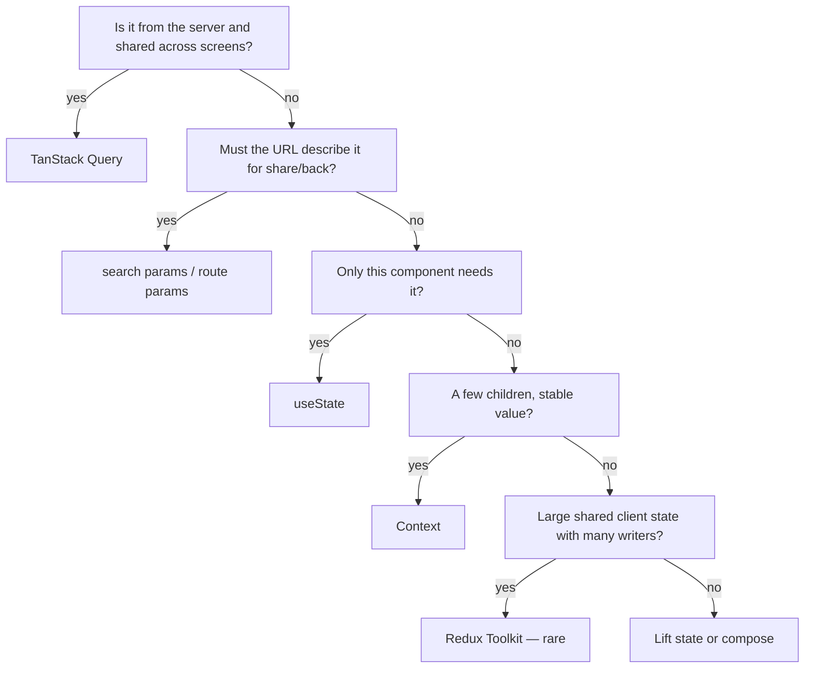

# Month 7 — Modern React Data, Forms, State, Performance

**Program:** Full-Stack Mastery Textbook  
**Phase:** 2 — Modern frontend engineering  
**Length:** 4 weeks · 7 days each · 3–4 focused hours/day  
**Prereq:** Month 6 gate passed (you can scaffold Vite + React + TS, route, test with RTL, and you have a Project 4 repo)  
**This month’s job:** Put **each piece of state in the right place**, then use the libraries that match those places: **TanStack Query** for server state, **React Hook Form + Zod** for forms, **URL** for shareable filters, **Context** sparingly, **Redux Toolkit** only if you can name a real client-state problem. Finish **Project 4**.

**Project 4** (same repo you started in Month 6): `full_stack_project_requirements_2026/project_04_react_admin_dashboard.md`. This textbook will **not** give you the dashboard source.

**This textbook is the lesson.** Query, Zod, RHF, state architecture, and performance are explained in the day files the same way Month 1 explained the machine: slowly, in full sentences, with pictures, then labs. If a day feels like a checklist, stay until you can teach the idea out loud.

Optional review links at the end of a day are for **later rechecking**, not first learning.

These files are written to render as **web pages**: relative links, tables, and **Mermaid** diagrams.

---

## How this textbook is organized

```
month-07/
  README.md     ← you are here
  week-01/      TanStack Query: keys, cache, stale, mutations, invalidation, pagination, optimistic
  week-02/      Zod + React Hook Form: schema, accessible errors, server vs client validation
  week-03/      State architecture decision order; Redux Toolkit literacy (when not to use it)
  week-04/      Feature folders, error boundaries, code splitting, measure-then-memo, MSW
                + finish Project 4 + Month 7 exam
```

Labs: `~\fullstack-lab\month-07\` (small Vite apps).  
Project 4: **`~/ops-dashboard/`** (or whatever you named it) — not a dump inside the lab folder.

---

## Where state lives (the month in one picture)



**Wrong belief:** “Redux is how React apps store API data.”  
**Correct:** API data is **server state**. Query already caches it, dedupes it, and refetches it. Redux for `GET /items` is extra machinery you must justify.

---

## Month 7 Gate

True **without a tutorial**:

1. Explain **server state** vs **client state** vs **URL state** vs **form state** with examples from *your* Project 4.
2. Use TanStack Query: `queryKey`, `queryFn`, `staleTime`, invalidation after a mutation, pagination in the key.
3. Parse unknown JSON with **Zod** at the boundary (Month 5 guards, now a schema).
4. Build a create/edit form with **React Hook Form + Zod** and **accessible** field errors (Month 2 labels still apply).
5. Write `STATE_ARCHITECTURE.md` that classifies every important piece of state — and does **not** invent Redux for the list cache.
6. Handle loading / empty / error without a blank screen; an **error boundary** catches a render crash.
7. Measure before `memo` / `useMemo`. Route-level **lazy** loading exists or is honestly deferred with a reason.
8. Project 4 Definition of Done is true: Query, forms, tests, mock API (MSW or equivalent).

If any item is false, do not start Month 8.

---

## What this month must teach (complete list)

| Week | Must learn | Must practice |
|---|---|---|
| 1 | QueryClient, `useQuery`, `useMutation`, query keys, stale vs garbage, refetch, invalidation, pagination, optimistic (when it helps) | Replace a Month 6 `useEffect` fetch with Query |
| 2 | Zod `safeParse`, inferred types, RHF `register`/`control`, `zodResolver`, `aria-invalid` / `aria-describedby`, mapping server errors | Login + create/edit forms |
| 3 | Decision order (local → compose → Context → URL → Query → Redux last); RTK store/slice/action/reducer/selector/middleware **literacy** | `STATE_ARCHITECTURE.md`; a tiny RTK counter you then **delete** or isolate as a lesson |
| 4 | Feature folders, component APIs, error boundaries, `lazy`/`Suspense`, Profiler, Tailwind **optional** after CSS | MSW; finish Project 4; exam |

**Avoid:** Query *and* `useEffect` fetch for the same resource; putting server lists in Redux; `any` on API data; `innerHTML`; copying a dashboard template; memoizing everything; Tailwind as a way to skip Month 2 CSS.

Horizontal:

- **Debugging:** React Query Devtools; Network tab still tells the truth.
- **Security:** Zod at the boundary; XSS still JSX text; mock auth is not security.
- **Tests:** wrap with `QueryClient`; MSW for HTTP; RTL still queries by role.
- **A11y:** form errors must be associated with fields.
- **Git:** Project 4 feature branches; small PRs (Month 4 habit).

---

## Weekly rhythm

Same as Month 1. Day 1 learn. Day 2 exercises. Day 3 from memory. Day 4 lab feature. Day 5 tests/docs. Day 6 independent. Day 7 review. Week 4 Day 7 is the Month 7 exam + gate.

| Minutes | Block |
|---|---|
| 30–45 | Concepts from **this textbook** |
| 45–60 | Focused exercises |
| 60–90 | Independent work |
| 30–60 | Lab / Project 4 |
| 15 | Notes / recall |

---

## Tools this month

| Tool | Why |
|---|---|
| `@tanstack/react-query` v5 | Server-state cache. Object syntax: `useQuery({ queryKey, queryFn })`. |
| `@tanstack/react-query-devtools` | See keys, stale, fetching. |
| `zod` | Runtime schema. Types via `z.infer`. |
| `react-hook-form` + `@hookform/resolvers` | Forms without a `useState` per field. |
| Redux Toolkit | **Literacy.** Default: you do **not** add it to Project 4. |
| `msw` | Mock HTTP in tests and optionally in the browser. |
| Vite + React 19 + Router | You already have these. |

Windows: PowerShell. Labs in `~\fullstack-lab\month-07\`.

---

## Start

Open [week-01/day-01.md](week-01/day-01.md).

When Month 7’s gate is true, continue with [Month 8 — Python](../month-08/README.md).
