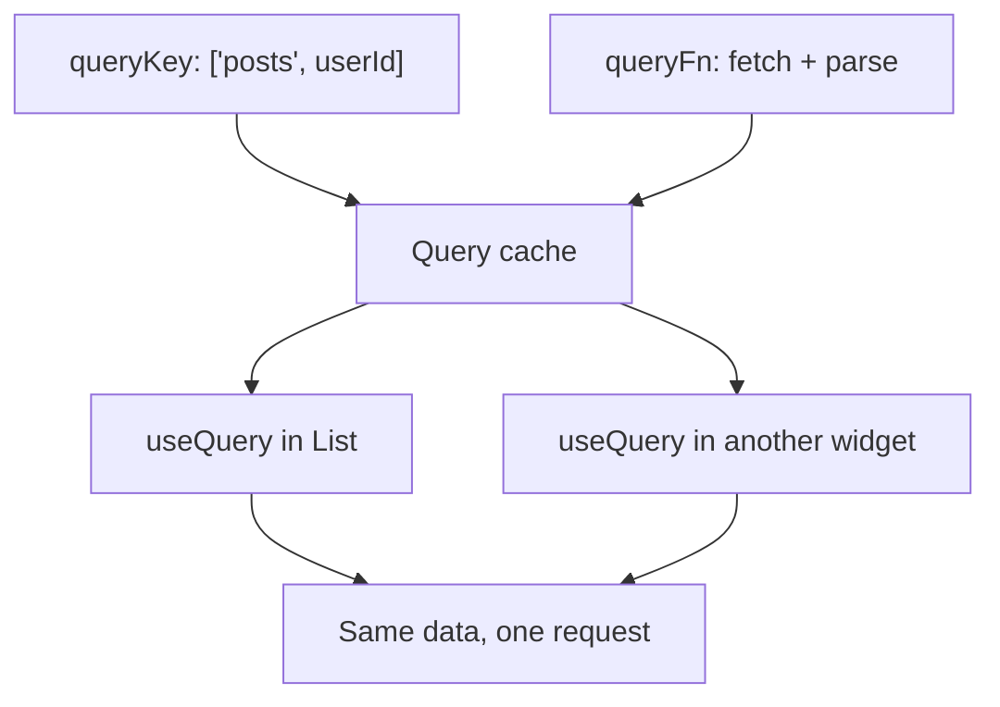
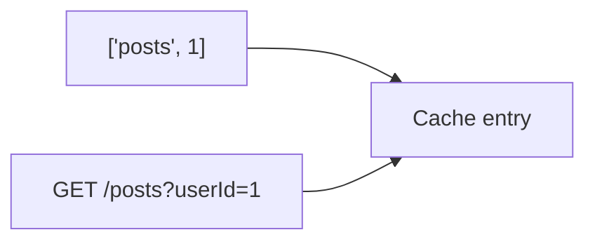

# Month 7 · Week 1 · Day 1
# Server State: QueryClient, queryKey, useQuery

**Program:** Full-Stack Mastery · 18 months  
**Phase:** 2 — Modern frontend  
**Month index:** [../../README.md](../../README.md)  
**Week 1:** Day 1 (today) · [2](day-02.md) · [3](day-03.md) · [4](day-04.md) · [5](day-05.md) · [6](day-06.md) · [7](day-07.md)  
**Week rhythm today:** Learn + type-along  
**Student state:** Month 6 gate passed. You can `fetch` in `useEffect` with abort. That was honest. It does not scale to a dashboard with list + detail + “another screen that needs the same list.”  
**Study time:** 3–4 focused hours

**This week covers:** TanStack Query — queries, keys, stale data, cache lifecycle, refetch, mutations, invalidation, pagination, optimistic updates.

Today: **what server state is**, **QueryClient**, **`queryKey` + `queryFn`**, **`useQuery`**, and **`isPending` / `isError` / `isSuccess`**. Mutations and invalidation are Day 2. Pagination and optimistic are later this week. Do not skip them.

Project 4 is **not** today’s paste target. Labs: `~\fullstack-lab\month-07\`. You may later copy *ideas* into `~/ops-dashboard/`.

---

## How to use this textbook

1. Read a section. Close it. Say the idea.
2. Type every lab. Do not paste a `QueryClient` you cannot explain.
3. When Query or `tsc` errors, **read the error**.
4. Optional review links are for later rechecking — not first learning.

---

## How to read this chapter

Month 6 taught: **UI = f(props, state)**. An effect fetched JSON and stuffed it into `useState`. That works for one widget. Problems appear immediately in an app:

- Two components need the same list → two fetches, or you lift state into a god-object.
- The user opens detail, then the list → stale or duplicate requests.
- A mutation succeeds → you forget to update three screens.
- Strict Mode double-mount → you already fought abort. Query **dedupes** in-flight requests for the same key.

**TanStack Query** (this course: v5, `@tanstack/react-query`) is a **cache of server state** keyed by **query keys**, plus hooks that subscribe to those entries.



If that is still abstract: the Network tab is the kitchen. Query is the **ticket rail**. Two waiters should not send two tickets for the same soup.

---

## Today's contract

By the end of this day you will be able to:

1. Define **server state** vs **client state** in one sentence each.
2. Create a **`QueryClient`** and wrap the tree in **`QueryClientProvider`**.
3. Write **`useQuery({ queryKey, queryFn })`** (v5 **object** syntax only).
4. Branch UI on **`status`** / **`isPending`** / **`isError`** / **`data`** — not on a homemade pair of booleans.
5. Put **`enabled`** on a query that must not fire (empty search).
6. Keep **`queryFn`** returning parsed data; throw on `!response.ok` (Month 3 rule still holds).

**Today's gate.** Closed-book:

> Server state is data that lives on a server and can be stale. A query key is the id of a cache entry. `useQuery` subscribes. `isPending` means no data yet. Two components with the same key share the request. I still check `response.ok`.

---

## Time box

| Block | Minutes | Work |
|---|---|---|
| A | 50 | Theory |
| B | 55 | Provider + first `useQuery` |
| C | 70 | Independent: list + `enabled` search |
| D | 20 | Git |
| E | 15 | Recall |

---

# Block A — Theory

## 1. Server state is not `useState`

| Kind | Lives | Examples | Tool this month |
|---|---|---|---|
| **Server** | On a backend (or mock API). Can change without this tab. | Item list, user profile, search results | **TanStack Query** |
| **Client** | Only in this browser session’s UI | Modal open, theme, wizard step | `useState` / Context |
| **URL** | Address bar | `?q=`, `?page=2`, `/items/3` | React Router |
| **Form** | While the user is editing | Draft title, field errors | RHF (Week 2) |

**Wrong belief:** “I’ll put the fetch result in Context so everyone can read it.”  
**Correct:** that is a handmade cache with none of Query’s invalidation, retries, or deduping. Context is for **stable client** values (auth flag, theme).

**Wrong belief:** “Query replaces `fetch`.”  
**Correct:** your `queryFn` still **calls** `fetch` (or `api.get`). Query **schedules**, **caches**, and **notifies**.

---

## 2. QueryClient — the cache owner

```tsx
import { QueryClient, QueryClientProvider } from "@tanstack/react-query";
import { ReactQueryDevtools } from "@tanstack/react-query-devtools";

const queryClient = new QueryClient({
  defaultOptions: {
    queries: {
      staleTime: 30_000, // 30s: data is fresh; no refetch
      retry: 1,
    },
  },
});

createRoot(document.getElementById("root")!).render(
  <QueryClientProvider client={queryClient}>
    <App />
    <ReactQueryDevtools initialIsOpen={false} />
  </QueryClientProvider>,
);
```

- Create **one** client for the app (not a new client every render — put it in `main.tsx` or a module).
- **`staleTime`:** how long data is **fresh**. Fresh → Query will not refetch in the background just because a component remounted. Default in v5 is `0` (immediately stale). For a dashboard, a small `staleTime` is often kinder than refetch-on-every-focus spam. You will tune this Day 2.
- **`gcTime`:** how long unused cache **stays in memory** after the last subscriber unmounts (formerly `cacheTime`). Default is 5 minutes. Stale ≠ deleted.
- Devtools: install `@tanstack/react-query-devtools`. You will **look** at keys today.

**Wrong belief:** “I’ll new `QueryClient()` inside `App`.”  
**Correct:** that resets the cache on every `App` render. Module scope or `useState(() => new QueryClient())` once.

---

## 3. queryKey — the name of the data

A **query key** is an array. Query hashes it. **Same key → same cache entry.**

```ts
["posts"]                 // the whole collection
["posts", { userId: 1 }]  // a filtered collection
["posts", postId]         // one post
["search", q]             // search results for q
```

Rules you can remember:

1. **Include every variable** the `queryFn` uses. If `queryFn` reads `userId` and the key is only `["posts"]`, you will show the wrong user’s posts when `userId` changes — or you will not refetch.
2. **Structure keys** as `['resource', ...filters]`. Invalidation tomorrow can target `['posts']` and hit all post queries.
3. Keys are **serializable**. Do not put a function or a class instance in a key.



---

## 4. useQuery — subscribe

v5: **one object**.

```tsx
const { data, error, isPending, isError, isFetching, status } = useQuery({
  queryKey: ["posts", userId],
  queryFn: () => getPosts(userId),
  enabled: userId > 0,
});
```

| Field | Meaning |
|---|---|
| `status === "pending"` / `isPending` | No **cached success data** yet. Show a loading UI. |
| `status === "error"` / `isError` | Last fetch failed. `error` is set. |
| `status === "success"` | `data` is defined (for a query that succeeded). |
| `isFetching` | A request is **in flight** (including background refetch). You can have `data` **and** `isFetching`. |
| `isLoading` | In v5 this is `isPending && isFetching`. Prefer **`isPending`** for “first paint loading.” |

**`enabled: false`:** do not run. Empty search box: `enabled: q.trim().length > 0`. Month 3 `isBlank` still applies.

**`queryFn`:**

```ts
export async function getPosts(userId: number): Promise<Post[]> {
  const response = await fetch(
    `https://jsonplaceholder.typicode.com/posts?userId=${userId}`,
  );
  if (!response.ok) {
    throw new Error(`HTTP ${response.status}`);
  }
  const json: unknown = await response.json();
  // Today: a small runtime check or Zod tomorrow. Do not `as Post[]` and pray.
  if (!Array.isArray(json)) throw new Error("Expected array");
  return json as Post[]; // honest Week 2: Zod. Today: check array; map fields you need.
}
```

Throwing inside `queryFn` makes the query **error**. Returning data makes it **success**. Forgetting `ok` still shows a 404 HTML body as “success” — Month 3 bug, still a bug.

**Wrong belief:** “`isLoading` is the only flag I need.”  
**Correct:** after you have data, a refetch is `isFetching`, not a blank page. Empty success (`data.length === 0`) is **not** an error.

---

## 5. What Query already does for you (so you stop writing it)

- **Deduping:** two `useQuery` with the same key at once → one network request.
- **Retries:** failed queries retry (default 3 in v5 — you may set `retry: 1` for a public API you expect to 404).
- **Garbage collection:** unused keys expire after `gcTime`.
- **Window focus refetch:** if data is stale, coming back to the tab may refetch. That is a feature. Tune `staleTime` before you disable it in anger.

You still own: **HTTP errors**, **parsing**, **empty vs error UI**, **XSS** (JSX text).

---

## 6. TypeScript

```ts
type Post = { id: number; title: string; userId: number };

const { data } = useQuery({
  queryKey: ["posts", userId],
  queryFn: () => getPosts(userId),
});
// data: Post[] | undefined
```

`data` is `undefined` while pending. Use optional chaining or a branch. Do not `data!` to silence it.

No `any` on the JSON.

---

# Block B — Type-along

```powershell
cd ~\fullstack-lab
mkdir month-07 -ErrorAction SilentlyContinue
cd month-07
npm create vite@latest week-01-query -- --template react-ts
cd week-01-query
npm install
npm install @tanstack/react-query @tanstack/react-query-devtools
npm run dev
```

1. Wrap with `QueryClientProvider` in `main.tsx` as in the theory. One client. Devtools on.
2. `getPosts.ts`: `fetch` JSONPlaceholder `GET /posts?userId=1`, `ok` check, return titles you need.
3. `PostList.tsx`: `useQuery({ queryKey: ["posts", 1], queryFn: () => getPosts(1) })`. Pending / error / empty / list. Titles via JSX text.
4. Render `PostList` **twice** on the page. Network tab: **one** request (or a Strict Mode pair that Query still coalesces — write what you **see**).
5. `NOTES.txt`: what the Devtools panel shows for the key `["posts", 1]`.

Cause a failure: point `queryFn` at a garbage URL. Confirm `isError` UI. Restore.

---

# Block C — Independent

`UserPosts.tsx`:

- A controlled number input (or select 1–3) for `userId`.
- `useQuery({ queryKey: ["posts", userId], queryFn: () => getPosts(userId), enabled: userId > 0 })`.
- Changing `userId` must change the **key** and the data.
- Empty userId → do not fetch (`enabled`).

`KEYS.txt`: why `["posts"]` alone would be wrong.

No mutations yet. No RHF. No Redux.

```powershell
cd ~\fullstack-lab
git add month-07/week-01-query
git commit -m "Week 1 Day 1: QueryClient, useQuery, query keys."
```

---

# Block E — Recall

1. Server state vs client state.  
2. What a query key identifies.  
3. `isPending` vs `isFetching`.  
4. Why `enabled` exists.  
5. Why `queryFn` must throw on `!ok`.

---

## Definition of done

- [ ] Provider wraps the app; client is not recreated every render
- [ ] Devtools shows my key
- [ ] Two subscribers did not mean two independent homemade caches
- [ ] `enabled` prevents a blank-id fetch
- [ ] Error UI for a failed URL
- [ ] Commit exists

---

## Optional review links

Query is explained in this chapter.

- [TanStack Query: Still need React Query?](https://tanstack.com/query/latest/docs/framework/react/overview)
- [TanStack Query: `useQuery`](https://tanstack.com/query/latest/docs/framework/react/reference/useQuery)
- [TanStack Query: Query keys](https://tanstack.com/query/latest/docs/framework/react/guides/query-keys)

---

## Tomorrow

**Mutations**, **invalidation**, **staleTime vs gcTime**, refetch. A successful POST that leaves the list stale is the bug you will fix on purpose.
