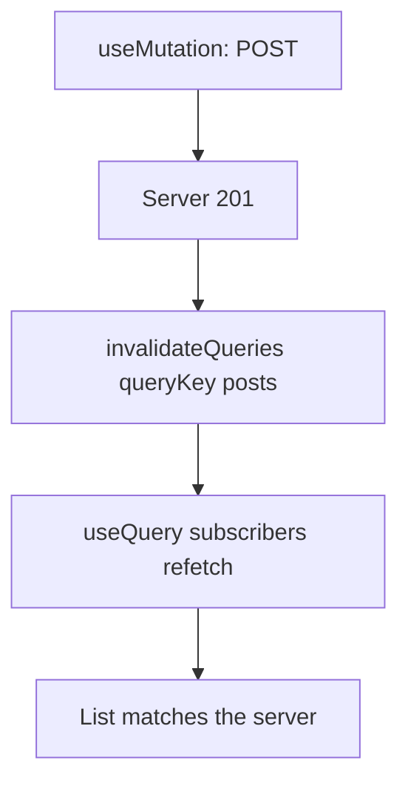
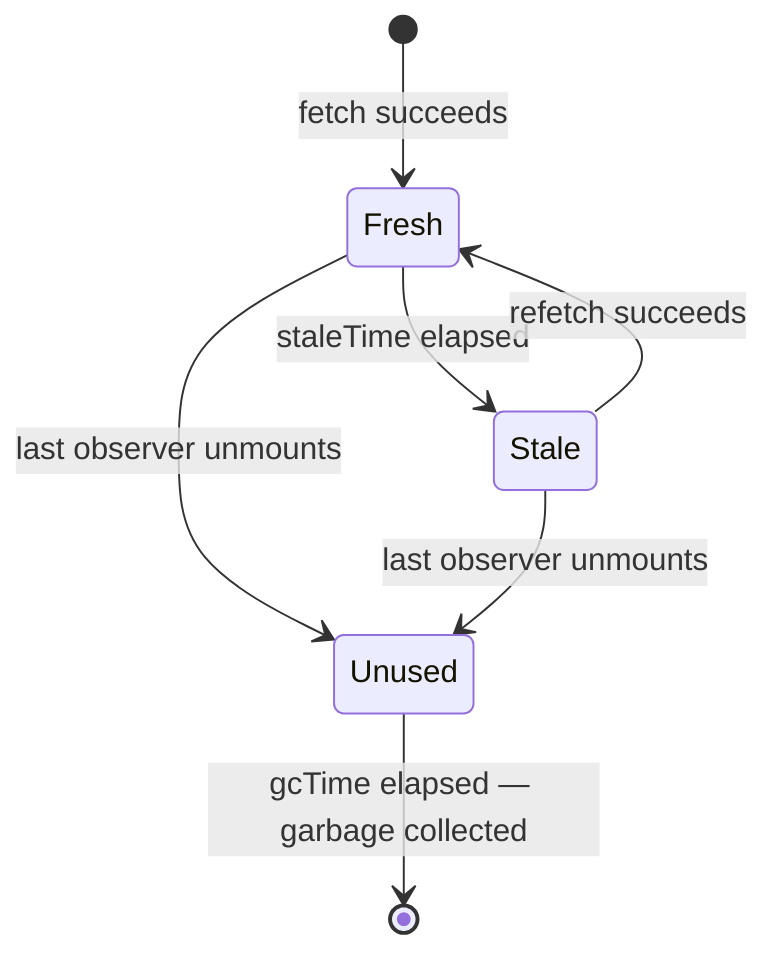

# Month 7 · Week 1 · Day 2
# staleTime, gcTime, Mutations, and Invalidation

**Program:** Full-Stack Mastery · 18 months  
**Phase:** 2 — Modern frontend  
**Month index:** [../../README.md](../../README.md)  
**Week 1:** [1](day-01.md) · Day 2 (today) · [3](day-03.md) · [4](day-04.md) · [5](day-05.md) · [6](day-06.md) · [7](day-07.md)  
**Week rhythm today:** Exercises + type-along  
**Student state:** Day 1 gate. You can wrap the tree in one `QueryClient`, write `useQuery({ queryKey, queryFn })`, and branch on `isPending` / `isError`. You have not written a mutation yet.  
**Study time:** 3–4 focused hours

Yesterday a list was a **read**. Today a create is a **write**, and the list must not lie after the write. If you POST and the table still shows yesterday’s rows, Query did not fail you — **you** forgot to tell the cache that the server changed.

Project 4 is **not** today’s paste target. Labs: `~\fullstack-lab\month-07\`. You may later copy *ideas* into `~/ops-dashboard/`.

---

## How to use this textbook

1. Read a section. Close it. Say the idea.
2. Type every lab. Do not paste a `useMutation` you cannot explain.
3. When Query or `tsc` errors, **read the error**.
4. Optional review links are for later rechecking — not first learning.

---

## How to read this chapter

Day 1 taught: a **query key** names a cache entry; `useQuery` **subscribes**. That cache is not immortal and it is not always fresh. Three clocks matter, and beginners mash them into one word: “cache.”

Then a **mutation** happens. Query does **not** guess that `POST /posts` should refresh `["posts"]`. You invalidate, or you write the cache yourself. Guessing is how dashboards show a created row that vanishes on refresh — or never appears at all.



If that is still abstract: the kitchen ticket rail is the cache. A new order does not magically reprint the board. Someone has to **invalidate** the old ticket or **write** the new one onto the rail.

JSONPlaceholder will teach you a second lesson: some public APIs **accept** POST and then **ignore** it on the next GET. Invalidation is still the right *idea*. The mock must persist if you want the list to grow.

---

## Today's contract

By the end of this day you will be able to:

1. Define **`staleTime`**, **`gcTime`**, and **`refetchOnWindowFocus`** in one sentence each, without swapping the names.
2. Write **`useMutation({ mutationFn })`** (v5 **object** syntax).
3. After success, call **`queryClient.invalidateQueries({ queryKey: ['posts'] })`**.
4. Explain **`setQueryData`** as a surgical cache write — useful, and easy to lie with.
5. Say when an **optimistic** update helps, and when it **lies**.
6. Distinguish **`isPending`** on a query (no success data yet) from **`isPending`** on a mutation (the POST is in flight).

**Today's gate.** Closed-book:

> Fresh data is `staleTime`. Unused data stays in memory for `gcTime`. A mutation does not update lists by magic. I invalidate the list key, or I `setQueryData` on purpose. Optimistic UI is a bet that the server will agree.

---

## Time box

| Block | Minutes | Work |
|---|---|---|
| A | 55 | Theory: clocks, mutation, invalidate, optimistic |
| B | 55 | Type-along: create + invalidate |
| C | 70 | Independent: mock that persists; one `setQueryData` experiment |
| D | 20 | Git |
| E | 15 | Recall |

---

# Block A — Theory

## 1. Three clocks, three jobs

| Option | Question it answers | Default in v5 (queries) |
|---|---|---|
| **`staleTime`** | After a successful fetch, how long is this entry **fresh**? Fresh data is not refetched just because a component remounted or the window focused. | `0` — immediately stale |
| **`gcTime`** | After the **last subscriber unmounts**, how long does unused data stay in **memory**? (Formerly `cacheTime`. The name changed because this is garbage-collection time, not “how long it is cached while in use.”) | `5 * 60 * 1000` (five minutes) |
| **`refetchOnWindowFocus`** | When the tab becomes visible again, if the data is **stale**, should Query refetch? | `true` |



**Stale ≠ gone.** Stale data is still on screen. Query may refetch **in the background**. The user still sees the last success until the new response arrives (unless you blank the UI — do not).

**Gone** is after `gcTime` with no observers. Opening the list again then looks like a **first load**: `isPending`, no `data`.

**Wrong belief:** “I’ll set `cacheTime` to stop refetches.”  
**Correct:** there is no `cacheTime` in v5. **`staleTime`** stops eager refetches. **`gcTime`** is how long unused memory is kept. Mixing them is the most common Day 2 confusion.

**Wrong belief:** “`refetchOnWindowFocus` is a bug; I will turn it off globally.”  
**Correct:** it is a feature for **server** state that can change in another tab or on another machine. Tune **`staleTime`** first (for example 30 seconds on a dashboard list). Disable focus refetch only when you can name why (a public demo API you are hammering, a mutation-only screen). Write the reason in a comment, not in anger.

A practical default for labs today:

```tsx
const queryClient = new QueryClient({
  defaultOptions: {
    queries: {
      staleTime: 30_000,
      gcTime: 5 * 60 * 1000,
      refetchOnWindowFocus: true,
      retry: 1,
    },
  },
});
```

You can override per query. A detail page you expect to change rarely can use a longer `staleTime`. A ticker that must be live can use `staleTime: 0`.

---

## 2. `isPending` vs `isFetching` (again, because mutations make it bite)

| Flag | Meaning |
|---|---|
| Query **`isPending`** | No **cached success data** yet. First paint loading. |
| Query **`isFetching`** | A request is in flight, including a **background** refetch. You can have `data` **and** `isFetching`. |
| Mutation **`isPending`** | The **write** is in flight. Disable the submit button. Do not blank the list. |

**Wrong belief:** “Any fetch should replace the table with a spinner.”  
**Correct:** that is a flash of emptiness. Show the old rows; optionally a quiet “Updating…” when `isFetching && !isPending`.

---

## 3. `useMutation` — a write, not a cache entry

A **query** is identified by a key and may run automatically. A **mutation** is a function you **call** (`mutate` or `mutateAsync`). It does not live in the cache under `["posts"]` unless **you** put data there.

v5: **one object**.

```tsx
const queryClient = useQueryClient();

const createPost = useMutation({
  mutationFn: (input: { title: string; body: string; userId: number }) =>
    postPost(input),
  onSuccess: () => {
    void queryClient.invalidateQueries({ queryKey: ["posts"] });
  },
});
```

Call it from a submit handler:

```tsx
createPost.mutate({ title, body, userId: 1 });
```

| Field | Meaning |
|---|---|
| `mutate` | Fire-and-forget from the UI. Errors also surface on the mutation object. |
| `mutateAsync` | Returns a Promise. Use when the caller must `await` (then navigate). |
| `isPending` | Disable the button; announce busy. |
| `isError` / `error` | Show a form-level message (Week 2 will map **field** errors). |
| `isSuccess` | Last call succeeded. Reset on the next `mutate`. |

**`mutationFn`** still uses `fetch`. Throw on `!response.ok`. Return parsed JSON. Same Month 3 rule.

```ts
export async function postPost(input: {
  title: string;
  body: string;
  userId: number;
}): Promise<{ id: number; title: string; body: string; userId: number }> {
  const response = await fetch("https://jsonplaceholder.typicode.com/posts", {
    method: "POST",
    headers: { "Content-Type": "application/json" },
    body: JSON.stringify(input),
  });
  if (!response.ok) {
    throw new Error(`HTTP ${response.status}`);
  }
  const json: unknown = await response.json();
  if (
    typeof json !== "object" ||
    json === null ||
    !("id" in json) ||
    typeof (json as { id: unknown }).id !== "number"
  ) {
    throw new Error("Expected a post with numeric id");
  }
  return json as {
    id: number;
    title: string;
    body: string;
    userId: number;
  };
}
```

Week 2 will replace the `as` with Zod. Today: throw if the shape is wrong; do not `any`.

**Wrong belief:** “`useMutation` replaces `useQuery`.”  
**Correct:** queries **read**. Mutations **write**. After a write, you **invalidate** (or `setQueryData`) so readers catch up.

---

## 4. `invalidateQueries` — mark matching keys stale, then refetch active ones

```ts
await queryClient.invalidateQueries({ queryKey: ["posts"] });
```

That prefix match is the point of structured keys. `["posts"]` invalidates `["posts"]`, `["posts", 1]`, `["posts", { userId: 1 }]`, `["posts", "detail", 12]` — every key that **starts with** `"posts"`.

If you only want the unfiltered collection:

```ts
queryClient.invalidateQueries({ queryKey: ["posts"], exact: true });
```

You will almost never want `exact: true` on a dashboard list that also has filtered variants. Prefer **prefix** invalidation after a create.

**Active** queries (currently observed) refetch. **Inactive** ones are marked stale and refetch when a subscriber returns — if they still exist in memory (`gcTime`).

**Wrong belief:** “I will `invalidateQueries()` with no key to refresh everything.”  
**Correct:** that is a blunt instrument. Invalidate the **resource** you changed.

---

## 5. `setQueryData` — write the cache yourself

```ts
queryClient.setQueryData<Post[]>(["posts", 1], (old) =>
  old ? [created, ...old] : [created],
);
```

Use this when:

- You already have the created object (the POST body returned it).
- A full list refetch is expensive or the API will **not** include the new row (JSONPlaceholder).
- You are doing an optimistic update (next section) and must roll back on error.

Dangers:

- You can put a shape in the cache that **GET** would never return.
- Filters: if the cache key is `["posts", { q: "north" }]` and the new title does not match `q`, prepending it **lies**.
- Pagination: inserting at the front of page 2 is usually wrong.

**Wrong belief:** “`setQueryData` is faster so I should skip invalidation forever.”  
**Correct:** invalidation is the honest default when the server is the source of truth. `setQueryData` is a **patch**. Pair them often: optimistic write, then invalidate to reconcile.

---

## 6. Optimistic updates — a bet, not a feature checklist

**Optimistic** means: update the UI **before** the server answers, assuming success.

The v5 pattern:

```tsx
const queryClient = useQueryClient();

const createPost = useMutation({
  mutationFn: postPost,
  onMutate: async (input) => {
    await queryClient.cancelQueries({ queryKey: ["posts"] });
    const previous = queryClient.getQueryData<Post[]>(["posts", 1]);
    const optimistic: Post = { id: -Date.now(), ...input };
    queryClient.setQueryData<Post[]>(["posts", 1], (old) =>
      old ? [optimistic, ...old] : [optimistic],
    );
    return { previous };
  },
  onError: (_err, _input, context) => {
    if (context?.previous) {
      queryClient.setQueryData(["posts", 1], context.previous);
    }
  },
  onSettled: () => {
    void queryClient.invalidateQueries({ queryKey: ["posts"] });
  },
});
```

`onMutate` can return a **context** object. `onError` receives it so you can restore `previous`.

### When it helps

- The mutation is **almost always** successful (toggle a flag, add a comment the user just typed).
- The UI cost of waiting is high (the row should appear **now**).
- You can **roll back** to a snapshot if the server says no.

### When it lies

- The server assigns fields you cannot guess (id, `createdAt`, permission, computed totals). A fake `id: -1` will break a detail link.
- The server **rejects** often (unique title, quota, auth). The user saw a row that then vanished — worse than a spinner.
- Two users edit the same record. Your optimistic title overwrote theirs in the cache until the next GET.
- JSONPlaceholder (and many mocks) **do not persist**. Optimistic prepend + invalidate + GET = the row **disappears**. That is the API, not Query being broken.

**Wrong belief:** “Project 4 requires optimistic updates everywhere.”  
**Correct:** the spec says use them **only when they improve the UX**. Default: wait for the response, then invalidate. Optimistic is extra machinery you must justify.

---

## 7. JSONPlaceholder honesty

`https://jsonplaceholder.typicode.com/posts` will **201** a POST and return an `id` (often `101`). A following `GET /posts` is the **original** 100 posts. Invalidation “worked”: you refetched the truth according to that host.

For Block B, observe that. For Block C, use an **in-memory mock** (a module-level array) so create **sticks**. That mock is a stand-in for a real API, not for Redux.

---

# Block B — Type-along

Continue `~\fullstack-lab\month-07\week-01-query` from Day 1, or scaffold if you lost it:

```powershell
cd ~\fullstack-lab\month-07
# if week-01-query already exists, cd into it; otherwise:
npm create vite@latest week-01-query -- --template react-ts
cd week-01-query
npm install
npm install @tanstack/react-query @tanstack/react-query-devtools
npm run dev
```

1. Confirm `QueryClientProvider` in `main.tsx`. One client. Devtools on. Set `staleTime: 30_000` on the client defaults. In `CLOCKS.txt` write one sentence each for `staleTime`, `gcTime`, `refetchOnWindowFocus`.
2. `getPosts.ts` / `postPost.ts`: GET list for `userId=1`; POST to JSONPlaceholder as in the theory. `ok` check. Throw on bad shape.
3. `PostList.tsx`: `useQuery({ queryKey: ["posts", 1], queryFn: () => getPosts(1) })`. Pending / error / empty / titles as JSX text.
4. `NewPostForm.tsx`: two text inputs (title, body) with **labels**. A `<button type="submit">`. `useMutation({ mutationFn: postPost, onSuccess: () => queryClient.invalidateQueries({ queryKey: ["posts"] }) })`. `useQueryClient()` from `@tanstack/react-query`. While `isPending`, disable the button.
5. Submit a post. Watch **Network**: POST, then GET. Watch Devtools: the `["posts", 1]` query goes fetching. Write in `CLOCKS.txt` whether the new title **stayed** on the list after the GET. (On JSONPlaceholder it usually **will not**.)
6. Temporarily **remove** `invalidateQueries`. Submit again. Write what the list does. Restore invalidation.

Cause a POST failure: point `mutationFn` at a garbage URL. Confirm the form shows an error and the list does not blank. Restore.

Blur the tab and come back. If `staleTime` has elapsed, you should see a refetch. Write one sentence: focus refetch is for **stale** data.

---

# Block C — Independent

`~\fullstack-lab\month-07\week-01-mutate-mock\` — a **new** Vite app is cleaner than fighting JSONPlaceholder’s amnesia.

```powershell
cd ~\fullstack-lab\month-07
npm create vite@latest week-01-mutate-mock -- --template react-ts
cd week-01-mutate-mock
npm install
npm install @tanstack/react-query @tanstack/react-query-devtools
```

Build a **notice board** (library hours, not Project 4 inventory):

1. Module `notices.ts`: an in-memory array of `{ id, title, body }`. `listNotices()` returns a copy after a 300ms delay. `createNotice({ title, body })` pushes a new id and returns the created row. This is a **fake server**, not React state.
2. `useQuery({ queryKey: ["notices"], queryFn: listNotices })`.
3. `useMutation({ mutationFn: createNotice, onSuccess: () => queryClient.invalidateQueries({ queryKey: ["notices"] }) })`.
4. After create, the list **must** show the new title (because the mock persists and invalidation refetches).
5. Stretch: a second button “Add silently” that **only** `setQueryData` prepends and does **not** invalidate. Then click a “Refetch” that `invalidateQueries`. Write `LIE.txt`: when `setQueryData` alone would drift from a real server.

No RHF. No Zod. No Redux. CSS you type is enough.

```powershell
cd ~\fullstack-lab
git add month-07/week-01-query month-07/week-01-mutate-mock
git commit -m "Week 1 Day 2: mutations, invalidation, staleTime vs gcTime."
```

---

# Block E — Recall

Close this file.

1. `staleTime` vs `gcTime` — which one is memory after unmount?  
2. Why v5 says `gcTime` not `cacheTime`.  
3. What `invalidateQueries({ queryKey: ["posts"] })` does to `["posts", 1]`.  
4. When `setQueryData` is honest.  
5. One case where optimistic UI lies.  
6. Query `isPending` vs mutation `isPending`.

---

## Definition of done

- [ ] I can say stale / garbage / focus-refetch without mixing them
- [ ] `useMutation({ mutationFn })` exists in a lab; object syntax only
- [ ] Success path calls `invalidateQueries({ queryKey: [...] })`
- [ ] I watched JSONPlaceholder *or* I used a persisting mock and can explain the difference
- [ ] Mutation error does not wipe the list
- [ ] `CLOCKS.txt` (and `LIE.txt` if you did the stretch) exist
- [ ] Commit exists

---

## Optional review links

Mutations and cache clocks are explained in this chapter.

- [TanStack Query: Important defaults](https://tanstack.com/query/latest/docs/framework/react/guides/important-defaults)
- [TanStack Query: Mutations](https://tanstack.com/query/latest/docs/framework/react/guides/mutations)
- [TanStack Query: Invalidation](https://tanstack.com/query/latest/docs/framework/react/guides/query-invalidation)
- [TanStack Query: Optimistic updates](https://tanstack.com/query/latest/docs/framework/react/guides/optimistic-updates)

---

## Tomorrow

From **memory**: a list plus a create, keys that include a **filter**. Days 1–2 stay closed during the drills. Repair from the recap file, not from a blog.
