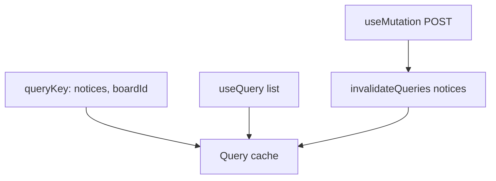

# Month 7 · Week 1 · Day 3
# From Memory: List + Create with Query Keys That Include a Filter

**Month index:** [../../README.md](../../README.md)  
**Week 1:** [1](day-01.md) · [2](day-02.md) · Day 3 (today) · [4](day-04.md) · [5](day-05.md) · [6](day-06.md) · [7](day-07.md)  
**Week rhythm today:** Implement from memory  
**Study time:** 3–4 focused hours  
**Student state:** You wrapped a `QueryClient`, subscribed with `useQuery`, and invalidated after `useMutation`. Today those ideas must live in your fingers.  
**Days 1–2 of this week:** closed during the drills. Repair from **this recap**, not from a Query article.

---

## How to read this chapter

Days 1 and 2 had type-along files. During the drills they stay **closed**. This file contains the lecture so you are not sent elsewhere to re-learn.

Server state is data that lives on a server and can be stale. Query is a **cache** keyed by **query keys**. A mutation does not update that cache unless you **invalidate** or **`setQueryData`**.



Allowed: this recap, your notes in `fullstack-lab`, the compiler or browser error in front of you.  
Not allowed: pasting a finished `App.tsx`, copying Day 1–2 lab files, treating tanstack.com as the teacher.

If you are stuck **more than 25 minutes**, open **only** the matching Day 1 or Day 2 section **in this textbook**, read it, close it, continue from memory. Record the peek in `lookups.txt`.

There is **no complete page solution** in this file. The board is specified. You write it.

---

## Complete explanation (Query you must be able to write)

This section **is** the lesson. Read a paragraph. Close it. Say it in one honest sentence. Then type the spec.

### Server state vs client state

**Server state** lives on a backend (or a module pretending to be one). Another tab, another user, or time itself can change it without this component knowing. **Client state** lives only in this UI session: modal open, which board id the operator picked in a local select before it belongs in the URL (URL is Week 3).

**Wrong belief:** “I’ll put the fetch result in Context so every widget can read it.”  
**Correct:** that is a handmade cache. Query already dedupes, retries, and invalidates.

### QueryClient — one, not per render

```tsx
const queryClient = new QueryClient({
  defaultOptions: {
    queries: { staleTime: 30_000, retry: 1 },
  },
});

createRoot(document.getElementById("root")!).render(
  <QueryClientProvider client={queryClient}>
    <App />
  </QueryClientProvider>,
);
```

Create it in `main.tsx` or `useState(() => new QueryClient())` once. A new client every `App` render **wipes the cache**.

**`staleTime`:** how long success data is **fresh** (no refetch on remount/focus). Default `0`.  
**`gcTime`:** how long **unused** data stays in memory after the last subscriber unmounts. Default five minutes. Not `cacheTime`.  
**`refetchOnWindowFocus`:** if data is stale, coming back to the tab may refetch. Tune `staleTime` before you disable this.

### queryKey includes every variable `queryFn` uses

```ts
["notices", boardId]
["notices", { boardId, q }]
```

Same key → same cache entry → shared request. If `queryFn` reads `boardId` and the key is only `["notices"]`, you will show the wrong board or never refetch.

**Wrong belief:** “The key is a label for Devtools.”  
**Correct:** the key **is** the identity of the data.

### useQuery — v5 object syntax

```tsx
const { data, error, isPending, isError, isFetching } = useQuery({
  queryKey: ["notices", boardId],
  queryFn: () => listNotices(boardId),
  enabled: boardId > 0,
});
```

| Flag | Meaning |
|---|---|
| `isPending` | No cached success data yet. First-load UI. |
| `isFetching` | A request is in flight, including background refetch. |
| `isError` | Last fetch failed. `error` is set. |

`enabled: false` — do not run. Empty filter that would hit the whole database: do not fire.

`queryFn` still `fetch`es (or calls your mock). Throw on `!response.ok`. Return parsed data. Empty array is **success**, not error.

### useMutation and invalidation

```tsx
const queryClient = useQueryClient();

const createNotice = useMutation({
  mutationFn: createNoticeRequest,
  onSuccess: () => {
    void queryClient.invalidateQueries({ queryKey: ["notices"] });
  },
});
```

`invalidateQueries({ queryKey: ["notices"] })` marks every key that **starts with** `"notices"` stale and refetches **active** ones. That is why the filter belongs **in the key**: the list for board 2 is a different entry from board 1, and prefix invalidation refreshes both after a create if you want that — or you invalidate `["notices", boardId]` if you only need the current board.

**Wrong belief:** “The mutation updates the list automatically.”  
**Correct:** you invalidate (or `setQueryData`).

JSONPlaceholder POST often **does not persist**. A persisting **in-memory mock** is honest for today’s spec.

`setQueryData` writes the cache by hand. Useful when you already have the created row. Easy to lie when filters or pages would not include that row.

Optimistic updates (UI before the server answers) help when success is almost certain and you can roll back. They lie when the server assigns ids you guessed, or when GET will not match what you prepended. **Not required** today.

---

## Today's contract

Rebuild Day 1–2 skills as if this were a lab exam.

**Today's gate**

> I listed and created notices with Query. The query key includes the board filter. Create invalidates `["notices"]`. I can explain `isPending` vs `isFetching` and `staleTime` vs `gcTime` without opening Days 1–2.

If the page only exists because you reopened Day 2 and copied, you are not done. Delete the components, wait five minutes, type them from this spec.

---

## Time box

| Block | Minutes | Work |
|---|---|---|
| A | 20 | Closed-book oral review (no typing yet) |
| B | 40 | Memory drills: provider + one query |
| C | 90 | Spec: filtered list + create |
| D | 25 | KEYS.md + defect hunt |
| E | 15 | Git + lookups |

---

# Block A — Speak first

Out loud, no notes, no editor:

1. Server state vs client state.  
2. Why one `QueryClient`, not inside `App`’s render body as `new QueryClient()`.  
3. What a query key identifies.  
4. Why the key must include the filter the `queryFn` uses.  
5. `isPending` vs `isFetching`.  
6. `staleTime` vs `gcTime`.  
7. What `invalidateQueries({ queryKey: ["notices"] })` does.  
8. Why `queryFn` throws on `!ok`.  
9. When optimistic UI lies.

If any answer is mush, re-read that subsection above. Do not start the board yet.

---

# Block B — Memory drills

Create `~\fullstack-lab\month-07\week-01-from-memory\` as a **new** Vite app:

```powershell
cd ~\fullstack-lab\month-07
npm create vite@latest week-01-from-memory -- --template react-ts
cd week-01-from-memory
npm install
npm install @tanstack/react-query @tanstack/react-query-devtools
npm run dev
```

Keep that terminal on the dev server. Open the **`http://`** URL.

### Drill 1 — Provider

Wrap the tree in `QueryClientProvider` from memory. One client. Devtools optional but recommended. In `BOOT.txt`: where the client is created and why not inside `App` without `useState` lazy init.

### Drill 2 — One list query

Hard-code `boardId = 1`. `useQuery({ queryKey: ["notices", 1], queryFn: ... })` against an in-memory `listNotices(boardId)`. Pending / error / empty / list. Titles as JSX text. Wrongly omit `boardId` from the key, switch boards in a temporary select, write what you see, then **put `boardId` back in the key**.

---

# Spec: campus notice boards

Build a **campus notice** tool (lost-and-found / events — **not** Project 4 ops inventory). This textbook will not give you the markup.

### Required

1. **Fake server** in `src/api/notices.ts`: module-level data for **two** boards (`1` and `2`). `listNotices(boardId: number)` filters and delays ~300ms. `createNotice({ boardId, title })` appends and returns the row. Throw if `title.trim()` is empty (simulate 400).
2. **`QueryClientProvider`** in `main.tsx`. `staleTime` you can justify in `KEYS.md` (even `0` is a justification).
3. A **select** (or two buttons) for `boardId`. That value is **client** state today (`useState`). Week 3 will put page/search in the **URL**.
4. **`useQuery({ queryKey: ["notices", boardId], queryFn: () => listNotices(boardId), enabled: boardId > 0 })`**.
5. **`useMutation({ mutationFn: createNotice, onSuccess: () => queryClient.invalidateQueries({ queryKey: ["notices"] }) })`**. Form: labeled title field, `type="submit"`, disable while mutation `isPending`.
6. UI states: first-load **`isPending`**, error, empty board, list of titles. Background refetch must **not** blank the list (`isFetching` ≠ destroy `data`).
7. Changing `boardId` must change the **key** and the rows.
8. **`KEYS.md`**: why `["notices"]` alone is wrong; what prefix invalidation does to board 1 and board 2 after a create on board 1.

### Constraints

- v5 **object** syntax only. No `useQuery(key, fn)`.
- No Redux. No RHF. No Zod required (trim check in the fake API is enough).
- No `any` on JSON. The mock can return typed objects; if you `fetch`, type `unknown` first.
- Do not paste Project 4.

Suggested files:

```
src/
  main.tsx
  App.tsx
  api/notices.ts
  components/NoticeList.tsx
  components/NewNoticeForm.tsx
```

You may keep one file until green, then **split** before commit.

---

# Block D — Defect hunt

Fill `AUDIT.txt`:

1. Network or fake delay: one list request per board key, not two homemade `useEffect` caches.  
2. Create on board 1, switch to board 2, back to board 1 — is the new title still there?  
3. Did you blank the list on refetch?  
4. Devtools: exact keys you see.  
5. One thing you would fail a classmate for.

Deliberate defect: remove `boardId` from the key **or** remove `invalidateQueries`. Write what happens. Restore.

`lookups.txt`: every 25-minute peek, or `none` plus the two ideas you are least sure about.

---

# Block E — Git

```powershell
cd ~\fullstack-lab
git add month-07/week-01-from-memory
git commit -m "Week 1 Day 3: filtered notice list and create from memory."
```

Never commit `node_modules`.

---

# Recall

Close Days 1–2 and this file after one last glance at the gate.

1. Why the filter belongs in the key.  
2. Prefix invalidation vs `exact: true`.  
3. Mutation `isPending` vs query `isPending`.  
4. Why a persisting mock beats JSONPlaceholder for this spec.

---

## Definition of done

- [ ] Oral Block A completed before the spec
- [ ] Keys include `boardId`; create invalidates `["notices"]`
- [ ] First load uses `isPending`; refetch does not wipe rows
- [ ] KEYS.md and AUDIT.txt exist
- [ ] No Redux, no Project 4 paste
- [ ] Commit exists
- [ ] I did not paste a solution

If any box is false, stay on Day 3.

---

## Optional review links

The recap in this chapter is the lesson. These pages are for later checking, not for first learning.

- [TanStack Query: Query keys](https://tanstack.com/query/latest/docs/framework/react/guides/query-keys)
- [TanStack Query: Mutations](https://tanstack.com/query/latest/docs/framework/react/guides/mutations)

---

## Tomorrow

**Pagination:** `page` in the query key; `placeholderData: keepPreviousData` so page 2 does not flash empty. Search in the key plus `enabled`.
