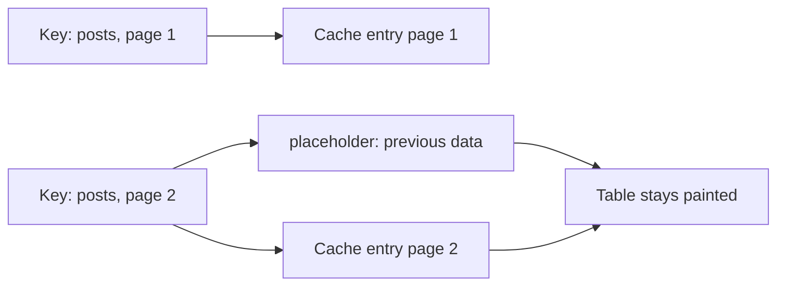
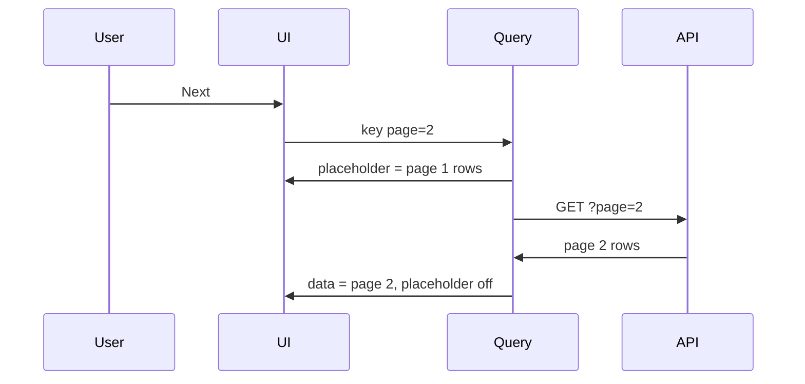

# Month 7 · Week 1 · Day 4
# Pagination in the Key, keepPreviousData, Search + enabled

**Program:** Full-Stack Mastery · 18 months  
**Phase:** 2 — Modern frontend  
**Month index:** [../../README.md](../../README.md)  
**Week 1:** [1](day-01.md) · [2](day-02.md) · [3](day-03.md) · Day 4 (today) · [5](day-05.md) · [6](day-06.md) · [7](day-07.md)  
**Week rhythm today:** Learn + lab feature  
**Student state:** Day 3 gate. You can list and create with Query, and you put the filter in the key. The list is still “all rows for this board.” Dashboards are **pages**.  
**Study time:** 3–4 focused hours

Today: **`page` belongs in `queryKey`**, **`placeholderData: keepPreviousData`** so changing page does not look like a first load, and **search** that is part of the key and **does not fire** while the box is blank (`enabled`).

Project 4 is **not** today’s paste target. Labs: `~\fullstack-lab\month-07\`. Pagination ideas later go into `~/ops-dashboard/` as **your** code.

---

## How to use this textbook

1. Read a section. Close it. Say the idea.
2. Type the lab. Do not paste a paginator you cannot explain.
3. When the list flashes empty on “Next,” that is today’s bug, not a broken install.
4. Optional review links are for later rechecking.

---

## How to read this chapter

A query key is the identity of **one** server result. Page 1 of `/posts` is not page 2. `["posts"]` for both pages is the Day 1 bug with extra pain: you will show page 1’s rows with a page-2 spinner, or you will overwrite the cache and jump backwards.

When the key **changes** (`page: 1` → `page: 2`), Query treats that as a **different** query. With no cached success for page 2, **`isPending` is true** — the table goes empty, then fills. That feels like a bug. It is the model working.

**`placeholderData: keepPreviousData`** (from `@tanstack/react-query`) says: while the new key has no data, **keep showing the last successful data**. You are not claiming page 2 is page 1. You are avoiding a blank flash. **`isPlaceholderData`** tells you the rows still belong to the previous key.



Search is the same rule: `q` in the key, and **`enabled: q.trim().length > 0`** (or whatever your product means by “do not search yet”). Month 3 `isBlank` still applies.

URL as the source of truth for `q` and `page` is **Week 3**. Today `useState` is allowed so you can see Query clearly.

---

## Today's contract

By the end of this day you will be able to:

1. Put **`page`** (and page size if the server uses it) in **`queryKey`**.
2. Import **`keepPreviousData`** from `@tanstack/react-query` and pass **`placeholderData: keepPreviousData`**.
3. Use **`isPlaceholderData`** / **`isFetching`** so “Next” can disable or show a quiet pending state without wiping rows.
4. Put **search text in the key** and gate the query with **`enabled`**.
5. Explain why infinite scroll and “load more” are still **keys + pages**, not a `useState` array you `concat` forever without a plan.
6. Keep throwing on `!response.ok`; empty page is success.

**Today's gate.** Closed-book:

> Page is part of the key. A new page is a new cache entry. `placeholderData: keepPreviousData` avoids a blank flash. Search belongs in the key. `enabled` stops a fetch I do not want.

---

## Time box

| Block | Minutes | Work |
|---|---|---|
| A | 50 | Theory |
| B | 55 | Type-along: JSONPlaceholder `_page` |
| C | 70 | Independent: catalog with search + pages |
| D | 20 | Git |
| E | 15 | Recall |

---

# Block A — Theory

## 1. Page in the key — non-negotiable

```tsx
const { data, isPending, isFetching, isPlaceholderData } = useQuery({
  queryKey: ["posts", { page, perPage }],
  queryFn: () => getPostsPage({ page, perPage }),
  placeholderData: keepPreviousData,
});
```

`queryFn` **closes over** `page`. If `page` is not in the key, Query will reuse page 1’s cache when you click Next, or it will refetch with a confusing mix. Include **every** input: `page`, `perPage`, `q`, `sort`.

JSONPlaceholder supports `_page` and `_limit`:

```ts
export async function getPostsPage(opts: {
  page: number;
  perPage: number;
}): Promise<Post[]> {
  const url = new URL("https://jsonplaceholder.typicode.com/posts");
  url.searchParams.set("_page", String(opts.page));
  url.searchParams.set("_limit", String(opts.perPage));
  const response = await fetch(url);
  if (!response.ok) throw new Error(`HTTP ${response.status}`);
  const json: unknown = await response.json();
  if (!Array.isArray(json)) throw new Error("Expected array");
  return json as Post[];
}
```

Total count: some APIs send `X-Total-Count`. JSONPlaceholder does. You can read `response.headers.get("x-total-count")` and return `{ items, total }`. Then `queryFn` returns an object; the key still includes `page`.

**Wrong belief:** “I’ll fetch all posts once and `slice` in React.”  
**Correct:** that is a client-side page of a dump. Fine for 20 demo rows. A dashboard list is **server** pagination: the server already sliced. Query caches **each slice**.

**Wrong belief:** “I’ll store `page` in Redux so Query can read it.”  
**Correct:** `page` is UI (today) or **URL** (Week 3). Query reads it as a key input. Redux is not in this picture.

---

## 2. `keepPreviousData` is a placeholder, not a merge

v5 removed the `keepPreviousData: true` boolean on `useQuery`. The replacement is explicit:

```ts
import { keepPreviousData, useQuery } from "@tanstack/react-query";
```

```tsx
placeholderData: keepPreviousData,
```

`keepPreviousData` is a **function** the library exports. You pass it to **`placeholderData`**. You do not invent `cacheTime`. You do not set `keepPreviousData: true`.

While the placeholder is showing:

- **`data`** is the **previous** page’s rows.
- **`isPending`** is typically **false** (you have data to show — it is placeholder data).
- **`isFetching`** is **true** (page 2 is loading).
- **`isPlaceholderData`** is **true**.

Use that to disable “Next” or set `aria-busy` on the table. Do not replace the table with the first-load spinner.

When page 2 arrives, it becomes a normal cache entry. Clicking Back to page 1 is instant if `gcTime` has not collected it.

**Wrong belief:** “`keepPreviousData` concatenates page 1 and page 2.”  
**Correct:** it shows the **old** result until the **new** key succeeds. It does not merge arrays. “Load more” that appends is a **different** UI: you still fetch page 2 as its own key, then **you** concatenate in the component if that is the product (and you must not confuse that with the cache’s truth for page 2). This course prefers **replace the table** for admin lists.



---

## 3. Search in the key + `enabled`

```tsx
const q = searchInput.trim();

const { data, isPending } = useQuery({
  queryKey: ["posts", "search", q],
  queryFn: () => searchPosts(q),
  enabled: q.length > 0,
});
```

| Situation | What you want |
|---|---|
| Box empty | **No** request. `enabled: false`. Show an idle hint, not an error. |
| User typed `a` then `ab` | Two keys. Optional: debounce client-side so you do not fetch every keystroke (a `useState` + timeout is enough; do not debounce inside `queryFn`). |
| Zero hits | **Success** with `[]`. Empty UI. |
| Network fail | `isError`. |

**Wrong belief:** “I’ll search with `enabled: true` and let the server reject blank.”  
**Correct:** do not send the request. `enabled` is the gate.

Combine search **and** page:

```tsx
queryKey: ["posts", { q, page, perPage }],
enabled: q.length > 0, // if the product is "search only"
```

If the product is “list all, optionally filter,” then `enabled: true` and `q` can be `""` as a real key (`{ q: "", page: 1 }`). **Empty search and page 1** is a different cache entry from **empty search and page 2**. Include both.

When `q` changes, **reset page to 1** in the same event handler. Otherwise you search for `"zebra"` while still asking for page 4 of that string.

---

## 4. Pagination UI (accessible, Month 2 still applies)

- “Previous” / “Next” are **`<button type="button">`**, disabled on page 1 / last page.
- Announce the current page: visible text, not color alone. `aria-current` if you render page numbers.
- Do not use `<a href="#">`. This is not navigation until Week 3 puts page in the URL.
- One `h1`. The table or list has a caption or heading.

Last page: you need **total** or a “short page means last.” JSONPlaceholder’s `X-Total-Count` is the grown-up signal. A mock can return `{ items, total }`.

---

## 5. Invalidation vs pages

After `useMutation` create:

```ts
queryClient.invalidateQueries({ queryKey: ["posts"] });
```

That stale-marks **every** page and search. Active page refetches. Good: the new row may appear on page 1. Page 7 in the cache is stale; when the user goes there, they get a refetch. That is what you want.

`setQueryData` on `["posts", { page: 1 }]` only patches page 1. Page 2 still old. Prefer **invalidate the prefix** after a create.

Optimistic insert on a **paginated** list is where optimistic UI **lies** most often (which page does the row belong on? does it match `q`?). Skip optimistic today.

---

## 6. TypeScript

```ts
type PostsPage = { items: Post[]; total: number };

const { data } = useQuery({
  queryKey: ["posts", { page, perPage }],
  queryFn: () => getPostsPage({ page, perPage }),
  placeholderData: keepPreviousData,
});
// data: PostsPage | undefined
```

While placeholder, `data` is still typed as success data. Do not `data!`. Branch on `isPending` for the **true** first load (no placeholder, no cache).

---

# Block B — Type-along

```powershell
cd ~\fullstack-lab\month-07
npm create vite@latest week-01-pages -- --template react-ts
cd week-01-pages
npm install
npm install @tanstack/react-query @tanstack/react-query-devtools
npm run dev
```

1. Provider + Devtools. `staleTime` 30s is fine.
2. `getPostsPage` as above, `_page` + `_limit=10`. Parse array; optional `X-Total-Count`.
3. `PostPages.tsx`: `page` in `useState` starting at 1. `useQuery` with `queryKey: ["posts", { page, perPage: 10 }]`, `placeholderData: keepPreviousData`.
4. First visit: `isPending` spinner. Click Next: table **must not** go empty. Write `FLASH.txt`: what `isPlaceholderData` and `isFetching` were on that click.
5. **Remove** `placeholderData` temporarily. Click Next. Write what you see. Restore `keepPreviousData`.
6. Buttons: Previous disabled on page 1; Next disabled when you know you are on the last page (total or short page).

Cause `page=9999` (or a bad URL). Error UI. Restore.

---

## 7. Cursor and “load more” (so you do not fake them)

Some APIs return `{ items, nextCursor }` instead of page numbers. The key still includes the **cursor** (or page token):

```ts
queryKey: ["books", { q, cursor }],
```

“Load more” UIs often **append** in the component while **each page remains its own cache entry**. TanStack Query also has `useInfiniteQuery`. **Not required** this week. If you use it later, it is still a key-based cache, not a Redux array you `concat`.

**Wrong belief:** “Infinite query means I do not need keys.”  
**Correct:** the infinite query **is** a keyed cache with pages inside.

For admin dashboards, **numbered pages** are clearer: operators say “page 3,” share `?page=3`, and tests can `initialEntries` that URL (Week 3). Prefer that for Project 4 unless you can teach infinite keys.

---

## 8. `placeholderData` vs `initialData` vs `initialDataUpdatedAt`

| Option | Meaning |
|---|---|
| `placeholderData: keepPreviousData` | Show **previous query’s** data while this **new key** loads. Not stored as this key’s success. |
| `placeholderData: someObject` | Show a **hard-coded** placeholder. Easy to lie (fake rows). |
| `initialData` | Treat this as **already fetched** for this key — affects stale/gc. Dangerous if you pass `[]` and then never look pending. |

**Wrong belief:** “I’ll `initialData: []` so `isPending` is false.”  
**Correct:** then empty and loading look the same unless you also watch `isFetching`. Prefer pending UI for first load; `keepPreviousData` for **page changes**.

`isPlaceholderData` is how you disable Next or set `aria-busy` without wiping rows.

---

# Block C — Independent

Same app **or** `week-01-catalog-pages`. Domain: **used-book stalls** (title, stall number) — not Project 4.

**In-memory API** is fine if you do not want JSONPlaceholder search:

- `listBooks({ q, page, perPage })` filters by title substring (case-insensitive), then slices. Returns `{ items, total }`. Delay 400ms so placeholder is visible.
- Search input labeled. `q` trimmed for the key. If you require a non-empty search, `enabled: q.length > 0`; otherwise empty `q` lists all.
- Changing `q` resets `page` to 1.
- Keys: `["books", { q, page, perPage }]`.
- `placeholderData: keepPreviousData`.
- Empty: “No titles on this page.” Error: message + retry via `refetch` from `useQuery`.

`KEYS.txt`: paste the keys you see in Devtools for page 1 and page 2 with the same `q`.

No Redux. No RHF. CSS you type.

```powershell
cd ~\fullstack-lab
git add month-07/week-01-pages
git commit -m "Week 1 Day 4: paginated query keys and keepPreviousData."
```

---

# Block E — Recall

1. Why `page` must be in the key.  
2. v5: `placeholderData: keepPreviousData`, not `keepPreviousData: true`.  
3. `isPending` vs `isPlaceholderData`.  
4. Why `enabled` on empty search.  
5. Why create should invalidate `["posts"]` not only page 1.  
6. Why optimistic insert on page 3 is usually a lie.

---

## Definition of done

- [ ] `page` (and `q` if searching) live in `queryKey`
- [ ] `keepPreviousData` imported from `@tanstack/react-query` and passed as `placeholderData`
- [ ] Next page does not flash a first-load empty table
- [ ] `enabled` used honestly for “do not fetch yet”
- [ ] `FLASH.txt` / `KEYS.txt` exist
- [ ] Commit exists

---

## Optional review links

Pagination and placeholders are explained in this chapter.

- [TanStack Query: Paginated queries](https://tanstack.com/query/latest/docs/framework/react/guides/paginated-queries)
- [TanStack Query: `keepPreviousData`](https://tanstack.com/query/latest/docs/framework/react/guides/paginated-queries#better-paginated-queries-with-placeholderdata)
- [TanStack Query: Dependent queries (`enabled`)](https://tanstack.com/query/latest/docs/framework/react/guides/dependent-queries)

---

## Tomorrow

**Tests:** a `QueryClient` **per test**, `retry: false`, wrap `render`. Assert **loading then success** with a mocked `fetch` (or a mock `queryFn`).
