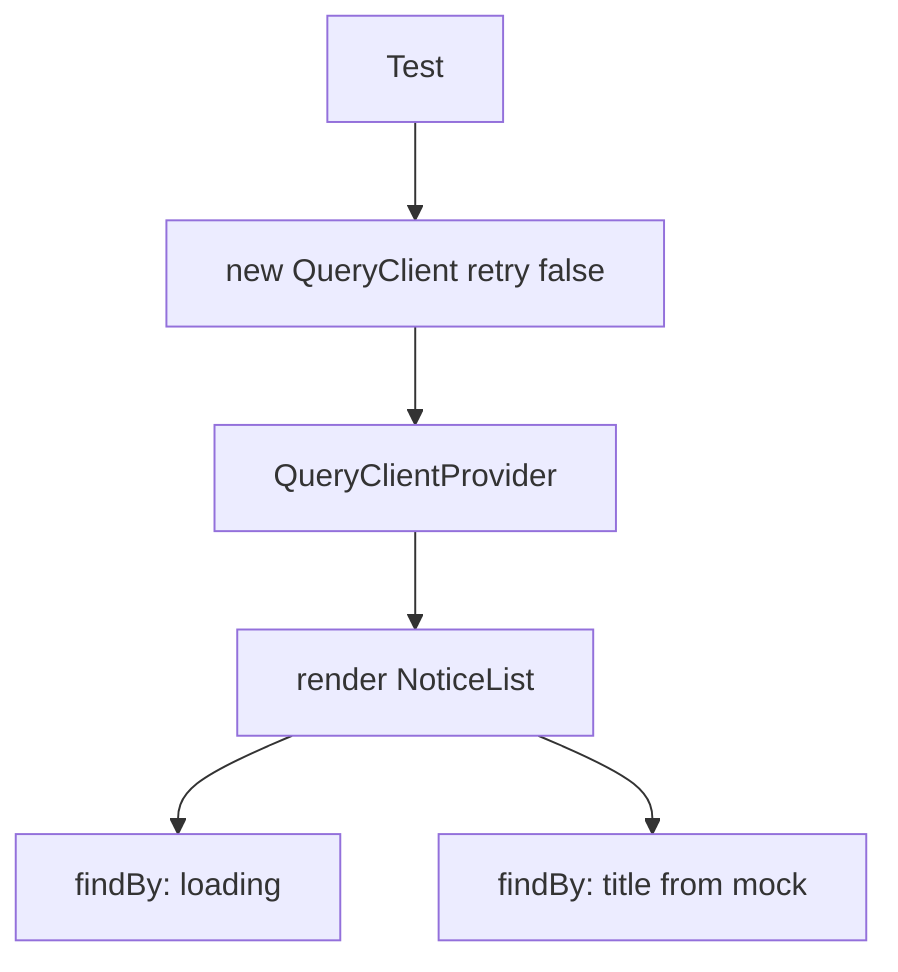

# Month 7 · Week 1 · Day 5
# Tests: QueryClient Per Test, Loading Then Success

**Month index:** [../../README.md](../../README.md)  
**Week 1:** [1](day-01.md) · [2](day-02.md) · [3](day-03.md) · [4](day-04.md) · Day 5 (today) · [6](day-06.md) · [7](day-07.md)  
**Week rhythm today:** Tests + refactor + documentation  
**Study time:** 3–4 focused hours  
**Student state:** You can `useQuery` a list, mutate and invalidate, paginate with `placeholderData: keepPreviousData`. Today you **claim** loading then success — not “I watched Chrome.”

MSW as a full handler layer is **Week 4**. Today you may **mock `fetch`** or inject a `queryFn`. The **wrapper** is the lesson: every test gets its **own** `QueryClient` with **`retry: false`**.

Do **not** paste Project 4. Do **not** install Redux to make tests “more real.”

---

## How to read this chapter

Month 6 taught: Testing Library queries **roles and names**. That still holds. Query adds a cache and retries. If you reuse one `QueryClient` across tests, test B sees test A’s posts. If you leave **retry** at 3, a failing test waits through three delays and your suite feels haunted.



Read Block A until you can say why the app’s `queryClient` from `main.tsx` must **not** be imported into tests. Then type the wrapper, type two tests, watch them pass, **break** the mock, watch red, restore.

---

## Complete explanation (this book is the lesson)

### A test is a claim about the user, not about hooks

Good claims today:

- While the request is in flight, the user sees a **loading** name (status, text, or `aria-busy` you chose).
- When the mock returns two notices, the user sees those **titles**.
- When the mock rejects, the user sees an **error** (and not a blank main).

Bad claims:

- `isPending` was `true` (implementation). You can infer it from UI.
- The query key equals `["notices"]` (Devtools, not RTL).
- `fetch` was called with a certain URL **as the only assertion** (pair it with UI if you spy).

**Wrong belief:** “I’ll export the component’s `data` for the test.”  
**Correct:** render, wait, assert roles and text.

### QueryClient per test

```tsx
import { QueryClient, QueryClientProvider } from "@tanstack/react-query";
import { render, screen } from "@testing-library/react";
import type { ReactNode } from "react";

function createTestClient() {
  return new QueryClient({
    defaultOptions: {
      queries: { retry: false },
      mutations: { retry: false },
    },
  });
}

function renderWithQuery(ui: ReactNode) {
  const client = createTestClient();
  return render(
    <QueryClientProvider client={client}>{ui}</QueryClientProvider>,
  );
}
```

| Rule | Why |
|---|---|
| **New client every test** | No leftover cache, no leftover mutations. |
| **`retry: false`** | Failures fail **now**. Default retries make error tests slow and flaky. |
| **Do not use the production client** | Tests would share memory and production `staleTime`. |
| **Wrap only what the component needs** | If the list does not need Router, do not wrap Router. |

`gcTime: Infinity` (or `gcTime: 0` depending on what you are proving) sometimes appears in docs to avoid “garbage collection during test” warnings. For this course, **`retry: false` + fresh client** is the required habit. If you see a warning about unmounting queries, set `gcTime: 0` on the test client so unused cache does not linger past the test.

### Assert loading, then success

`getBy*` throws **immediately** if the node is missing. The first paint of `useQuery` is often **pending**. Use **`findBy*`** (async, waits) or `waitFor`.

```tsx
test("shows titles after the list loads", async () => {
  const fetchMock = vi.fn().mockResolvedValue({
    ok: true,
    json: async () => [{ id: 1, title: "Closed Sunday" }],
  });
  vi.stubGlobal("fetch", fetchMock);

  renderWithQuery(<NoticeList boardId={1} />);

  expect(await screen.findByText(/loading/i)).toBeInTheDocument();
  expect(await screen.findByText("Closed Sunday")).toBeInTheDocument();
});
```

Order matters. If your loading UI **unmounts** before you assert it, the test is racing. Prefer:

1. Delay the mock so loading is visible:

```ts
vi.stubGlobal(
  "fetch",
  vi.fn().mockImplementation(
    () =>
      new Promise((resolve) => {
        setTimeout(() => {
          resolve({
            ok: true,
            json: async () => [{ id: 1, title: "Closed Sunday" }],
          });
        }, 50);
      }),
  ),
);
```

2. `findByText(/loading/i)` then `findByText("Closed Sunday")`.
3. After success, loading text should **not** remain: `expect(screen.queryByText(/loading/i)).not.toBeInTheDocument()`.

**Wrong belief:** “`waitFor` the title is enough; skip loading.”  
**Correct:** Project 4’s testing section wants a **loading → success** flow. Prove both.

### Mock `fetch` vs mock `queryFn`

| Approach | Use when |
|---|---|
| `vi.stubGlobal("fetch", ...)` | The component’s `queryFn` actually calls `fetch`. Restore with `vi.unstubAllGlobals()` in `afterEach`. |
| Pass a fake `queryFn` | You designed the list to receive `queryFn` as a prop (rare; do not warp production API for tests). |
| MSW | Week 4. Same HTTP the app uses. Better for “the whole page.” |

If `queryFn` lives in `api/notices.ts`, mocking `fetch` is honest. Mocking the module with `vi.mock` is allowed if you still assert **UI**.

Always: `if (!response.ok) throw` in production `queryFn`. A mock with `ok: false` should drive **error** UI.

### What Month 6 still requires

- Vitest + jsdom + Testing Library. `getByRole` / `findByRole` preferred.
- `npm test` → `vitest run`.
- Query by accessible name. Loading may be `role="status"` — **give it a name** (`Loading notices`) so you can `findByRole("status", { name: /loading notices/i })`.

```tsx
{isPending ? <p role="status">Loading notices</p> : null}
```

A spinner `div` with no text is a test smell **and** an a11y smell.

### Mutations in tests (stretch)

Wrap the same way. Click submit with `userEvent`. Mock `fetch` for POST then GET, or mock both functions. Assert the **new title** appears after invalidation. If that is too much today, one list test plus one error test is the floor.

### Error test (typed)

```tsx
test("shows an error when the list fails", async () => {
  vi.stubGlobal(
    "fetch",
    vi.fn().mockResolvedValue({
      ok: false,
      status: 500,
      json: async () => ({ message: "desk offline" }),
    }),
  );
  renderWithQuery(<NoticeList boardId={1} />);
  expect(await screen.findByRole("alert")).toBeInTheDocument();
});
```

`retry: false` is why this does not wait through three default retries. `afterEach(() => { vi.unstubAllGlobals(); })` is why the next test does not inherit a broken `fetch`.

**Wrong belief:** “I’ll import `queryClient` from `main.tsx` so tests match production `staleTime`.”  
**Correct:** tests must not share cache or clocks. Production `staleTime` makes a second test see the first test’s posts.

**Wrong belief:** “I’ll assert `result.current.isPending` with `renderHook`.”  
**Correct:** the user sees **Loading notices**, then a title. That is the claim.

**Wrong belief:** “`gcTime` is `cacheTime` in v5 if I squint.”  
**Correct:** v5 renamed it to **`gcTime`**. Tests may set `gcTime: 0` on the test client so unused cache does not linger. They must not set `cacheTime`.

Windows: install in the **lab folder**, not in `month-07` itself.

```powershell
cd ~\fullstack-lab\month-07\week-01-from-memory
npm install -D vitest jsdom @testing-library/react @testing-library/jest-dom @testing-library/user-event
```

`vitest.config.ts` needs `environment: "jsdom"` and the React plugin, same Month 6 pattern. Script `"test": "vitest run"`.

`queryFn` still throws on `!ok`. A mock with `ok: true` and a body that is not an array should become **error** UI if you parse. If you skip parse today, write that debt in `TESTS.md` — Week 2 Zod will collect it.

---

## Today's contract

1. Explain why **each test** creates a `QueryClient` with **`retry: false`**.  
2. `render` through **`QueryClientProvider`**.  
3. Assert **loading**, then **success**, with a mocked `fetch` (or equivalent).  
4. Assert **error** UI when the mock fails.  
5. `npm test` green; one deliberate red; restore.

**Today's gate**

> `npm test` proves loading then a title, and I did not share a QueryClient across tests.

---

## Time box

| Block | Minutes | Work |
|---|---|---|
| A | 35 | Theory (above) spoken aloud |
| B | 55 | Install if needed; wrapper; two tests |
| C | 45 | Error test; break mock; restore |
| D | 30 | TESTS.md + README scripts |
| E | 15 | Recall |

---

# Block B — Type-along

Use `week-01-from-memory`, `week-01-pages`, or a tiny new `week-01-query-tests` app. If Vitest is not installed, follow the same pattern as Month 6: `vitest`, `jsdom`, `@testing-library/react`, `@testing-library/jest-dom`.

```powershell
cd ~\fullstack-lab\month-07\week-01-from-memory
npm install -D vitest jsdom @testing-library/react @testing-library/jest-dom @testing-library/user-event
```

`vitest.config.ts`: `environment: "jsdom"`, merge Vite config as you did in Month 6. Script `"test": "vitest run"`.

1. Extract `renderWithQuery` to `src/test/renderWithQuery.tsx` (or `src/test-utils.tsx`).
2. Component under test must show **visible** loading text or `role="status"`.
3. Test A: mock `fetch` success → loading → title.
4. `afterEach`: `vi.unstubAllGlobals()`; `cleanup` if you do not rely on Vitest’s default.

Do not import `queryClient` from `main.tsx`.

---

# Block C — Independent

1. Test B: `ok: false` or `mockRejectedValue` → `findByRole("alert")` or your error heading. `retry: false` so this is fast.
2. Change the mock title to `"Nope"` without changing the assertion — test must **fail**. Restore.
3. Stretch: pagination component — mock page 1, click Next, mock page 2, assert a title from page 2. Harder; skip if time is gone, note it in TESTS.md.

`TESTS.md`: what you claimed, command, PASS.

Refactor: delete unused Vite logos. Loading copy consistent.

---

# Block D — Docs

README of that lab: `npm run dev`, `npm test`. One paragraph: tests create their own `QueryClient`.

```powershell
cd ~\fullstack-lab
git add month-07
git commit -m "Week 1 Day 5: QueryClient per test, loading then success."
```

---

# Recall

1. Why shared `QueryClient` poisons tests.  
2. Why `retry: false`.  
3. `getBy` vs `findBy` for pending UI.  
4. Why loading needs accessible text.  
5. Why we do not assert `isPending` by importing the hook state.

### Loading then success, delayed mock

```tsx
test("shows loading then a title", async () => {
  vi.stubGlobal(
    "fetch",
    vi.fn().mockImplementation(
      () =>
        new Promise((resolve) => {
          setTimeout(() => {
            resolve({
              ok: true,
              json: async () => [{ id: 1, title: "Closed Sunday" }],
            });
          }, 50);
        }),
    ),
  );
  renderWithQuery(<NoticeList boardId={1} />);
  expect(await screen.findByRole("status", { name: /loading notices/i })).toBeInTheDocument();
  expect(await screen.findByText("Closed Sunday")).toBeInTheDocument();
  expect(screen.queryByText(/loading notices/i)).not.toBeInTheDocument();
});
```

Give the status node an accessible name (`Loading notices`). A spinner with no text cannot be found by role name.

`afterEach`: `vi.unstubAllGlobals()`. New client every test. Production `staleTime` stays out. If the error test is slow, you left default retries on.

Do not paste Project 4. Do not wrap Redux. `isPending` is first load; the test infers it from UI, not from hook internals.

---

## Definition of done

- [ ] Wrapper creates a new `QueryClient` with `retry: false`
- [ ] Test: loading then success (mock fetch)
- [ ] Test: error UI
- [ ] I saw a test go red on purpose
- [ ] `npm test` green
- [ ] TESTS.md exists
- [ ] Commit exists

---

## Optional review links

The wrapper and flags are explained in this chapter.

- [TanStack Query: Testing](https://tanstack.com/query/latest/docs/framework/react/guides/testing)
- [Testing Library: Async methods](https://testing-library.com/docs/dom-testing-library/api-async)

---

## Tomorrow

Independent lab, **not** Project 4’s domain. Teachback: **400+ words** on server vs client state.
