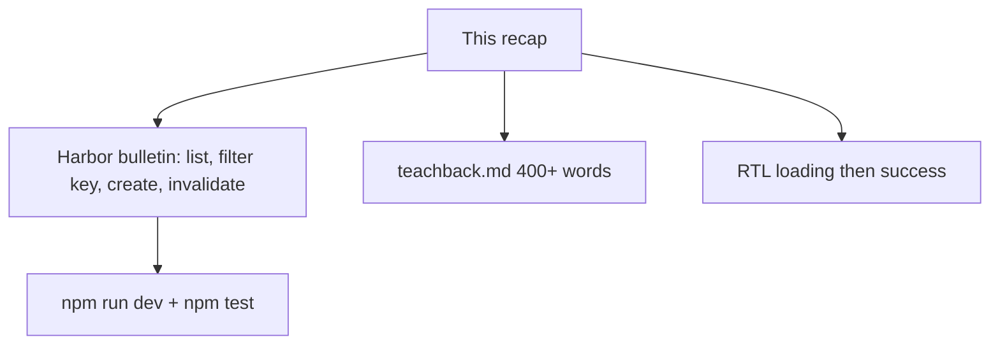

# Month 7 · Week 1 · Day 6
# Independent: Harbor Bulletin (Not Project 4)

**Month index:** [../../README.md](../../README.md)  
**Week 1:** [1](day-01.md) · [2](day-02.md) · [3](day-03.md) · [4](day-04.md) · [5](day-05.md) · Day 6 (today) · [7](day-07.md)  
**Week rhythm today:** Independent project work  
**Study time:** 3–4 focused hours  
**Days 1–5 textbook files:** closed for the *challenges*. Repair from **this recap**.

---

## How to read this chapter

Today you prove Week 1 without a type-along. The complete explanation below **is** the lesson. Read a section. Close it. Say it in one sentence. Then build.

If you catch yourself renaming Project 4 “items” into “berths” and calling it done, stop. **New domain. New copy. Same Query rules.**



Allowed during challenges: this file, your notes, the error in front of you.  
Not allowed: Days 1–5 as a paste source, Project 4’s spec as a layout to clone, AI writing `App.tsx`.

If you are stuck more than 25 minutes, open **only** Day 1 or Day 2 **in this textbook**, read one section, close it, continue. Record the lookup.

No Redux. No RHF required. No Zod required. No `any`. Tailwind optional and **not** a substitute for Month 2 CSS if you skip it.

---

## Complete explanation (this book is the lesson)

### Server state is not `useState`

**Server state** is data that lives on a server (or a fake module that plays server) and can be stale the moment you have it. Lists, detail records, search hits: **TanStack Query**.

**Client state** is UI that never came from GET: which harbor id is selected in a widget, whether a “compose” panel is open. **`useState`**.

**URL state** (Week 3) is `?q=` and `?page=` when share and back must work. Today harbor id may stay in `useState`.

**Form state** (Week 2) is the draft while typing. Today a labeled `<input>` plus `useState` or an uncontrolled form that you read on submit is enough.

**Wrong belief:** “Redux is how React apps store API data.”  
**Correct:** Query is the cache for API data. Redux for `GET /notices` is extra machinery.

### QueryClient, keys, useQuery

One **`QueryClient`**. **`QueryClientProvider`**. v5 **`useQuery({ queryKey, queryFn, enabled })`**.

The **key includes every variable** `queryFn` uses: `["bulletins", harborId]`, `["bulletins", { harborId, page }]`.

**`isPending`:** no success data yet — first-load UI.  
**`isFetching`:** in flight, including background refetch — do not blank the list.  
**`enabled: false`:** do not fetch (harbor id 0, empty search if that is the product).

`queryFn` throws on `!ok`. Empty array is success.

**`staleTime`:** freshness. **`gcTime`:** unused memory after unmount (not `cacheTime`). **`refetchOnWindowFocus`:** refetch stale data when the tab returns; tune `staleTime` before disabling.

### Mutations

**`useMutation({ mutationFn })`**. On success: **`queryClient.invalidateQueries({ queryKey: ["bulletins"] })`**. Prefix match refreshes filtered keys.

**`setQueryData`** patches one entry. Easy to lie with filters and pages.

Optimistic UI: only if success is almost certain and you can roll back. A harbor bulletin with a server-assigned id is a bad optimistic candidate. **Skip it** unless you can teach the rollback.

### Pagination (if you include it)

`page` in the key. **`placeholderData: keepPreviousData`** imported from `@tanstack/react-query`. New page must not flash empty. Search in the key; reset page when `q` changes.

### Tests

Each test: **new** `QueryClient`, **`retry: false`**, wrap `render`. Mock `fetch`. Assert **loading then title**. Do not import the production client.

### Typed list + create (adapt names)

```tsx
const queryClient = useQueryClient();

const listQuery = useQuery({
  queryKey: ["bulletins", { harborId }],
  queryFn: () => listBulletins({ harborId }),
  enabled: harborId > 0,
});

const create = useMutation({
  mutationFn: createBulletin,
  onSuccess: () => {
    void queryClient.invalidateQueries({ queryKey: ["bulletins"] });
  },
});
```

Harbor filter **must** be in the key. Changing harbor without that part shows the previous harbor’s rows until a coincidental refetch.

Pagination, if you include it:

```tsx
import { keepPreviousData } from "@tanstack/react-query";

useQuery({
  queryKey: ["bulletins", { harborId, page, q }],
  queryFn: () => listBulletins({ harborId, page, q }),
  placeholderData: keepPreviousData,
});
```

Not `keepPreviousData: true`. Not `cacheTime`. **`isPending`** blanks only when there is **no** success data yet. After page 1 succeeded, page 2’s first paint should still show page 1 rows while `isFetching` is true and `isPlaceholderData` is true.

**Wrong belief:** “I’ll `setQueryData` the new bulletin onto every filtered key by hand.”  
**Correct:** prefix `invalidateQueries({ queryKey: ["bulletins"] })` is the default. Patching is how paginated lists lie.

**Wrong belief:** “Optimistic create is how dashboards feel fast.”  
**Correct:** a server-assigned id makes a fake row a lie. Skip optimistic unless you can roll back. A harbor bulletin is a bad candidate.

**Wrong belief:** “Redux will keep the bulletin list consistent across pages.”  
**Correct:** Query already does. Do not add a store for GET.

Fake API must **persist** in memory so invalidation is visible. JSONPlaceholder POST often does not stick; then you will “learn” that invalidate is broken.

`BOUNDARY.md` rows: `harborId` (client), bulletin rows (server / Query), compose-open (client), `q`/`page` (URL later; today may be state — say so), form title (form state).

---

## Today's contract

1. Challenge 1: a **harbor bulletin** app from the spec.  
2. Challenge 2: **`teachback.md` — 400+ words** on server vs client state.  
3. Challenge 3: at least one RTL test — loading then success.

**Today's gate**

> I can teach server vs client state in prose, and I have a Query list+create that is not Project 4.

---

## Time box

| Block | Minutes | Work |
|---|---|---|
| 0 | 15 | Recap aloud |
| 1 | 90 | Challenge 1 — harbor bulletin |
| 2 | 40 | Challenge 2 — teachback 400+ words |
| 3 | 30 | Challenge 3 — test |
| 4 | 15 | Git |

---

# Challenge 1 — Harbor bulletin

```powershell
cd ~\fullstack-lab\month-07
npm create vite@latest week-01-harbor -- --template react-ts
cd week-01-harbor
npm install
npm install @tanstack/react-query @tanstack/react-query-devtools
npm run dev
```

Fictional **North Harbor** operations desk for **weather bulletins** and **berth closures**. Not inventory SKUs. Not “items.” Not the ops dashboard.

### Required

1. Fake API module: at least **two** harbors. `listBulletins({ harborId, page?, q? })` delays 300ms+. `createBulletin({ harborId, title })` persists in memory.
2. `QueryClientProvider` in `main.tsx`. One client.
3. Harbor filter in the **query key**. Changing harbor changes rows.
4. Create form, labeled field, mutation `isPending` disables submit, **`invalidateQueries({ queryKey: ["bulletins"] })`** on success.
5. Pending / error / empty / list. Refetch does not wipe.
6. Either **pagination** (`page` in key + `keepPreviousData`) **or** a documented reason in `SCOPE.txt` that the list is short — then still include **`q` in the key** with `enabled` if search exists.
7. CSS you type. One `h1`. Landmarks.

### Forbidden

- Project 4 routes, copy, or components.
- Redux.
- Copying `week-01-from-memory` file-for-file (you may glance at **your** notes, not paste).
- `any`. `dangerouslySetInnerHTML`.

`BOUNDARY.md`: what is server state, what is client state, what Query owns.

---

# Challenge 2 — Teachback (400+ words)

File: `~\fullstack-lab\month-07\week-01-harbor\teachback.md`

Write **at least 400 words** in full sentences (professor talking to a junior). Cover:

- What **server state** is, with examples from **this harbor app** (not “posts from a tutorial”).
- What **client state** is in the same app (harbor select, compose open, page if not in URL yet).
- Why **Context** is the wrong cache for the bulletin list.
- Why **Redux** is unnecessary for that list.
- What a **query key** is for; why the harbor id belongs in it.
- What happens if you **forget `invalidateQueries`** after create.
- **`isPending` vs `isFetching`**.
- **`staleTime` vs `gcTime`**.
- When **optimistic** updates would lie on this bulletin board.

Count words. If you are under 400, you have not taught; you have captioned. No bullet-only dump — prose paragraphs, then a short list if you need one.

---

# Challenge 3 — Test

Install Vitest + RTL as Day 5. `renderWithQuery`. Mock `fetch` or the API module. Claim: loading then a bulletin title.

```powershell
npm test
```

Record PASS in `TESTS.md`.

### Provider in `main.tsx` (one client)

```tsx
const queryClient = new QueryClient();

createRoot(document.getElementById("root")!).render(
  <StrictMode>
    <QueryClientProvider client={queryClient}>
      <App />
    </QueryClientProvider>
  </StrictMode>,
);
```

Do **not** `new QueryClient()` inside `App` — that resets the cache every render. Devtools: `<ReactQueryDevtools />` under the provider in development if you installed it.

Harbor select is **client** state (`useState`) or, later, URL. Rows are **server** state. Teachback must use **this** app’s names (North Harbor, berth closures), not “posts from a tutorial.”

If create works in the Network sense but the list does not move, you forgot `invalidateQueries({ queryKey: ["bulletins"] })`. Simulate the bug for two minutes, then fix it, then write that story in the 400 words.

---

# Git

```powershell
cd ~\fullstack-lab
git add month-07/week-01-harbor
git commit -m "Week 1 Day 6: harbor bulletins and server-state teachback."
```

---

# What 400 words of teachback looks like (do not paste)

Write about **your harbors**. A paragraph on keys that never mentions `harborId` is too abstract. A paragraph on `gcTime` that calls it `cacheTime` fails. Include at least one **story**: you created a bulletin, forgot invalidate (or simulated it), and the list lied until you fixed it.

If you used JSONPlaceholder instead of a persisting mock, the teachback **must** say that POST did not stick and that invalidation still refetched **truth** — otherwise you will “learn” that invalidate is broken.

**Wrong belief:** “Server state is anything in QueryClient.”  
**Correct:** QueryClient can hold whatever you parse. If you `setQueryData` a UI flag, you have misused the cache. Harbor id in `useState` is client. Bulletin rows from `listBulletins` are server.

Stretch: paginate with `placeholderData: keepPreviousData` if SCOPE.txt claimed the list was short and you have time.

### Fake API shape (persist so invalidate is visible)

```ts
type Bulletin = { id: string; harborId: number; title: string };

let rows: Bulletin[] = [
  { id: "b1", harborId: 1, title: "Fog until noon" },
  { id: "b2", harborId: 2, title: "Berth 4 closed" },
];

export async function listBulletins(args: { harborId: number }) {
  await delay(300);
  return rows.filter((row) => row.harborId === args.harborId);
}

export async function createBulletin(args: { harborId: number; title: string }) {
  await delay(300);
  const row = {
    id: crypto.randomUUID(),
    harborId: args.harborId,
    title: args.title.trim(),
  };
  rows = [...rows, row];
  return row;
}
```

JSONPlaceholder will not teach invalidation. This module will. `queryFn` still throws if you later wrap HTTP and `!ok`.

UI branch: `listQuery.isPending` → status “Loading bulletins”. `listQuery.isError` → `role="alert"`. Success + length 0 → empty copy. Success + rows → `key={id}`. Refetch: do not replace the list with a blank because `isFetching` is true.

Create button: `disabled={create.isPending}`. After success, the list must change **without** a manual refresh. If it does not, you forgot `invalidateQueries({ queryKey: ["bulletins"] })`.

`renderWithQuery` from Day 5: new `QueryClient`, `retry: false`. Assert loading then `"Fog until noon"` (or your seed title). Deliberate fail: change the mock title, watch red, restore.

---

# Recall

1. Server vs client in *your* harbor app.  
2. Why invalidate after create.  
3. Why the test client is not `main.tsx`’s client.

---

## Definition of done

- [ ] Harbor app is a new domain, not a renamed dashboard
- [ ] Query list + create + invalidation; filter in the key
- [ ] teachback.md ≥ 400 words, honest examples
- [ ] `npm test` proves loading → success
- [ ] BOUNDARY.md exists
- [ ] Commit exists

---

## Optional review links

Week 1 Query is explained in this chapter.

- [TanStack Query: Still need React Query?](https://tanstack.com/query/latest/docs/framework/react/overview)
- [TanStack Query: Testing](https://tanstack.com/query/latest/docs/framework/react/guides/testing)

---

## Tomorrow

Week review: teach the synthesis, mini-build, debug **missing key part**, **no invalidate**, **`isPending` vs `isFetching`**. Do not start Week 2 because the calendar moved.
