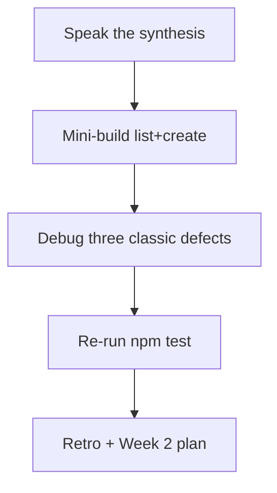

# Month 7 · Week 1 · Day 7
# Week Review — Query Keys, Cache Clocks, Mutations

**Month index:** [../../README.md](../../README.md)  
**Week 1:** [1](day-01.md) · [2](day-02.md) · [3](day-03.md) · [4](day-04.md) · [5](day-05.md) · [6](day-06.md) · Day 7 (today)  
**Week rhythm today:** Review, repair, plan Week 2  
**Study time:** 3–4 focused hours  
**Student state:** You fetched with Query, mutated, invalidated, maybe paginated, and wrote a teachback. Today those ideas must still live in your head — from **this file**.

Do not start Week 2 because the calendar moved. Start Week 2 because this file’s gate is true.

---

## How to read this chapter

This is a **closed-book teaching day**. The synthesis below is the lesson.

1. Read a section. Close it. Say the idea in one honest sentence.
2. Then do the review blocks in order. During the mini-build, Days 1–6 stay closed. If you go blank, re-read **this synthesis**.
3. Repair the weakest topic **today**. Week 2 (Zod, RHF) assumes Query is automatic.



---

## Week synthesis (the lesson, in this book)

**Server state** lives on a server and can be stale. **TanStack Query v5** is a cache of that state. **Client state** is UI. Do not put GET lists in Redux or in Context-as-cache.

**QueryClient:** one per app. Not `new QueryClient()` every `App` render.

**`useQuery({ queryKey, queryFn, enabled })`:** object syntax. The key **is** the id of the cache entry. Include every `queryFn` input (id, filter, **page**, **q**).

**`isPending`:** no success data yet (first load). **`isFetching`:** request in flight, including background refetch. Do not blank the table on refetch.

**`staleTime`:** freshness. **`gcTime`:** unused memory after last unmount (not `cacheTime`). **`refetchOnWindowFocus`:** refetch if **stale**; tune `staleTime` before disabling.

**`useMutation({ mutationFn })`:** writes. Then **`queryClient.invalidateQueries({ queryKey: ['items'] })`** (your resource name). Prefix invalidation hits filtered keys. **`setQueryData`** is a patch; it can lie.

**Pagination:** page in the key. **`placeholderData: keepPreviousData`** from `@tanstack/react-query`. Search in the key; **`enabled`** when the fetch must not run.

**Optimistic:** a bet. Lies when ids are fake or GET will not match. Not a checklist item.

**Tests:** new `QueryClient` per test, **`retry: false`**, wrap `render`. Loading then success.

The rest of this file unpacks those sentences.

---

## Today's contract

1. Teach Week 1 aloud from the synthesis.  
2. Mini-build a list+create from memory.  
3. Diagnose **missing key part**, **no invalidate**, **`isPending` vs `isFetching`**.  
4. Re-run `npm test` on a Week 1 app.  
5. Retro + Week 2 plan; repair the weakest hole today.

**Today's gate.** Closed-book:

> Server state is Query. Keys include filters and page. Mutations invalidate. `isPending` is first load; `isFetching` can coexist with data. I have a green test this week.

---

## Time box

| Block | Minutes | Work |
|---|---|---|
| 1 | 40 | Closed-book: speak the synthesis |
| 2 | 50 | Mini-build: `review/` list+create |
| 3 | 35 | Debug three defects (plus stretch) |
| 4 | 20 | Re-run tests |
| 5 | 25 | Retro + Week 2 plan + repair |

---

# Complete explanation — Query you must still own

## 1. Why Query exists

Two components needed the same list. `useEffect` + `useState` fetched twice or you lifted a god-object. Mutations forgot to update screens. Strict Mode double-mount fought abort. Query **dedupes** in-flight reads for the same key, **caches** success, **notifies** subscribers.

It does not replace `fetch`. `queryFn` still calls `fetch` (or a mock). You still check `response.ok`. You still parse. XSS is still JSX text.

**Wrong belief:** “Query is a state library like Redux.”  
**Correct:** it is a **server-state cache** with observers. Redux literacy is Week 3 and is **not** the list cache.

## 2. Keys and enabled

```tsx
useQuery({
  queryKey: ["notices", { boardId, page, q }],
  queryFn: () => listNotices({ boardId, page, q }),
  enabled: boardId > 0,
});
```

Omit `boardId` from the key → wrong board or no refetch. Empty search: `enabled: q.trim().length > 0` when the product should not hit the API yet.

## 3. Clocks

| Name | Job |
|---|---|
| `staleTime` | Fresh vs stale. Stale data still **shows**. |
| `gcTime` | After unmount, how long memory remains. |
| `refetchOnWindowFocus` | If stale, refetch on focus. |

**Wrong belief:** “I’ll set `cacheTime` to 0 to stop refetches.”  
**Correct:** v5 has **`gcTime`**. Stopping refetches is **`staleTime`**.

## 4. Mutations

```tsx
useMutation({
  mutationFn: createNotice,
  onSuccess: () => {
    void queryClient.invalidateQueries({ queryKey: ["notices"] });
  },
});
```

No invalidate → the list lies until a manual refetch or unmount+gc+remount. JSONPlaceholder may persist nothing; a mock that appends makes invalidation **visible**.

`setQueryData` writes one key. Paginated + filtered lists: prefer invalidate prefix.

## 5. Pagination placeholder

```ts
import { keepPreviousData } from "@tanstack/react-query";

placeholderData: keepPreviousData,
```

Not `keepPreviousData: true`. `isPlaceholderData` means you are looking at the **previous key’s** data while the new key fetches.

## 6. Tests

Fresh `QueryClient`, `retry: false`. `findBy` loading, `findBy` title. Mock `fetch`. Production client stays out of tests.

### Mini-build mutation (type this)

```tsx
const queryClient = useQueryClient();

const create = useMutation({
  mutationFn: createSignout,
  onSuccess: () => {
    void queryClient.invalidateQueries({ queryKey: ["signouts"] });
  },
});
```

Studio filter in the key:

```tsx
useQuery({
  queryKey: ["signouts", { studio }],
  queryFn: () => listSignouts({ studio }),
});
```

**Wrong belief:** “`isFetching` means I should return `<p>Loading</p>` and unmount the table.”  
**Correct:** after success, keep the table. A small “Updating…” is optional. `isPending` is the first-load blank.

**Wrong belief:** “I’ll write `cacheTime: 0` to stop focus refetch.”  
**Correct:** v5 uses **`gcTime`**. Stopping refetch is **`staleTime`** (and then, if you still must, `refetchOnWindowFocus`).

**Wrong belief:** “`placeholderData: keepPreviousData` is `keepPreviousData: true`.”  
**Correct:** v5 moved it. Import `keepPreviousData` from `@tanstack/react-query` and pass it as **`placeholderData`**.

Scaffold:

```powershell
cd ~\fullstack-lab\month-07
npm create vite@latest week-01-review -- --template react-ts
cd week-01-review
npm install
npm install @tanstack/react-query
npm run dev
```

One `QueryClient` in `main.tsx`. Devtools optional. No Redux. No RHF. No Zod required today (Week 2). `queryFn` still throws on `!ok`. Parse can stay a tiny guard if you mock the module instead of HTTP.

`DEBUG.txt` A must name **identity**: the key is the id of the cache entry. Omit `studio` and two studios share one entry.

---

# 1. Closed-book explanation (40 min)

Speak every Week 1 topic. Close Days 1–6. This file may stay open for the first pass, then close it and speak again.

Cover:

1. Server vs client vs (preview) URL vs form  
2. One QueryClient  
3. Object syntax; keys; `enabled`  
4. `isPending` vs `isFetching`  
5. `staleTime` vs `gcTime` vs focus refetch  
6. `useMutation` + `invalidateQueries`  
7. `setQueryData` vs invalidate  
8. When optimistic lies  
9. Page in key; `keepPreviousData`  
10. Test wrapper  

If a topic is under two true sentences, it is weak — write it for the retro.

---

# 2. Independent mini-build (50 min)

New folder **`~\fullstack-lab\month-07\week-01-review\`**. Days 1–6 closed. This synthesis is allowed.

**Studio sign-out board** (who borrowed a lens — not Project 4):

1. Fake API: list + create, persist in memory.  
2. Provider. `useQuery` + `useMutation` + invalidate `["signouts"]`.  
3. Optional filter (studio A/B) **in the key**.  
4. Pending / error / empty / list.  
5. One `h1`. Labeled form.

No Redux. No RHF. Serve Vite HTTP.

`review/OUTLINE.txt`: heading outline before CSS arguments.

---

# 3. Debugging (35 min)

`review/DEBUG.txt` — cause in **full sentences**. For each: what the program does, why a beginner believes the wrong thing, what to write instead.

**A. Missing key part** — `queryFn` uses `userId` / `boardId` / `page` but the key is only `["posts"]`. What the user sees when the variable changes. What identity means.

**B. No invalidate** — POST succeeds, list unchanged, Devtools still “success” with old data. Why Query did not guess. What `invalidateQueries({ queryKey: ["posts"] })` does to `["posts", 1]`.

**C. `isPending` vs `isFetching`** — background refetch blanks the table because the UI branched on the wrong flag. What each flag means after a successful first fetch. What the user should still see.

Stretch **D. `cacheTime`** — a classmate writes `cacheTime: 0` in v5. What happens (type error or ignored). What they meant (`staleTime` vs `gcTime`).

Stretch **E. `keepPreviousData: true`** — v4 habit in a v5 app. What to write instead.

The labels are the exam. Write **your** sentences.

---

# 4. Re-run tests (20 min)

In **one** of: harbor, from-memory, query-tests, pages:

```powershell
npm test
```

Record command, date, PASS/FAIL in `review/TESTS.md`. If FAIL, fix **today**.

---

# 5. Retro + Week 2 plan (25 min)

`review/retro.md` — solid / weak / lookups / hours.

**Week 2:** **Zod** (`parse` / `safeParse`, `z.infer`, unknown JSON), **React Hook Form** (`register` / `control`, `handleSubmit`, `zodResolver`), accessible field errors (`id`, `aria-describedby`, `aria-invalid`), client vs server validation. Login + item-shaped form in **labs**, then ideas into Project 4.

Repair the weakest Query topic **today** in a real file.

```powershell
cd ~\fullstack-lab
git add month-07
git commit -m "Record Week 1 Query review."
```

---

## Week 1 definition of done

- [ ] I can teach keys, clocks, mutation, invalidation from this book
- [ ] List+create exists somewhere this week with invalidate
- [ ] I did not use Redux for a GET list
- [ ] At least one RTL Query test green (`retry: false`, own client)
- [ ] DEBUG.txt has A–C in full sentences
- [ ] Retro names the Week 2 plan honestly

If any box is still false after repair, do not pretend Week 1 is finished. Zod will not hide a missing query key.

### DEBUG.txt A–C (what “full sentences” means)

**A.** `queryFn` closes over `studio` but the key is `["signouts"]`. The user switches studio B; the UI still shows studio A until a refetch coincidence. Identity is the key. Include `studio`.

**B.** POST succeeds. List unchanged. Devtools still “success” with old data. Query did not guess. `invalidateQueries({ queryKey: ["signouts"] })` marks prefix matches stale, including `["signouts", { studio: "A" }]`.

**C.** Background refetch sets `isFetching` true while `data` still exists. The UI returned only `<p>Loading</p>` because it branched on `isFetching` or on a homemade `loading` boolean. After first success, keep the table. `isPending` is the first-load flag.

Stretch D: classmate writes `cacheTime: 0`. v5 wants **`gcTime`**. They meant `staleTime` if the goal was fewer refetches.

Stretch E: `keepPreviousData: true` is v4. v5: `placeholderData: keepPreviousData`.

Repair today in a **real file**: add a missing key part or an invalidate you skipped. Week 2 Zod will not fix a lying list.

### Mini-build `queryFn` honesty

```ts
export async function listSignouts(args: { studio: string }) {
  await delay(250);
  return rows.filter((row) => row.studio === args.studio);
}
```

Throw only when you wrap HTTP and `!ok`. Empty array is success. `isPending` first load; keep the list on `isFetching`. Filter `studio` **in the key**. Form: labeled title, `preventDefault` if you use a native form without RHF (RHF is Week 2). Mutation `isPending` disables submit.

One `h1`. CSS you type. HTTP via Vite. Extra `--` in PowerShell when you scaffolded.

`review/OUTLINE.txt` before arguing with CSS. Retro names Zod + RHF for next week without skipping “unknown JSON.”

---

## Optional review links

Week 1 Query is explained in this chapter. These pages are for later checking, not for first learning.

- [TanStack Query: Important defaults](https://tanstack.com/query/latest/docs/framework/react/guides/important-defaults)
- [TanStack Query: Mutations](https://tanstack.com/query/latest/docs/framework/react/guides/mutations)
- [TanStack Query: Testing](https://tanstack.com/query/latest/docs/framework/react/guides/testing)

---

## Next week

**Day 1 of Week 2** introduces **Zod** at the JSON boundary: `unknown` in, `safeParse`, types from **`z.infer`**. Come in able to say today’s gate in sixty seconds.
