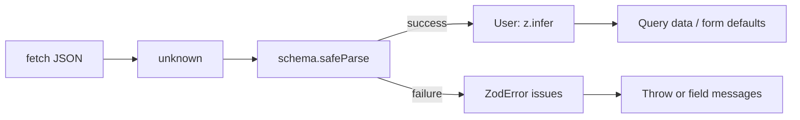

# Month 7 · Week 2 · Day 1
# Zod at the Boundary: parse, safeParse, z.infer

**Program:** Full-Stack Mastery · 18 months  
**Phase:** 2 — Modern frontend  
**Month index:** [../../README.md](../../README.md)  
**Week 2:** Day 1 (today) · [2](day-02.md) · [3](day-03.md) · [4](day-04.md) · [5](day-05.md) · [6](day-06.md) · [7](day-07.md)  
**Week rhythm today:** Learn + type-along  
**Student state:** Week 1 gate. You cache server data with Query. The `queryFn` still trusts JSON with a thin array check or an `as Post[]`. That trust is a bug with extra steps.  
**Study time:** 3–4 focused hours

**This week covers:** Zod schemas, inferred types, React Hook Form, `zodResolver`, accessible field errors, client vs server validation, mapping server errors onto fields.

Today: **`unknown` JSON**, **`z.object`**, **`parse` vs `safeParse`**, **`z.infer`**. Forms that type into a schema are **Day 2**. Do not skip them. If you only memorize “Zod makes types,” you will still `as` the network and wonder why the UI exploded.

Project 4 is **not** today’s paste target. Labs: `~\fullstack-lab\month-07\`. Parse *ideas* later belong in `~/ops-dashboard/` API modules.

---

## How to use this textbook

1. Read a section. Close it. Say the idea.
2. Type every lab. Do not paste a schema you cannot read aloud.
3. When Zod fails, **read `error.issues`**. That *is* the lesson.
4. Optional review links are for later rechecking — not first learning.

---

## How to read this chapter

Month 5 taught: `response.json()` is **`unknown`**. A type assertion (`as User`) is a **compile-time costume**. The browser never sees it. If the mock API ships `{ "id": "12" }` (a string) and your component does `id.toFixed()`, you crash at **runtime**.

**Zod** is a schema that runs. You describe the shape. At the boundary you **parse**. Success: you have a typed value. Failure: you have issues you can show or throw into Query’s `isError`.



If that is still abstract: TypeScript is the dress rehearsal. Zod is the ticket check at the door. Query caches whatever you **return**. If you return unchecked JSON, the cache is a box of lies.

React Hook Form is tomorrow. Today the schema must stand alone so you can test it with `node` or Vitest without a component.

---

## Today's contract

By the end of this day you will be able to:

1. Type network JSON as **`unknown`**, never `any`.
2. Write a **`z.object`** (and `z.array`) that matches a small resource.
3. Use **`schema.parse(data)`** when failure should **throw**.
4. Use **`schema.safeParse(data)`** when you will **branch** on `success`.
5. Take types from **`z.infer<typeof schema>`** — not a second handmade `interface` that can drift.
6. Put parse **inside `queryFn`** (or an `api/` helper) so Query never stores garbage.

**Today's gate.** Closed-book:

> `JSON.parse` and `response.json()` are unknown. Zod checks at runtime. `parse` throws. `safeParse` returns success or error. `z.infer` is the type of a successful parse. I do not `as` the network.

---

## Time box

| Block | Minutes | Work |
|---|---|---|
| A | 50 | Theory |
| B | 55 | Schema + parse in a queryFn |
| C | 70 | Independent: two resources, one deliberate bad payload |
| D | 20 | Git |
| E | 15 | Recall |

---

# Block A — Theory

## 1. The boundary is the network (and `localStorage`, and `JSON.parse`)

Anything that **enters** the app as a string of JSON is untrusted:

- `await response.json()`
- `JSON.parse(text)`
- `localStorage.getItem` then parse
- A mock file you wrote last month and forgot

Inside the app, after a successful parse, you may pass **typed** objects as props. You do not need to re-parse every child. Parse **once** at the edge.

**Wrong belief:** “I typed `type Post = { id: number }` so the API is typed.”  
**Correct:** that type is a wish. The API did not sign it.

**Wrong belief:** “`any` is faster for JSON.”  
**Correct:** `any` turns the checker off. Forbidden as a way to silence the boundary.

---

## 2. A schema is a runtime program

```ts
import { z } from "zod";

export const postSchema = z.object({
  id: z.number(),
  userId: z.number(),
  title: z.string().min(1),
  body: z.string(),
});

export const postListSchema = z.array(postSchema);

export type Post = z.infer<typeof postSchema>;
```

`z.infer<typeof postSchema>` means: “the TypeScript type of a value that **passed** this schema.” Change the schema, the type changes. A second `interface Post` will drift. Prefer **one** source.

Common pieces you will actually use this week:

| Schema | Meaning |
|---|---|
| `z.string()` | a string (including `""` unless you add `.min(1)`) |
| `z.string().trim().min(1, "Title is required")` | not blank after trim — Month 3 `isBlank` |
| `z.number()` | `typeof === "number"` and not `NaN` in current Zod |
| `z.boolean()` | boolean |
| `z.array(postSchema)` | array of posts |
| `z.object({ ... })` | object; **unknown keys** are stripped by default in Zod object parse |
| `z.email()` or `z.string().email()` | depends on Zod major — use the API **your** installed version documents; if `.email()` lives on `z`, use it; do not invent |
| `z.union([z.literal("idle"), z.literal("busy")])` | a small enum of strings |
| `z.coerce.number()` | `"12"` → `12` — **dangerous** at a JSON API if you wanted to reject strings. Prefer **not** to coerce GET JSON unless you are parsing form strings. |

Install:

```powershell
npm install zod
```

This course uses Zod **4 or 3** as your lockfile decides. APIs differ slightly (`z.email()` vs `z.string().email()`). Read **your** editor types. The ideas — parse, safeParse, infer — do not change.

---

## 3. `parse` throws; `safeParse` does not

```ts
const json: unknown = await response.json();

const post = postSchema.parse(json);
// post: Post
// if invalid: throws ZodError
```

Use **`parse`** in `queryFn` when invalid JSON is a **failed query**. Query will set `isError`. That is usually what you want for GET.

```ts
const result = postSchema.safeParse(json);

if (!result.success) {
  console.error(result.error.issues);
  throw new Error("Invalid post payload");
}

const post = result.data;
```

**`safeParse`** returns `{ success: true, data }` or `{ success: false, error }`. Use it when:

- You will **map issues** to field names (forms, Day 2–4).
- You are in a function that must not throw (rare in `queryFn`).
- You are writing a **unit test** of the schema and asserting `success === false`.

**Wrong belief:** “I’ll `try/catch` around `JSON.parse` and skip Zod.”  
**Correct:** `JSON.parse` only checks **syntax**. `{ "id": null }` is valid JSON and an invalid `Post`.

**Wrong belief:** “`parse` and `safeParse` are the same if I catch.”  
**Correct:** they are the same *check*. `safeParse` is the structured result. Prefer it when you will read `issues`. Prefer `parse` when throwing is the whole story.

---

## 4. Issues are data

```ts
result.error.issues.forEach((issue) => {
  const path = issue.path.join(".");
  const message = issue.message;
  // path: "title" or "0.title" for arrays
});
```

`path` is an array: `["title"]`, `["items", 0, "qty"]`. Day 4 will map those onto RHF `setError("title", { message })`.

Do not `JSON.stringify` the whole error into the UI as the product copy. Throw a short Error for Query; keep issues for forms.

---

## 5. Where parse lives in a Query app

```ts
export async function getPost(id: number): Promise<Post> {
  const response = await fetch(
    `https://jsonplaceholder.typicode.com/posts/${id}`,
  );
  if (!response.ok) throw new Error(`HTTP ${response.status}`);
  const json: unknown = await response.json();
  return postSchema.parse(json);
}
```

```tsx
useQuery({
  queryKey: ["posts", id],
  queryFn: () => getPost(id),
  enabled: id > 0,
});
```

If parse throws, the query is **error**. Good. Do not `parse` in the component body during render — that is extra work and easy to mishandle. Helpers in `api/` own the boundary.

**Wrong belief:** “I’ll parse in JSX so the schema stays near the view.”  
**Correct:** the view consumes **Post**. The edge produces **Post**.

For lists:

```ts
return postListSchema.parse(json);
```

One failure in one element fails the **whole** list parse (default). That is strict and honest. If you need partial lists, that is a product decision — not today’s default.

---

## 6. Forms preview (so Day 2 is not a surprise)

The **same schema** can validate:

- GET JSON (this file)
- A form submit (Day 2 `zodResolver`)

Sometimes the form is a **subset** (create has no `id`). Then:

```ts
export const createPostSchema = postSchema.omit({ id: true });
export type CreatePost = z.infer<typeof createPostSchema>;
```

Or `pick`. Do not maintain two unrelated objects that happen to share field names.

Client validation (Zod in the browser) is **UX**. Server validation (later FastAPI) is **security**. Both can exist. Either can fail. Day 4 maps **server** field errors onto the form after the client said OK.

---

## 7. What Zod does not do

- It is not Query. It does not fetch.
- It is not RHF. It does not hold input focus.
- It does not sanitize HTML. XSS is still JSX text. A parsed `title` is still **text** in `<p>{title}</p>`.
- It does not make mock auth real.

---

# Block B — Type-along

```powershell
cd ~\fullstack-lab\month-07
npm create vite@latest week-02-zod -- --template react-ts
cd week-02-zod
npm install
npm install zod @tanstack/react-query @tanstack/react-query-devtools
npm run dev
```

1. `src/schemas/post.ts`: `postSchema`, `postListSchema`, `export type Post = z.infer<typeof postSchema>`.
2. `src/api/posts.ts`: `getPosts()` → JSONPlaceholder `/posts?userId=1`, `ok` check, `unknown`, **`postListSchema.parse`**.
3. Wire Query as Week 1: provider, `useQuery({ queryKey: ["posts", 1], queryFn: getPosts })`. Titles from `data`.
4. Unit-test the schema **without** a component (Vitest or a small `src/schemas/post.test.ts`):
   - `safeParse` a good object → `success`.
   - `safeParse({ id: "1", title: "x", userId: 1, body: "" })` → `success === false`.
5. Temporarily `parse` `{ id: "nope" }` in a throwaway script or test. Read the issues. Restore.

`BOUNDARY.txt`: one paragraph — where `unknown` becomes `Post`.

---

## 8. Arrays, optional fields, and `.passthrough()`

```ts
const postSchema = z.object({
  id: z.number(),
  userId: z.number(),
  title: z.string().min(1),
  body: z.string(),
});
```

JSONPlaceholder posts also have extra keys depending on the endpoint. Default Zod **object** parse **strips** unknown keys (in Zod 3). That is usually what you want: your `Post` type is the fields you **use**. If you must **keep** extras, read your version’s `passthrough` / `catchall` — not required today.

**Optional:** `z.string().optional()` allows `undefined`. JSON often uses `null`. `z.string().nullable()` allows `null`. `z.union([z.string(), z.null()])` is explicit. Do not confuse “field missing” with `"null"` the string.

**Wrong belief:** “I’ll `z.any()` on `body` because it might be HTML.”  
**Correct:** if it is a string, `z.string()`. You still render it as **text**. HTML in JSON is not a reason to skip the schema.

For lists that must not fail entirely when one row is rotten, you *could* `safeParse` each element and drop failures. That is a **product** choice (log and skip vs fail the query). Default this course: **fail the query**. A rotten row is a backend bug you should see.

---

## 9. `parse` in tests without React

```ts
import { postSchema } from "./post";

test("rejects string id", () => {
  const result = postSchema.safeParse({
    id: "1",
    userId: 1,
    title: "Hi",
    body: "",
  });
  expect(result.success).toBe(false);
});
```

This is a Month 5 unit test with a better library. It does not replace UI tests. It **does** let you pin the boundary before Query exists.

`issues[0].path` for that case should include `"id"`. Read it. Write `ISSUES.txt` with the path and message.

---

# Block C — Independent

Add **`commentSchema`**: `id`, `postId`, `name`, `email`, `body` as strings/numbers matching JSONPlaceholder `/comments?postId=1`.

1. `getComments(postId)` parses `z.array(commentSchema)`.
2. `useQuery({ queryKey: ["comments", postId], queryFn: () => getComments(postId), enabled: postId > 0 })`.
3. A second file `BAD.json` (or a mock function) that returns comments with `email: 12`. Parse must **fail**. Show Query error UI — not a crash in render doing `.toUpperCase` on a number.
4. `INFER.txt`: paste the `z.infer` type (or write it by hand) and confirm you did **not** also write `interface Comment`.

No RHF yet. No Redux.

```powershell
cd ~\fullstack-lab
git add month-07/week-02-zod
git commit -m "Week 2 Day 1: Zod parse at the Query boundary."
```

---

# Block E — Recall

1. Why `response.json()` is `unknown`.  
2. `parse` vs `safeParse`.  
3. What `z.infer<typeof schema>` is tied to.  
4. Why parse belongs in `api/`, not in JSX.  
5. Why a valid JSON object can still fail Zod.  
6. Why `as Post[]` is not a schema.

---

## Definition of done

- [ ] Network JSON typed `unknown`
- [ ] `z.infer` is the Post/Comment type — no drifting duplicate interface
- [ ] `queryFn` parses; bad payload → query error, not a white screen in a child
- [ ] I read `issues` at least once
- [ ] BOUNDARY.txt exists
- [ ] Commit exists

---

## Optional review links

Zod at the boundary is explained in this chapter.

- [Zod: Defining schemas](https://zod.dev/)
- [TanStack Query: Query functions](https://tanstack.com/query/latest/docs/framework/react/guides/query-functions)

---

## Tomorrow

**React Hook Form:** `register` vs `control`, `handleSubmit`, **`zodResolver`** from `@hookform/resolvers/zod`. Accessible errors: message **`id`**, **`aria-describedby`**, **`aria-invalid`**.
