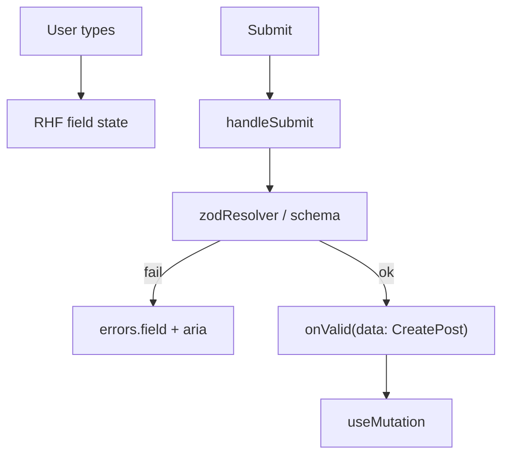

# Month 7 · Week 2 · Day 2
# React Hook Form: register, control, handleSubmit, zodResolver

**Program:** Full-Stack Mastery · 18 months  
**Phase:** 2 — Modern frontend  
**Month index:** [../../README.md](../../README.md)  
**Week 2:** [1](day-01.md) · Day 2 (today) · [3](day-03.md) · [4](day-04.md) · [5](day-05.md) · [6](day-06.md) · [7](day-07.md)  
**Week rhythm today:** Exercises + type-along  
**Student state:** Day 1 gate. You can `safeParse` unknown JSON and `z.infer` a type. Forms are still Month 6 **controlled** `useState` per field. That does not scale to a dashboard create/edit screen.  
**Study time:** 3–4 focused hours

Today: **`useForm`**, **`register`**, **`control` + `Controller`**, **`handleSubmit`**, **`zodResolver`**, and **accessible** field errors (`id` on the message, `aria-describedby`, `aria-invalid`). Mapping **server** errors onto fields is Day 4. Do not skip it.

Project 4 is **not** today’s paste target. Labs: `~\fullstack-lab\month-07\`.

---

## How to use this textbook

1. Read a section. Close it. Say the idea.
2. Type the form. Do not paste a `useForm` blob you cannot explain.
3. Keyboard: tab to the field, submit empty, confirm the error is **announced** with the field — not a red div on the other side of the page with no association.
4. Optional review links are for later rechecking.

---

## How to read this chapter

Month 6: `value={title}` and `onChange` → `setTitle`. That is honest. Twelve fields later you have twelve setters, a homemade `errors` object, and a submit handler that reimplements Zod.

**React Hook Form (RHF)** owns **form state**: values, dirty flags, field errors, submit count. You describe fields. You validate with the **same Zod schema** via **`zodResolver`**. On submit you receive **parsed** data (or the submit never runs).



RHF is **not** Query. Draft title is **form state**. After a successful POST, **server state** updates via invalidation. Do not put the draft in Query. Do not put the server list in RHF.

---

## Today's contract

By the end of this day you will be able to:

1. Install `react-hook-form` and `@hookform/resolvers`.
2. Call **`useForm({ resolver: zodResolver(schema), defaultValues })`**.
3. Use **`register("title")`** on a native input.
4. Explain when **`control` + `Controller`** is required (non-native widgets).
5. Wrap submit with **`handleSubmit(onValid, onInvalid)`**.
6. Render field errors with **`id`**, **`aria-invalid`**, **`aria-describedby`**.

**Today's gate.** Closed-book:

> RHF holds the draft. Zod decides if submit may proceed. `register` wires native inputs. Errors are associated with fields the way Month 2 associated labels: `id` and `aria-describedby`. `handleSubmit` receives parsed data.

---

## Time box

| Block | Minutes | Work |
|---|---|---|
| A | 55 | Theory |
| B | 55 | Type-along: create-notice form |
| C | 70 | Independent: login-shaped form (client only) |
| D | 20 | Git |
| E | 15 | Recall |

---

# Block A — Theory

## 1. `useForm` — one hook for the draft

```tsx
import { useForm } from "react-hook-form";
import { zodResolver } from "@hookform/resolvers/zod";
import { z } from "zod";

const noticeSchema = z.object({
  title: z.string().trim().min(1, "Title is required"),
  body: z.string().trim().min(1, "Body is required"),
});

type NoticeInput = z.infer<typeof noticeSchema>;

const {
  register,
  handleSubmit,
  control,
  formState: { errors, isSubmitting },
} = useForm<NoticeInput>({
  resolver: zodResolver(noticeSchema),
  defaultValues: { title: "", body: "" },
});
```

**`defaultValues`:** always set them for controlled-ish resets and for TypeScript. Empty strings for text fields.

**`resolver`:** `zodResolver(noticeSchema)` from **`@hookform/resolvers/zod`**. On submit (and on blur/change if you set `mode`), RHF runs the schema. Failures become `formState.errors`.

**`mode`:** default is validate on **submit**. `mode: "onBlur"` validates when the user leaves a field — often kinder for a11y than yelling on every keystroke. `onChange` can be noisy. Pick **`onTouched` or `onBlur`** for this course unless you have a reason.

**Wrong belief:** “RHF replaces Zod.”  
**Correct:** RHF **calls** Zod through the resolver. The schema remains the source of rules.

**Wrong belief:** “I’ll `useState` for title *and* `register("title")`.”  
**Correct:** two sources of truth. Pick RHF.

---

## 2. `register` — native inputs

```tsx
<label htmlFor="title">Title</label>
<input
  id="title"
  type="text"
  autoComplete="off"
  aria-invalid={errors.title ? true : undefined}
  aria-describedby={errors.title ? "title-error" : undefined}
  {...register("title")}
/>
```

`register("title")` returns `{ name, onChange, onBlur, ref }`. Spread **after** your `id` / `aria-*` so you do not accidentally overwrite `name`. Do not overwrite `ref` unless you know how to compose refs.

**`htmlFor` / `id`:** Month 2. RHF does not invent the label association.

Native `<input>`, `<textarea>`, `<select>`: **`register`**.

---

## 3. `control` — when `register` is the wrong tool

Some UI is not a native input: a custom combobox, a Month 6 `DateField` that only exposes `value` + `onChange`, a checkbox group component.

Then you use **`Controller`**:

```tsx
import { Controller } from "react-hook-form";

<Controller
  name="boardId"
  control={control}
  render={({ field, fieldState }) => (
    <select
      id="boardId"
      {...field}
      value={field.value}
      onChange={(event) => field.onChange(Number(event.target.value))}
      aria-invalid={fieldState.error ? true : undefined}
      aria-describedby={fieldState.error ? "boardId-error" : undefined}
    >
      <option value={1}>North</option>
      <option value={2}>South</option>
    </select>
  )}
/>
```

`field` has `value`, `onChange`, `onBlur`, `ref`, `name`. For `<select>`, converting to `number` is **your** job if the schema wants `z.number()`.

A native `<select {...register("boardId", { valueAsNumber: true })}>` can also coerce. Read RHF’s `valueAsNumber` if you stay on `register`. Do not mix `valueAsNumber` and a Zod `z.string()` and then wonder.

**Wrong belief:** “I must `Controller` every field because it looks official.”  
**Correct:** native fields: `register`. Custom value/onChange widgets: `Controller`.

`control` is the object you pass to `Controller` and to some helper libraries. You rarely use it another way today.

---

## 4. `handleSubmit` — parse, then your function

```tsx
function onValid(data: NoticeInput) {
  createNotice.mutate(data);
}

function onInvalid() {
  // optional: focus first error — RHF can do this with shouldFocusError (default true)
}

<form onSubmit={handleSubmit(onValid, onInvalid)} noValidate>
```

**`noValidate`:** HTML5 native bubbles (`required` on the tag) fight Zod’s messages. Let Zod be the client validator. You still **write** `type="email"` where it helps mobile keyboards; the schema remains the rule.

**`handleSubmit`:**

1. Prevents default (no document reload — Month 6).
2. Runs the resolver.
3. Calls `onValid(parsed)` only if Zod succeeded.
4. Otherwise fills `errors` and calls `onInvalid` if you passed it.

Do not call `createNotice.mutate` in a raw `onSubmit` that also uses RHF without `handleSubmit` — you will send unparsed strings.

**`isSubmitting`:** true while `onValid` is async and awaiting. If you `mutate` without awaiting, use the **mutation’s** `isPending` to disable the button. If you `mutateAsync` inside `onValid`, RHF `isSubmitting` covers the wait.

```tsx
<button type="submit" disabled={createNotice.isPending}>
  Post notice
</button>
```

---

## 5. Accessible errors — the Month 2 rule, named

```tsx
{errors.title ? (
  <p id="title-error" role="alert">
    {errors.title.message}
  </p>
) : null}
```

| Piece | Job |
|---|---|
| `id="title-error"` | Stable id for this message |
| `aria-describedby="title-error"` on the **input** | The field **points at** the message |
| `aria-invalid={true}` on the input when there is an error | Invalid state, not color alone |
| `role="alert"` on the message (or `aria-live`) | Many AT announce the appearance |
| `htmlFor` / `id` on the label | Name of the field |

**Wrong belief:** “A red border is an error.”  
**Correct:** color is not a program. Association is `id` + `aria-describedby`. Month 2 `aria-invalid` still applies.

**Wrong belief:** “I’ll put all errors in one `ul` at the top and skip field ids.”  
**Correct:** a summary is a **bonus** (and should link to fields). Field-level messages are required this week.

Do not use `placeholder` as the only label.

---

## 6. Client validation is not the server

Zod in the browser:

- Stops empty submit.
- Speaks immediately.
- Can be **bypassed** (disabled JS, a crafted `fetch`). That is fine. Real enforcement is the API (Month 8+). Mock APIs still return 400s on Day 4.

If client Zod says OK and the server says `"title": "already exists"`, you **`setError("title", { type: "server", message: "..." })`**. That is Day 4. Today, client-only is enough if the fake API only checks trim.

---

## 7. Query + RHF together (preview you may type today)

```tsx
const queryClient = useQueryClient();
const createNotice = useMutation({
  mutationFn: postNotice,
  onSuccess: () => {
    void queryClient.invalidateQueries({ queryKey: ["notices"] });
    reset();
  },
});
```

`reset` comes from `useForm`. After success, clear the draft. The **list** is Query’s job.

Do not `useQuery` the draft.

---

# Block B — Type-along

```powershell
cd ~\fullstack-lab\month-07
npm create vite@latest week-02-rhf -- --template react-ts
cd week-02-rhf
npm install
npm install react-hook-form @hookform/resolvers zod @tanstack/react-query @tanstack/react-query-devtools
npm run dev
```

1. `noticeSchema` as in theory. `type NoticeInput = z.infer<typeof noticeSchema>`.
2. `NoticeForm.tsx`: `useForm` + `zodResolver`. Title and body: **labels**, `register`, error `p` with `id`, `aria-describedby`, `aria-invalid`.
3. Submit empty: errors appear, associated. Submit valid: `console.log` the data **or** a mutation against an in-memory mock + invalidate `["notices"]` if you also show a list.
4. Inspect the input in DevTools: `aria-invalid="true"` when wrong.
5. `A11Y.txt`: tab order, what a screen reader would hear (even if you simulate it by reading the accessibility tree in DevTools).

Break association: remove `aria-describedby`. Write why that fails the gate. Restore.

---

# Block C — Independent

**Login-shaped form** (mock, not security):

Schema: `email` (email string for your Zod version), `password` `min(8)` with a useful message. No “must contain three symbol classes” theater unless you want it — **clear** beats clever.

- `useForm` + `zodResolver`.
- Fields labeled. `autoComplete="username"` / `autoComplete="current-password"`.
- Accessible errors.
- `onValid`: mock `login({ email, password })` that **resolves** for one hard-coded pair and **rejects** otherwise. Today you may `alert` or show a form-level `role="alert"` on reject. **`setError` per field from the server is Day 4** — if you finish early, peek at Day 4 and try `setError("root", { message })` only.
- Disable submit while pending.

Not Project 4’s login page copy-paste. New file, new copy (“Harbor staff sign-in”).

No Redux.

```powershell
cd ~\fullstack-lab
git add month-07/week-02-rhf
git commit -m "Week 2 Day 2: RHF plus Zod resolver and accessible errors."
```

---

# Block E — Recall

1. What RHF owns vs what Query owns.  
2. `register` vs `Controller`.  
3. What `handleSubmit` does before `onValid`.  
4. The three a11y attributes/ids for a field error.  
5. Why `noValidate` on the form.  
6. Why client Zod is not security.

---

## Definition of done

- [ ] `zodResolver` wired; schema is `z.infer`’d
- [ ] Native fields use `register`; I can say when I would use `control`
- [ ] Empty submit shows field errors with `id`, `aria-describedby`, `aria-invalid`
- [ ] Login-shaped independent form exists
- [ ] A11Y.txt exists
- [ ] Commit exists

---

## Optional review links

RHF and accessible errors are explained in this chapter.

- [React Hook Form: Get started](https://react-hook-form.com/get-started)
- [React Hook Form: `zodResolver`](https://github.com/react-hook-form/resolvers#zod)
- [MDN: `aria-invalid`](https://developer.mozilla.org/en-US/docs/Web/Accessibility/ARIA/Reference/Attributes/aria-invalid)
- [MDN: `aria-describedby`](https://developer.mozilla.org/en-US/docs/Web/Accessibility/ARIA/Reference/Attributes/aria-describedby)

---

## Tomorrow

From **memory**: schema + a small form with accessible errors. Days 1–2 stay closed during drills.
