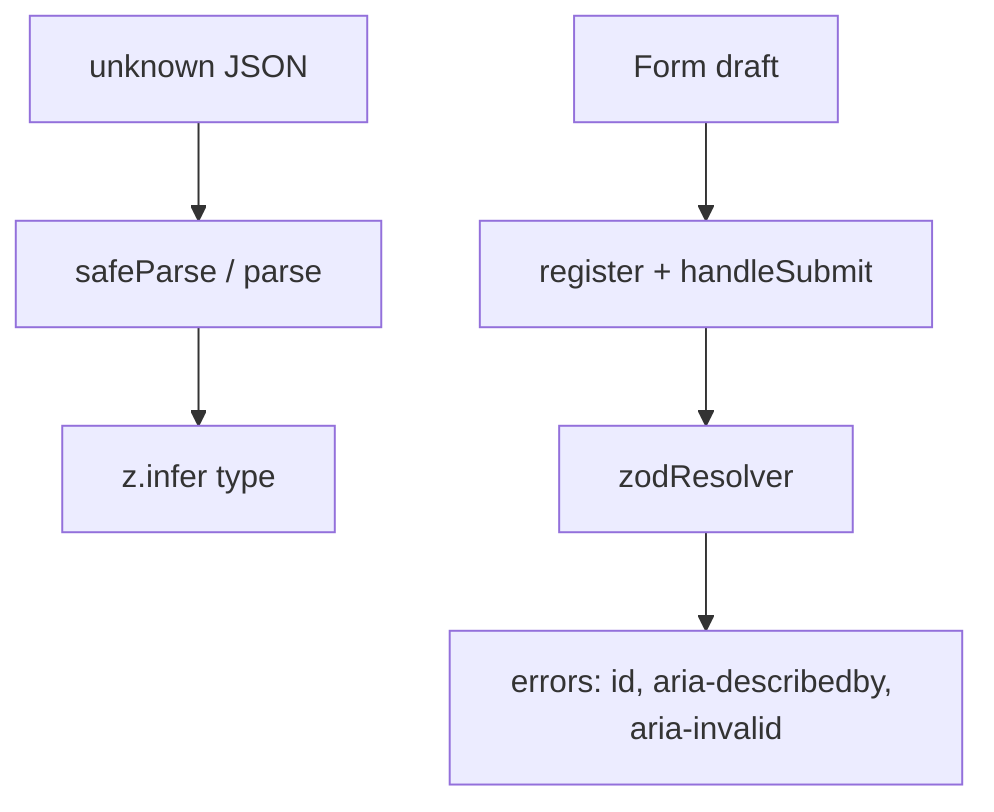

# Month 7 · Week 2 · Day 3
# From Memory: Schema + Accessible Form

**Month index:** [../../README.md](../../README.md)  
**Week 2:** [1](day-01.md) · [2](day-02.md) · Day 3 (today) · [4](day-04.md) · [5](day-05.md) · [6](day-06.md) · [7](day-07.md)  
**Week rhythm today:** Implement from memory  
**Study time:** 3–4 focused hours  
**Student state:** You parsed unknown JSON with Zod and wired RHF with `zodResolver`. Today those ideas must live in your fingers.  
**Days 1–2 of this week:** closed during the drills. Repair from **this recap**, not from a forms article.

---

## How to read this chapter

Days 1 and 2 had type-along files. During the drills they stay **closed**. This file contains the lecture so you are not sent elsewhere to re-learn.



Allowed: this recap, your notes, the error in front of you.  
Not allowed: pasting Day 1–2 labs, AI writing the form, copying Project 4 login.

If you are stuck **more than 25 minutes**, open **only** the matching Day 1 or Day 2 section **in this textbook**, read it, close it, continue. Record `lookups.txt`.

There is **no complete form solution** in this file. The spec is the assignment. You write it.

---

## Complete explanation (Zod + RHF you must be able to write)

### Unknown at the boundary

`await response.json()` is **`unknown`**. `as Item` is a costume. **Zod** runs at runtime.

```ts
const itemSchema = z.object({
  id: z.number(),
  name: z.string().min(1),
  qty: z.number().int().nonnegative(),
});

export type Item = z.infer<typeof itemSchema>;
```

**`z.infer<typeof itemSchema>`** is the type of a successful parse. Do not keep a second `interface Item`.

**`schema.parse(json)`** throws `ZodError` — appropriate inside `queryFn` so Query becomes `isError`.

**`schema.safeParse(json)`** returns `{ success: true, data } | { success: false, error }`. Use it when you will read **`error.issues`** (path + message) without relying on throw.

Parse in **`api/` helpers**, not in JSX. Query must not cache unparsed garbage.

**Wrong belief:** “TypeScript already validated the API.”  
**Correct:** types erase. The network did not read your `.ts` file.

### RHF owns the draft

```tsx
const {
  register,
  handleSubmit,
  formState: { errors },
} = useForm<CreateItem>({
  resolver: zodResolver(createItemSchema),
  defaultValues: { name: "", qty: 0 },
});
```

Install: `react-hook-form`, `@hookform/resolvers`, `zod`. Resolver import: **`zodResolver` from `@hookform/resolvers/zod`**.

**`register("name")`** on native `<input>` / `<textarea>` / `<select>`. Spread it; keep your `id` and `aria-*`.

**`control` + `Controller`:** custom widgets that only give `value`/`onChange`. Not required for a plain text login.

**`handleSubmit(onValid)`** prevents default, runs Zod, calls `onValid(parsed)` only if the schema passed. Put **`noValidate`** on `<form>` so HTML5 bubbles do not fight Zod messages.

Disable submit with mutation **`isPending`** (or RHF `isSubmitting` if you `await mutateAsync`).

After success: `reset()` the form; **`invalidateQueries({ queryKey: ['items'] })`** for the list. Draft is not Query. List is not RHF.

### Accessible field errors

```tsx
<label htmlFor="name">Name</label>
<input
  id="name"
  aria-invalid={errors.name ? true : undefined}
  aria-describedby={errors.name ? "name-error" : undefined}
  {...register("name")}
/>
{errors.name ? (
  <p id="name-error" role="alert">
    {errors.name.message}
  </p>
) : null}
```

Label `htmlFor` / `id`. Message has **`id`**. Input **`aria-describedby`** that id when an error exists. **`aria-invalid`**. `role="alert"` on the message is a solid default.

**Wrong belief:** “Red text under the form is enough.”  
**Correct:** without association, many users never hear *which* field failed.

### Client vs server (preview)

Client Zod is **UX**. It can be skipped. The API must still reject bad bodies (Day 4 you will map those rejections onto fields with `setError`). Today a mock that only accepts parsed data is fine.

---

## Today's contract

**Today's gate**

> I wrote a Zod schema, inferred its type, used RHF + `zodResolver`, and empty submit exposes accessible field errors. I can explain `parse` vs `safeParse` without opening Days 1–2.

---

## Time box

| Block | Minutes | Work |
|---|---|---|
| A | 20 | Closed-book oral review |
| B | 40 | Memory drills: schema test + one field |
| C | 90 | Spec: lost-and-found intake |
| D | 25 | AUDIT + lookups |
| E | 15 | Git |

---

# Block A — Speak first

Out loud:

1. Why JSON is `unknown`.  
2. `parse` vs `safeParse`.  
3. What `z.infer` is.  
4. What RHF owns vs Query.  
5. `register` vs `Controller`.  
6. What `handleSubmit` guarantees.  
7. `id` / `aria-describedby` / `aria-invalid`.  
8. Why `noValidate`.  
9. Why client Zod is not security.

If mush, re-read the subsection. Do not start the spec yet.

---

# Block B — Memory drills

```powershell
cd ~\fullstack-lab\month-07
npm create vite@latest week-02-from-memory -- --template react-ts
cd week-02-from-memory
npm install
npm install zod react-hook-form @hookform/resolvers
npm run dev
```

### Drill 1

Write `foundItemSchema` with `title` (non-blank) and `location` (non-blank). `safeParse` a bad object in a small test or `schema-check.ts` you run with Vitest. Read `issues`.

### Drill 2

One input `title` with `useForm` + `zodResolver`. Submit empty. Confirm `aria-*` in the DOM. Then build the rest of the spec.

---

# Spec: lost-and-found intake

Fictional **campus lost-and-found** (not Project 4 inventory). This textbook will not give you the markup.

### Required

1. **`createReportSchema`:** `title`, `location`, `email` (email rule for your Zod version), optional `notes` (`z.string().optional()` or allow `""`). `export type CreateReport = z.infer<typeof createReportSchema>`.
2. **`useForm<CreateReport>({ resolver: zodResolver(createReportSchema), defaultValues })`**.
3. All fields **labeled**. Native inputs **`register`**. Errors: `id`, `aria-describedby`, `aria-invalid`, `role="alert"` on messages.
4. `handleSubmit` → in-memory `createReport` that persists. If you show a list, use Query: `queryKey: ["reports"]`, invalidate on success, `reset()` the form. If you skip the list, write `SCOPE.txt` saying the form is the whole spec — still `console.log` is **not** enough; persist in a module and render the last created title on the page.
5. `form noValidate`. Submit button `type="submit"`.
6. **`SCHEMA.md`:** where GET parse would live if this list came from HTTP (`unknown` → `parse`).

### Constraints

- No Redux. No `any`. No `dangerouslySetInnerHTML`.
- Do not paste Project 4 forms.
- Do not `useState` per field **and** RHF.

### Accessible field (copy the wiring, not the product)

```tsx
<label htmlFor="title">Title</label>
<input
  id="title"
  aria-invalid={errors.title ? true : undefined}
  aria-describedby={errors.title ? "title-error" : undefined}
  {...register("title")}
/>
{errors.title ? (
  <p id="title-error" role="alert">
    {errors.title.message}
  </p>
) : null}
```

`register` last so you do not overwrite `id`. `noValidate` on the form. Submit is `type="submit"`.

List + invalidate if you show reports:

```tsx
useQuery({
  queryKey: ["reports"],
  queryFn: listReports,
});

useMutation({
  mutationFn: createReport,
  onSuccess: () => {
    void queryClient.invalidateQueries({ queryKey: ["reports"] });
    reset();
  },
});
```

`reset()` only on **success**. Draft is RHF. Rows are Query.

**Wrong belief:** “`z.infer` means I can skip `safeParse` because TypeScript already checked.”  
**Correct:** infer is a type. The network is `unknown`. `parse` / `safeParse` run.

**Wrong belief:** “I’ll keep `interface CreateReport` and also infer — they can drift.”  
**Correct:** one schema, one inferred type.

**Wrong belief:** “Red text under the form is accessible enough.”  
**Correct:** associate the message. `aria-describedby` + `id` + `aria-invalid`.

Schema sketch:

```ts
export const createReportSchema = z.object({
  title: z.string().trim().min(1, "Title is required."),
  location: z.string().trim().min(1, "Location is required."),
  email: z.string().email("Enter a valid email."),
  notes: z.string().optional(),
});

export type CreateReport = z.infer<typeof createReportSchema>;
```

`queryFn` for a GET list would `reportListSchema.parse(json)` after `ok`. Today an in-memory module can still parse what it returns so the habit exists.

---

# Block D — Defect hunt

`AUDIT.txt`:

1. Empty submit: how many fields show errors? Are they associated?  
2. Accessibility tree: input described by the error id?  
3. Valid submit: last report visible?  
4. One classmate fail.

Deliberate defect: drop `aria-describedby`. Note. Restore.

`lookups.txt` as usual.

---

# Block E — Git

```powershell
cd ~\fullstack-lab
git add month-07/week-02-from-memory
git commit -m "Week 2 Day 3: lost-and-found form from memory."
```

---

# Recall

1. Infer vs duplicate interface.  
2. Why parse in `queryFn` throws.  
3. Why the error `p` needs an `id`.

### AUDIT you can execute

1. Submit empty. Count alerts. In DevTools Accessibility pane, the title input’s **description** should be the error text. If the description is empty, `aria-describedby` is missing or the `id` mismatches.  
2. Type a valid title, location, and email. Submit. Last report title visible as **text** (JSX, not `innerHTML`).  
3. If you used Query, Network/Devtools: create should mark `["reports"]` stale and refetch. If you skipped Query, `SCOPE.txt` plus in-memory render is the spec — `console.log` is not.  
4. Drop `zodResolver` for ten seconds: empty submit calls `onValid`. Restore. That is tomorrow’s debug preview.

`lookups.txt`: Day 1 or Day 2 section titles, or `none`.

Windows scaffold already used the extra `--`. Keep `StrictMode`. Import `zodResolver` from `@hookform/resolvers/zod`. No Redux. No Project 4 login paste.

---

## Definition of done

- [ ] Oral Block A first
- [ ] Schema + `z.infer` + RHF + `zodResolver`
- [ ] Accessible field errors proven in AUDIT.txt
- [ ] Persist on valid submit
- [ ] Commit exists
- [ ] I did not paste a solution

---

## Optional review links

The recap in this chapter is the lesson.

- [Zod](https://zod.dev/)
- [React Hook Form: Get started](https://react-hook-form.com/get-started)

---

## Tomorrow

**Server errors on fields:** client Zod passed, API returned 400 with field names, **`setError`**. Login + item form with a simulated server rejection.
