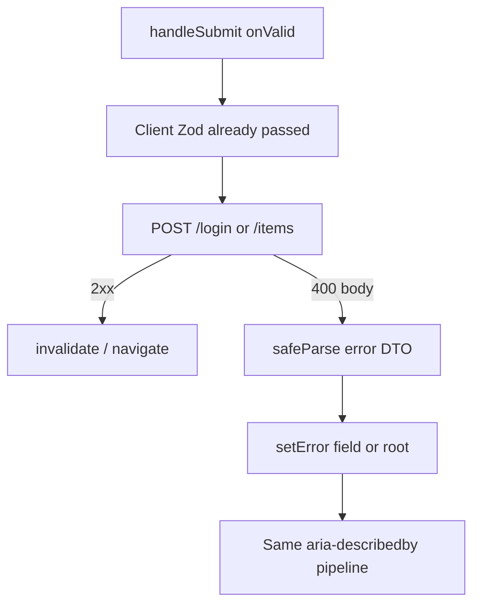

# Month 7 · Week 2 · Day 4
# Client vs Server Validation and Mapping Errors onto Fields

**Program:** Full-Stack Mastery · 18 months  
**Phase:** 2 — Modern frontend  
**Month index:** [../../README.md](../../README.md)  
**Week 2:** [1](day-01.md) · [2](day-02.md) · [3](day-03.md) · Day 4 (today) · [5](day-05.md) · [6](day-06.md) · [7](day-07.md)  
**Week rhythm today:** Learn + lab feature  
**Student state:** Day 3 gate. Client Zod blocks empty submit. A real API (and a honest mock) still says **no** after that. If you only `console.error` the 400, the user cannot fix the field.  
**Study time:** 3–4 focused hours

Today: **client vs server validation**, **field-level messages from the server**, **`setError`**, a **login** form and an **item** (create) form that both survive a simulated 400.

Project 4 is **not** a paste target. Labs: `~\fullstack-lab\month-07\`. Later you will map the same pattern onto `~/ops-dashboard/` create/edit — **you** write that.

---

## How to use this textbook

1. Read a section. Close it. Say the idea.
2. Type both forms. Do not paste a dashboard login.
3. When the mock returns 400, the **field** must speak — same `aria-*` as client errors.
4. Optional review links are for later rechecking.

---

## How to read this chapter

Client Zod is a **courtesy**. It runs in the browser. It can be turned off. It cannot see “this email is already registered” or “SKU taken” without asking the server.

The server (or your mock) is **authority**. It returns 400/409/422 with a body you must treat as **`unknown`** and parse. Then you copy messages onto RHF with **`setError("email", { type: "server", message })`**.



If that is still abstract: the bouncer at the door (Zod) checks the dress code. The computer inside (API) checks whether your name is on the list. Both can reject. The user should hear **which field** the computer named.

---

## Today's contract

By the end of this day you will be able to:

1. Explain **client** vs **server** validation in one sentence each, including **why both exist**.
2. Define a **Zod schema for the error body** (unknown JSON in, field map out).
3. Call **`setError(name, { type: "server", message })`** and **`setError("root", { message })`** for non-field failures.
4. Keep **`aria-invalid` / `aria-describedby`** working for server messages (they flow through `formState.errors`).
5. Build **login** + **item create** against a mock that can reject **after** client success.
6. Disable submit while **`isPending`**; do not clear the draft on server failure.

**Today's gate.** Closed-book:

> Client Zod is UX. The server is authority. I parse the error body as unknown. I `setError` on fields. A 401 with no field still uses a form-level alert. I do not treat HTTP 200 with `{ error: "nope" }` as success — I still check `ok`.

---

## Time box

| Block | Minutes | Work |
|---|---|---|
| A | 50 | Theory |
| B | 55 | Type-along: login + `setError` |
| C | 70 | Independent: item form + unique-name 409 |
| D | 20 | Git |
| E | 15 | Recall |

---

# Block A — Theory

## 1. Two validators, two jobs

| Layer | Runs where | Can be bypassed? | Typical rules |
|---|---|---|---|
| **Client (Zod + RHF)** | Browser | Yes (disable JS, craft `fetch`) | Required, format, min length, “qty ≥ 0” |
| **Server (mock today; FastAPI later)** | API process | Not by the UI | Uniqueness, auth, quotas, “this user may not” |

**Wrong belief:** “If Zod passed, the POST cannot fail.”  
**Correct:** uniqueness, passwords, rate limits, and “record changed” live on the server.

**Wrong belief:** “I’ll skip client Zod and wait for 400s.”  
**Correct:** that is a round trip for empty fields and a worse a11y story. Do **both**.

**Wrong belief:** “I’ll skip server checks because this is a mock.”  
**Correct:** the mock’s job is to **rehearse** 400s. Project 4 requires a simulated server error.

---

## 2. Check `ok` first, then parse the body

Month 3 still owns HTTP:

```ts
const response = await fetch("/api/login", {
  method: "POST",
  headers: { "Content-Type": "application/json" },
  body: JSON.stringify(payload),
});

const json: unknown = await response.json().catch(() => undefined);

if (!response.ok) {
  throw new ApiError(response.status, json);
}

return loginSuccessSchema.parse(json);
```

A helper `ApiError` that carries `status` and `body: unknown` is better than `throw new Error("fail")` because Day 4 needs the **body**.

Do not parse a 400 body with `loginSuccessSchema`. Use an **error DTO** schema:

```ts
const fieldErrorsSchema = z.object({
  errors: z.record(z.string(), z.string()).optional(),
  message: z.string().optional(),
});

export type FieldErrorsDto = z.infer<typeof fieldErrorsSchema>;
```

Your mock can return:

```json
{ "errors": { "email": "No staff account for that email." } }
```

or

```json
{ "message": "Invalid email or password." }
```

`safeParse` the DTO. If that fails, fall back to a generic “Something went wrong” **root** error. Never `any`. Never dump the raw JSON into the page as HTML.

---

## 3. `setError` — the same `errors` object the UI already reads

```tsx
const { setError, register, handleSubmit, formState: { errors } } = useForm<LoginInput>({
  resolver: zodResolver(loginSchema),
  defaultValues: { email: "", password: "" },
});

async function onValid(data: LoginInput) {
  try {
    await loginRequest(data);
    reset();
    // navigate or set mock auth — Week 3 Context
  } catch (err) {
    if (err instanceof ApiError) {
      const parsed = fieldErrorsSchema.safeParse(err.body);
      if (parsed.success && parsed.data.errors) {
        for (const [field, message] of Object.entries(parsed.data.errors)) {
          if (field === "email" || field === "password") {
            setError(field, { type: "server", message });
          }
        }
      }
      if (parsed.success && parsed.data.message) {
        setError("root", { type: "server", message: parsed.data.message });
      }
      if (!parsed.success) {
        setError("root", { type: "server", message: "Sign-in failed." });
      }
      return;
    }
    setError("root", { type: "server", message: "Sign-in failed." });
  }
}
```

Use **`mutateAsync`** in `onValid` if the mutation should throw into this `try/catch`. `mutate` + `onError` can call `setError` too; then you need the form methods in the mutation closure. Either is fine. **Awaiting** keeps the story linear.

Root error in the UI:

```tsx
{errors.root ? (
  <p id="form-error" role="alert">
    {errors.root.message}
  </p>
) : null}
```

Optionally `aria-describedby` on the `<form>` pointing at `form-error`. Field errors keep their own ids.

**Wrong belief:** “I’ll `alert()` the server message.”  
**Correct:** field-level, associated, visible. `alert` is not a form.

**Wrong belief:** “I’ll `reset()` on error so they start over.”  
**Correct:** keep the draft. They mistyped a password, not the whole identity.

---

## 4. Mutation + Query on the item form

Login may not invalidate a list. **Create item** does:

```tsx
const createItem = useMutation({
  mutationFn: postItem,
  onSuccess: () => {
    void queryClient.invalidateQueries({ queryKey: ["items"] });
  },
});
```

If `postItem` throws `ApiError` with `{ errors: { name: "That name is taken." } }`, do **not** invalidate. The list did not change. `onSuccess` will not run. Map errors in `onError` or in `onValid`’s catch.

**Wrong belief:** “Invalidate in `onSettled` even on 400.”  
**Correct:** a failed create should not refetch as if something was written. `onSuccess` is the right hook for invalidate.

---

## 5. What to put in the mock (so the lab is teachable)

**Login mock:**

- Client schema: email format + password `min(8)`.
- Server: only `staff@harbor.test` / `harborharbor` succeeds (document this in `CREDS.txt` — lab secret, not production).
- Wrong email that **passes Zod**: `{ errors: { email: "No staff account for that email." } }` status 401.
- Wrong password: `{ message: "Invalid email or password." }` — **do not** confirm which part failed if you are rehearsing real auth; a single root message is the grown-up pattern. For **learning `setError` on a field**, also support a path that sets `password`.
- Optional: email `taken@harbor.test` on a **register** variant — skip if you only have login.

**Item mock:**

- Client: `name` non-blank, `qty` integer ≥ 0 (`z.coerce.number().int().nonnegative()` is reasonable **on form strings**; GET JSON should still be real numbers without coerce).
- Server: if `name` case-insensitive-equals an existing item, **409** `{ errors: { name: "A crate with that name already exists." } }`.
- Empty name should never reach the server if client Zod works; still reject it server-side if it does.

This is **not** security. It is a rehearsal.

---

## 6. Accessible errors do not change

Server `setError("name", { message })` fills `errors.name.message`. The same `p#name-error` and `aria-describedby` work. Do not build a second error UI for “server” vs “client.” The user does not care who rejected them.

Focus: RHF `shouldFocusError` focuses the first invalid field after **client** fail. After **async** server fail, you may `setFocus("name")` yourself.

---

# Block B — Type-along

```powershell
cd ~\fullstack-lab\month-07
npm create vite@latest week-02-server-errors -- --template react-ts
cd week-02-server-errors
npm install
npm install zod react-hook-form @hookform/resolvers @tanstack/react-query
npm run dev
```

1. `ApiError` class + `fieldErrorsSchema`.
2. `loginSchema` + `LoginForm` with accessible errors.
3. `loginRequest` mock (Promise, 300ms delay): success one pair; otherwise 401 body as above. No real HTTP required — a function that throws `ApiError` is enough. You may still wrap it in `useMutation({ mutationFn: loginRequest })`.
4. Prove: password too short → **client** message on password. Valid shape but wrong email → **server** message on email. Button disabled while pending.
5. `CREDS.txt` with the successful pair.

---

## 7. Status codes you will actually map

| Status | Typical meaning | UI |
|---|---|---|
| 400 / 422 | Field or body invalid | `errors` map → `setError` fields |
| 401 | Bad credentials / not signed in | Root message; do not confirm which field if this is **password** login |
| 403 | Signed in but not allowed | Root; do not pretend it is “title required” |
| 409 | Conflict (unique name) | Field if the server named it |
| 500 | Your mock “desk offline” | Root; log |

**Wrong belief:** “I’ll use 200 `{ success: false }` because fetch is easier.”  
**Correct:** Month 3: `ok` is the contract. A 200 with an error flag trains you to skip `ok` forever. The mock must `throw` or return `ok: false`.

If the mock is in-process (no HTTP), **still** throw `ApiError` with a status so `onValid` does not grow a second protocol.

`focus` after server error:

```ts
setError("name", { type: "server", message: "A crate with that name already exists." });
setFocus("name");
```

`setFocus` comes from `useForm`. Combined with `aria-invalid`, the clerk lands on the field that can fix the 409.

---

## 8. Create vs edit

Edit forms `defaultValues` from **Query detail data**. Wait until `isSuccess` before mounting the form **or** `reset(detail)` when data arrives. Do not `useEffect` copy field-by-field into RHF if `reset` exists.

```tsx
const { data, isPending, isError } = useQuery({
  queryKey: ["crates", id],
  queryFn: () => getCrate(id),
  enabled: id > 0,
});

if (isPending) return <p role="status">Loading crate</p>;
if (isError || !data) return <p role="alert">Could not load crate.</p>;
return <CrateForm defaultValues={data} crateId={id} />;
```

Key the form `key={data.id}` so RHF does not keep the previous crate’s draft. Invalidation of `["crates"]` after edit should include the **detail** key: `invalidateQueries({ queryKey: ["crates"] })` prefix already hits `["crates", id]`.

Today’s independent lab can skip edit if login + create uniqueness is solid. Note it in MAP.md.

---

# Block C — Independent

**Crate intake** (warehouse *toy* domain — not Project 4 SKU copy):

1. Query list of crates (`["crates"]`). In-memory API. Zod parse on “GET” (`z.array(crateSchema)`).
2. RHF create form: name + qty. `zodResolver`. Accessible errors.
3. `useMutation({ mutationFn })`; `onSuccess` invalidate `["crates"]`.
4. Duplicate name → 409 field error on `name`. Unique name appears in the list after invalidate.
5. Form-level root error if the mock throws a 500 with only `{ message: "Desk offline." }`.

`MAP.md`: table — HTTP status, body, which `setError` path.

No Redux. CSS you type.

```powershell
cd ~\fullstack-lab
git add month-07/week-02-server-errors
git commit -m "Week 2 Day 4: setError from parsed server bodies."
```

---

# Block E — Recall

1. Why both client and server validation.  
2. Why error JSON is `unknown`.  
3. `setError` field vs `root`.  
4. Why not invalidate on 400.  
5. Why not `reset()` on failure.  
6. Why 200 + error flag is still a Month 3 bug.

---

## Definition of done

- [ ] I can teach client vs server without mixing them
- [ ] Login maps a server field or root error via `setError`
- [ ] Item/crate form maps uniqueness onto a field
- [ ] Same a11y pipeline for both error sources
- [ ] MAP.md / CREDS.txt exist
- [ ] Commit exists

---

## Optional review links

Server error mapping is explained in this chapter.

- [React Hook Form: `setError`](https://react-hook-form.com/docs/useform/seterror)
- [MDN: 422 Unprocessable Entity](https://developer.mozilla.org/en-US/docs/Web/HTTP/Status/422)

---

## Tomorrow

**RTL:** fill a form, submit, assert field error (client) and a mocked server 400 (associated message). User-event, not `fireEvent` as the default.
