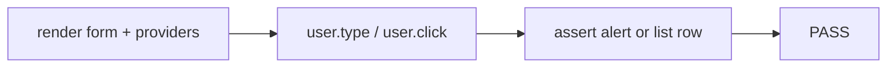

# Month 7 · Week 2 · Day 5
# Tests: Forms Through Labels, Errors Through Roles

**Month index:** [../../README.md](../../README.md)  
**Week 2:** [1](day-01.md) · [2](day-02.md) · [3](day-03.md) · [4](day-04.md) · Day 5 (today) · [6](day-06.md) · [7](day-07.md)  
**Week rhythm today:** Tests + refactor + documentation  
**Study time:** 3–4 focused hours  
**Student state:** You have login and item/crate forms with Zod + RHF and `setError` from a mock API. Today you **claim** those behaviors.

Query tests (Week 1 Day 5) still wrap a **fresh** `QueryClient` with **`retry: false`** when the form also lists data. MSW as a network layer is Week 4; today mock the **`mutationFn`** or `fetch`.

Do **not** paste Project 4 tests as the only evidence. Test **this week’s** lab form.

---

## How to read this chapter

A form test is a claim: a person who can see labels can type, submit, and read errors. If you cannot `getByRole("textbox", { name: /title/i })`, the **product** is unlabeled — the test is doing its job when it fails.



Read until you can say why `container.querySelector("input.name")` is the wrong *main* assertion. Then write tests from the **spec** below.

---

## Complete explanation (form tests this week)

### What we are proving

Good claims:

- Submitting empty **Name** shows an accessible error (the textbox is `invalid`, described by the message).
- Submitting a valid client body still shows **“already exists”** on Name when the mock 409s.
- Successful create shows the new title in the list (Query invalidation) — wrap QueryClient.
- Login: short password → client message; well-shaped wrong email → server message.

Bad claims:

- `zodResolver` was called.
- `errors.title.type === "server"` (implementation).
- Snapshot of the whole DOM as the only test.

**Wrong belief:** “I’ll call `setError` from the test.”  
**Correct:** the test types and clicks. The product calls `setError`.

### user-event

```tsx
const user = userEvent.setup();
await user.type(screen.getByLabelText(/name/i), "Oak crate");
await user.click(screen.getByRole("button", { name: /add crate/i }));
```

Prefer **`getByLabelText`** / **`getByRole`**. `placeholder` is not a label.

RHF + Zod often validates on submit. `user.click(submit)` is the act. Then **`findByRole("alert")`** (async) for the message.

### Accessible assertions

```tsx
const nameInput = screen.getByLabelText(/name/i);
expect(nameInput).toHaveAttribute("aria-invalid", "true");
expect(nameInput).toHaveAccessibleDescription(/required/i);
```

`toHaveAccessibleDescription` (jest-dom) checks `aria-describedby` text. If that matcher is awkward with your versions, `expect(screen.getByRole("alert")).toHaveTextContent(/required/i)` plus `expect(nameInput).toHaveAttribute("aria-describedby", "name-error")` is honest.

### Providers

```tsx
function renderForm(ui: ReactNode) {
  const client = new QueryClient({
    defaultOptions: { queries: { retry: false }, mutations: { retry: false } },
  });
  return render(
    <QueryClientProvider client={client}>{ui}</QueryClientProvider>,
  );
}
```

If the form has no Query, skip the provider. Do not wrap Redux.

### Mocking the server

```ts
vi.spyOn(api, "postCrate").mockRejectedValueOnce(
  new ApiError(409, { errors: { name: "A crate with that name already exists." } }),
);
```

Or `vi.stubGlobal("fetch", ...)` with `ok: false`, `status: 409`, `json: async () => ({ errors: { name: "..." } })`.

`afterEach`: restore mocks. New QueryClient every test.

### Async and RHF

Do not `fireEvent.change` as your default. `user-event` fills the value RHF’s `onChange` expects.

If submit is too fast to see `isPending`, you still assert the **outcome**. A loading name on the button (`Add crate` → `Saving`) is a bonus claim: `findByRole("button", { name: /saving/i })`.

### Client-empty test (adapt labels)

```tsx
test("empty name shows an associated error", async () => {
  const user = userEvent.setup();
  renderForm(<CratePage />);
  await user.click(screen.getByRole("button", { name: /add crate/i }));
  const nameInput = screen.getByLabelText(/name/i);
  expect(await screen.findByRole("alert")).toHaveTextContent(/required/i);
  expect(nameInput).toHaveAttribute("aria-invalid", "true");
  expect(nameInput).toHaveAttribute("aria-describedby", "name-error");
});
```

The server-error test must type a **valid** name first. Empty submit is client Zod. Duplicate is the mock 409.

**Wrong belief:** “I’ll `expect(formState.errors.name).toBeDefined()`.”  
**Correct:** export `formState` and you tested RHF, not the clerk. Query by label.

**Wrong belief:** “One QueryClient for the whole `describe` is faster.”  
**Correct:** test B will see test A’s created crate. New client every test. `retry: false`.

**Wrong belief:** “`getByRole('alert')` before `await` is fine.”  
**Correct:** RHF + Zod after click is often **async**. `findByRole` waits. `getBy` throws immediately.

Windows: `cd` into the lab. `npm test` is `vitest run`. If `toHaveAccessibleDescription` is missing, assert `aria-describedby` plus the alert text — still two claims, still not a CSS class.

If the form also lists crates, wrap `QueryClientProvider`. If it does not, skip the provider. Do not wrap Redux.

---

## Today's contract

1. At least **two** RTL tests: client validation fail; server field error.  
2. Optional third: success path shows new row.  
3. `npm test` green; one deliberate fail; restore.  
4. TESTS.md.

**Today's gate**

> Tests type into **labeled** fields and assert **associated** errors. I did not export `formState` for the test.

---

## Time box

| Block | Minutes | Work |
|---|---|---|
| A | 30 | Theory spoken |
| B | 55 | Client-error test + server-error test |
| C | 45 | Success test or login test; break; restore |
| D | 25 | TESTS.md + README |
| E | 15 | Recall |

---

# Block B — Type-along

Work in `week-02-server-errors` or `week-02-from-memory`. Install Vitest + RTL if missing (Month 6 / Week 1 Day 5 pattern).

1. Extract `renderForm` if the tree needs Query.  
2. Test: render create form, click submit without typing, `findByRole("alert")` matches title/name required. Assert `aria-invalid` on that input.  
3. Test: type a name the mock treats as duplicate, submit, find alert `/already exists/i`.

Use **your** button accessible name. If `getByRole("button", { name })` fails, fix the **button text**, not the test with a CSS selector.

---

# Block C — Independent

1. Login form: password of 3 characters → client error on password.  
2. Stretch: mock success, assert list row **or** a “Signed in” status.  
3. Break the label (`<input>` without `id`/`htmlFor`). Test should fail or become harder — restore the label. Write one sentence in TESTS.md: tests failed when a11y failed.

---

# Block D — Docs

README: `npm test`. Note: tests use labels, not css classes.

```powershell
cd ~\fullstack-lab
git add month-07
git commit -m "Week 2 Day 5: RTL form tests for Zod and server errors."
```

---

# Recall

1. Why `getByLabelText` beats `querySelector`.  
2. Why the test does not call `setError`.  
3. Why QueryClient is per test when the form invalidates a list.  
4. `findBy` vs `getBy` after submit.  
5. Why a snapshot-only test is a weak claim.

---

### What to do when RHF and user-event disagree

If `user.type` does not fill the field, check:

1. The field has a **label** (`htmlFor`/`id` or wrap).  
2. You used `await user.click(submit)` after type — RHF default validates on submit.  
3. You did not forget `userEvent.setup()`.  
4. The input is not `disabled` from a stuck mutation mock.

If `findByRole("alert")` finds **two** alerts (one per field), use `getAllByRole("alert")` or `getByRole("alert", { name: ... })` if the alert has accessible text. Prefer asserting the **input’s** `aria-invalid` plus the specific message text.

**Wrong belief:** “I’ll `fireEvent.change` because user-event is slow.”  
**Correct:** user-event is the default. `fireEvent` skips focus and may skip RHF’s `onBlur` if you later switch `mode` to `onBlur`.

For server errors, the mock must **reject** after the client schema would pass. Type a **valid** name that the mock treats as duplicate. If you type empty, you are testing client Zod twice.

```tsx
test("duplicate name shows a field error", async () => {
  const user = userEvent.setup();
  vi.spyOn(api, "postCrate").mockRejectedValueOnce(
    new ApiError(409, { errors: { name: "A crate with that name already exists." } }),
  );
  renderForm(<CratePage />);
  await user.type(screen.getByLabelText(/name/i), "Oak");
  await user.click(screen.getByRole("button", { name: /add crate/i }));
  expect(await screen.findByText(/already exists/i)).toBeInTheDocument();
  expect(screen.getByLabelText(/name/i)).toHaveAttribute("aria-invalid", "true");
});
```

That is the shape. Use **your** labels.

### Vitest wiring (Windows)

```powershell
cd ~\fullstack-lab\month-07\week-02-server-errors
npm install -D vitest jsdom @testing-library/react @testing-library/jest-dom @testing-library/user-event
```

`"test": "vitest run"`. `environment: "jsdom"`. Setup file imports `@testing-library/jest-dom/vitest`. Explicit `import { expect, test } from "vitest"`.

If the page also shows a Query list, `renderForm` wraps a **new** `QueryClient` with `retry: false` and `mutations: { retry: false }`. Do not import the production client from `main.tsx`.

Deliberate fail: remove `htmlFor`/`id` from Name. The label query should fail or get harder. Restore. Write in `TESTS.md`: tests failed when a11y failed.

Success-path stretch: mock `postCrate` resolve, submit a valid unique name, `findByText` the new title after invalidation. If the list never appears, you mocked the POST but the GET still hits a real URL — mock both, or use an in-memory module both paths share.

`noValidate` on the form so the test sees Zod alerts, not native bubbles.

### Login test (client vs server)

```tsx
test("short password is a client error", async () => {
  const user = userEvent.setup();
  renderForm(<LoginForm />);
  await user.type(screen.getByLabelText(/email/i), "clerk@clinic.test");
  await user.type(screen.getByLabelText(/password/i), "ab");
  await user.click(screen.getByRole("button", { name: /sign in/i }));
  expect(await screen.findByRole("alert")).toHaveTextContent(/password/i);
});
```

Well-shaped wrong password: mock reject, `setError` on a field or `root`, assert that message. Do not `reset()` on failure.

`TESTS.md` table: command, claim, PASS date, deliberate-fail note. README: tests use **labels**, not CSS classes. No Redux wrapper. QueryClient only if the tree queries.

If `user.type` does nothing, the input is missing a label or is `disabled`. Fix the product.

Deliberate fail today: change the required message in the schema without updating the test — red — restore. Or remove `aria-describedby` and watch the accessible-description assertion fail. Record the test **name** in `TESTS.md`.

Query by `getByLabelText(/name/i)` even when the visible text is “Crate name”. Placeholder is not a label. `data-testid` is not the contract this week.

---

## Definition of done

- [ ] Client validation test green
- [ ] Server field-error test green
- [ ] I saw a test go red on purpose
- [ ] TESTS.md exists
- [ ] Commit exists

### Wrapper reminder (forms that also list)

```tsx
function renderForm(ui: React.ReactNode) {
  const client = new QueryClient({
    defaultOptions: {
      queries: { retry: false },
      mutations: { retry: false },
    },
  });
  return render(
    <QueryClientProvider client={client}>{ui}</QueryClientProvider>,
  );
}
```

After each test, restore spies. Do not share one client across the file. Client Zod fail and server 409 are **two** tests; empty submit is not a 409.

Windows: extra `--` if you scaffolded a new app today. `npm test` is `vitest run`.

---

## Optional review links

Form testing is explained in this chapter.

- [Testing Library: Forms](https://testing-library.com/docs/guide-which-query)
- [Testing Library: user-event](https://testing-library.com/docs/user-event/intro)
- [jest-dom: `toHaveAccessibleDescription`](https://github.com/testing-library/jest-dom#tohaveaccessibledescription)

---

## Tomorrow

Independent lab, **not** Project 4 domain. Teachback on client vs server validation. A small form+list you can explain.
