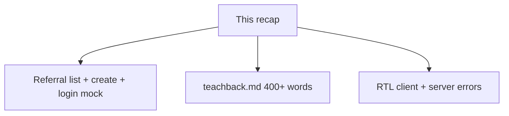

# Month 7 · Week 2 · Day 6
# Independent: Clinic Referral Form (Not Project 4)

**Month index:** [../../README.md](../../README.md)  
**Week 2:** [1](day-01.md) · [2](day-02.md) · [3](day-03.md) · [4](day-04.md) · [5](day-05.md) · Day 6 (today) · [7](day-07.md)  
**Week rhythm today:** Independent project work  
**Study time:** 3–4 focused hours  
**Days 1–5 textbook files:** closed for the *challenges*. Repair from **this recap**.

---

## How to read this chapter

Today you prove Week 2 without a type-along. New domain: **clinic referrals** — not crates, not harbor login copy-paste, not Project 4.



Allowed: this file, your notes, the error in front of you.  
Not allowed: Days 1–5 as paste, Project 4 forms, AI writing `ReferralForm.tsx`.

Stuck > 25 minutes: one textbook section from Day 1 or 2, then close. Record lookups.

---

## Complete explanation (this book is the lesson)

### Zod at the edge

JSON is **`unknown`**. `parse` throws (good in `queryFn`). `safeParse` branches. **`z.infer<typeof schema>`** is the type. No duplicate interface. No `any`. No `as Referral[]` as the only check.

GET list: `referralListSchema.parse(json)` after `ok`. Bad payload → Query `isError`.

Create body: a **create** schema (`omit` id). Same family as the GET schema.

### RHF

`useForm({ resolver: zodResolver(schema), defaultValues })`. Native fields: **`register`**. Custom widgets: **`control` + `Controller`**. **`handleSubmit(onValid)`**. **`noValidate`**. Mutation **`isPending`** disables submit.

Accessible errors: label `htmlFor`/`id`; message **`id`**; input **`aria-describedby`** and **`aria-invalid`**. Client and server messages share that pipeline.

### Client vs server

Client Zod: format and presence. Server mock: uniqueness, unknown email, “desk offline.” Parse error DTO with Zod. **`setError("field", { type: "server", message })`** or **`root`**. Do not invalidate on failure. Do not `reset()` on failure.

### Query

List: `useQuery({ queryKey: ["referrals"], queryFn })`. Create: `useMutation({ mutationFn, onSuccess: () => queryClient.invalidateQueries({ queryKey: ["referrals"] }) })`. v5 object syntax. `isPending` first load; do not blank on `isFetching`.

### Tests

Own `QueryClient`, `retry: false`. user-event. Labels. Alerts.

No Redux. Tailwind optional after CSS.

### Three tools, three jobs (say this before you scaffold)

| Tool | Owns | Does not own |
|---|---|---|
| **Zod** | Runtime shape of unknown JSON and of the draft at submit | The cache, the DOM |
| **RHF** | Draft, `register`, `errors`, `setError` | The referral list |
| **Query** | GET list, mutation, `invalidateQueries({ queryKey: ["referrals"] })` | Keystrokes |

```tsx
useQuery({
  queryKey: ["referrals"],
  queryFn: listReferrals,
});

useMutation({
  mutationFn: createReferral,
  onSuccess: () => {
    void queryClient.invalidateQueries({ queryKey: ["referrals"] });
    reset();
  },
});
```

On 409 you `setError("initials", { type: "server", message })`. You do **not** invalidate. You do **not** `reset()`.

Login is the same machine: `zodResolver` for format; mock `loginStaff` for the pair in `CREDS.txt`; `setError` on the email field or `root`.

**Wrong belief:** “I’ll put referrals on a session Context so the list is ready after login.”  
**Correct:** the list page mounts and `useQuery` runs. Context holds `user`, not rows.

**Wrong belief:** “Client Zod is security.”  
**Correct:** it is UX. A real API must still reject. Your mock is the stand-in authority today.

**Wrong belief:** “`isFetching` should unmount the table so the clerk knows it is updating.”  
**Correct:** `isPending` is first load. Keep rows on refetch.

Scaffold:

```powershell
cd ~\fullstack-lab\month-07
npm create vite@latest week-02-referrals -- --template react-ts
cd week-02-referrals
npm install
npm install zod react-hook-form @hookform/resolvers @tanstack/react-query @tanstack/react-query-devtools
```

Parse list JSON with Zod even if the “network” is a module: return unknown-shaped data from a fake `fetch` **or** parse in `listReferrals` so `queryFn` can throw. Empty array is success.

---

## Today's contract

1. Clinic referral mini-app from the spec.  
2. **`teachback.md` ≥ 400 words** — client vs server validation, plus where Query vs RHF vs Zod sit.  
3. RTL: client empty submit + server field error.

**Today's gate**

> I can teach the three tools (Zod, RHF, Query) and I have a form whose server 409 lands on a field.

---

## Time box

| Block | Minutes | Work |
|---|---|---|
| 0 | 15 | Recap aloud |
| 1 | 90 | Challenge 1 — referrals |
| 2 | 40 | Challenge 2 — teachback |
| 3 | 30 | Challenge 3 — tests |
| 4 | 15 | Git |

---

# Challenge 1 — Referral desk

```powershell
cd ~\fullstack-lab\month-07
npm create vite@latest week-02-referrals -- --template react-ts
cd week-02-referrals
npm install
npm install zod react-hook-form @hookform/resolvers @tanstack/react-query @tanstack/react-query-devtools
```

Fictional **Northline Clinic** referral intake. Patient initials + specialty + notes. **Not** ops inventory.

### Required

1. In-memory API: `listReferrals`, `createReferral`, `loginStaff`. Delays. Zod on list payloads.  
2. **Login form:** email/password, accessible errors, one successful pair in `CREDS.txt`, server reject maps to field or root.  
3. **Referral form** (visible after mock login **or** on the same page if you skip routing — routing is optional; a `useState` “session” is enough; Context is Week 3). Unique specialty+initials pair or unique `initials` — your rule — returns 409 on a field.  
4. List with Query; invalidate `["referrals"]` on create success.  
5. One `h1` per screen if you split login/list; landmarks; CSS you type.

### Forbidden

- Project 4. Redux. `any`. `dangerouslySetInnerHTML`.  
- Copying Day 4 crate names.

`BOUNDARY.md`: Zod / RHF / Query / client `useState` — what each owns.

---

# Challenge 2 — Teachback (400+ words)

`teachback.md` in the app folder. Prose, not a caption list. Cover:

- Why `unknown` + Zod at GET and at error bodies.  
- Why RHF instead of twelve `useState`s.  
- `register` vs `Controller` in *this* app (even if you only used `register` — say why).  
- Client vs server validation with **your** 409 example.  
- How `setError` reuses a11y wiring.  
- What Query invalidation does after a successful referral.  
- What you would still need a real backend to enforce.

Word count ≥ 400.

---

# Challenge 3 — Tests

Two tests minimum, three better. `npm test` green. TESTS.md.

---

# Git

```powershell
cd ~\fullstack-lab
git add month-07/week-02-referrals
git commit -m "Week 2 Day 6: clinic referrals with Zod, RHF, and Query."
```

---

# Field-level messages — a worked walk-through

Suppose the clinic already has initials `AJ` for cardiology. The user types `AJ`, chooses cardiology, submits.

1. Client Zod: initials non-blank, specialty chosen — **pass**. `onValid` runs.  
2. `mutationFn` POST (or in-memory create) finds the pair, throws `ApiError(409, { errors: { initials: "A cardiology referral for AJ already exists." } })`.  
3. You `safeParse` the body. On success, `setError("initials", { type: "server", message: "..." })`.  
4. RHF fills `errors.initials`. The input already has `aria-describedby="initials-error"` when `errors.initials` is set. The `<p id="initials-error" role="alert">` appears.  
5. You **do not** `invalidateQueries`. The list did not gain a row.  
6. You **do not** `reset()`. The clerk should change initials or specialty, not retype the note.

**Wrong belief:** “I’ll `alert` the 409 and keep the form ‘clean.’”  
**Correct:** field-level, associated, visible. Same pipeline as “required.”

If the mock returns 500 `{ message: "Referral desk offline." }` with no `errors` map, `setError("root", { message })` and a form-level `role="alert"`. Do not pretend it was the initials field.

Login is the same machine with different fields: short password never leaves the browser; well-shaped wrong email is a **server** story.

---

# What “independent” still forbids

- Importing `week-02-server-errors` components.  
- A schema typed as `z.any()`.  
- Query `isPending` blanking the list after the first success.  
- `useEffect` that copies form values into Query.

`FORBIDDEN.txt`: one sentence confirming you did not do those, or a confession if you did and then undid them.

---

# Recall

1. Three tools, three jobs.  
2. Why 409 does not invalidate.  
3. Why the test uses the label.  
4. Walk AJ/cardiology from submit to `aria-describedby`.

PowerShell word count:

```powershell
(Get-Content .\teachback.md | Measure-Object -Word).Words
```

If it is under 400, keep writing about *this* clinic, not a generic “forms are important” paragraph.

### Login + list on one page (allowed)

Routing is optional today. A `session` `useState` or a tiny Auth Context is enough. After mock login, show the referral form and the Query list. Do not put the referral **array** on that context.

Accessible referral fields: initials and specialty each have `htmlFor`/`id`, error `id`, `aria-describedby`, `aria-invalid`. `register` those native inputs. `handleSubmit` → `mutate`. Mutation `isPending` disables submit.

```tsx
<form
  noValidate
  onSubmit={handleSubmit((values) => {
    create.mutate(values);
  })}
>
```

`onError` maps Zod-parsed `{ errors: { initials?: string } }` through `setError`. Unknown 500 → `setError("root", { message: "Referral desk offline." })`.

List:

```tsx
{listQuery.isPending ? (
  <p role="status">Loading referrals</p>
) : listQuery.isError ? (
  <p role="alert">Could not load referrals.</p>
) : listQuery.data.length === 0 ? (
  <p>No referrals yet.</p>
) : (
  <ul>
    {listQuery.data.map((row) => (
      <li key={row.id}>
        {row.initials} — {row.specialty}
      </li>
    ))}
  </ul>
)}
```

`queryFn` uses Zod `parse` on the payload. Empty array is success. No Redux. No Project 4 nouns.

RTL: empty submit → alert on initials or specialty. Valid duplicate pair → already-exists on a field. `retry: false`. Labels, not classes.

### CREDS.txt and BOUNDARY.md

`CREDS.txt`: one successful email/password pair and the 409 rule (unique initials, or unique initials+specialty). Not a real secret. Mock only.

`BOUNDARY.md` sentences:

- Zod parses GET lists and error bodies; infers create types.  
- RHF owns drafts and `setError`.  
- Query owns `["referrals"]` and invalidates on **success**.  
- `useState`/Context owns mock session, not rows.

Teachback must include the AJ/cardiology walk-through in **prose**. PowerShell word count on the file. Under 400 is not done.

No `z.any()`. No `dangerouslySetInnerHTML`. No Project 4 inventory names.

---

## Definition of done

- [ ] New domain, not a renamed Project 4
- [ ] Login + item-like form; server error on a field
- [ ] Query list + invalidate on success
- [ ] teachback.md ≥ 400 words
- [ ] RTL tests green
- [ ] FORBIDDEN.txt exists
- [ ] Commit exists

---

## Optional review links

Week 2 is explained in this chapter.

- [Zod](https://zod.dev/)
- [React Hook Form: `setError`](https://react-hook-form.com/docs/useform/seterror)
- [TanStack Query: Mutations](https://tanstack.com/query/latest/docs/framework/react/guides/mutations)

---

## Tomorrow

Week review: synthesis, mini-build, debug (no resolver; missing `aria-describedby`; treating 400 as success). Do not start Week 3 because the calendar moved.

If teachback.md is 390 words, you are not done. Add the 409 walk-through in prose until the count clears 400. Word processors lie; `Measure-Object -Word` in PowerShell on the file is honest.
