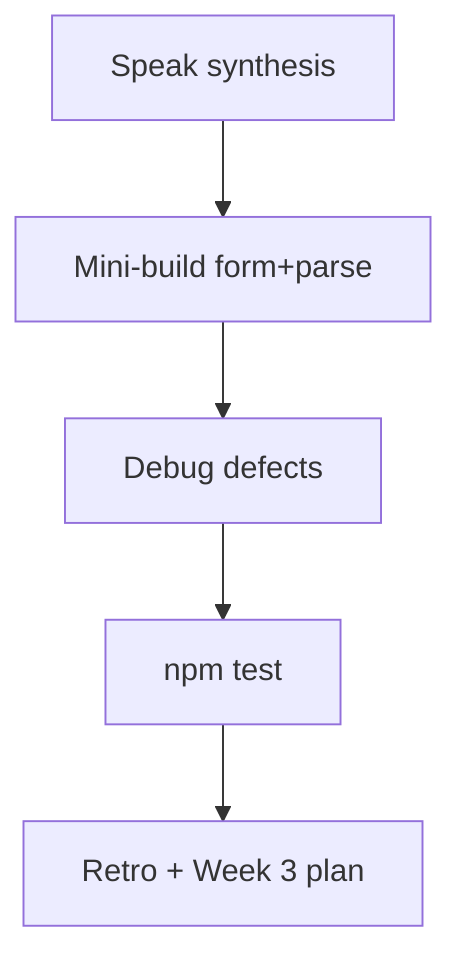

# Month 7 · Week 2 · Day 7
# Week Review — Zod, RHF, Accessible Errors, Server Mapping

**Month index:** [../../README.md](../../README.md)  
**Week 2:** [1](day-01.md) · [2](day-02.md) · [3](day-03.md) · [4](day-04.md) · [5](day-05.md) · [6](day-06.md) · Day 7 (today)  
**Week rhythm today:** Review, repair, plan Week 3  
**Study time:** 3–4 focused hours  
**Student state:** You parsed JSON with Zod, built RHF forms, mapped server errors. Today those ideas must still live in your head — from **this file**.

Do not start Week 3 because the calendar moved. Start Week 3 because this file’s gate is true.

---

## How to read this chapter

Closed-book teaching day. The synthesis **is** the lesson.

1. Read. Say it.  
2. Mini-build with Days 1–6 closed.  
3. Debug. Repair the weakest topic **today**.



---

## Week synthesis (the lesson, in this book)

**Zod** runs at runtime. Network JSON is **`unknown`**. **`parse`** throws; **`safeParse`** returns success/error. **`z.infer<typeof schema>`** is the type. Parse in `api/` so Query never caches garbage.

**RHF** holds **form state** (the draft). **`register`** native inputs; **`control`/`Controller`** custom widgets. **`handleSubmit`** + **`zodResolver`** from `@hookform/resolvers/zod`. `noValidate` on the form.

**A11y:** label `htmlFor`/`id`; error `id`; `aria-describedby`; `aria-invalid`; `role="alert"` on the message.

**Client vs server:** Zod in the browser is UX. The API is authority. Parse error bodies with Zod. **`setError("field", { type: "server", message })`** or `root`. Same UI pipeline. No invalidate on 400. No reset on 400.

**Query** still owns the list: `useMutation({ mutationFn })` then `invalidateQueries({ queryKey: ['items'] })` on **success**.

**Tests:** labels, user-event, alerts, QueryClient per test if needed, `retry: false`.

No Redux this week. No `any`. JSX text still XSS-safe; no `dangerouslySetInnerHTML`.

---

## Today's contract

1. Teach Week 2 aloud.  
2. Mini-build a parsed list + accessible create form with one server 409.  
3. Debug: missing resolver; missing `aria-describedby`; 400 treated as success.  
4. Re-run tests.  
5. Retro; Week 3 is **state architecture** (URL, Context for mock auth, RTK **literacy**).

**Today's gate.** Closed-book:

> Unknown JSON is parsed with Zod. Forms use RHF + zodResolver with associated errors. Server 400 maps through `setError`. Lists still invalidate in Query.

---

## Time box

| Block | Minutes | Work |
|---|---|---|
| 1 | 40 | Speak the synthesis |
| 2 | 50 | Mini-build |
| 3 | 35 | Debug A–C |
| 4 | 20 | Tests |
| 5 | 25 | Retro + repair |

---

# Complete explanation — forms you must still own

## 1. Zod

```ts
export const itemSchema = z.object({
  id: z.number(),
  name: z.string().min(1),
});
export type Item = z.infer<typeof itemSchema>;
```

`queryFn`: `ok` check, `unknown`, `itemListSchema.parse`. Invalid → throw → `isError`.

**Wrong belief:** “`as Item` is parsing.”  
**Correct:** parsing runs. Assertion does not.

## 2. RHF + resolver

```tsx
useForm<CreateItem>({
  resolver: zodResolver(createItemSchema),
  defaultValues: { name: "" },
});
```

`register("name")`. `handleSubmit(onValid)`. `onValid` receives **CreateItem**, not a raw event.

## 3. Errors people can hear

Without `aria-describedby`, a screen reader user on the input may never hear the message. Color is not a program.

## 4. Server mapping

```ts
setError("name", { type: "server", message: "Already exists." });
setError("root", { type: "server", message: "Desk offline." });
```

Error JSON is `unknown`. `safeParse` a DTO. Fallback root message.

## 5. Query boundary

RHF does not fetch the list. Query does not store the draft. Context (next week) does not store GET `/items`.

### Mini-build wiring (type it)

```tsx
const create = useMutation({
  mutationFn: createHold,
  onSuccess: () => {
    void queryClient.invalidateQueries({ queryKey: ["holds"] });
    reset();
  },
  onError: (error) => {
    if (error instanceof ApiError && error.field === "title") {
      setError("title", { type: "server", message: error.message });
      return;
    }
    setError("root", { type: "server", message: "Desk offline." });
  },
});
```

Prefer parsing a Zod error DTO over a custom `field` property if you already have Day 4’s shape. The point is: **throw** on 409, **setError**, **do not invalidate**.

**Wrong belief:** “Without `zodResolver`, HTML `required` is enough.”  
**Correct:** `noValidate` is there so Zod owns messages. Native bubbles fight your `role="alert"` copy.

**Wrong belief:** “A 400 response that I `return await response.json()` is a successful mutation.”  
**Correct:** check `ok`. Throw. Otherwise `onSuccess` may invalidate.

**Wrong belief:** “I’ll `reset()` on every `onError` so the form looks clean.”  
**Correct:** the clerk should edit the duplicate title, not retype the email.

Scaffold:

```powershell
cd ~\fullstack-lab\month-07
npm create vite@latest week-02-review -- --template react-ts
cd week-02-review
npm install
npm install zod react-hook-form @hookform/resolvers @tanstack/react-query
```

Library holds: patron email + book title. Duplicate title → 409 on `title`. Accessible errors. Query list. No Project 4. No Redux.

Week 3 will not reteach `zodResolver`. If that name is mush, the mini-build is the repair.

---

# 1. Closed-book explanation (40 min)

Cover: unknown; parse/safeParse/infer; register vs control; handleSubmit; a11y trio; client vs server; setError; invalidate only on success; tests by label.

---

# 2. Mini-build (50 min)

`~\fullstack-lab\month-07\week-02-review\`

**Library hold requests** (patron email + book title). In-memory API. Zod list parse. RHF create. Duplicate title → 409 on `title`. Query list + invalidate. Accessible errors. Optional tiny login.

No Project 4. No Redux.

---

# 3. Debugging (35 min)

`review/DEBUG.txt` — full sentences.

**A. Missing resolver** — `useForm()` with no `zodResolver`. Empty submit calls `onValid` with empty strings. What the user sees. What to wire.

**B. Missing `aria-describedby`** — red `<p>` under the field, input not described. What AT does. The three pieces (`id`, describedby, invalid).

**C. 400 treated as success** — `fetch` without `ok` check; `mutationFn` returns parsed error JSON as if it were the created item; list “succeeds.” Month 3 bug in a form. What to throw; what not to invalidate.

Stretch **D.** `reset()` on 409 — why the user is angry.  
Stretch **E.** `any` on error body — what you lose.

---

# 4. Re-run tests (20 min)

One Week 2 app: `npm test`. Record PASS/FAIL. Fix today.

---

# 5. Retro + Week 3 plan (25 min)

`review/retro.md`

**Week 3:** decision order (local → compose → Context → **URL** → Query → Redux last). `useSearchParams` for `q`/`page`. Context for **mock auth only**. Redux Toolkit **literacy**: store, slice, dispatch, selector, thunks — and **why Query already cached the list**. Tiny RTK counter **not** wired into Project 4. `STATE_ARCHITECTURE.md` for a fictional app.

Repair the weakest form topic **today**.

```powershell
cd ~\fullstack-lab
git add month-07
git commit -m "Record Week 2 Zod and RHF review."
```

---

## How DEBUG.txt should sound

**A (shape):** Without `zodResolver`, `handleSubmit` still runs `onValid` with the raw values. Empty title is a string `""`, not a blocked submit. The user sees a POST of garbage or a mock 400 you then misread as “Zod works.” Wire `resolver: zodResolver(schema)`.

**B (shape):** A `<p className="error">` next to the input is visible to eyes that look there. Keyboard and AT users on the input hear the **accessible name** (the label), not a sibling they have not navigated to. `aria-describedby` points the input at `id="title-error"`. `aria-invalid` marks the state. `role="alert"` announces appearance.

**C (shape):** `const json = await response.json(); return json` after a 400 means `mutationFn` **succeeded** with an error document. Query/`onSuccess` may invalidate. The list “updates” with nonsense or does not, depending on shape. Check `ok`, throw `ApiError`, `setError`, do not invalidate.

If your sentences could apply to any library (“it broke because of state”), they fail. Name **functions**.

Repair today: pick the weakest of A–C and change a **real lab file**, not only the markdown.

---

## Week 2 definition of done

- [ ] I can teach Zod + RHF + a11y errors + setError from this book
- [ ] A form this week maps a server field error
- [ ] Query invalidation still only on success
- [ ] RTL tests by label exist and pass
- [ ] DEBUG.txt has A–C
- [ ] I repaired a real lab file for the weakest topic
- [ ] No unjustified Redux

### Mini-build list UI (holds)

```tsx
{holdsQuery.isPending ? (
  <p role="status">Loading holds</p>
) : holdsQuery.isError ? (
  <p role="alert">Could not load holds.</p>
) : holdsQuery.data.length === 0 ? (
  <p>No holds yet.</p>
) : (
  <ul>
    {holdsQuery.data.map((row) => (
      <li key={row.id}>
        {row.title} — {row.email}
      </li>
    ))}
  </ul>
)}
```

`isPending` first load only. Do not blank on `isFetching`. JSX text for titles. No Redux. No Project 4.

---

## Optional review links

Week 2 is explained in this chapter.

- [Zod](https://zod.dev/)
- [React Hook Form: Get started](https://react-hook-form.com/get-started)
- [React Hook Form: `setError`](https://react-hook-form.com/docs/useform/seterror)

---

## Next week

**Day 1 of Week 3** is the **state decision order** and **URL search params** as the source of truth for `q` and `page`. Come in able to say today’s gate in sixty seconds.

Bring a form you can submit empty with your eyes closed and still know which `id` the input points at. If that is mush, repair Day 2’s a11y lab before Week 3.

Week 3 will not reteach `zodResolver`. If that name is not in your fingers, type one login form tonight from this file’s synthesis.

Do not start Week 3 with a form that only `console.log`s. Invalidation and `setError` are this week’s remaining debts if DEBUG.txt named them.

### Mini-build persist module

```ts
export const holdSchema = z.object({
  id: z.string(),
  email: z.string().email(),
  title: z.string().min(1),
});

export const createHoldSchema = holdSchema.omit({ id: true });
export type CreateHold = z.infer<typeof createHoldSchema>;
```

In-memory `createHold`: if title already exists, throw a 409-shaped error. `queryFn` for the list: `z.array(holdSchema).parse(rows)`. `useForm<CreateHold>({ resolver: zodResolver(createHoldSchema) })`. Native `register`. Associated errors. Invalidate `["holds"]` only in `onSuccess`.

**Wrong belief:** “I’ll `as CreateHold` the form values because RHF already typed them.”  
**Correct:** the resolver is what makes `onValid` receive parsed data. Without it, empty strings flow.

Scaffold:

```powershell
cd ~\fullstack-lab\month-07
npm create vite@latest week-02-review -- --template react-ts
cd week-02-review
npm install
npm install zod react-hook-form @hookform/resolvers @tanstack/react-query
```

### Accessible hold title (review mini-build)

```tsx
<label htmlFor="title">Book title</label>
<input
  id="title"
  aria-invalid={errors.title ? true : undefined}
  aria-describedby={errors.title ? "title-error" : undefined}
  {...register("title")}
/>
{errors.title ? (
  <p id="title-error" role="alert">
    {errors.title.message}
  </p>
) : null}
```

Empty submit without `zodResolver` calls `onValid` with `""`. That is debug A. A red `<p>` without `aria-describedby` is debug B. `return await response.json()` on 400 is debug C — throw, `setError`, no invalidate.

Re-run `npm test` on **one** Week 2 app. Fix today. Week 3 is URL + Context + RTK literacy, not a second forms tutorial.

`review/DEBUG.txt` must name functions: `zodResolver`, `aria-describedby`, `ok` / `ApiError`, `invalidateQueries({ queryKey: ["holds"] })`. Slogans fail. Repair the weakest of A–C in a **lab file**, not only markdown.

One `h1`. Landmarks. CSS you type. Extra `--` on Vite create. Import from `"react-router"` only if you add a route — not required today.

---
