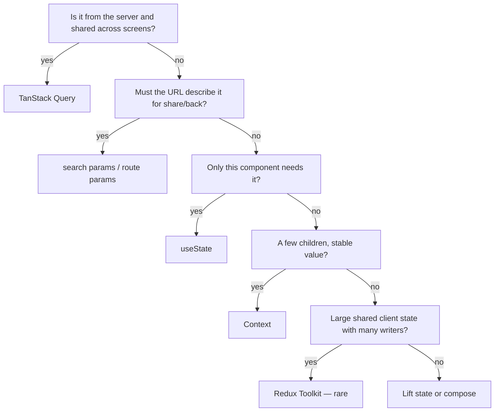
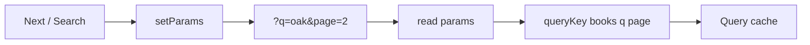

# Month 7 · Week 3 · Day 1
# Where State Lives: Decision Order and URL as Source of Truth

**Program:** Full-Stack Mastery · 18 months  
**Phase:** 2 — Modern frontend  
**Month index:** [../../README.md](../../README.md)  
**Week 3:** Day 1 (today) · [2](day-02.md) · [3](day-03.md) · [4](day-04.md) · [5](day-05.md) · [6](day-06.md) · [7](day-07.md)  
**Week rhythm today:** Learn + type-along  
**Student state:** Week 2 gate. You can put server lists in Query and drafts in RHF. Search and page are probably still `useState`. Refresh then lies: the table is page 1 again and the share link is mute.  
**Study time:** 3–4 focused hours

**This week covers:** the month’s **decision order**, **URL search params** for `q` and `page`, **Context for mock auth only**, Redux Toolkit **literacy**, and a `STATE_ARCHITECTURE.md` that does **not** invent Redux for the list cache.

Today: the **flowchart**, then **`useSearchParams`** as the source of truth for list query inputs. Context and RTK are later this week. Do not skip them. If you only memorize “put page in the URL,” you will still keep a shadow `useState` that fights the address bar.

Project 4 is **not** today’s paste target. Labs: `~\fullstack-lab\month-07\`. URL ideas later belong in `~/ops-dashboard/` list pages — **you** write those.

---

## How to use this textbook

1. Read a section. Close it. Say the idea.
2. Type the lab. Do not paste a router table you cannot explain.
3. Refresh the page with `?q=oak&page=2`. If the UI forgets, you are not done.
4. Optional review links are for later rechecking.

---

## How to read this chapter

Month 6 already taught `useSearchParams` as a **preview**. This month the URL is not a trick. It is where **shareable list controls** live so Query keys stay honest.

The Month 7 README asks one question at a time. You will hang every Project 4 field on that tree by Week 4. Today you hang **`q` and `page`**.



If that is still abstract: the address bar is the ticket the operator can photograph. Query is the kitchen’s copy of the order. `useState` is the pencil mark on the waiter’s pad that nobody else needs. Redux is a second kitchen — only if you can name the meals that are not on tickets and not on the rail.

---

## Today's contract

By the end of this day you will be able to:

1. Walk the **decision order** aloud with an example for each box.
2. Put **`q` and `page` in the URL**, not in a parallel `useState` that you “sync” with an effect.
3. Feed **the same values** into **`queryKey`** so Query and the address bar cannot disagree.
4. Use **`placeholderData: keepPreviousData`** when `page` changes.
5. **`enabled`** for empty search if the product requires a query string.
6. Reset **page to 1** when `q` changes, **in the same navigation**.

**Today's gate.** Closed-book:

> Shareable list controls live in the URL. Query keys include those params. I do not keep a second `page` in React state as the source of truth. Server data is still Query. Redux is not in this picture.

---

## Time box

| Block | Minutes | Work |
|---|---|---|
| A | 50 | Theory: decision order + search params |
| B | 55 | Type-along: catalog with `?q=` `&page=` |
| C | 70 | Independent: two filters in the URL |
| D | 20 | Git |
| E | 15 | Recall |

---

# Block A — Theory

## 1. Decision order — slow, in sentences

**1. Server state, shared across screens?** Item list, item detail, search hits from GET. **TanStack Query.** Not Redux. Not Context-as-cache. Not `useState` that you fill in `useEffect` (Month 6 was the rehearsal; Query is the instrument).

**2. Must the URL describe it?** If an operator pastes a link, hits Back, or refreshes, should they see the same **page of the same search**? Then **`q` and `page` (and sort, and filter chips that are part of the product’s share contract)** belong in **search params** or **route params** (`/items/3` is the detail id). React Router: `useSearchParams`, `useParams`.

**3. Only this component?** Modal open, “advanced filters expanded,” which tab is highlighted *if* you do not want that in the URL. **`useState`**.

**4. A few children, stable value?** Mock current user, theme. **Context.** Not the item list.

**5. Large shared client state, many writers?** Rare in Project 4. **Redux Toolkit** only if you can name the problem after 1–4 failed. Day 4 and Day 7 exist so you can **refuse** this box honestly.

**6. Otherwise** lift state or compose. Do not skip to Redux because a blog used it in 2018.

**Wrong belief:** “I’ll put everything in Redux so it’s predictable.”  
**Correct:** predictable **server** data is Query. Predictable **shareable** UI is the URL. Predictable **draft** is RHF.

**Wrong belief:** “URL state is server state.”  
**Correct:** the URL lives in the browser. It **selects** which server state to fetch. The rows are still Query.

---

## 2. Search params as source of truth

Month 6: `const [params, setParams] = useSearchParams()`. That API is still the one.

```tsx
import { useSearchParams } from "react-router";

function CatalogPage() {
  const [params, setParams] = useSearchParams();
  const q = params.get("q") ?? "";
  const page = Math.max(1, Number(params.get("page") ?? "1") || 1);

  const { data, isPending, isFetching, isPlaceholderData } = useQuery({
    queryKey: ["books", { q, page, perPage: 10 }],
    queryFn: () => listBooks({ q, page, perPage: 10 }),
    placeholderData: keepPreviousData,
    enabled: true, // or q.trim().length > 0
  });

  function onSearchSubmit(event: FormEvent<HTMLFormElement>) {
    event.preventDefault();
    const next = new URLSearchParams(params);
    const value = new FormData(event.currentTarget).get("q");
    const qNext = typeof value === "string" ? value : "";
    next.set("q", qNext);
    next.set("page", "1");
    setParams(next);
  }

  function goToPage(nextPage: number) {
    const next = new URLSearchParams(params);
    next.set("page", String(nextPage));
    setParams(next);
  }
  // ...
}
```

Rules:

1. **Read** `q` and `page` from `params`, not from `useState`.
2. **Write** by cloning `URLSearchParams` and `setParams`. Do not mutate the live object as your only step if the API expects a new one — clone, then set.
3. Changing `q` **sets page to 1** in that **same** `setParams` call. Two updates that fight will skip page reset.
4. Parse `page` defensively: `NaN` → 1. Negative → 1. This is still a string in the URL.
5. Put **`q` and `page` in `queryKey`**. The URL is the input; the key is Query’s identity.

**Wrong belief:** “I’ll `useState` for the input and `useEffect` to write the URL.”  
**Correct:** that is two sources of truth and a loop waiting to happen. For a **search box**, you may keep a local draft while typing and commit to the URL on **submit** (or debounce commit). The **committed** `q` that fetches is the param. The draft is form/UI state — optional. Do not fetch on every keystroke unless you intend to.

**Wrong belief:** “I’ll `useState(page)` and also set the URL for show.”  
**Correct:** the URL is the show **and** the state. Refresh must work.



---

## 3. What still does **not** go in the URL

| Piece | Place |
|---|---|
| Password, tokens | Never. Mock auth is Context (Day 2), not `?token=` |
| Modal “are you sure” | `useState` |
| RHF draft | RHF |
| GET `/books` rows | Query |
| Theme | Context or localStorage — product choice; not required today |

Putting `password` in the query string is a **security** defect, not a style issue.

---

## 4. Query + URL + pagination

Week 1 Day 4 still holds:

- `placeholderData: keepPreviousData` from `@tanstack/react-query`
- `isPlaceholderData` / `isFetching` for quiet pending
- `isPending` only for true first load (no cache, no placeholder)

Invalidation after create still `invalidateQueries({ queryKey: ["books"] })`. The **current** URL’s key refetches. Other pages in memory go stale. Good.

---

## 5. Router install reminder

You already used React Router in Month 6. Wrap the tree:

```tsx
<QueryClientProvider client={queryClient}>
  <BrowserRouter>
    <App />
  </BrowserRouter>
</QueryClientProvider>
```

`useSearchParams` only works **inside** `BrowserRouter`. Tests: `MemoryRouter` with `initialEntries: ["/catalog?q=oak&page=2"]`.

Import from `"react-router"` as in Month 6.

---

## 6. Debounce, drafts, and not lying to Query

A search **input** can be noisy. Three honest designs:

| Design | Draft | Committed `q` | Fetches |
|---|---|---|---|
| Submit-only | The input’s current string (RHF or `useState`) | URL after submit | Once per submit |
| Debounced URL | Local `useState` | URL after 300ms idle | Once per pause |
| Every keystroke in URL | None | URL on each `onChange` | Many keys; often too many |

**Wrong belief:** “I’ll debounce inside `queryFn` with `setTimeout`.”  
**Correct:** `queryFn` should be a **pure-ish fetch**. Debounce the **state that changes the key** (the param), not the network function. Otherwise you fight Query’s own scheduling and cancel story.

If you debounce, changing `q` still **resets page to 1** when you write the URL. Do not debounce `page` — clicking Next should be immediate.

Empty `q` after trim: either `enabled: false` (search-only product) or `q=""` as a real list-all key. Pick one in DECISION.md. Mixing “idle placeholder” with a fetch of the entire catalog is how dashboards melt JSONPlaceholder.

---

## 7. Accessibility

Search is a **form** with a labeled input and a submit **button**. Page controls are **buttons** (or links that set `?page=` — `Link` to the same path with search is excellent because **open in new tab** works). If you use `Link`:

```tsx
<Link to={{ pathname: "/catalog", search: next.toString() }}>Next</Link>
```

That is real navigation. Back button works. Prefer it over `setParams` if you want shareable pagination **and** history entries. `setParams` also writes history by default. Either is OK if refresh works. Do not use `<a href="#">`.

One `h1`. Announce current page in text.

`aria-current="page"` on the current page number if you render a list of page links. Color alone is not current page. Disabled Previous on page 1 is enough if you only have two buttons — then the visible “Page 2 of 12” text is the announcement.

**Wrong belief:** “Search params are inaccessible.”  
**Correct:** they are in the address bar **and** in labeled controls. Keep the form and the buttons; do not hide pagination in a swipe-only div.

---

## 8. What Query stores versus what the URL stores

Query’s cache identity is the **key**, not the address bar string. `?q=oak&page=2` is how humans share a view. `["books", { q: "oak", page: 2, perPage: 10 }]` is how Query knows that view is not page 1.

If you put the **raw** `window.location.search` in the key, two equivalent URLs (`?page=2&q=oak` vs `?q=oak&page=2`) become **two** cache entries for the same slice. Parse into a **canonical object**, then key that object. Order of keys inside the object is hashed stably by Query; order of **query-string pairs** in the URL is not a contract you should rely on.

**Wrong belief:** “I’ll key `["books", params.toString()]` so I never forget a filter.”  
**Correct:** you will duplicate cache entries and you will fight `setParams` that reorders pairs. Parse `q`, `page`, `sort`, `perPage`. Key the parsed values.

When the operator hits Back, the Router restores search params, the component re-reads them, the key matches an entry that may still be in memory (`gcTime`). That instant table is Query, not magic. If you had only `useState`, Back would still change the URL (if you had written it) **or** would not — depending on which of the two sources you treated as truth. One source: the URL.

---

# Block B — Type-along

```powershell
cd ~\fullstack-lab\month-07
npm create vite@latest week-03-url -- --template react-ts
cd week-03-url
npm install
npm install react-router @tanstack/react-query @tanstack/react-query-devtools
npm run dev
```

1. `BrowserRouter` + `QueryClientProvider` in `main.tsx`. Route `/catalog`.
2. In-memory `listBooks({ q, page, perPage })` with delay. Zod optional today; Query required.
3. `CatalogPage` reads `q` and `page` **only** from `useSearchParams`. Keys include both.
4. Search form commits `q` and `page=1`. Next/Prev change `page`.
5. `keepPreviousData`. Prove: load `http://127.0.0.1:5173/catalog?q=oak&page=2` **as the first visit** — you must land on that slice, not page 1.
6. `URL.txt`: paste the address after searching and paging.

Remove URL and use `useState` temporarily. Refresh. Write what you lost. Restore URL as source of truth.

Worked identity check (you type the data; this table is the rule for keys):

| Operator action | URL | `queryKey` |
|---|---|---|
| First visit `/catalog` | `q` empty, `page` 1 | `["books", { q: "", page: 1, perPage: 10 }]` or enabled false |
| Search `oak`, submit | `?q=oak&page=1` | `["books", { q: "oak", page: 1, perPage: 10 }]` |
| Next | `?q=oak&page=2` | page **2** in the key — not the same entry as page 1 |
| Refresh | same URL | same key — cache or refetch, **not** page 1 by accident |

If Devtools shows only `["books"]`, you dropped the object. Fix it before Block C.

`perPage` belongs in the key if `queryFn` uses it. Hard-coding 10 in the fetch **and** omitting it from the key is only safe while it never changes. The day it becomes a `<select>`, the key must include it. Add it now.

Sort belongs in the same object in the key: `{ q, page, perPage, sort }`. A separate `["books", "sort", sort]` that ignores `q` is a missing key part. One object, one identity.

---

# Block C — Independent

Add a **`sort`** param: `title` | `stall` (or `author`). Include it in the key and in `setParams`. Default when missing.

Filter **stall** as a third param **or** a `<select>` that writes `stall=`. Empty means all.

`DECISION.md`: for `q`, `page`, `sort`, list rows, search-box draft (if any), “advanced open” — one line each: which box of the flowchart.

Replace `setParams` with `Link` for Next/Prev as a stretch. Confirm the back button replays page 2 → page 1. Write one sentence in URL.txt: history entries are part of URL state, not Query.

**Wrong belief:** “I’ll `replace: true` on every page click so history stays clean.”  
**Correct:** then Back leaves the catalog. Prefer **push** for page changes. `replace` is right after **login** (Month 6) so Back does not return to the form. Search submit: either is defensible; pick one and document it.

No Redux. No Project 4 copy.

```powershell
cd ~\fullstack-lab
git add month-07/week-03-url
git commit -m "Week 3 Day 1: q and page live in the URL and the query key."
```

---

# Block E — Recall

1. Walk the flowchart for “item list rows.”  
2. Walk it for “`?page=2`.”  
3. Walk it for “delete confirm modal.”  
4. Why not `useState` + effect to copy page into the URL.  
5. Why `q` belongs in `queryKey`.  
6. Why passwords never go in search params.

---

## Definition of done

- [ ] I can walk the decision order without looking
- [ ] `q` and `page` are read from the URL
- [ ] Query keys include those values
- [ ] Refresh and pasted `?q=&page=` restore the slice
- [ ] DECISION.md exists
- [ ] URL.txt includes a pasted `?q=` `&page=` after using the UI
- [ ] Commit exists

If refresh shows page 1 after you clicked Next, the URL is not the source of truth yet. Stay on the type-along until it is.

---

## Optional review links

URL as source of truth is explained in this chapter.

- [React Router: `useSearchParams`](https://reactrouter.com/start/declarative/routing)
- [TanStack Query: Paginated queries](https://tanstack.com/query/latest/docs/framework/react/guides/paginated-queries)
- [Month 7 README — where state lives](../../README.md)

---

## Tomorrow

**Context for mock auth only.** Why the item list still must not live there. Combining `RequireAuth` with Query.
