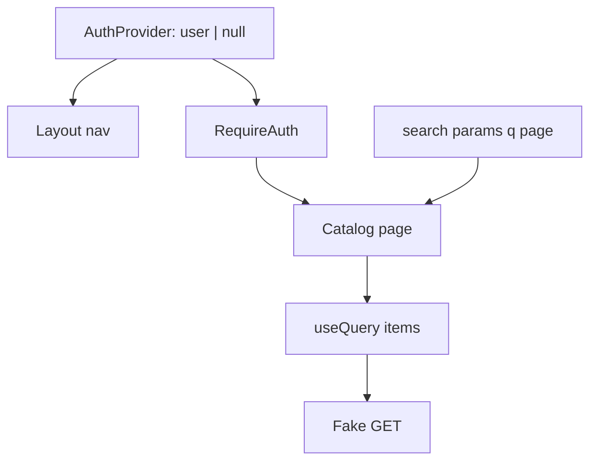

# Month 7 · Week 3 · Day 2
# Context for Mock Auth Only — Not a Server Cache

**Program:** Full-Stack Mastery · 18 months  
**Phase:** 2 — Modern frontend  
**Month index:** [../../README.md](../../README.md)  
**Week 3:** [1](day-01.md) · Day 2 (today) · [3](day-03.md) · [4](day-04.md) · [5](day-05.md) · [6](day-06.md) · [7](day-07.md)  
**Week rhythm today:** Exercises + type-along  
**Student state:** Day 1 gate. `q` and `page` live in the URL and in the query key. Mock user is probably still a boolean in `App`. That boolean will get drilled into Query-enabled pages unless you put it in **Context** — the right Context, not a list cache.  
**Study time:** 3–4 focused hours

Today: **Auth context** as Month 6, now sitting **next to** Query. Who is signed in is **client** state. The item list is **not**. `RequireAuth` still redirects. Login still uses **RHF + Zod** (Week 2). After login, **do not** put GET `/items` into context.

Redux is **Day 4**. Do not install it today.

Project 4: you may **later** align `~/ops-dashboard/` mock auth with this pattern. Today’s lab is a **clinic staff** shell, not the dashboard paste.

---

## How to use this textbook

1. Read. Say it. Type it.  
2. If you find `items` on context, delete that field. That is the whole bug.  
3. Optional review links are for later rechecking.

---

## How to read this chapter

Context is a **pipe** for a value many children need without twenty layers of props. It is a terrible **database**. Every consumer re-renders when the value’s identity changes. A list of 200 rows on context is a rerender storm **and** a handmade cache with no invalidation.



Three pipes, three jobs. Mixing them is how Month 7 fails the gate.

---

## Today's contract

By the end of this day you will be able to:

1. Provide **`user | null`**, **`login`**, **`logout`** via Context.  
2. Keep **tokens out of the URL**.  
3. Protect a route with **`RequireAuth`** + **`<Navigate replace>`**.  
4. Fetch the list with **Query** only after the page mounts (user exists). Optional: `enabled: !!user`.  
5. Explain why **`enabled: !!user`** is not the same as putting rows on context.  
6. Login form: Week 2 a11y + `setError` for failed mock login.

**Today's gate.** Closed-book:

> Mock auth is Context. The list is Query. Filters are the URL. I do not store GET results on AuthContext. Refresh still loses mock auth unless I persist — and persist is optional, not security.

---

## Time box

| Block | Minutes | Work |
|---|---|---|
| A | 50 | Theory |
| B | 55 | Type-along: provider + protected catalog |
| C | 70 | Independent: login errors + enabled |
| D | 20 | Git |
| E | 15 | Recall |

---

# Block A — Theory

## 1. What belongs on AuthContext

```tsx
type AuthValue = {
  user: { email: string } | null;
  login: (input: LoginInput) => Promise<void>;
  logout: () => void;
};
```

Stable **client** facts: who the UI **thinks** is signed in. Theme could be a **second** context or the same provider if you are careful about split values — this course prefers **auth only** on this context so list pages do not rerender on a theme toggle. Splitting contexts is a performance habit, not a religion.

**Wrong belief:** “I’ll add `items` and `setItems` to AuthContext so the table can read them.”  
**Correct:** that is a server cache. Query already is one.

**Wrong belief:** “I’ll add `queryClient` to context.”  
**Correct:** `QueryClientProvider` already did. `useQueryClient()` is the hook.

---

## 2. Provider shape (Month 6, tightened)

```tsx
const AuthContext = createContext<AuthValue | null>(null);

export function AuthProvider({ children }: { children: ReactNode }) {
  const [user, setUser] = useState<AuthValue["user"]>(null);

  const login = async (input: LoginInput) => {
    await mockLogin(input); // throws ApiError
    setUser({ email: input.email });
  };

  const logout = () => setUser(null);

  const value = useMemo(() => ({ user, login, logout }), [user]);

  return <AuthContext.Provider value={value}>{children}</AuthContext.Provider>;
}

export function useAuth() {
  const ctx = useContext(AuthContext);
  if (!ctx) throw new Error("useAuth must be used within AuthProvider");
  return ctx;
}
```

`useMemo` on `value` so consumers do not rerender because the provider rendered for an unrelated reason **with a new object identity**. `login`/`logout` still change when `user` changes unless you `useCallback` them — good enough today.

**Persist:** `localStorage` of `{ email }` is a **demo**. It is not a session. XSS on your own origin can read it. Course rule: optional, documented as fake. Never store passwords.

---

## 3. Tree order

```tsx
<QueryClientProvider client={queryClient}>
  <BrowserRouter>
    <AuthProvider>
      <Routes>{/* ... */}</Routes>
    </AuthProvider>
  </BrowserRouter>
</QueryClientProvider>
```

Auth inside Router so `login` can `useNavigate`. Query outside so auth pages could still query (usually they do not).

`RequireAuth`:

```tsx
function RequireAuth() {
  const { user } = useAuth();
  if (!user) return <Navigate to="/login" replace />;
  return <Outlet />;
}
```

Layout with nav sits **on** the protected branch: skip link, nav, `Outlet`. Login route **outside** that branch.

---

## 4. `enabled: !!user` vs hiding the page

If a Query-enabled component **cannot mount** until `RequireAuth` passes, you may not need `enabled: !!user`. If it **can** mount on a public layout, then:

```tsx
useQuery({
  queryKey: ["referrals", { q, page }],
  queryFn: listReferrals,
  enabled: !!user,
});
```

**Wrong belief:** “`enabled: false` stores the list on context until user exists.”  
**Correct:** `enabled: false` means **do not fetch**. There is no list yet. Context still has no rows.

Do not put `user` in the **query key** unless the **server** returns different lists per user. For a mock that returns the same array, `user.email` in the key only **busts cache on login** — sometimes useful, often noise. Prefer keys that match **resource + filters**. On logout, you may `queryClient.clear()` so the next human at the keyboard does not see the previous list flash. That is a **privacy** habit for a shared computer, not encryption.

```tsx
const logout = () => {
  setUser(null);
  queryClient.clear();
};
```

You need `useQueryClient()` in the provider or pass `queryClient` into a logout that lives next to it. Do not circular-import.

---

## 5. Login is still a form

Week 2: `zodResolver`, accessible errors, `setError` on mock 401. After success, `navigate("/catalog", { replace: true })`. Do not put email in the URL.

The catalog: Day 1 URL params + Query.

---

## 6. What you will say in STATE_ARCHITECTURE.md (preview)

| State | Place | Why |
|---|---|---|
| `user` | Auth Context | Mock session, few readers, not from GET `/items` |
| `q`, `page` | URL | Share, refresh, back |
| Referral rows | Query | Server state |
| Login draft | RHF | Form state |
| Nav menu open (mobile) | `useState` in layout | Local UI |

Redux: **none** unless Day 4’s lab (isolated counter).

---

# Block B — Type-along

Continue `week-03-url` **or** new `week-03-auth`:

```powershell
cd ~\fullstack-lab\month-07
npm create vite@latest week-03-auth -- --template react-ts
cd week-03-auth
npm install
npm install react-router @tanstack/react-query @tanstack/react-query-devtools react-hook-form @hookform/resolvers zod
```

1. Providers in the order above.  
2. Routes: `/login` public; `/catalog` behind `RequireAuth`.  
3. Catalog: in-memory list, `q`/`page` in URL + query key (Day 1).  
4. Login: RHF + Zod. Mock only one user.  
5. Logout clears user; prove catalog is unreachable. Optional `queryClient.clear()`.  
6. `TREE.txt`: who owns auth vs list vs URL.

Add `items` to context **on purpose**, consume it in the table, then **delete it** and write why the table flickered or was stale. Restore Query-only list.

---

# Block C — Independent

1. Failed login maps server message (`setError`).  
2. Deep link: logged-out visit to `/catalog?q=oak&page=2` → login → after login land on **that** search (store `location` and `Navigate` `state.from`, Month 6 skill). If you cannot, document in `GAPS.txt` and send to `/catalog` — then **do** the `from` search as stretch.  
3. `enabled: !!user` on a query that lives in a component which **might** render without user — or explain in TREE.txt why RequireAuth makes it unnecessary.

No Redux. No Project 4 paste.

Logged-out catalog must not flash Query data from a previous session. If you skip `queryClient.clear()`, write in TREE.txt that the cache can leak on a shared kiosk — then add `clear()` anyway. That is the privacy habit, not encryption.

**Wrong belief:** “I’ll persist the mock user in `localStorage` and call it auth.”  
**Correct:** optional demo only. XSS on your origin reads it. Document “fake session” in TREE.txt. Never persist passwords.

---

```powershell
cd ~\fullstack-lab
git add month-07/week-03-auth
git commit -m "Week 3 Day 2: mock auth context beside Query and URL filters."
```

---

## 7. `useMemo` on the value — why it matters next to Query

If `value={{ user, login, logout }}` is a **new object every render** of `AuthProvider`, every `useAuth()` consumer rerenders when the provider renders — including when a parent re-renders for an unrelated reason.

That is painful once **catalog** is a consumer: typing in an **unrelated** layout state could rerender the table. Query still holds the data; you still **waste render**. `useMemo` / `useCallback` here is **Context hygiene**, not “performance theater.” Profiler week will show this if you skip it.

**Wrong belief:** “I’ll put `items` on the same context so I only have one provider.”  
**Correct:** one provider is not a virtue. Split **auth** from **everything else**. Query is already a provider.

---

## 8. Login draft vs session

| Piece | Place |
|---|---|
| Email/password while typing | RHF |
| `user` after success | Context |
| “Remember this kiosk” checkbox | `useState` or RHF; **not** a Query key |
| Staff list from GET `/staff` | Query — **not** Context |

After `login` succeeds you `setUser`. You do **not** `queryClient.setQueryData(["user"], ...)`. There is no GET. Mock auth is not server state until Month 8 gives you `/me`.

Deep link restore:

```tsx
const location = useLocation();
const from = (location.state as { from?: string } | null)?.from ?? "/catalog";
// after login:
navigate(from, { replace: true });
```

`RequireAuth` should pass `state={{ from: location.pathname + location.search }}` so `?q=` survives the bounce. Forgetting `search` is how page 2 dies at the login door.

**Wrong belief:** “I’ll put `from` in the URL as `?next=`.”  
**Correct:** open redirect risk later; today `location.state` is enough and it does not leak the path to analytics on the query string if you are careful. If you do use `?next=`, allowlist paths that start with `/`.

---

## 9. What `enabled: !!user` is not

A public `Header` that shows “3 overdue crates” must not fetch `/crates` while logged out if that URL is protected in your mock. `enabled: !!user` prevents the 401 storm. It does **not** store crates on the user object.

If `RequireAuth` already unmounts the page, the query never runs. Then `enabled` is redundant — say so in TREE.txt. Redundant `enabled` is harmless; redundant **data on context** is not.

**Wrong belief:** “I’ll fetch in the provider so children never pending.”  
**Correct:** children should handle `isPending`. Prefetch is `queryClient.prefetchQuery` after login, still keyed, still Query — optional stretch, not Context.

---

# Block E — Recall

1. Why lists do not belong on Context.  
2. Provider order: Query, Router, Auth.  
3. `enabled: !!user` vs RequireAuth.  
4. Why `queryClient.clear()` on logout.  
5. Why `?token=` is wrong.  
6. Where the login **draft** lives.

TREE.txt must list provider order in one line: QueryClientProvider → BrowserRouter → AuthProvider → Routes. If Auth is outside Router, `useNavigate` in `login` will throw. If Query is inside Auth, you can still query — but then logout `clear()` needs a client from a parent. Prefer Query **outside**.

Logout should `navigate("/login", { replace: true })` so Back does not return to a protected catalog that immediately redirects again. That loop feels like a Router bug; it is a history stack you can fix with `replace`.

---

## 10. Combining RequireAuth with a Query page (the whole sentence)

`RequireAuth` answers: **may this route render at all?** Query answers: **what rows does this clerk see?** Those are not the same question.

A protected catalog that mounts only after `user` exists does not need `user` in the query key for a mock that returns one global list. A later real API that returns **this user’s** queue **does** belong as `["queue", user.id]` (or the server infers the user from a cookie and the key is still `["queue"]` plus filters). Do not invent `user` in the key “for safety” if the payload does not depend on it — you will refetch on every login of the same person with a new object identity.

If `login` constructs `{ email }` as a **new object** every time, and you put that object in the key, you bust the cache even when the email string is unchanged. Keys want **serializable primitives** (Week 1). Put `user.email` if you must, not the whole user object.

**Wrong belief:** “Auth and Query should share one Context so I only have one provider.”  
**Correct:** `QueryClientProvider` is already the server-state provider. `AuthProvider` is the session pipe. Two providers is not clutter; it is two jobs.

When you write TREE.txt, one line must read: **rows are not on AuthContext.** If that line is missing, Day 3’s ARCH.md will lie.

---

## Definition of done

- [ ] AuthContext holds user, not rows
- [ ] Protected catalog uses Query + URL params
- [ ] Login uses RHF + accessible errors
- [ ] TREE.txt exists
- [ ] Commit exists

---

## Optional review links

Auth as client state is explained in this chapter.

- [React: Passing data deeply with context](https://react.dev/learn/passing-data-deeply-with-context)
- [React Router: `Navigate`](https://reactrouter.com/start/declarative/routing)

---

## Tomorrow

From **memory**: flowchart + a tiny protected list with URL `q`. Days 1–2 closed during drills.
