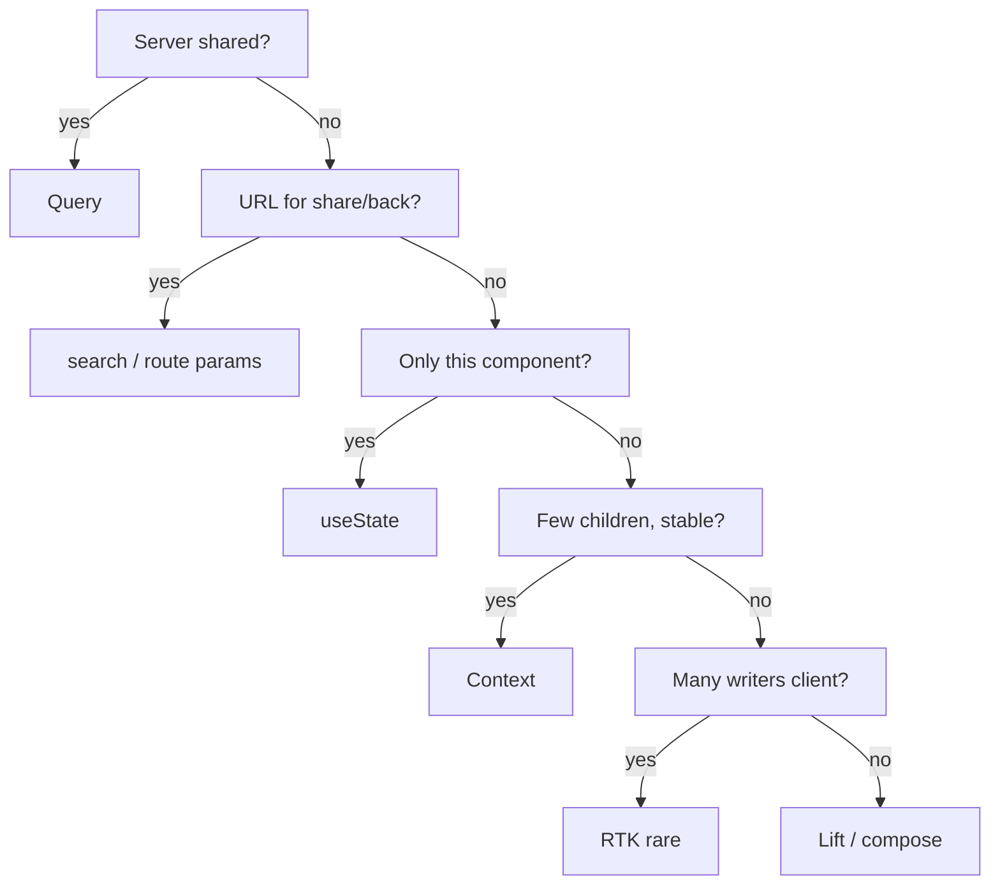

# Month 7 · Week 3 · Day 3
# From Memory: Decision Order, URL Filters, Mock Auth

**Month index:** [../../README.md](../../README.md)  
**Week 3:** [1](day-01.md) · [2](day-02.md) · Day 3 (today) · [4](day-04.md) · [5](day-05.md) · [6](day-06.md) · [7](day-07.md)  
**Week rhythm today:** Implement from memory  
**Study time:** 3–4 focused hours  
**Student state:** You put `q`/`page` in the URL and mock user on Context. Today those ideas must live in your fingers.  
**Days 1–2 of this week:** closed during the drills. Repair from **this recap**.

---

## How to read this chapter

This file **is** the lesson. Days 1–2 stay closed. No Project 4 paste. No Redux today (that is tomorrow’s literacy, not today’s list).



Stuck > 25 minutes: one section from Day 1 or 2 in this textbook, then close. `lookups.txt`.

---

## Complete explanation (architecture you must be able to write)

### Decision order

**Query** — GET data shared across screens: lists, details, search hits. Keys include every fetch input.

**URL** — `q`, `page`, `sort`, entity `id` in the path. Source of truth: `useSearchParams` / `useParams`. Refresh and share must restore. Do not shadow with `useState` + `useEffect` sync. A typing draft may be local; the **committed** search is the param.

**useState** — modal open, local toggles, values that must not be shareable.

**Context** — mock `user | null`, `login`, `logout`. **Not** the item array. **Not** `queryClient` (already provided). Optional `queryClient.clear()` on logout.

**Redux Toolkit** — only large shared **client** state with many writers. Default Project 4: **off**. Query already cached the server.

**RHF** — drafts. Not listed on the README mermaid as a box, but Week 2 placed it: form state is neither URL nor Query.

**Wrong belief:** “Context is global state, so the list goes there.”  
**Correct:** Context is a render pipe. Query is the server cache.

### URL + Query together

```tsx
const [params, setParams] = useSearchParams();
const q = params.get("q") ?? "";
const page = Math.max(1, Number(params.get("page") ?? "1") || 1);

useQuery({
  queryKey: ["notices", { q, page }],
  queryFn: () => listNotices({ q, page }),
  placeholderData: keepPreviousData,
});
```

Change `q` and set `page=1` in the **same** `setParams`. `keepPreviousData` imported from `@tanstack/react-query` as `placeholderData`.

Never put passwords in the query string.

### Auth next to Query

```tsx
<QueryClientProvider>
  <BrowserRouter>
    <AuthProvider>
      <Routes />
    </AuthProvider>
  </BrowserRouter>
</QueryClientProvider>
```

`RequireAuth`: no user → `<Navigate to="/login" replace />` else `<Outlet />`. Login: RHF + Zod, `setError` on failure, `navigate` replace on success. Restore `state.from` if you captured it.

`enabled: !!user` only if the query component can mount while logged out.

### HTTP and Zod still apply

`queryFn` throws on `!ok`. Parse `unknown` with Zod when you have a schema. Empty list is success.

### URL + Query typed (the page)

```tsx
import { keepPreviousData } from "@tanstack/react-query";
import { useSearchParams } from "react-router";

const [params, setParams] = useSearchParams();
const q = params.get("q") ?? "";
const page = Math.max(1, Number(params.get("page") ?? "1") || 1);

const archiveQuery = useQuery({
  queryKey: ["archive", { q, page }],
  queryFn: () => listArchive({ q, page }),
  placeholderData: keepPreviousData,
});
```

Commit search **and** reset page in one write:

```tsx
function commitSearch(nextQ: string) {
  const next = new URLSearchParams(params);
  next.set("q", nextQ);
  next.set("page", "1");
  setParams(next, { replace: true });
}
```

`replace: true` so Back is not one history entry per letter. A local `draft` `useState` for the input is allowed; the **committed** `q` is the param. Do not `useEffect` copy `q` into `useState(page)`.

**Wrong belief:** “I’ll keep `page` in `useState` and also put it in the URL for show.”  
**Correct:** then refresh is a lie. The URL is the source of truth; Query is the subscriber.

**Wrong belief:** “AuthProvider should fetch the archive so login feels instant.”  
**Correct:** the archive page mounts, `useQuery` runs. Do not hide rows in Context.

**Wrong belief:** “Redux is how filters stay in sync with the list.”  
**Correct:** the key `["archive", { q, page }]` is the sync. RTK is tomorrow’s literacy, not today’s list.

`RequireAuth`:

```tsx
if (!user) {
  return (
    <Navigate
      to="/login"
      replace
      state={{ from: location.pathname + location.search }}
    />
  );
}
return <Outlet />;
```

Login restores `from` so `?q=water&page=2` survives the lock. Import router APIs from **`"react-router"`**.

---

## Today's contract

**Today's gate**

> I built a protected list whose filters live in the URL and whose rows live in Query. Auth context has no array of records. I can walk the flowchart for every piece of state I used.

---

## Time box

| Block | Minutes | Work |
|---|---|---|
| A | 20 | Oral flowchart |
| B | 40 | Memory drills: read params + one query |
| C | 90 | Spec: archive desk |
| D | 25 | ARCH.md + audit |
| E | 15 | Git |

---

# Block A — Speak first

For each, say the box: item rows; `?q=`; `?page=`; mock user; login password draft; “filters expanded”; detail `:id`; Redux for GET `/items` (the answer is **do not**).

If mush, re-read. Do not code yet.

---

# Block B — Memory drills

```powershell
cd ~\fullstack-lab\month-07
npm create vite@latest week-03-from-memory -- --template react-ts
cd week-03-from-memory
npm install
npm install react-router @tanstack/react-query react-hook-form @hookform/resolvers zod
npm run dev
```

Provider order from memory. One public heading route. One `useSearchParams` page that lists **hard-coded** filtered rows **without** Query — then **replace** with Query before the spec’s list is “done.” The drill is: params parse, then key.

---

# Spec: municipal archive desk

Fictional **city archive** request list (box numbers, not SKUs). Not Project 4.

### Required

1. Mock auth context (`user`, `login`, `logout`). Login form accessible + Zod. One cred pair in `CREDS.txt`.  
2. Protected `/archive`. Public `/login`.  
3. `q` and `page` in the URL **and** `queryKey: ["archive", { q, page }]`. In-memory API + delay. `keepPreviousData`.  
4. Search commits to URL and resets page.  
5. Context must **not** hold the archive array.  
6. **`ARCH.md`:** table of every stateful piece → flowchart box.  
7. One `h1` per page. Landmarks. CSS you type.

### Constraints

- No Redux. No `any`. No list in Context.  
- Do not paste Day 1/2 lab files.

---

### Provider order (from memory)

```tsx
<QueryClientProvider client={queryClient}>
  <BrowserRouter>
    <AuthProvider>
      <Routes>
        <Route path="/login" element={<LoginPage />} />
        <Route element={<RequireAuth />}>
          <Route element={<AppLayout />}>
            <Route path="/archive" element={<ArchivePage />} />
          </Route>
        </Route>
      </Routes>
    </AuthProvider>
  </BrowserRouter>
</QueryClientProvider>
```

`RequireAuth` reads `user`. No user → `<Navigate to="/login" replace state={{ from: location.pathname + location.search }} />`. Layout holds nav and `Outlet`. Archive page **reads URL**, **not** a copied `useState` page.

Login: `zodResolver`, accessible errors, `setError` on failure, `navigate(from, { replace: true })` on success. Draft is RHF. Session is Context.

**Wrong belief:** “I’ll fetch the archive in AuthProvider so it’s ready after login.”  
**Correct:** the archive page mounts, `useQuery` runs. Cache then exists. Prefetch via `queryClient.prefetchQuery` is optional advanced — not required. Do not hide it in Context.

ARCH.md rows must include at least: `user`, `q`, `page`, rows, login draft, “filters expanded” if you have it, Redux (none).

---

# Block D — Defect hunt

`AUDIT.txt`: refresh `?q=water&page=2` logged in — same slice? Logged out visit to that URL — login redirect? Context value keys (must not include rows)?

Deliberate defect: `useState` for page **and** URL. Refresh. Write the lie. Restore.

---

# Block E — Git

```powershell
cd ~\fullstack-lab
git add month-07/week-03-from-memory
git commit -m "Week 3 Day 3: archive desk from memory — URL, Query, auth context."
```

---

# Recall

1. Why URL and Query are both needed for a search page.  
2. Why logout might `queryClient.clear()`.  
3. Why Redux is still off.

### Login restore (type the idea)

```tsx
const from =
  (location.state as { from?: string } | null)?.from ?? "/archive";
navigate(from, { replace: true });
```

Narrow `state` honestly — a Zod object or a typeof check — rather than `as` as a habit. The point is: `?q=` must survive the lock. `replace` so Back is not a trap.

`ARCH.md` rows: `user` → Context; `q`/`page` → URL; rows → Query; login password → RHF; “filters expanded” → `useState`; Redux → none. If Context value keys include `boxes` or `items`, you failed today’s gate.

Deliberate defect: `const [page, setPage] = useState(1)` **and** URL. Refresh `?page=2`. Write the lie in `AUDIT.txt`. Restore.

Import `BrowserRouter`, `Routes`, `Route`, `Link`, `Outlet`, `Navigate`, `useSearchParams` from **`"react-router"`**. One `QueryClient` in `main.tsx`. `enabled: !!user` only if the list can mount logged out.

### In-memory archive page size

```ts
export async function listArchive(args: { q: string; page: number }) {
  await delay(300);
  const filtered = rows.filter((row) =>
    row.label.toLowerCase().includes(args.q.trim().toLowerCase()),
  );
  const pageSize = 5;
  const start = (args.page - 1) * pageSize;
  return {
    items: filtered.slice(start, start + pageSize),
    total: filtered.length,
  };
}
```

`page` in the key. Changing `q` resets page to 1 in the **same** `setParams`. `placeholderData: keepPreviousData` so page 2 does not flash empty. Zod-parse the payload if you treat it as unknown JSON.

`CHOICE`/`ARCH.md`: Redux is **off**. Rows are not on Context. Passwords never in the query string.

---

## Definition of done

- [ ] Oral flowchart first
- [ ] Protected list; URL filters; Query rows
- [ ] ARCH.md honest
- [ ] No rows on Context
- [ ] Commit exists
- [ ] I did not paste a solution

---

## Optional review links

The recap in this chapter is the lesson.

- [Month 7 README](../../README.md)
- [React Router: `useSearchParams`](https://reactrouter.com/start/declarative/routing)

---

## Tomorrow

**Redux Toolkit literacy:** `configureStore`, `createSlice`, `useDispatch` / `useSelector`, thunks as an idea. A **tiny counter** you then **delete** or leave in a lab folder. **Why Query already did the server cache.** Not wired into Project 4’s list.
