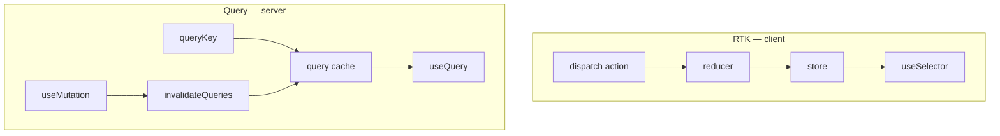
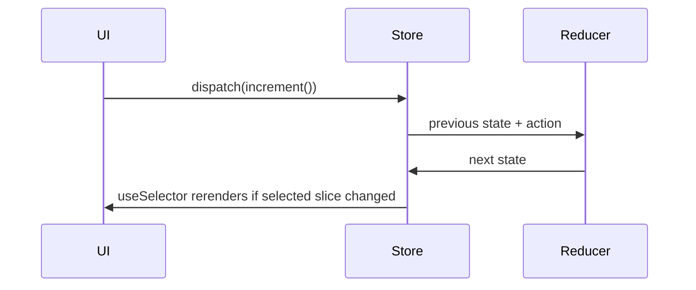

# Month 7 · Week 3 · Day 4
# Redux Toolkit Literacy — And Why Query Already Cached the Server

**Program:** Full-Stack Mastery · 18 months  
**Phase:** 2 — Modern frontend  
**Month index:** [../../README.md](../../README.md)  
**Week 3:** [1](day-01.md) · [2](day-02.md) · [3](day-03.md) · Day 4 (today) · [5](day-05.md) · [6](day-06.md) · [7](day-07.md)  
**Week rhythm today:** Learn + lab feature  
**Student state:** Day 3 gate. You can place Query, URL, Context, and `useState`. Today you learn **Redux Toolkit** well enough to **read** it and to **refuse** it for Project 4’s list.  
**Study time:** 3–4 focused hours

Default Project 4 does **not** use Redux. You will build a **tiny isolated counter** (and optionally a tiny UI-flag slice) in `~\fullstack-lab\month-07\week-03-rtk\`. You will **not** wire that store into `~/ops-dashboard/` item lists. After the lab you may **delete** the counter from any dashboard experiment, or leave it **only** in the lab folder.

---

## How to use this textbook

1. Read until you can draw store → slice → action → reducer → selector.  
2. Type the counter. Do not paste a “Redux Query tutorial” that fetches posts into `createSlice`.  
3. Write `WHY_NOT_LIST.md` before you commit.  
4. Optional review links are for later rechecking.

---

## How to read this chapter

Redux is a **predictable client-state container**: one store, updates via **actions**, new state from **reducers** (pure functions). **Redux Toolkit (RTK)** is the 2026 way to write that: `createSlice` generates actions, `configureStore` wires DevTools and thunk middleware.

It is **good** at: many components writing the same **client** flags, undo/redo of UI, complex client workflows that are not “GET this URL.”

It is **redundant** at: caching `GET /items`. TanStack Query already stores server data by key, dedupes, stale-times, invalidates, and refetches. A slice that `fetch`es in a thunk and `setItems` in a reducer is **Week 1 with extra steps** — plus you must write loading flags Query already has.



If that is still abstract: Redux is a whiteboard the whole office shares for **meeting-room booking stickers**. Query is the **inventory database**. Do not copy the warehouse into the whiteboard.

---

## Today's contract

By the end of this day you will be able to:

1. Call **`configureStore`** with a reducer map.  
2. Call **`createSlice`** with `name`, `initialState`, `reducers`.  
3. **`useDispatch`** and **`useSelector`** from `react-redux`.  
4. Explain a **thunk** as “a function that can dispatch later / async,” and why **Query mutations** already cover async **server** writes.  
5. Explain **middleware** as a store pipeline (thunk, logger) — not as Express.  
6. Say, with a straight face, why **`items: []` in a slice** is the wrong architecture for Project 4.

**Today's gate.** Closed-book:

> RTK is a client store: slice, action, reducer, selector. Thunks are async dispatch helpers. Query already owns server cache. I will not put GET `/items` in Redux unless I can name a reason that survives Day 7. My counter lives in the lab folder.

---

## Time box

| Block | Minutes | Work |
|---|---|---|
| A | 55 | Theory |
| B | 50 | Type-along: counter store |
| C | 70 | Independent: WHY_NOT_LIST + optional UI-flag slice |
| D | 20 | Git |
| E | 15 | Recall |

---

# Block A — Theory

## 1. Store, slice, action, reducer, selector

| Word | Meaning |
|---|---|
| **Store** | The single object tree for **this** Redux app. `configureStore({ reducer: { counter: counterReducer } })`. |
| **Slice** | A piece of that tree plus the reducers that update it. `createSlice({ name: "counter", ... })`. |
| **Action** | A plain object `{ type, payload }` (Toolkit generates `type` strings like `counter/increment`). |
| **Reducer** | `(state, action) => nextState`. In a slice you **write mutating syntax**; Immer makes it immutable underneath. You still must not mutate **outside** that slice reducer. |
| **Selector** | A function `state => piece`. `useSelector((s: RootState) => s.counter.value)`. |
| **Dispatch** | `dispatch(increment())` — the only way to ask for a change. |

```ts
import { createSlice } from "@reduxjs/toolkit";

const counterSlice = createSlice({
  name: "counter",
  initialState: { value: 0 },
  reducers: {
    increment(state) {
      state.value += 1;
    },
    decrement(state) {
      state.value -= 1;
    },
    addAmount(state, action: { payload: number }) {
      state.value += action.payload;
    },
  },
});

export const { increment, decrement, addAmount } = counterSlice.actions;
export default counterSlice.reducer;
```

```ts
import { configureStore } from "@reduxjs/toolkit";
import counterReducer from "./counterSlice";

export const store = configureStore({
  reducer: {
    counter: counterReducer,
  },
});

export type RootState = ReturnType<typeof store.getState>;
export type AppDispatch = typeof store.dispatch;
```

```tsx
import { Provider, useDispatch, useSelector } from "react-redux";
import type { AppDispatch, RootState } from "./store";

createRoot(document.getElementById("root")!).render(
  <Provider store={store}>
    <App />
  </Provider>,
);

function Counter() {
  const value = useSelector((s: RootState) => s.counter.value);
  const dispatch = useDispatch<AppDispatch>();
  return (
    <div>
      <p>Count: {value}</p>
      <button type="button" onClick={() => dispatch(increment())}>
        Increment
      </button>
    </div>
  );
}
```

Typed hooks (`useAppDispatch`) are a nicety. Today, generics on `useDispatch` are enough.

**Wrong belief:** “`createSlice` talks to the server.”  
**Correct:** it updates **memory in the store**. Networking is extra (`createAsyncThunk` or, in this course, **don’t** — use Query).

---

## 2. Data flow



If `useSelector` returns a **new object every time** (`(s) => ({ n: s.counter.value })`), you will rerender always. Select a **primitive** or a stable reference. Memoized selectors (`createSelector`) exist for derived client data. Derived **server** lists still belong in the Query result + render: `data.filter(...)`.

---

## 3. Thunk literacy (async without making it the list cache)

**Middleware** sits between dispatch and the reducer. Toolkit’s store includes **thunk** middleware by default.

A **thunk** is a function that receives `dispatch` and `getState`. You `dispatch(myThunk())`. The thunk may `await fetch` and then `dispatch(success(payload))`.

```ts
import { createAsyncThunk } from "@reduxjs/toolkit";

export const fetchItems = createAsyncThunk("items/fetch", async () => {
  const response = await fetch("/api/items");
  if (!response.ok) throw new Error("fail");
  return response.json(); // still unknown — still needs Zod
});
```

Then extra reducers for `pending` / `fulfilled` / `rejected`. You have reinvented **`isPending` / `isError` / `data`** poorly, with **no shared cache** between components unless they all read the same slice, **no query keys**, **no staleTime**, **no `invalidateQueries`**.

**Wrong belief:** “I need thunks because my dashboard fetches.”  
**Correct:** you need **`useQuery` / `useMutation`**. Thunks are literacy so you can read old code and job interviews. They are not Project 4’s data layer.

If you ever had **client-only** async (debounce writing a draft to `indexedDB`), a thunk might be honest. That is not GET `/items`.

---

## 4. Why Query already did server cache

| Concern | RTK slice + thunk | TanStack Query |
|---|---|---|
| Identity of data | One `items` array in the store | `queryKey` per filter/page |
| Two components need the list | Both `useSelector` — one fetch if you coded it | Deduped by key automatically |
| After POST | You `dispatch(append)` or refetch thunk | `invalidateQueries({ queryKey: ['items'] })` |
| Stale vs memory | You invent it | `staleTime` / `gcTime` |
| Window focus | You invent it | built-in |
| Pagination | One array or many ad-hoc fields | page in the key + `keepPreviousData` |

**Wrong belief:** “Redux + Query together is more professional.”  
**Correct:** together is fine when Redux holds **client** state Query does not. Two caches for the **same GET** is a bug.

RTK Query exists (a Query-like layer **inside** RTK). This course uses **TanStack Query**. Do not add RTK Query on top. Literacy: know the name; do not install it this month.

---

## 5. When RTK *would* be justified (so Day 7 is not a slogan)

Examples that **might** survive the flowchart:

- A complex **client** editor: many panels write a document that is **not** saved yet, with undo, and it is too large for lifting + Context.
- Real-time **client** presence UI that is not a GET cache (still often better as Context + Query for the server part).
- An existing team standard you must join — then you still **do not** duplicate Query.

Project 4 default: **none of these**. Mock auth is Context. List is Query. Filters are URL. Forms are RHF.

---

## 6. Provider vs QueryClientProvider

You **may** wrap the lab counter in `<Provider store={store}>`. You **must not** replace `QueryClientProvider` with Redux. In a throwaway lab that has **only** a counter, Query can be absent. In Project 4, Query stays; Redux stays **out**.

---

# Block B — Type-along

```powershell
cd ~\fullstack-lab\month-07
npm create vite@latest week-03-rtk -- --template react-ts
cd week-03-rtk
npm install
npm install @reduxjs/toolkit react-redux
npm run dev
```

1. `store.ts` + `counterSlice.ts` as in theory.  
2. `Provider` in `main.tsx`.  
3. `Counter.tsx`: increment, decrement, add 5. Buttons are real `<button type="button">`.  
4. Two instances of `Counter` on the page — they share the store (that is the point of Redux). Write `SHARE.txt`: compare to two `useState` counters (independent).  
5. **Do not** fetch JSONPlaceholder into this slice.

---

## 7. Immer in slices — what you may pretend to mutate

Inside `createSlice` reducers, `state.value += 1` is legal because **Immer** produces the next immutable tree. **Outside** the reducer — in a component, in a thunk before dispatch — `state.value += 1` is the same bug as mutating a `useState` array.

```ts
// inside reducer: OK (Immer)
increment(state) {
  state.value += 1;
}

// in a thunk: NOT how you change the store
export function badThunk() {
  return (_dispatch: AppDispatch, getState: () => RootState) => {
    getState().counter.value += 1; // mutation of the live tree — do not
  };
}
```

Dispatch `increment()` instead. The mental model stays: **the only writer is a reducer**.

**Wrong belief:** “Toolkit let me mutate, so I can mutate in the component too.”  
**Correct:** Immer is a reducer convenience. Components still `dispatch`.

---

## 8. `extraReducers` literacy (so thunks are not magic)

```ts
const itemsSlice = createSlice({
  name: "items",
  initialState: { list: [] as { id: number }[], status: "idle" as "idle" | "loading" | "error" },
  reducers: {},
  extraReducers: (builder) => {
    builder
      .addCase(fetchItems.pending, (state) => {
        state.status = "loading";
      })
      .addCase(fetchItems.fulfilled, (state, action) => {
        state.status = "idle";
        state.list = action.payload; // you still did not Zod-parse
      });
  },
});
```

That `itemsSlice` is the **anti-pattern** for this course. You are looking at it so you can **recognize** it in a blog and close the tab. Your lab **must not** ship this as the notices list. `WHY_NOT_LIST.md` should describe this builder in your own words.

Notice `list` is **one** array. Page 2 has nowhere to live. That is the identity problem Query solved with keys on Day 1.

---

# Block C — Independent

1. **`WHY_NOT_LIST.md`** (≥ 250 words): if you put `GET /posts` in this slice, what you would have to invent that Query already has. Use Week 1 vocabulary (`queryKey`, `invalidateQueries`, `staleTime`).  
2. Optional: a `uiSlice` with `navOpen: boolean` — still lab-only. Say in the file why Layout `useState` would have been enough.  
3. Optional thunk: `incrementAsync` that waits 500ms then increments — **client** delay, not HTTP. So you felt `dispatch(thunk())` once.  
4. Confirm this folder is **not** inside `~/ops-dashboard/`.

If you already added Redux to Project 4 “for practice,” **remove** it from the list feature today. Leave the lab.

```powershell
cd ~\fullstack-lab
git add month-07/week-03-rtk
git commit -m "Week 3 Day 4: RTK counter literacy; list cache stays in Query."
```

---

# Block E — Recall

1. Slice vs store.  
2. What `dispatch(increment())` does.  
3. What a thunk is.  
4. Why `fetchItems` thunk duplicates Query.  
5. Two `Counter`s vs two `useState`s.  
6. Project 4 default: Redux on or off?

---

## Definition of done

- [ ] I can define store, slice, action, reducer, selector, thunk
- [ ] Isolated counter lab works; two subscribers share the number
- [ ] WHY_NOT_LIST.md exists and mentions Query keys + invalidation
- [ ] Project 4 list is not powered by this store
- [ ] Commit exists

---

## Optional review links

RTK literacy is explained in this chapter. These pages are for later checking, not a reason to rewrite Project 4 in Redux.

- [Redux Toolkit: Quick start](https://redux-toolkit.js.org/tutorials/quick-start)
- [Redux: Why use RTK](https://redux.js.org/introduction/why-rtk-is-redux-today)
- [TanStack Query: Still need React Query?](https://tanstack.com/query/latest/docs/framework/react/overview)

---

## Tomorrow

Tests/docs: URL params restore in RTL (`MemoryRouter` `initialEntries`); architecture notes. Optional RTK selector test in the **lab** only.
