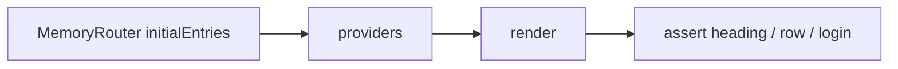

# Month 7 · Week 3 · Day 5
# Tests and Docs: URL State, Auth Redirect, Architecture Claims

**Month index:** [../../README.md](../../README.md)  
**Week 3:** [1](day-01.md) · [2](day-02.md) · [3](day-03.md) · [4](day-04.md) · Day 5 (today) · [6](day-06.md) · [7](day-07.md)  
**Week rhythm today:** Tests + refactor + documentation  
**Study time:** 3–4 focused hours  
**Student state:** You have URL filters, mock auth, and an RTK counter lab. Today you **claim** the architecture in tests and prose — not “Redux is configured.”

Do **not** test Project 4 by pasting a template. Test a Week 3 lab (`week-03-auth`, `from-memory`, or `url`). RTK tests stay in `week-03-rtk`.

---

## How to read this chapter

A good Week 3 test proves a **user-visible** consequence of where state lives:

- Opening `/catalog?q=oak&page=2` shows the **oak** slice (or loading then those rows).
- Visiting `/catalog` while logged out ends on **login**.
- Two counter buttons share a number (lab only).

A bad test: `expect(store.getState().items).toHaveLength(10)` as the **dashboard** contract.



---

## Complete explanation (tests this week)

### QueryClient + Router + Auth

```tsx
function renderAt(path: string, ui: ReactNode, authUser: { email: string } | null) {
  const client = new QueryClient({
    defaultOptions: { queries: { retry: false }, mutations: { retry: false } },
  });
  return render(
    <QueryClientProvider client={client}>
      <MemoryRouter initialEntries={[path]}>
        <AuthProvider initialUser={authUser}>{ui}</AuthProvider>
      </MemoryRouter>
    </QueryClientProvider>,
  );
}
```

`AuthProvider` in production may not take `initialUser`. For tests, either:

- export a test-friendly provider, or
- **login through the UI** (`user.type` / `click`) — slower, more honest.

`MemoryRouter` + `initialEntries: ["/archive?q=water&page=2"]` is how you prove URL as source of truth **without** a browser.

Mock `fetch` / API as Week 1 Day 5. Assert **loading then a row** whose title matches the filter if your mock respects `q`.

### What not to wrap

Do not wrap `Provider` from Redux on the archive tests. The archive has no store.

### RTK lab test (optional, isolated)

```tsx
render(
  <Provider store={store}>
    <Counter />
    <Counter />
  </Provider>,
);
await user.click(screen.getAllByRole("button", { name: /increment/i })[0]);
expect(screen.getAllByText(/count: 1/i)).toHaveLength(2);
```

Use a **fresh store** per test (`configureStore` again) or you will leak counts between tests — the same lesson as QueryClient.

### URL restore test (adapt titles)

```tsx
test("q=water shows the water box", async () => {
  renderAt("/archive?q=water&page=1", <AppRoutes />, { email: "a@b.c" });
  expect(await screen.findByText(/water/i)).toBeInTheDocument();
});
```

The mock **must** filter on `q`. A test that asserts a static heading does not prove URL state.

Auth redirect:

```tsx
test("logged-out archive shows sign in", async () => {
  renderAt("/archive", <AppRoutes />, null);
  expect(
    await screen.findByRole("heading", { name: /sign in/i }),
  ).toBeInTheDocument();
});
```

Export **`AppRoutes`**. `main.tsx` wraps `BrowserRouter`. Tests wrap `MemoryRouter`. One router.

**Wrong belief:** “I’ll `expect(window.location.pathname).toBe('/login')` as the only claim.”  
**Correct:** assert the **login heading or email field**. MemoryRouter is what you control.

**Wrong belief:** “I’ll wrap Redux Provider on the archive tests for realism.”  
**Correct:** the archive has no store. Adding one teaches the wrong architecture.

**Wrong belief:** “Shared `QueryClient` across tests is fine if I `invalidateQueries` in `afterEach`.”  
**Correct:** new client. `retry: false`. Optional `gcTime: 0`.

`ARCHITECTURE_CLAIMS.md` must say **Redux is not used for GET lists** in a full sentence, not as a table caption only.

### Docs as tests you cannot automate today

`STATE_ARCHITECTURE.md` (full fictional app tomorrow) starts as **`ARCH.md`** if you already wrote one. Today expand **`ARCHITECTURE_CLAIMS.md`** in the lab you test:

- Each important piece of state → one place.
- Explicit: **Redux is not used for GET lists.**
- If the RTK lab exists, link it: “literacy only.”

---

## Today's contract

1. RTL: URL `initialEntries` restores filter UI (and/or list mock).  
2. RTL: unauthenticated protected path → login heading or email field.  
3. Optional: RTK two-counter share test in the lab.  
4. ARCHITECTURE_CLAIMS.md.  
5. `npm test` green.

**Today's gate**

> I can prove URL and auth in tests without putting items in Redux.

---

## Time box

| Block | Minutes | Work |
|---|---|---|
| A | 30 | Theory spoken |
| B | 55 | URL + Query test |
| C | 45 | Auth redirect test; optional RTK |
| D | 25 | Architecture claims doc |
| E | 15 | Recall |

---

# Block B — Type-along

Pick `week-03-from-memory` or `week-03-auth`. Install Vitest + RTL if needed.

1. `renderAt("/archive?q=water&page=1", <AppRoutes />, user)`. Mock list. `findBy` a water-related title **your mock returns for that q**.  
2. If the mock ignores `q`, **fix the mock** — the test is teaching the key.

If routing is in `App`, render `App` inside MemoryRouter **without** a second `BrowserRouter`. Duplicate routers are a classic fail. Export `AppRoutes` without `BrowserRouter` for tests; keep `BrowserRouter` in `main.tsx`.

---

# Block C — Independent

1. `initialEntries: ["/archive"]`, `authUser: null` → `findByRole("heading", { name: /sign in/i })` (use **your** login `h1`).  
2. Stretch: after login via UI, catalog heading appears.  
3. RTK lab: shared increment test **or** skip with a sentence in TESTS.md.

Break the URL test by reading `page` from `useState(1)` only. Test should fail or show page 1 rows. Restore.

---

# Block D — Docs

`ARCHITECTURE_CLAIMS.md`:

| Piece | Place | Test evidence |
|---|---|---|
| q, page | URL | initialEntries test |
| rows | Query | loading then title |
| user | Context | redirect test |
| counter | RTK lab only | optional |
| GET items in Redux | **forbidden** | not applicable |

```powershell
cd ~\fullstack-lab
git add month-07
git commit -m "Week 3 Day 5: tests for URL state and auth redirect."
```

---

### Duplicate BrowserRouter — the classic fail

```tsx
// main.tsx
<BrowserRouter><App /></BrowserRouter>

// App.tsx — WRONG if tests also wrap MemoryRouter
export function App() {
  return (
    <BrowserRouter>
      <AppRoutes />
    </BrowserRouter>
  );
}
```

Export **`AppRoutes`** (the `Routes` tree) for tests. `main.tsx` wraps `BrowserRouter`. Tests wrap `MemoryRouter`. One router.

**Wrong belief:** “I’ll test with `window.history.pushState`.”  
**Correct:** `initialEntries` is the Testing Library-friendly way. You are proving the **component** reads params, not that the browser chrome works.

If the URL test is flaky because Query retries, you forgot `retry: false` on the **test** client. If it never loads, the mock ignored `q` — fix the fake API to filter. A test that asserts a **static** heading only does not prove `q`.

RTK lab: `configureStore({ reducer: { counter: counterReducer } })` **inside** the test factory, not a shared `export const store` if tests increment and leak. The production lab app may use a module store; tests should not share it.

### renderAt you can type

```tsx
function renderAt(
  path: string,
  ui: React.ReactNode,
  authUser: { email: string } | null,
) {
  const client = new QueryClient({
    defaultOptions: {
      queries: { retry: false },
      mutations: { retry: false },
    },
  });
  return render(
    <QueryClientProvider client={client}>
      <MemoryRouter initialEntries={[path]}>
        <AuthProvider initialUser={authUser}>{ui}</AuthProvider>
      </MemoryRouter>
    </QueryClientProvider>,
  );
}
```

If production `AuthProvider` has no `initialUser`, either add it for tests or log in through the UI. Duplicate `BrowserRouter` inside `App` will fight `MemoryRouter` — export `AppRoutes`.

Mock `listArchive({ q, page })` so `q=water` returns a unique title. Assert that title. Assert a different `q` does **not** show it (`queryByText`).

Break the product: read `page` from `useState(1)` only. Refresh in the test via `initialEntries: ["/archive?q=water&page=2"]`. You should see page-1 rows or a lie. Restore URL as source of truth.

ARCHITECTURE_CLAIMS.md table is not enough without a sentence: **Redux is not used for GET lists.** Link `week-03-rtk` as literacy only.

### Optional RTK test (lab folder only)

```tsx
test("two counters share one store", async () => {
  const user = userEvent.setup();
  const store = configureStore({ reducer: { counter: counterReducer } });
  render(
    <Provider store={store}>
      <Counter />
      <Counter />
    </Provider>,
  );
  await user.click(screen.getAllByRole("button", { name: /increment/i })[0]);
  expect(screen.getAllByText(/count: 1/i)).toHaveLength(2);
});
```

Fresh `store` per test. Do **not** import this into archive tests. If you skip, one sentence in `TESTS.md`.

Windows: `cd` the lab you actually test. `npm test` → `vitest run`. `MemoryRouter` from `"react-router"`.

Break restore: after the URL test is green, temporarily ignore `params.get("q")` and filter with `useState("")`. The `q=water` test should fail. Restore. Quote the failing test name in `TESTS.md`.

Do not wrap Redux on archive tests. Do not nest `BrowserRouter` inside `AppRoutes`.

---

# Recall

1. Why `MemoryRouter` not `BrowserRouter` in tests.  
2. Why a new `QueryClient` and a new RTK `store` per test.  
3. Why `App` must not nest two routers.  
4. What ARCHITECTURE_CLAIMS.md is for.

---

## Definition of done

- [ ] URL restore test exists
- [ ] Auth redirect test exists
- [ ] ARCHITECTURE_CLAIMS.md exists
- [ ] AppRoutes can render under MemoryRouter without a nested BrowserRouter
- [ ] `npm test` green
- [ ] Commit exists

### What a passing URL test is allowed to mock

Mock `listArchive` (or `fetch`) so `q=water` returns one unique box name. Assert that name. Assert `q=nope` shows empty or a different set. If both queries return the same static array, you tested the heading, not the key.

`retry: false`. `findBy` for pending UI. `MemoryRouter` `initialEntries`. Auth provider with a user for the list test, `null` for the redirect test.

Import `MemoryRouter` from `"react-router"`, not from a v6 `react-router-dom` snippet you have not installed. If TypeScript cannot find `initialEntries`, you wrapped the wrong router.

ARCHITECTURE_CLAIMS.md: one sentence that **Redux is not used for GET lists**, plus a link to `week-03-rtk` as literacy only.

---

## Optional review links

Testing URL state is explained in this chapter.

- [React Router: `MemoryRouter`](https://reactrouter.com/start/declarative/routing)
- [TanStack Query: Testing](https://tanstack.com/query/latest/docs/framework/react/guides/testing)

---

## Tomorrow

Independent: **`STATE_ARCHITECTURE.md` for a fictional app** (complete classification) + polish. Tiny RTK stays isolated. Not Project 4 domain for the fiction — you will write the real file for Project 4 in Week 4.

If the URL test only asserts a heading that does not depend on `q`, it does not prove URL state. Change the mock so `q=water` returns a unique title, then assert that title.

`retry: false` belongs on the **test** QueryClient, not as a way to hide production retries you wanted. Production may still `retry: 1`.

Auth redirect tests should `findByLabelText` or a login heading — not `expect(window.location.pathname).toBe("/login")` as the only claim if MemoryRouter is what you control. Assert UI the user would see.
