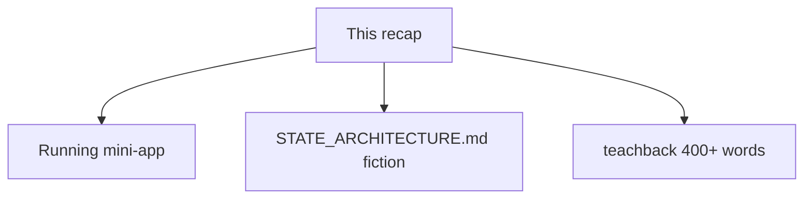
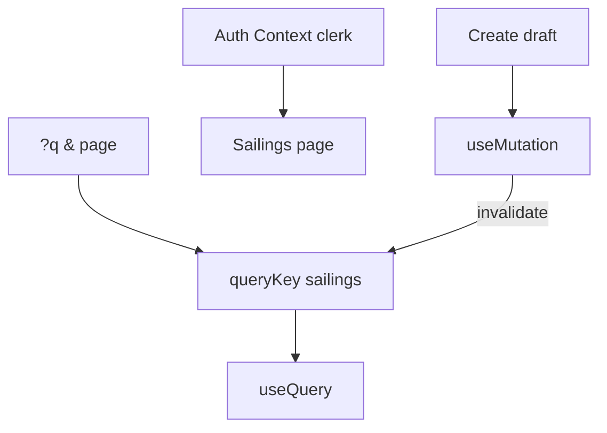

# Month 7 · Week 3 · Day 6
# Independent: STATE_ARCHITECTURE.md for a Fictional App

**Month index:** [../../README.md](../../README.md)  
**Week 3:** [1](day-01.md) · [2](day-02.md) · [3](day-03.md) · [4](day-04.md) · [5](day-05.md) · Day 6 (today) · [7](day-07.md)  
**Week rhythm today:** Independent project work  
**Study time:** 3–4 focused hours  
**Days 1–5 textbook files:** closed for the *challenges*. Repair from **this recap**.

---

## How to read this chapter

Two jobs: (1) a **small running app** that obeys the flowchart, (2) a **`STATE_ARCHITECTURE.md`** for a **fictional** product you can defend in an exam. The fiction is **not** Project 4’s ops dashboard — practice the document shape. Week 4 you will write the real file in `~/ops-dashboard/`.



Allowed: this file, notes, compiler errors.  
Not allowed: copying an admin template, putting GET lists in Redux, AI writing the architecture file without your table.

---

## Complete explanation (this book is the lesson)

Walk the tree for every piece of state:

1. **Server and shared?** → TanStack Query (`queryKey`, `queryFn`, `staleTime` / `gcTime`, `useMutation` + `invalidateQueries({ queryKey })`).  
2. **Must the URL describe it?** → search params / route params. `q` and `page` here.  
3. **Only this component?** → `useState`.  
4. **Few children, stable?** → Context (mock auth).  
5. **Large shared client, many writers?** → RTK **rare**. Default no.  
6. Else lift / compose.  
7. **Drafts** → RHF + Zod.  
8. **Never** passwords in the URL. **Never** `any` on JSON; Zod at the boundary.

RTK literacy: `configureStore`, `createSlice`, `useDispatch`, `useSelector`, thunks as async dispatch. **Query already cached GET.** Tiny counter lives in `week-03-rtk` only.

Tests: `MemoryRouter` `initialEntries`, QueryClient per test `retry: false`, no duplicate `BrowserRouter`.

**Wrong belief:** “STATE_ARCHITECTURE.md is a list of libraries.”  
**Correct:** it is a **classification** of **your** fields with reasons.

### Ferry page (typed shape, your copy)

```tsx
useQuery({
  queryKey: ["sailings", { q, page }],
  queryFn: () => listSailings({ q, page }),
  placeholderData: keepPreviousData,
});

useMutation({
  mutationFn: createSailing,
  onSuccess: () => {
    void queryClient.invalidateQueries({ queryKey: ["sailings"] });
  },
});
```

`q` and `page` come from `useSearchParams` imported from `"react-router"`. Create form is RHF + Zod. Clerk is Context. Sailings are **not** on Context.

If time is short, “Sign in as clerk” is an honest shortcut **plus** ARCH that says Project 4 still needs a real login form. Prefer RHF login if you can.

**Wrong belief:** “I’ll put sailings on AuthContext so dashboard cards can read them without Query.”  
**Correct:** cards call `useQuery` with a stats key, or receive props from a page that queried. Context would not invalidate after create and would not key by `q`/`page`.

**Wrong belief:** “The spec mentioned Redux Toolkit, so the ferry app needs a store.”  
**Correct:** the spec is **conditional**. “I wanted one place for data” is Query’s job.

**Wrong belief:** “`page` is chrome, so `useState` is fine.”  
**Correct:** refresh and share must restore. URL is the source of truth.

Fiction doc: **Lumen Library** (or another name). Do not describe ops-dashboard inventory. Eight rows minimum. Each row: what it is, where it lives, **why not** the runner-up. Mermaid of **this** fiction — your nouns, not the Month 7 README screenshot.

RTK counter stays in `week-03-rtk`. Do not import that store into the ferry app.

---

## Today's contract

1. Challenge 1: **ferry timetable admin** mini-app (or another fiction you invent that is not Project 4).  
2. Challenge 2: **`STATE_ARCHITECTURE.md`** for a **larger fictional** product (see spec).  
3. Challenge 3: **teachback.md ≥ 400 words** — when Redux is unnecessary (preview of Day 7).

**Today's gate**

> I classified state in prose and in a running app. Redux is not the list cache.

---

## Time box

| Block | Minutes | Work |
|---|---|---|
| 0 | 15 | Recap aloud |
| 1 | 80 | Challenge 1 — mini-app |
| 2 | 45 | Challenge 2 — architecture doc |
| 3 | 35 | Challenge 3 — teachback |
| 4 | 15 | Git |

---

# Challenge 1 — Ferry desk (running)

```powershell
cd ~\fullstack-lab\month-07
npm create vite@latest week-03-ferry -- --template react-ts
cd week-03-ferry
npm install
npm install react-router @tanstack/react-query zod react-hook-form @hookform/resolvers
```

**Northline Ferries** staff tool: list sailings, search + page in **URL**, create sailing with **RHF+Zod**, mock **auth context**, Query keys `["sailings", { q, page }]`, invalidate on create. No RTK in this app.

If time is short, login can be a single button “Sign in as clerk” **plus** a comment in ARCH that Project 4 still needs a real form — honesty over fake RHF. Prefer a real login form if you can.

`npm run dev` must show the flowchart in the running data, not only in markdown.

---

# Challenge 2 — Fictional architecture (the document)

Create `~\fullstack-lab\month-07\week-03-ferry\STATE_ARCHITECTURE.md` **or** a sibling folder `week-03-architecture-fiction/STATE_ARCHITECTURE.md`.

Invent **“Lumen Library staff console”** (or another name). **Do not** describe Project 4’s inventory. Include **at least**:

| Piece | Example in the fiction |
|---|---|
| Server list | Catalog titles from GET |
| Server detail | One title `/titles/:id` |
| Mutation | Add copy |
| URL | `q`, `page`, `sort` |
| Auth | Mock librarian |
| Form draft | Add-copy form |
| Local UI | “Advanced filters open” |
| Context | Current librarian |
| Redux | **Section: not used** — why Query/URL/Context suffice |
| Optional RTK | “We practiced a counter in week-03-rtk; it is not this product.” |

For **each** piece: **what it is**, **where it lives**, **why not the next-most-tempting wrong place** (e.g. why the catalog is not Context, why `page` is not `useState`, why the catalog is not Redux).

Minimum **eight** rows, full sentences under the table, mermaid of **this** fiction’s data flow.

This is a **writing** assignment at university depth. A table with no “why not” fails.

---

# Challenge 3 — Teachback (400+ words)

`teachback.md`: **When Redux is unnecessary.** Use the flowchart. Mention thunks vs `useMutation`. Mention your ferry app. Mention the isolated counter. Do not trash Redux as “bad” — trash **misplacement**.

---

# Git

```powershell
cd ~\fullstack-lab
git add month-07/week-03-ferry month-07/week-03-architecture-fiction
git commit -m "Week 3 Day 6: ferry desk and fictional STATE_ARCHITECTURE."
```

Skip the second path if the doc lives in the ferry app.

---

# How to write a why-not (the skill the exam grades)

A row that says “list → Query” is a caption. A row that earns the gate says **what a classmate would do wrong** and **what breaks**.

**Wrong belief:** “I’ll put sailings on AuthContext so the dashboard cards can read them without Query.”  
**Correct:** dashboard cards call `useQuery` with a **stats** key, or they receive **props** from a page that queried. Context would not invalidate after create, would not key by `q`/`page`, and would rerender the login button when a sailing arrives.

**Wrong belief:** “`page` is UI chrome, so `useState` is fine; I’ll copy it into the URL for show.”  
**Correct:** then refresh is a lie. The URL is the source of truth; Query is the subscriber.

**Wrong belief:** “Redux Toolkit is on the spec page, so the ferry app needs a store.”  
**Correct:** the spec says **conditional**. Your teachback must name a **client** problem. “I wanted one place for data” is Query’s job.

Worked table fragment you may adapt (change the names):

| Piece | Lives | Why not the runner-up |
|---|---|---|
| Sailings for `?q=dawn&page=2` | Query key `["sailings", { q: "dawn", page: 2 }]` | Not Context (no invalidation); not a single Redux `sailings[]` (wrong identity for page 1 vs 2) |
| `q`, `page` | URL | Not `useState` (refresh/share); not Query (the URL **selects** the query) |
| Clerk | Auth Context | Not URL (`?email=` is a leak); not Query (there is no GET `/me` in this mock) |
| Create form title | RHF | Not Query (unpublished draft); not URL (password-adjacent noise if you ever put secrets there — never) |
| “Timetable help” dialog | `useState` in the page | Not Redux (one writer); not URL (you do not want shareable “dialog open”) |

Copy the **shape**, not the ferry nouns, into the library fiction.

If two features need the same sailing, they **share the key**, not a lifted array in `App`. That sentence is Week 1 and Week 3 shaking hands.

---

# Stretch if the mini-app is already green

1. `MemoryRouter` test: `/sailings?q=dawn&page=1` shows a dawn row from your mock.  
2. Logout clears the user; optional `queryClient.clear()`.  
3. One 409 on duplicate route name mapped with `setError`.  
4. Confirm `week-03-rtk` is still a **sibling** folder, not an import in the ferry `package.json`.

`STRETCH.txt`: done or skipped, with one sentence of honesty.

---

# Recall

1. Eight classifications from your doc, aloud.  
2. Why the counter is not in the ferry repo.  
3. Why-not for list-in-Context and page-in-useState.

---

## Definition of done

- [ ] Mini-app: Query + URL + auth, no list Redux
- [ ] STATE_ARCHITECTURE.md has why-not for wrong places
- [ ] teachback.md ≥ 400 words
- [ ] STRETCH.txt exists (done or skipped)
- [ ] Commit exists

### Teachback length check

```powershell
cd ~\fullstack-lab\month-07\week-03-ferry
(Get-Content .\teachback.md | Measure-Object -Word).Words
```

If the count is under 400, add: (1) thunk `fetchSailings` vs `useQuery` keys, (2) two counters sharing a store with **no HTTP**, (3) why Project 4’s default is off. Do not pad with “state is important.”

Running app: one `h1` per screen, labels, CSS you type, Vite HTTP, extra `--` on create.

Provider order from memory: `QueryClientProvider` → `BrowserRouter` → `AuthProvider` → routes. `RequireAuth` is a door: `Navigate` or `Outlet`. Sailings never live on that context.

`STATE_ARCHITECTURE.md` mermaid must use **your** product nouns (Lumen titles, not “items”). Why-not for catalog-in-Context, page-in-`useState`, and GET-in-RTK are required paragraphs, not captions.

Do not import `week-03-rtk` into the ferry `package.json`. Isolated literacy stays isolated.

---

## Optional review links

Architecture is explained in this chapter.

- [Month 7 README](../../README.md)
- [TanStack Query: Overview](https://tanstack.com/query/latest/docs/framework/react/overview)
- [Redux Toolkit: Quick start](https://redux-toolkit.js.org/tutorials/quick-start)

---

# Teachback shape (so 400 words is argument, not padding)

Open with the flowchart applied to **one** sailing row. Then explain a thunk that `fetch`es sailings: which Query features you would now invent (`queryKey` per `q`/`page`, `staleTime`, `invalidateQueries({ queryKey: ["sailings"] })`, focus refetch). Then the counter: two components, one number, **no HTTP** — that is the honest RTK demo. Close with Project 4’s default: **off**, because the spec’s Redux rule is conditional and your fiction has no surviving client-state problem.

**Wrong belief:** “I’ll write 400 words calling Redux outdated.”  
**Correct:** Redux Toolkit is current and useful **for client trees with many writers**. Misplacement is the defect. The gate skill is refusal **with names**.

---

## Tomorrow

Week review + **gate skill:** when Redux is unnecessary. Debug: list in Context; page only in `useState`; thunk as the GET cache.

If STATE_ARCHITECTURE.md has no “why not” column in prose, add three paragraphs tonight: why not Context for the catalog, why not `useState` for page, why not RTK for GET. That is the assignment, not the table alone.

The mermaid in that file should be **your** fiction’s flow, not a screenshot of the Month 7 README. Labels must use your product nouns.

Do not import `week-03-rtk` from the ferry app to “reuse the store.” That is wiring Redux into a list product by accident. Leave the counter where it is.

### Ferry search commit (typed)

```tsx
import { keepPreviousData } from "@tanstack/react-query";
import { useSearchParams } from "react-router";

const [params, setParams] = useSearchParams();
const q = params.get("q") ?? "";
const page = Math.max(1, Number(params.get("page") ?? "1") || 1);

function onSearchSubmit(event: React.FormEvent<HTMLFormElement>) {
  event.preventDefault();
  const next = new URLSearchParams(params);
  next.set("q", draft.trim());
  next.set("page", "1");
  setParams(next, { replace: true });
}
```

`draft` may be `useState`. Committed `q` is the param **and** sits in `queryKey: ["sailings", { q, page }]`. `placeholderData: keepPreviousData`. Invalidate `["sailings"]` after create. Auth Context has `user`, not `sailings`.

Fiction mermaid (your nouns):



Word count the teachback in PowerShell. If under 400, add the thunk-vs-Query paragraph with **names**, not “Redux is extra.”

### Library fiction — why-not paragraph you must still write

The catalog list is Query because it is GET data, goes stale, and must refetch after “add copy.” Context would not key `q`/`page` and would rerender chrome on every row. `page` in `useState` would lie on refresh. A Redux `titles[]` would be a second cache you must sync by hand — that is Query’s job. The add-copy **draft** is RHF. The librarian is Context. “Advanced filters open” is `useState`. RTK stays in `week-03-rtk`.

`STRETCH.txt`: MemoryRouter test, logout `queryClient.clear()`, 409 `setError`, or skipped with honesty.

No Project 4 inventory in the fiction. No AI-written architecture table without your why-nots.

Eight fiction rows minimum, each with a **why not**. If a row is only “list → Query,” it fails. Add: what a classmate would do wrong, and what breaks (stale page, no invalidation, password in the URL).

Vite extra `--`. Labs in `~\fullstack-lab\month-07\`. Project 4 stays in `~/ops-dashboard/` — clone the **document shape** next week, not these ferry nouns.

---
