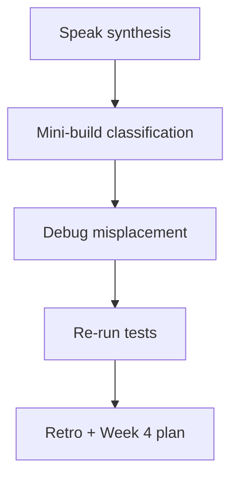
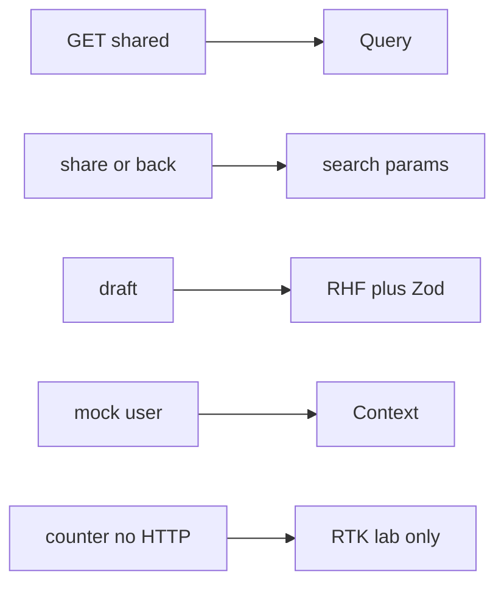

# Month 7 · Week 3 · Day 7
# Week Review — Decision Order and When Redux Is Unnecessary

**Month index:** [../../README.md](../../README.md)  
**Week 3:** [1](day-01.md) · [2](day-02.md) · [3](day-03.md) · [4](day-04.md) · [5](day-05.md) · [6](day-06.md) · Day 7 (today)  
**Week rhythm today:** Review, repair, plan Week 4  
**Study time:** 3–4 focused hours  
**Student state:** You classified state, put filters in the URL, kept auth on Context, and typed an RTK counter. Today the **gate skill** is refusing Redux for the list — from **this file**.

Do not start Week 4 because the calendar moved. Start Week 4 because this file’s gate is true.

---

## How to read this chapter

Closed-book teaching day. The synthesis **is** the lesson. Day 7’s debug prompts are the exam for “when Redux is unnecessary.”



---

## Week synthesis (the lesson, in this book)

**Decision order:** server shared → **Query**; share/back → **URL**; local → **useState**; few stable children → **Context**; large shared client many writers → **RTK (rare)**; else lift/compose. **RHF** for drafts. **Zod** at JSON boundaries.

**URL:** `q` and `page` in search params **and** in `queryKey`. `placeholderData: keepPreviousData`. Reset page when `q` changes. No passwords in the query string.

**Context:** mock `user`, `login`, `logout`. Not GET rows. Optional `queryClient.clear()` on logout. `RequireAuth` + `Navigate`.

**RTK literacy:** `configureStore`, `createSlice`, actions, reducers, `useDispatch`, `useSelector`, thunk middleware. Two counters share a store. **Thunk `fetchItems` duplicates Query.** Isolated lab only. Project 4 default: **no Redux**.

**Tests:** `MemoryRouter` `initialEntries`; QueryClient per test; no nested BrowserRouter; fresh RTK store per test if you test the counter.

**Wrong belief:** “Professionals put API data in Redux.”  
**Correct:** professionals put API data in a **server-state cache**. This course’s cache is TanStack Query.

### Gate speech pieces you must still unpack

```tsx
queryKey: ["sailings", { q, page, sort }],
placeholderData: keepPreviousData,
```

`useSearchParams` reads. `setParams` writes. Shadow `useState(page)` is a bug.

Thunk vs Query, in one paragraph you should be able to say:

A `createAsyncThunk('items/fetch')` gives `pending` / `fulfilled` / `rejected` for **one** list. You still invent keys, `staleTime`, focus refetch, and prefix `invalidateQueries({ queryKey: ["items"] })`. `useQuery` / `useMutation({ mutationFn })` already did. Keep RTK for a **counter** (two components, one number, **no HTTP**). Delete the thunk cache.

**Wrong belief:** “I’ll say Redux is overkill and stop.”  
**Correct:** the gate is **naming the right tool** for each misplaced piece.

**Wrong belief:** “Week 3 replaced Query with diagrams.”  
**Correct:** the hooks did not change. Object syntax still: `useQuery({ queryKey, queryFn })`.

**Wrong belief:** “Form drafts belong in Query so they persist.”  
**Correct:** that caches keystrokes. Drafts are RHF. The README mermaid omitted the box; this week did not give permission to forget Week 2.

Mini-build scaffold if you want a running repair:

```powershell
cd ~\fullstack-lab\month-07
npm create vite@latest week-03-review -- --template react-ts
cd week-03-review
npm install
npm install react-router @tanstack/react-query
```

Protected list, URL `q`, Query rows, no Redux. Or `ADDENDUM.md` for a **museum loan desk** with ten why-nots if scaffolding is exhausted — prefer running code if Day 6’s ferry is messy.

If Project 4’s `package.json` has `@reduxjs/toolkit` only from curiosity, remove it from **that** repo today unless ARCH names a surviving **client** problem.

---

## Today's contract

1. Teach the flowchart and RTK vocabulary aloud.  
2. Mini-build or mini-doc: classify a new tiny UI.  
3. Debug three misplacements (Context list; `useState` page; thunk as GET cache).  
4. Re-run tests.  
5. Retro; Week 4 is feature folders, error boundaries, lazy/Suspense, Profiler, MSW, finish Project 4, exam.

**Today's gate.** Closed-book:

> I can walk the decision order. I can define a slice and a thunk. I can explain why Query already cached the list. I do not need Redux for Project 4 unless I can name a client-state problem that survives this week.

---

## Time box

| Block | Minutes | Work |
|---|---|---|
| 1 | 40 | Speak the synthesis |
| 2 | 50 | Mini-build / architecture addendum |
| 3 | 35 | Debug A–C (gate skill) |
| 4 | 20 | Tests |
| 5 | 25 | Retro + repair |

---

# Complete explanation — state you must still own

## 1. The flowchart in one breath

If it is GET and shared, it is Query. If the operator must share or refresh it, it is the URL (which **feeds** Query keys). If only one widget cares, `useState`. If a stable client value is needed deep, Context. If a large client collaboration exists, maybe RTK. Forms are RHF. That is the month.

## 2. URL and keys

```tsx
queryKey: ["sailings", { q, page, sort }],
```

`useSearchParams` is the reader. `setParams` / `Link` is the writer. Shadow `useState(page)` is a bug.

## 3. Auth context

Pipe for `user`. Login form is RHF. Session is fake. XSS still JSX text.

## 4. RTK vs Query

Dispatch goes to reducers. Selectors read the tree. Thunks delay dispatch. None of that **is** `staleTime`, query keys, or `invalidateQueries({ queryKey: ['items'] })`.

A counter in `week-03-rtk` taught **shared client** state. Two `useState` counters would **not** share. That contrast is the whole legitimate Redux demo. A dashboard list is the **illegitimate** demo.

## 5. Project 4

`STATE_ARCHITECTURE.md` in the **project repo** is required this month (Week 4 Day 6). It must **not** invent Redux for the list. If you added Redux “because the spec mentioned it,” read the spec again: **conditional**.

---

# 1. Closed-book explanation (40 min)

Cover: every flowchart box with an example; `keepPreviousData`; auth vs rows; store/slice/action/reducer/selector/thunk/middleware; why RTK Query is not our layer; test wrappers.

---

# 2. Mini-build (50 min)

`~\fullstack-lab\month-07\week-03-review\`

Either a **tiny** Vite app (one protected list, URL `q`, Query, no Redux) **or**, if you are exhausted of scaffolding, an **`ADDENDUM.md`** that classifies **ten** pieces of a **museum loan desk** (new fiction) with why-nots. Prefer a running app if Day 6’s ferry is messy — repair it as the mini-build.

No Project 4 source.

---

# 3. Debugging (35 min) — gate skill

`review/DEBUG.txt` — full sentences.

**A. List in Context** — `AuthProvider` also holds `items` filled by `useEffect`. Two pages, stale append, no keys. What Query would have done. Why rerenders hurt.

**B. Page only in `useState`** — Next increments React state; the address bar stays `?page=1` or has no page. Refresh. Share. What to write instead (`useSearchParams` + key).

**C. Thunk as GET cache** — `createAsyncThunk` `fetchItems` + `itemsSlice`. Classmate says “Redux is our backend.” Map each Query feature they now must invent. What to delete.

Stretch **D.** `?token=abc` after login.  
Stretch **E.** Redux **and** Query both holding the same array — which one wins on create?

These answers are the **when Redux is unnecessary** skill. Vague “Redux is overkill” fails. Name the **right** tool.

---

# 4. Re-run tests (20 min)

One Week 3 app: `npm test`. Record PASS/FAIL. Fix today.

---

# 5. Retro + Week 4 plan (25 min)

`review/retro.md`

**Week 4:** **feature folders** (`features/items/`), **error boundaries** (class component **only** for `componentDidCatch` — React still has no function equivalent), **`React.lazy` + `Suspense`**, Profiler / **do not memo first**, **MSW** handlers, finish **Project 4** checklist, **Month 7 exam**.

Repair: if Project 4 already has unjustified Redux, **remove** it today or schedule it as the first Week 4 hour — do not let it rot.

```powershell
cd ~\fullstack-lab
git add month-07
git commit -m "Record Week 3 state architecture review."
```

---

## Model answers you must still write yourself

Do not paste these into DEBUG.txt. After you write, you may compare **ideas**. If your file is shorter than three honest paragraphs per of A–C, you have not taught.

**A (idea):** Context-as-cache has one slot for “the items.” Filters and pages have no identity. A create on page 1 silently appears on a page-2 view that never refetched. Query would have `["items", { page: 2 }]` as a different entry and `invalidateQueries({ queryKey: ["items"] })` to mark them stale. Context also rerenders every consumer when the array identity changes — including the sign-out button.

**B (idea):** `useState(page)` dies on refresh. A coworker opens your “page 3” link and sees page 1. `useSearchParams` plus `page` in the query key makes the address bar the input Query already understands.

**C (idea):** `createAsyncThunk('items/fetch')` gives you `pending`/`fulfilled`/`rejected` for **one** list. You still invent keys, stale time, focus refetch, and prefix invalidation. `useQuery` / `useMutation` already did. Keep RTK for a **counter** or a real client workflow; delete the thunk cache.

**Wrong belief:** “I’ll say Redux is overkill and stop.”  
**Correct:** the gate is **naming the right tool** for each misplaced piece.

If Project 4’s `package.json` includes `@reduxjs/toolkit` only because of this week’s curiosity, remove it from that repo today unless `STATE_ARCHITECTURE.md` names a surviving client problem. The lab counter remains in `week-03-rtk`.

---

## Week 3 definition of done

- [ ] I can walk the decision order without looking
- [ ] I can define RTK vocabulary and still refuse it for GET lists
- [ ] DEBUG.txt A–C are specific, not slogans
- [ ] A STATE_ARCHITECTURE.md exists for a fiction (Day 6) and is honest
- [ ] URL filters proven (app or test)
- [ ] Isolated RTK lab is not wired into Project 4

If any box is false, stay on Week 3. Feature folders will not hide a list in Redux.

Close Days 1–6. Speak the flowchart one last time using **only** the synthesis at the top of this file. If you cannot, you are not done.

A sixty-second gate speech you should be able to give:

> Server lists are Query, keyed including filters and page. Shareable `q` and `page` are the URL. Mock user is Context, not the list. Drafts are RHF. Redux is a client store I practiced as a counter. Thunks that fetch items duplicate Query, so Project 4 does not use them.

If you skip “keyed including filters,” you are not ready.

Write that speech into `review/GATE_SPEECH.txt` without looking at the synthesis, then diff it against the paragraph above. Repair any missing box of the flowchart.

If GATE_SPEECH.txt still says “Redux for the list,” you failed the week. Delete that sentence and replace it with Query keys. Re-record the speech.

The sixty-second speech must also name **form state** (RHF) even though the README mermaid does not draw that box. A classmate who puts the create-title draft in Query will “cache” keystrokes. Week 2 already forbade that; this week’s flowchart does not give you permission to forget it.

**Wrong belief:** “Week 3 replaced Query with architecture diagrams.”  
**Correct:** Week 3 told you **which** state Query is allowed to hold. The hooks did not change: `useQuery({ queryKey, queryFn })`, `useMutation({ mutationFn })`, `invalidateQueries({ queryKey: ['items'] })`.

---

## Optional review links

Week 3 is explained in this chapter.

- [Month 7 README](../../README.md)
- [Redux Toolkit: Quick start](https://redux-toolkit.js.org/tutorials/quick-start)
- [TanStack Query: Overview](https://tanstack.com/query/latest/docs/framework/react/overview)

---

## Next week

**Day 1 of Week 4** organizes a UI by **feature** (`features/items/api.ts`, hooks, pages) instead of a junk drawer `components/`. Come in able to say today’s gate in sixty seconds.

If you cannot name `placeholderData: keepPreviousData` as the page-change trick, repair Week 1 Day 4 from **this week’s** URL labs — the URL changed the key; the placeholder kept the table painted. That pair is still the product.

Bring `STATE_ARCHITECTURE.md` (fiction) to Week 4 so you can **clone the shape** into `~/ops-dashboard/`, not the ferry nouns. The exam will ask where state lives in **your** dashboard. A fiction-only answer is allowed on Day 6; it is not allowed on the Month 7 gate.

Do not start Week 4 with unjustified Redux still in Project 4. Remove it this afternoon if DEBUG.txt named it.

### DEBUG A–C in the voice the exam wants

**A.** `AuthProvider` holds `items` filled by `useEffect`. Page 2 never has its own identity. Create on page 1 appears on a page-2 view that never refetched. Query would use `["items", { page: 2 }]` and `invalidateQueries({ queryKey: ["items"] })`. Context also rerenders Sign out when the array identity changes.

**B.** Next increments `useState(page)`. The address bar stays `?page=1`. Refresh loses the place. A coworker’s shared link is a lie. `useSearchParams` plus `page` in the key is the fix.

**C.** `createAsyncThunk('items/fetch')` + `itemsSlice` is a homemade Query: one pending/fulfilled/rejected for one list. You still invent keys, `staleTime`, `gcTime`, focus refetch, prefix invalidation. Delete the thunk cache. Keep the counter lab.

Write `review/GATE_SPEECH.txt` without looking, then diff against the sixty-second paragraph in this file. Missing “keyed including filters” means you are not ready.

```powershell
cd ~\fullstack-lab\month-07
npm create vite@latest week-03-review -- --template react-ts
cd week-03-review
npm install
npm install react-router @tanstack/react-query
```

### Form state still exists (say it in GATE_SPEECH.txt)

The flowchart’s boxes are Query, URL, useState, Context, RTK. **RHF** is still the draft. A classmate who `setQueryData`s each keystroke will cache half-typed titles. Week 2 forbade that; this review does not un-forbid it.

Zod still parses `unknown` JSON in `queryFn`. Empty list is success. `useMutation({ mutationFn })` then `invalidateQueries({ queryKey })` on success. v5 object syntax. `gcTime` not `cacheTime`. `placeholderData: keepPreviousData`.

If `@reduxjs/toolkit` is in `~/ops-dashboard/` without a named client problem, remove it **today**.

Re-run tests on one Week 3 app. Record PASS/FAIL. `GATE_SPEECH.txt` must name: Query keys including filters and page; URL for `q`/`page`; Context for mock user; RHF for drafts; RTK counter only; no Redux for GET lists; `placeholderData: keepPreviousData`; `invalidateQueries({ queryKey })`; `gcTime` not `cacheTime`.

Days 1–6 stay closed during the mini-build. Repair from **this** synthesis.



Museum loan addendum if you skip a new Vite app: ten pieces, each with why-not. Prefer running code if the ferry app is messy — repair it as the mini-build.

**Wrong belief:** “I’ll keep Redux in Project 4 ‘just in case.’”  
**Correct:** unused stores rot. Delete unless ARCH names a client problem that survives Query, URL, Context, and RHF.

Closed-book cover: every flowchart box with an example from ferry or archive; `keepPreviousData`; store/slice/action/reducer/selector/thunk; why RTK Query is not our layer; test wrappers (`MemoryRouter`, fresh QueryClient, no nested BrowserRouter).

`review/retro.md`: hours; solid vs weak; Week 4 feature folders, error boundaries, lazy/Suspense, Profiler, MSW, finish Project 4, exam.

```powershell
cd ~\fullstack-lab
git add month-07
git commit -m "Record Week 3 state architecture review."
```

If GATE_SPEECH.txt still says “Redux for the list,” replace that sentence with Query keys and re-record.

The sixty-second speech must also name **form state** (RHF). A classmate who puts create-title drafts in Query will cache keystrokes. `useQuery({ queryKey, queryFn })` and `useMutation({ mutationFn })` did not change this week.

Optional review is later checking only. This file is the lesson. Do not start Week 4 because the calendar moved.

Open [../week-04/day-01.md](../week-04/day-01.md) when this gate is true.

---
