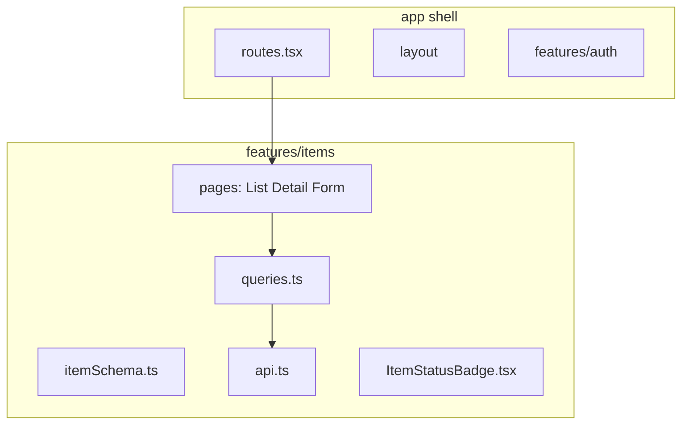
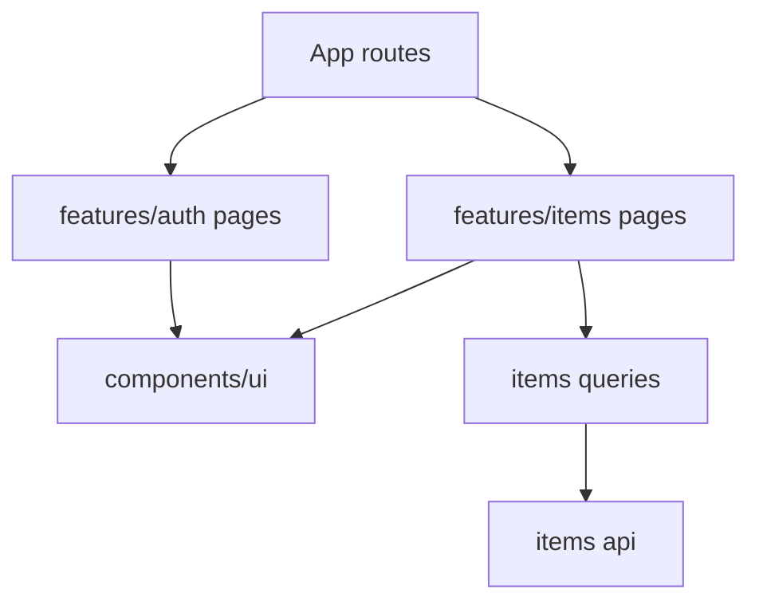

# Month 7 · Week 4 · Day 1
# Feature Folders and Component APIs

**Program:** Full-Stack Mastery · 18 months  
**Phase:** 2 — Modern frontend  
**Month index:** [../../README.md](../../README.md)  
**Week 4:** Day 1 (today) · [2](day-02.md) · [3](day-03.md) · [4](day-04.md) · [5](day-05.md) · [6](day-06.md) · [7](day-07.md)  
**Week rhythm today:** Learn + type-along  
**Student state:** Week 3 gate. You know where state lives. The repo is probably `components/` with a dozen unrelated files and `api.ts` as a junk drawer. That does not scale to Project 4’s list + detail + form.  
**Study time:** 3–4 focused hours

**This week covers:** feature-based folders, error boundaries, `lazy`/`Suspense`, measure-then-memo, MSW, finish Project 4, Month 7 exam.

Today: **`features/items/`** (and friends), what a **component API** is (props you can explain), and what **not** to split. Error boundaries are **Day 2**. Do not skip them.

This textbook will **not** give you the dashboard. Labs: `~\fullstack-lab\month-07\`. You may **reorganize** `~/ops-dashboard/` using today’s rules — you still write the files.

Tailwind is **optional** and only **after** CSS you can explain. Do not “migrate to Tailwind” as today’s job.

---

## How to use this textbook

1. Read a section. Close it. Say the idea.  
2. Move files in a **lab** first, then optionally in Project 4.  
3. If a split requires rewriting half the app, the split is too early.  
4. Optional review links are for later rechecking.

---

## How to read this chapter

A **feature** is a slice of the product a human can name: **items**, **auth**, **dashboard summary**. Code that changes **together** should **live** together: schema, API, query hooks, pages, local components.

A **layer** dump (`components/`, `hooks/`, `utils/`, `api/`) groups by **kind**. That feels tidy until `getItem` in `api/` is twenty folders away from `ItemDetails.tsx`.



If that is still abstract: a restaurant does not keep all knives in one city warehouse and all recipes in another country. The **grill station** has the grill’s tools.

---

## Today's contract

By the end of this day you will be able to:

1. Explain **feature folders** vs **type folders**.  
2. Place **Zod schema**, **fetch helpers**, **`useQuery`/`useMutation` wrappers**, and **pages** under `features/<name>/`.  
3. Keep **truly shared** UI (`Button`, `PageHeader`) in `components/` or `ui/` — thin, no feature imports **down** from items.  
4. Define a **component API**: required props, what it owns, what it must not fetch unless it is a page.  
5. Avoid **circular imports** (page → api → page).  
6. Refuse a 400-line `App.tsx` as the feature.

**Today's gate.** Closed-book:

> A feature folder owns one product concept end to end. Shared UI does not import `features/items`. Pages compose; badges do not call `useQuery` unless they *are* the data boundary. I can draw my import arrows.

---

## Time box

| Block | Minutes | Work |
|---|---|---|
| A | 50 | Theory |
| B | 55 | Type-along: split a lab into features |
| C | 70 | Independent: second feature + public API |
| D | 20 | Git |
| E | 15 | Recall |

---

# Block A — Theory

## 1. A suggested tree (not a religion)

```
src/
  main.tsx
  App.tsx                 # providers + routes only
  routes.tsx              # Route table
  components/             # shared, dumb-ish UI
    ui/Button.tsx
    layout/AppLayout.tsx
  features/
    auth/
      AuthProvider.tsx
      LoginPage.tsx
      loginSchema.ts
    items/
      itemSchema.ts
      api.ts
      queries.ts
      ItemListPage.tsx
      ItemDetailPage.tsx
      ItemForm.tsx
      ItemStatusBadge.tsx
    dashboard/
      DashboardPage.tsx
      statsQueries.ts
  test/
    renderWithProviders.tsx
```

Names vary (`pages/` inside the feature is fine). The rule is **gravity**: `itemSchema` next to `api.ts` next to the page that uses them.

**Wrong belief:** “I’ll have `types/`, `schemas/`, `services/`, `hooks/`, `views/` as top-level always.”  
**Correct:** that is six hops to change “item title is required.” Features first; *then* a `lib/queryClient.ts` for the singleton client.

---

## 2. `queries.ts` — hooks that know keys

```ts
// features/items/queries.ts
export function useItemList(filters: { q: string; page: number }) {
  return useQuery({
    queryKey: ["items", filters],
    queryFn: () => listItems(filters),
    placeholderData: keepPreviousData,
  });
}

export function useCreateItem() {
  const queryClient = useQueryClient();
  return useMutation({
    mutationFn: createItem,
    onSuccess: () => {
      void queryClient.invalidateQueries({ queryKey: ["items"] });
    },
  });
}
```

Pages call `useItemList`. They do not invent keys in three files. **Invalidation stays next to the mutation.**

`api.ts` is still `fetch` + `ok` + Zod `parse`. Hooks do not parse.

---

## 3. Component APIs — boundaries again

| Kind | May `useQuery`? | Props |
|---|---|---|
| **Page** (`ItemListPage`) | Yes — it is the data boundary | Route params, nothing huge |
| **Feature widget** (`ItemStatusBadge`) | Usually **no** — receives `status` | Small, typed |
| **Shared `Button`** | Never | `children`, `type`, `disabled`, `onClick` |

**Wrong belief:** “I’ll make `ItemTable` fetch so the page stays clean.”  
**Correct:** now you have two data boundaries and surprise waterfalls. Either the **page** fetches and passes rows, or a clearly named `ItemTableConnected` is the boundary — do not hide fetch in a table that looks dumb.

**Wrong belief:** “Reusable means twenty optional booleans.”  
**Correct:** composition (`children`) and small props. Month 6 still applies.

Public export: a feature may have `index.ts` that exports pages and hooks. Do not export `api.ts` internals if pages should not call `fetch` directly — optional discipline.

---

## 4. Import direction

Allowed:

- `features/items/ItemListPage` → `features/items/queries` → `features/items/api`
- `features/items/ItemListPage` → `components/ui/Button`
- `App.tsx` → `features/items/ItemListPage`

Forbidden:

- `components/ui/Button` → `features/items/api`
- `features/auth/AuthProvider` → `features/items/ItemListPage`
- `features/items/api` → `features/items/ItemListPage`

Auth may export `useAuth`. Items may **read** `useAuth` for `enabled: !!user`. Items must not **own** login.



Cycles: if `api.ts` imports a component, you have inverted the stack.

---

## 5. Colocation of tests

`ItemForm.test.tsx` next to `ItemForm.tsx` **or** in `features/items/__tests__/`. Pick one. Shared `renderWithProviders` in `src/test/`.

MSW handlers (Day 5) can live in `src/mocks/` **or** `features/items/msw.ts`. Feature-next-to-handler is easier to delete with the feature.

---

## 6. Tailwind / UI kits (optional, after CSS)

If you add Tailwind this week, it does **not** replace:

- landmarks, one `h1`, focus rings, labels
- Month 2 spacing you can still write in CSS

A `Button` with `className` join is enough. Do not rebuild the dashboard in a paid template.

---

## 7. Project 4 application (checklist, not source)

When you touch `~/ops-dashboard/` today, you **move** files; you do not download an admin template. Suggested features: `auth`, `items` (or `inventory` / `jobs` — **your** domain name), `dashboard`. Keep `STATE_ARCHITECTURE.md` at repo root — it is not a feature.

A **component API** paragraph you can reuse in API.md:

> `TagCard` receives `title` and `status`. It owns the `<article>` markup and the badge color classes. It must not invent the tag list, must not call `useQuery`, and must not link with a raw `<a href="/tags/1">` if the app is an SPA — it uses `Link` from the parent or receives `to`.

If you cannot write that paragraph for a file, the file has no boundary yet. Split or delete it.

---

# Block B — Type-along

Use `week-03-ferry` or a new `week-04-features` copied conceptually (do not copy Project 4).

```powershell
cd ~\fullstack-lab\month-07
npm create vite@latest week-04-features -- --template react-ts
cd week-04-features
npm install
npm install react-router @tanstack/react-query zod react-hook-form @hookform/resolvers
```

1. Build a **tiny** “lost luggage tags” list+create (new domain) **already split** into `features/tags/` + `features/auth/` + `components/ui`.  
2. `queries.ts` owns keys and invalidate.  
3. `IMPORTS.md`: mermaid or bullet arrows.  
4. Deliberate cycle: make `Button` import `useTagList`. Watch the mess. Revert. Write one sentence.

---

## 8. What a page is allowed to import

`ItemListPage` may import:

- `useItemList`, `useCreateItem` from `./queries`
- `ItemStatusBadge` from `./ItemStatusBadge`
- `Button` from `../../components/ui/Button`
- `useAuth` from `../auth/useAuth`
- `useSearchParams` from `react-router`

It should **not** import:

- `fetch` helpers from another feature’s `api.ts` (re-export a hook there, or a shared `lib/http.ts` for `ok` + json)
- `DashboardPage` (compose in **routes**, not in the item page)
- `queryClient` singleton to call `invalidateQueries` in JSX — that belongs in `queries.ts` `onSuccess`

**Wrong belief:** “A barrel `features/items/index.ts` that exports everything is always cleaner.”  
**Correct:** barrels that re-export **pages and hooks** are fine. Barrels that re-export `api` internals invite cycles. Start without a barrel if you are unsure.

---

## 9. Refactors that are too early

Do not invent `useRepository()` abstracting Query “so we can swap Redux later.” You are not swapping. Do not invent a `BasePage`. Split when you have **two** call sites or a file you cannot scroll without getting lost.

**Wrong belief:** “I’ll create `features/shared/hooks/useApi.ts` that takes a URL string.”  
**Correct:** that hides keys and Zod. Typed functions per resource are the course style.

If Project 4’s `App.tsx` is 400 lines, today’s job is **move**, not **rewrite behavior**. Tests should stay green. If you have no tests yet, write one heading test **before** the move so the move cannot silently delete the `h1`.

---

# Block C — Independent

Second feature `features/desks/` with a **static** or Query list of desks. Shared `Button`. No cross-feature page imports.

`API.md` for `TagCard`: receives / owns / must not invent (must not fetch).

If you reorganize Project 4, commit **there** separately with a message about folders, not “finish dashboard.”

When moving files, **grep** for old paths. A leftover `from "../../api"` that still points at a junk-drawer `src/api.ts` means you now have **two** fetch helpers. Delete the drawer once the feature `api.ts` owns the resource.

**Wrong belief:** “I’ll keep `src/api.ts` as a facade that imports every feature.”  
**Correct:** that facade becomes a cycle magnet. Routes import pages; pages import their queries.

```powershell
cd ~\fullstack-lab
git add month-07/week-04-features
git commit -m "Week 4 Day 1: feature folders for tags and auth."
```

---

# Block E — Recall

1. Feature vs type folder.  
2. Who owns `queryKey` strings.  
3. Why Button must not import items API.  
4. Page vs badge as data boundary.  
5. Where `STATE_ARCHITECTURE.md` lives.

Barrel files: if `features/tags/index.ts` exports the page **and** the api, `Button` can accidentally import from the barrel and pull Query into shared UI. Export pages from `index.ts` only, or skip the barrel.

`STATE_ARCHITECTURE.md` stays at the **repo root** even after feature folders exist. Do not bury it in `features/items/` — it is about the whole app.

---

## 10. Tests colocate; providers stay shared

A list test that imports `useItemList` from `features/items/queries` is allowed. A list test that reaches into `features/auth/loginSchema` to build a user is a smell — use the test `AuthProvider` with `initialUser` (Week 3 Day 5). Shared `src/test/renderWithProviders.tsx` wraps Query + Router + Auth. It does **not** live inside `features/items/`; every feature would then import items to test auth.

**Wrong belief:** “Feature folders mean each feature has its own QueryClient.”  
**Correct:** one client per **app** (and one **new** client per **test**). Features share the cache on purpose so the dashboard card and the list page can hit `["items", filters]`.

When you move Project 4 files, keep `main.tsx` providers at the root. Moving `QueryClientProvider` into `features/items` would make login unable to prefetch and would make dashboard stats a second cache. Gravity is for **item** code, not for the singleton client.

---

## Definition of done

- [ ] A lab uses `features/<name>/` with schema, api, queries, page
- [ ] Shared UI does not import features
- [ ] IMPORTS.md exists
- [ ] I can explain a component API in one paragraph
- [ ] Commit exists

---

## Optional review links

Feature folders are explained in this chapter.

- [React: Thinking in React](https://react.dev/learn/thinking-in-react)
- [TanStack Query: Query keys](https://tanstack.com/query/latest/docs/framework/react/guides/query-keys)

---

## Tomorrow

**Error boundaries:** React still requires a **class** component for `componentDidCatch` / `getDerivedStateFromError`. Function components cannot do this. You will write one class **only** for that job.
