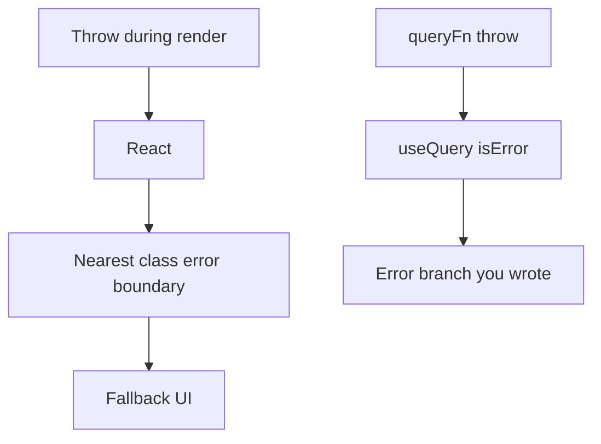
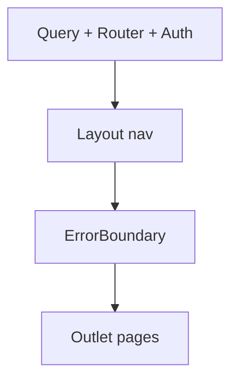

# Month 7 · Week 4 · Day 2
# Error Boundaries — The One Class You Still Write

**Program:** Full-Stack Mastery · 18 months  
**Phase:** 2 — Modern frontend  
**Month index:** [../../README.md](../../README.md)  
**Week 4:** [1](day-01.md) · Day 2 (today) · [3](day-03.md) · [4](day-04.md) · [5](day-05.md) · [6](day-06.md) · [7](day-07.md)  
**Week rhythm today:** Exercises + type-along  
**Student state:** Day 1 gate. Features have folders. A render crash (`data.map` on `undefined` you swore was an array) still **whitescreens** the whole app. Query’s `isError` does **not** catch that — the throw happened **during render**, not in `queryFn`.  
**Study time:** 3–4 focused hours

Today: **error boundaries**. React’s API for “a child threw while rendering” is **`componentDidCatch`** and **`getDerivedStateFromError`**. Those exist on **class components**. Function components have **no** equivalent hook in React 19. This course remains **functions everywhere else**. You will write **one class** (or copy a 30-line class you can explain) **only** for this job.

This is not Redux. This is not Query. This is the **render** crash net.

Project 4: you will **later** wrap a route or the shell. Today’s lab is a **museum kiosk**, not the dashboard source.

---

## How to use this textbook

1. Read until you can say what an error boundary **does not** catch.  
2. Type the class. Cause a crash. See the fallback.  
3. Optional review links are for later rechecking.

---

## How to read this chapter

Query `isError` is for **failed fetches**. RHF `errors` are for **fields**. `try/catch` in an event handler catches **that handler**. None of those run when React is calling your function and **`items.map` throws**.

React walks the tree. If a descendant throws, React looks for the nearest **error boundary**, unmounts the broken subtree, and renders that boundary’s **fallback**. Without one, the whole root unmounts — blank page. Project 4 forbids a blank screen.



Two nets. Wear both.

---

## Today's contract

By the end of this day you will be able to:

1. Explain why the boundary is a **class**: `getDerivedStateFromError`, `componentDidCatch`.  
2. Write `class ErrorBoundary extends Component<Props, State>`.  
3. Render a **fallback** with a heading, a message, and a **retry** (reset state) or a `Link` home.  
4. List what boundaries **do not** catch (events, async, server, Query — unless you rethrow in render).  
5. Place boundaries at **route** or **feature** granularity, not around every button.  
6. Keep **function** components for everything else.

**Today's gate.** Closed-book:

> Render errors need an error boundary. In React 19 that is still a class. Query `isError` is a different net. I do not catch events with a boundary. I do not use classes for pages.

---

## Time box

| Block | Minutes | Work |
|---|---|---|
| A | 50 | Theory |
| B | 55 | Type-along: class + crashing child |
| C | 70 | Independent: route-level boundary + Query error vs render error |
| D | 20 | Git |
| E | 15 | Recall |

---

# Block A — Theory

## 1. The exception React still documents

Month 6: **function components only**. That rule stands — **except** this:

React does not provide `useErrorBoundary` as a built-in that *replaces* the class (libraries exist; this course writes the class so you understand the platform). `componentDidCatch` is a **lifecycle method on classes**.

```tsx
import { Component, type ErrorInfo, type ReactNode } from "react";

type Props = { children: ReactNode; fallback?: ReactNode };
type State = { error: Error | null };

export class ErrorBoundary extends Component<Props, State> {
  state: State = { error: null };

  static getDerivedStateFromError(error: Error): State {
    return { error };
  }

  componentDidCatch(error: Error, info: ErrorInfo) {
    console.error("ErrorBoundary", error, info.componentStack);
  }

  reset = () => {
    this.setState({ error: null });
  };

  render() {
    if (this.state.error) {
      return (
        this.props.fallback ?? (
          <section>
            <h1>Something went wrong</h1>
            <p>This panel crashed. You can try again or go home.</p>
            <button type="button" onClick={this.reset}>
              Try again
            </button>
          </section>
        )
      );
    }
    return this.props.children;
  }
}
```

**`getDerivedStateFromError`:** render-phase. Convert the throw into **state**. Must be static. Return `{ error }`.

**`componentDidCatch`:** after commit. Side effects: log. Do not `setState` here for the fallback if you already used `getDerivedStateFromError` (you can, but one path is enough).

**`reset`:** set `error` back to `null` so children mount again. If the child **always** throws, you loop. Retry is for **transient** mistakes or after navigation.

**Wrong belief:** “I’ll write `function ErrorBoundary` and `useEffect`.”  
**Correct:** that will not catch descendant render throws. You need the class API.

**Wrong belief:** “Classes are back for everything.”  
**Correct:** this is a **platform hole**. Pages stay functions.

---

## 2. What is not caught

| Throw location | Caught by error boundary? |
|---|---|
| Render of a descendant (`return items.map`) | **Yes** |
| Constructor of a descendant class | Yes |
| `queryFn` / `fetch` rejection | **No** — Query `isError` |
| `handleClick` throw | **No** — event; use try/catch or let it hit the console |
| `setTimeout` / Promise `then` | **No** — async; not in React’s render |
| Error boundary’s **own** render | **No** — needs a parent boundary |
| SSR (not this course’s host) | Different story |

**Wrong belief:** “One boundary means I can skip Query error UI.”  
**Correct:** failed GET should be a **polite** page, not a crash. Do not throw in render because `isError` is true — **branch**. Throw in render only for **impossible** states (programmer error) you want the net to catch.

If you throw inside `queryFn`, Query catches it. If you then do `if (!data) data.map()` because you ignored `isPending`, that **is** a render throw — boundary time. Fix the branch; the boundary is the last net.

---

## 3. Where to place it

```tsx
<ErrorBoundary>
  <AppLayout />
</ErrorBoundary>
```

Shell-level: any page crash shows fallback; nav might die too if it is inside.

Better:

```tsx
<AppLayout>
  <ErrorBoundary>
    <Outlet />
  </ErrorBoundary>
</AppLayout>
```

Nav survives. The **page** is replaced. This matches “no blank screen” without destroying chrome.

Feature-level: wrap a widget that uses a flaky third-party chart so the table still works.

Do not wrap every `<li>`.



---

## 4. Fallback UI (accessible)

- One `h1` if this fallback **is** the page; `h2` if the site `h1` is in the layout still visible.  
- Real `<button>` for retry. `Link` to `/` for escape.  
- Do not `dangerouslySetInnerHTML` the `error.message` if it might contain junk — **text** is fine for `error.message` in a lab (`{error.message}`).  
- Logging in `componentDidCatch` is not a product UI.

---

## 5. Query vs boundary — teach this pair

| Symptom | Tool |
|---|---|
| Network 500, timeout, parse fail in `queryFn` | `isError` + retry `refetch` |
| `undefined.map` in JSX | Error boundary + **fix the bug** |
| Mutation 400 | `setError` / mutation `isError` |
| Blank root | Missing boundary **or** crash **in** the boundary |

Zod parse in `queryFn` → Query error. Good. Zod parse in render “to be sure” that throws → boundary. Put parse in `api/`.

---

## 6. Libraries

`react-error-boundary` wraps the class for you. This course **types the class once** so you are not superstitious. You may use the library later if you can explain what it wraps. Today: your class.

---

# Block B — Type-along

```powershell
cd ~\fullstack-lab\month-07
npm create vite@latest week-04-boundary -- --template react-ts
cd week-04-boundary
npm install
npm install react-router
npm run dev
```

1. `ErrorBoundary.tsx` class as in theory.  
2. `Boom.tsx` function: `if (true) throw new Error("kiosk render exploded");` — behind a button that **sets state** `explode` so you can mount cleanly first.  
3. Wrap `Boom` in `ErrorBoundary`. Click. Fallback. Retry.  
4. `NOTES.txt`: what the console shows from `componentDidCatch`.  
5. Throw inside `onClick` **without** setting explode — confirm the **boundary does not** catch it. Write that down. Optional: `try/catch` in the handler.

---

## 7. Reset and navigation together

A fallback “Try again” that only `setState({ error: null })` remounts the **same** crashing child. Pair retry with:

- a `key` on the child you increment (`<Outlet key={retryCount} />` is a blunt instrument — prefer resetting **page state** if you own it), or
- `Link` to `/` so the user **leaves**.

Logging: `componentDidCatch` is the right place for `console.error`. Do not `fetch` a telemetry URL from render. Do not `alert` the stack to the operator — a short sentence is the product.

**Wrong belief:** “I’ll install an error boundary so I can skip empty/error branches in Query.”  
**Correct:** you will still write those branches. The boundary is for **unknown** render throws, not for HTTP you already modeled.

---

## 8. Nested boundaries

```tsx
<ErrorBoundary fallback={<ShellCrash />}>
  <AppLayout>
    <ErrorBoundary fallback={<PageCrash />}>
      <Outlet />
    </ErrorBoundary>
  </AppLayout>
</ErrorBoundary>
```

Inner catches page throws; outer catches layout throws. Inner `componentDidCatch` does **not** stop the inner fallback from rendering. The throw does **not** bubble to the outer if the inner handled it. That is the point of “nearest boundary.”

Do not nest five deep. Two is a grown-up dashboard.

If the **fallback itself** throws, you need a parent. Keep fallbacks boring: heading, paragraph, button, link. No Query in the fallback. No `useParams` if the param was the thing that crashed — prefer `Link to="/"`.

**Wrong belief:** “The fallback should show `error.stack` to look professional.”  
**Correct:** stacks are for `componentDidCatch` logs. Operators get a short sentence. In production you would send the log to a service; you do not have one this month.

---

# Block C — Independent

Museum kiosk: two routes (`/`, `/plaque/:id`). Layout with nav. **Boundary around `Outlet`**.

1. Plaque page: Query or a fake `getPlaque`. `isError` UI for failed fetch (bad id).  
2. A **deliberate** render crash button on one plaque (“Dev: crash this plaque”) that throws during render. Boundary fallback; **nav still visible**.  
3. Compare in `NETS.md`: fetch fail vs render throw — what the user sees for each.  
4. Do **not** use a class for `PlaquePage`.

No Redux. No Project 4 paste.

Throw during **render** of `PlaquePage` only when a **button** has set `crash` to true. A module-level `throw` as soon as the file loads will crash **before** the boundary’s children mount in a confusing way. State-driven crash is the lab.

**Wrong belief:** “I’ll wrap `fetch` in the error boundary.”  
**Correct:** `fetch` is async. The boundary never sees it unless you rethrow **during render** after storing the error in state — which is what Query’s `isError` branch already is, politely.

```powershell
cd ~\fullstack-lab
git add month-07/week-04-boundary
git commit -m "Week 4 Day 2: class error boundary around outlet."
```

---

# Block E — Recall

1. Why a class.  
2. `getDerivedStateFromError` vs `componentDidCatch`.  
3. What is not caught.  
4. Why wrap `Outlet` not `html`.  
5. Query `isError` vs boundary.  
6. Why retry can loop.

`getDerivedStateFromError` must be **`static`**. It cannot read `this`. It receives the error and returns state. If you skip it and only log in `componentDidCatch`, you may still set state there — but the course pattern is derived state first, log second.

React will unmount the broken subtree. Local `useState` in that page is gone. Query cache for that key **remains** (gcTime). Retry remounts; data may appear instantly. That is not the boundary “fixing” the fetch — it is the cache. Do not credit the class for Query’s job.

---

## 9. Event throws, async throws, and the sentence you will repeat

A click handler that throws is **not** a render error. React 19 will log it. The boundary stays idle. If you need the user to see a message after a click fails, **`try/catch` in the handler** or let a **mutation** `isError` branch paint — the same Week 2 form-level alert. Do not `setState` a throw in `onClick` hoping the class will notice; it will not, unless you then **rethrow during the next render** (an ugly pattern: store `crashError` in state, then `if (crashError) throw crashError` in render). That last trick is how some libraries funnel async errors into boundaries. This course prefers Query/mutation flags for async and the class for **true render** mistakes.

**Wrong belief:** “I’ll wrap `useMutation` in an error boundary.”  
**Correct:** mutations fail in promises. The boundary never sees them. `onError` + `setError` / mutation `isError` is the net.

Write that distinction in NETS.md in **your** words. If NETS.md only says “boundaries catch errors,” it fails today’s gate.

A route-level boundary plus Query `isError` is the Project 4 pair. If you only ship the class and skip empty/error branches, a 404 JSON will look like a crash or a blank table. If you only ship branches and skip the class, `undefined.map` still whitescreens. Gate item 6 wants **both**.

---

## Definition of done

- [ ] I can explain the class exception to the function-component rule
- [ ] A lab shows fallback on render throw
- [ ] I proved an event throw is not caught
- [ ] NETS.md or NOTES.txt exists
- [ ] Pages remain functions
- [ ] Commit exists

---

## Optional review links

Error boundaries are explained in this chapter.

- [React: Error boundaries](https://react.dev/reference/react/Component#catching-rendering-errors-with-an-error-boundary)
- [React: `componentDidCatch`](https://react.dev/reference/react/Component#componentdidcatch)

---

## Tomorrow

From **memory**: a feature folder + an error boundary around a page that can crash. Days 1–2 closed during drills.
