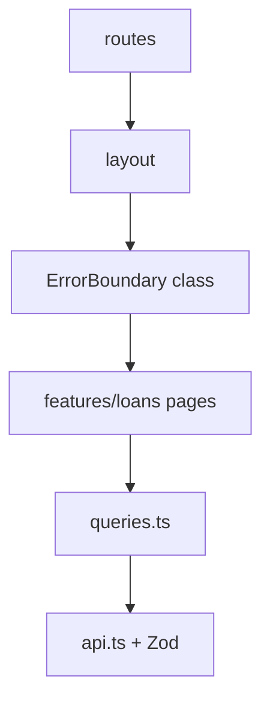

# Month 7 · Week 4 · Day 3
# From Memory: Feature Folder + Error Boundary

**Month index:** [../../README.md](../../README.md)  
**Week 4:** [1](day-01.md) · [2](day-02.md) · Day 3 (today) · [4](day-04.md) · [5](day-05.md) · [6](day-06.md) · [7](day-07.md)  
**Week rhythm today:** Implement from memory  
**Study time:** 3–4 focused hours  
**Student state:** You split a feature folder and wrote a class error boundary. Today those ideas must live in your fingers.  
**Days 1–2 of this week:** closed during the drills. Repair from **this recap**.

---

## How to read this chapter

This file **is** the lesson. No Project 4 paste. No class pages. One class: the boundary.



Stuck > 25 minutes: one Day 1 or Day 2 section, then close. `lookups.txt`.

---

## Complete explanation (architecture you must be able to write)

### Feature folders

A **feature** (`features/loans/`) holds schema, `api.ts` (`fetch` + `ok` + Zod `parse`), `queries.ts` (`useQuery` / `useMutation` + `invalidateQueries({ queryKey: ['loans'] })`), pages, small presentational pieces.

Shared `components/ui` does **not** import the feature. Pages **may** import `useAuth`. `api.ts` does **not** import pages.

**Component API:** a badge receives `status`; it does not `useQuery`. The **page** is the data boundary.

Keys live in `queries.ts` so list and mutation agree.

### Error boundary class

Function components cannot implement `componentDidCatch`. React 19 still needs a **class**:

- `static getDerivedStateFromError(error)` → `{ error }`  
- `componentDidCatch(error, info)` → log  
- `render`: fallback or `children`  
- `reset` sets `error` to `null`

Wrap **`Outlet`** so nav survives. Catch **render** throws, not `queryFn`, not click handlers, not promises.

Query `isError`: branch in the page. Do not throw on `isError` on purpose.

Fallback: heading, short text, `<button type="button">` retry and/or `Link` home. JSX text for messages.

### State placement (Week 3 still true)

List → Query. `q`/`page` → URL. Auth → Context. Draft → RHF. No Redux for GET.

### Import from `"react"` for `Component`

```tsx
import { Component, type ErrorInfo, type ReactNode } from "react";
```

Type `Props` / `State`. Do not use `any`.

```tsx
export class ErrorBoundary extends Component<{ children: ReactNode }, { error: Error | null }> {
  state = { error: null as Error | null };

  static getDerivedStateFromError(error: Error) {
    return { error };
  }

  componentDidCatch(error: Error, info: ErrorInfo) {
    console.error(error, info.componentStack);
  }

  render() {
    if (this.state.error) {
      return (
        <section>
          <h2>This page crashed</h2>
          <p>You can retry or use the nav to leave.</p>
          <button type="button" onClick={() => this.setState({ error: null })}>
            Try again
          </button>
        </section>
      );
    }
    return this.props.children;
  }
}
```

That is enough. Do not copy a class `LoanListPage`. Do not put `fetch` in `componentDidMount` — that is history, and Query is the present.

**Wrong belief:** “Retry always fixes it.”  
**Correct:** retry remounts children. If they throw **unconditionally**, you loop. Crash must be **state-driven** (`crash === true`) so reset can set `crash` false **or** the fallback offers a `Link` away.

**Wrong belief:** “I’ll throw in render when `isError` so the boundary can show it.”  
**Correct:** that turns a polite network failure into a crash. Branch on `isError`. The boundary is for **programmer** mistakes (`undefined.map`) and unknown render throws.

### Query keys in `queries.ts` (from memory)

```ts
export function useLoanList() {
  return useQuery({
    queryKey: ["loans"],
    queryFn: listLoans,
  });
}

export function useCreateLoan() {
  const queryClient = useQueryClient();
  return useMutation({
    mutationFn: createLoan,
    onSuccess: () => {
      void queryClient.invalidateQueries({ queryKey: ["loans"] });
    },
  });
}
```

Pages import these hooks. They do not each invent `["loan"]` vs `["loans"]` — a missing key part by spelling.

Shared `Button` receives `children` and `type`. It does not import `useLoanList`.

### Crash must be state-driven

```tsx
function CrashToy({ crash }: { crash: boolean }) {
  if (crash) {
    throw new Error("Render crash for the boundary lab.");
  }
  return <p>Loan desk is stable.</p>;
}
```

A checkbox in the page sets `crash`. The boundary’s **Try again** calls `setState({ error: null })`. If the child still has `crash === true`, you loop — so reset must also clear `crash` (lift state above the boundary, or offer a `Link` away). Unconditional `throw` in render is a loop.

Wrap **Outlet**:

```tsx
<main id="main">
  <ErrorBoundary>
    <Outlet />
  </ErrorBoundary>
</main>
```

Nav lives. Query `isError` is a **branch** in `LoanListPage`, not a throw.

**Wrong belief:** “I’ll throw on `isError` so one UI handles everything.”  
**Correct:** a 500 is not a programmer crash. Branch. The class is for `undefined.map` and unknown render throws.

**Wrong belief:** “Feature folders mean every file is a class.”  
**Correct:** **one** class (the boundary). Pages are functions. `api.ts` is functions + Zod `parse`.

**Wrong belief:** “Button should call `useLoanList` so it can disable when pending.”  
**Correct:** pass `disabled` as a prop. Shared UI does not import the feature.

```ts
export function useLoanList() {
  return useQuery({
    queryKey: ["loans"],
    queryFn: listLoans,
  });
}

export function useCreateLoan() {
  const queryClient = useQueryClient();
  return useMutation({
    mutationFn: createLoan,
    onSuccess: () => {
      void queryClient.invalidateQueries({ queryKey: ["loans"] });
    },
  });
}
```

Keys live in `queries.ts` so list and mutation agree. No Redux. Import router from `"react-router"`.

Scaffold:

```powershell
cd ~\fullstack-lab\month-07
npm create vite@latest week-04-from-memory -- --template react-ts
cd week-04-from-memory
npm install
npm install react-router @tanstack/react-query zod
```

---

## Today's contract

**Today's gate**

> I scaffolded a feature folder and a class ErrorBoundary around the page outlet. A render crash shows fallback; a failed query shows isError UI. Shared Button does not import the feature.

---

## Time box

| Block | Minutes | Work |
|---|---|---|
| A | 20 | Oral review |
| B | 40 | Memory drills: class skeleton + folder tree |
| C | 90 | Spec: equipment loans |
| D | 25 | TREE.md + crash audit |
| E | 15 | Git |

---

# Block A — Speak first

1. Feature vs `components/` junk drawer.  
2. Who owns query keys.  
3. Why Button cannot import `features/loans/api`.  
4. Why the boundary is a class.  
5. What the boundary does not catch.  
6. Query error vs render error.  
7. Where to wrap (`Outlet`).

---

# Block B — Memory drills

```powershell
cd ~\fullstack-lab\month-07
npm create vite@latest week-04-from-memory -- --template react-ts
cd week-04-from-memory
npm install
npm install react-router @tanstack/react-query zod
```

Write `ErrorBoundary` from memory in isolation. Mount a child that throws. Then build the spec.

On paper (`TREE.txt`): folders before files exist. Then create them.

---

# Spec: equipment loan desk

Fictional **studio equipment loans** (lenses, not Project 4 SKUs).

### Required

1. `features/loans/` — schema, api (in-memory OK), queries, `LoanListPage`, optional detail.  
2. `features/auth/` — mock user **or** skip login if time, but then TREE.md says auth would live there. Prefer a stub `AuthProvider`.  
3. `components/ui/Button.tsx` — no feature imports.  
4. Router layout; **ErrorBoundary around Outlet**.  
5. List Query: pending / error / empty / rows.  
6. A **crash** control that throws **during render** on demand. Fallback; nav lives.  
7. `TREE.md`: import arrows. `NETS.md`: fetch fail vs render throw.

### Constraints

- One class only (the boundary).  
- No Redux. No `any`. No dashboard paste.  
- v5 Query object syntax.

---

# Block D — Defect hunt

Crash the page. Is nav visible? Retry: does the crash immediately return? (If the throw is unconditional, reset loops — make crash **state-driven** so reset works.)

Unlabeled Button? Fix.

---

# Block E — Git

```powershell
cd ~\fullstack-lab
git add month-07/week-04-from-memory
git commit -m "Week 4 Day 3: loans feature folder and error boundary from memory."
```

---

# Recall

1. `getDerivedStateFromError` is static — why.  
2. Why parse belongs in api not render.  
3. Why wrapping the whole `html` is a poor placement.

### TREE.md arrows (write these)

- `LoanListPage` → `useLoanList` in `queries.ts` → `listLoans` in `api.ts` → Zod `parse`  
- `useCreateLoan` → `invalidateQueries({ queryKey: ["loans"] })`  
- `Button` → **no** arrow into `features/loans`  
- Layout → `ErrorBoundary` → `Outlet` → pages  

`NETS.md`: (1) `queryFn` throws / `isError` branch — nav fine, heading “Could not load loans.” (2) `CrashToy` throw — fallback inside `main`, nav still there. Do not throw on `isError` to reuse the boundary.

`getDerivedStateFromError` is **static** so React can compute the next state without an instance. `componentDidCatch` logs. Retry `setState({ error: null })` plus clear the crash flag.

No Redux. v5 object syntax. Import router from `"react-router"`. Windows extra `--` on `npm create vite@latest`.

---

## Definition of done

- [ ] Oral first
- [ ] Feature folder + queries.ts keys
- [ ] Class boundary around Outlet
- [ ] Two nets documented
- [ ] Commit exists
- [ ] I did not paste a solution

---

## Optional review links

The recap in this chapter is the lesson.

- [React: Error boundaries](https://react.dev/reference/react/Component#catching-rendering-errors-with-an-error-boundary)
- [TanStack Query: Query keys](https://tanstack.com/query/latest/docs/framework/react/guides/query-keys)

---

## Tomorrow

**`React.lazy` + `Suspense`**, route-level code splitting, **Profiler**, and why **`memo` / `useMemo` is not the first move**.
