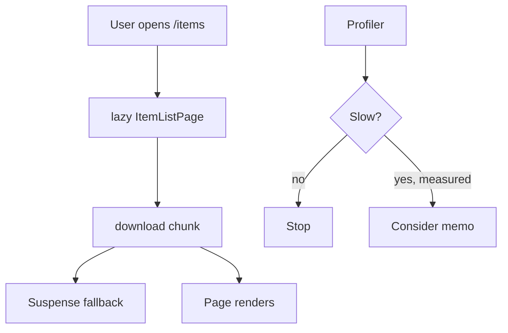

# Month 7 · Week 4 · Day 4
# lazy, Suspense, Profiler — Measure Before memo

**Program:** Full-Stack Mastery · 18 months  
**Phase:** 2 — Modern frontend  
**Month index:** [../../README.md](../../README.md)  
**Week 4:** [1](day-01.md) · [2](day-02.md) · [3](day-03.md) · Day 4 (today) · [5](day-05.md) · [6](day-06.md) · [7](day-07.md)  
**Week rhythm today:** Learn + lab feature  
**Student state:** Day 3 gate. The app is a single JS bundle in your head. Every route is `import LoanListPage from ...` at the top of `routes.tsx`. That is honest for a lab. A dashboard with charts, forms, and MSW-backed tables can wait to **download** a route until it is visited.  
**Study time:** 3–4 focused hours

Today: **`React.lazy`**, **`Suspense`**, **route-level splitting**, the **React Profiler**, and why **`memo` / `useMemo` / `useCallback` are not the first performance move**. You will **measure**, then maybe memo. You will not wrap every component in `memo` because a blog said so.

Project 4: lazy **or** an honest sentence in README why you deferred it. Do not paste a split dashboard.

---

## How to use this textbook

1. Read. Say it. Type a lazy route.  
2. Use Profiler **once** with a reason. Screenshot or notes, not vibes.  
3. Optional review links are for later rechecking.

---

## How to read this chapter

Vite already code-splits **dynamic** `import()`. `React.lazy(() => import("./ItemListPage"))` is a component that **loads that module when first rendered**. Until then, the nearest **`Suspense`** shows a **fallback** (a real loading UI, not a blank hole).

That is **network** performance: smaller first JS. It is not the same as **rerender** performance (`memo`). Beginners mash them into “optimization.”



If that is still abstract: lazy is **shipping the set after the audience sits**. Memo is **not rebuilding the same chair every frame**. You do not skip chairs because the truck is late.

---

## Today's contract

By the end of this day you will be able to:

1. Write **`lazy(() => import("./features/items/ItemListPage"))`**.  
2. Wrap routes in **`<Suspense fallback={...}>`**.  
3. Explain **default vs named export** gotcha (`lazy` wants a **default** export, or you map `{ default: Named }`).  
4. Record a **Profiler** session: what committed, why you did or did not memo.  
5. List cheaper wins: keys, not deriving in effects, not putting the list on Context, `isFetching` vs blanking the table.  
6. Avoid `memo` as decoration.

**Today's gate.** Closed-book:

> `lazy` + `Suspense` split a route’s JS. Profiler tells me if a rerender is a problem. I do not `memo` first. Query and URL mistakes cost more than a missing `useCallback`.

---

## Time box

| Block | Minutes | Work |
|---|---|---|
| A | 50 | Theory |
| B | 55 | Type-along: lazy routes + fallback |
| C | 70 | Independent: Profiler notes + one justified memo or none |
| D | 20 | Git |
| E | 15 | Recall |

---

# Block A — Theory

## 1. `lazy` and `Suspense`

```tsx
import { lazy, Suspense } from "react";
import { Routes, Route } from "react-router";

const ItemListPage = lazy(() => import("./features/items/ItemListPage"));
const ItemDetailPage = lazy(() => import("./features/items/ItemDetailPage"));

function AppRoutes() {
  return (
    <Suspense fallback={<p role="status">Loading page</p>}>
      <Routes>
        <Route path="/items" element={<ItemListPage />} />
        <Route path="/items/:id" element={<ItemDetailPage />} />
      </Routes>
    </Suspense>
  );
}
```

**Fallback:** accessible status, not an empty `null` forever. Layout **outside** Suspense keeps nav painted while the page chunk loads — same idea as error boundary around `Outlet`.

```tsx
<AppLayout>
  <ErrorBoundary>
    <Suspense fallback={<p role="status">Loading page</p>}>
      <Outlet />
    </Suspense>
  </ErrorBoundary>
</AppLayout>
```

**Wrong belief:** “Suspense replaces Query `isPending`.”  
**Correct:** Suspense here waits for **the JS module**. Query `isPending` waits for **HTTP data**. You will often see: chunk load (Suspense) **then** spinner (Query). That is two honest waits. You may make the fallbacks look similar; do not delete Query’s pending UI.

React 19 also has data-fetching Suspense patterns. **This course’s Query path is `isPending`**, not `useSuspenseQuery`, unless you choose it **and** can teach it. Default: **no** `useSuspenseQuery` this month — one model is enough.

---

## 2. Default export

`lazy(() => import("./X"))` expects `export default function X`. If you only **named-export**:

```ts
export function ItemListPage() { /* ... */ }
```

then:

```ts
const ItemListPage = lazy(() =>
  import("./features/items/ItemListPage").then((m) => ({ default: m.ItemListPage })),
);
```

Pick a convention per feature. Mixing without the `.then` map is a runtime “not a valid component” error.

---

## 3. What to split

**Worth it:** heavy **pages** (charts, large forms, admin tables) that are not the first screen.

**Not worth it:** `Button.tsx`, a 20-line badge, the layout. Extra chunks have overhead.

**Wrong belief:** “I’ll lazy every file in `components/`.”  
**Correct:** route-level (or tab-level) splits. Measure bundle with `npm run build` and the rollup visualizer **optional** — Network tab after clicking a route is enough today: a new `.js` request.

Login page: sometimes eager (first paint). Dashboard widgets: lazy. Your call; write it in `SPLIT.md`.

---

## 4. Profiler — measure

React DevTools **Profiler** tab:

1. Click record.  
2. Perform the interaction (type in search, open a modal, switch page).  
3. Stop.  
4. Look at **which** components committed and **how long**.

Ask:

- Did the **whole app** commit because **context value** identity changed (auth object new every render — Day 2 `useMemo`)?  
- Did a list **without keys** recreate children?  
- Is the “slow” thing **network** (Query fetching), not JS?

**Wrong belief:** “The Profiler is red so I need `memo`.”  
**Correct:** gray/fast is fine. Optimize **user-facing delay** you can name.

Write `PROFILE.md`: interaction, what you saw, **action** (none / fix context identity / memo one child). “None” is a valid professional outcome.

---

## 5. Why not memo first

`memo(Component)` skips rerender if **props are shallow-equal**. It **costs** comparison work. It **fails** if parents pass **inline objects/functions** (`style={{}}`, `onClick={() => ...}`) every time — you then add `useCallback` and `useMemo` until the component is unreadable.

`useMemo` is for **expensive derived values**, not for “I stored a number.” Filtering 20 rows is not expensive. Filtering 20,000 **might** be — measure.

`useCallback` is for **stable function identity** when a **memoized child** needs it, or for effect deps. It is not a luck charm.

**Cheaper wins this month (do these first):**

| Win | Why |
|---|---|
| Query keys + cache | Do not refetch as a substitute for thinking |
| Do not blank on `isFetching` | Perceived performance |
| URL params, not effect-sync | Avoid loops |
| Context split / memoized value | Stop whole-tree rerenders |
| Keys on lists | Correctness **and** less DOM thrash |
| Lazy routes | Less JS on first load |
| Don’t put lists on Context | Rerender storm |

**Wrong belief:** “I’ll `memo` every export in `features/items`.”  
**Correct:** that is noise. Profiler first.

---

## 6. `startTransition` (literacy)

React `startTransition` marks an update as non-urgent (e.g. typing into a huge filter). Optional. Do not sprinkle it without a jank story. Not required for Project 4.

---

## 7. A Profiler story that does **not** need memo

You type in a search box that commits to the URL on submit. Profiler shows `ItemListPage` commit when you click Search. That is **correct**: `q` changed, the key changed, new data may arrive. Memoizing `ItemRow` does nothing to the **network**. The user was waiting on GET.

You click Next. `isPlaceholderData` is true, table stays painted, `isFetching` is true. Perceived performance is already good. `memo` on the table is vanity.

You toggle a **layout** checkbox “compact rows” stored in `useState` on `AppLayout`, and **every** page under `Outlet` rerenders because you passed an inline `onToggle={() => setCompact((c) => !c)}` through Context without memoizing the value. **That** is a Context-identity problem (Week 3). Fix the provider value. Then measure again. Only then consider `memo` on a heavy child.

**Wrong belief:** “Inline functions are always bugs.”  
**Correct:** they are normal in event handlers on **DOM** nodes. They become a problem when they are **props to a memoized child** you expected to skip. Do not memo the child **and** forget the inline object.

---

## 8. Bundle vs runtime — two different clocks

| Clock | Tool | Question |
|---|---|---|
| Download | `lazy`, Network, `dist/assets/*.js` | How much JS before `/items` is usable? |
| Render | Profiler, `isFetching` UI | How long from click to paint? |
| Server | Network, Query Devtools | How long did GET take? |

Optimizing the wrong clock is how people `useMemo` a spinner. Write in PROFILE.md which clock you looked at.

`npm run build` then `npm run preview` is the honest split demo on Windows:

```powershell
cd ~\fullstack-lab\month-07\week-04-from-memory
npm run build
npm run preview
```

Open the preview URL, DevTools Network, disable cache, click a lazy route. You should see a **new** JS file. Dev `npm run dev` also lazy-loads, but the filenames are noisier. Prefer preview for SPLIT.md.

---

## 9. Accessibility of fallbacks

`<p role="status">Loading page</p>` is a minimum. A spinner `div` with no text is a hole for AT. Do not `aria-busy` the whole `document.body`. The layout nav should remain keyboard-reachable while the page chunk loads — another reason Suspense wraps **`Outlet`**, not the router root that includes the skip link.

If fallback and Query pending look identical, that is OK. If they **replace** the layout, that is not OK.

---

# Block B — Type-along

Continue `week-04-from-memory` or `week-04-features`.

1. Convert **two** pages to `lazy` + layout `Suspense` fallback with `role="status"`.  
2. `npm run dev`. Network: click the second route — new chunk (or Vite’s lazy in dev — note what you see; `npm run build && npm run preview` is clearer). Write `SPLIT.md`.  
3. Named vs default: if you hit the error, fix with default export or `.then` map.

---

# Block C — Independent

1. Profiler: record **search typing** or **page next**. `PROFILE.md`.  
2. If you see a real extra-tree rerender from a **new object** in context, fix **that**.  
3. Add `memo` **only** if PROFILE.md names the child and the prop stability. Otherwise write “no memo; evidence: …”.  
4. Stretch: `npm run build` and note `dist/assets` chunk names.

No `memo` on `App`. No Redux. Tailwind optional and not a performance strategy.

If the Profiler flame is wide because **Strict Mode** double-invokes in development, say so in PROFILE.md. Do not “fix” it by removing Strict Mode. Production will not double-invoke that way. Measure a **user interaction**, not only mount.

**Wrong belief:** “I’ll `useMemo` the JSX (`const list = useMemo(() => <ul>...</ul>, [data])`).”  
**Correct:** that is not a supported performance pattern and it fights the mental model. Memo **components** or **expensive values**, not element trees you stuffed in a variable to feel clever.

---

```powershell
cd ~\fullstack-lab
git add month-07
git commit -m "Week 4 Day 4: lazy routes, Suspense, profiler notes."
```

---

# Block E — Recall

1. What `lazy` waits for vs what `isPending` waits for.  
2. Why Suspense around `Outlet`.  
3. Default export gotcha.  
4. One cheaper win than `memo`.  
5. When `useMemo` is honest.  
6. Why “memo everything” fights inline `onClick`.

`lazy` in TypeScript: the resolved module must default-export a component. If `tsc` says the type is `{}`, you forgot the default or the `.then` map. Fix the export; do not `as any`.

In SPLIT.md, write the **chunk filename** you saw under `dist/assets` after `npm run build`. If you only used `npm run dev`, say so and run preview before you claim route-level splitting.

---

## Definition of done

- [ ] At least two lazy pages + Suspense fallback
- [ ] SPLIT.md and PROFILE.md exist
- [ ] memo is justified or explicitly skipped
- [ ] I did not confuse Suspense with Query pending
- [ ] Preview build showed a chunk (or I wrote why dev-only evidence is weaker)
- [ ] Commit exists

If PROFILE.md says “it felt slow” with no component names, it is not a measurement. Name the component and the interaction.

---

## Worked comparison: two loading states on one navigation

The operator clicks **Items** in the nav.

1. Router matches `/items`. `lazy` starts the chunk. **Suspense** fallback: “Loading page.” Layout (skip link, nav) stays.  
2. Chunk arrives. `ItemListPage` mounts. Query has no cache. **`isPending`**: “Loading items.”  
3. GET returns. Table paints.  
4. Operator clicks **Next**. New key. **`placeholderData: keepPreviousData`**. Table stays; `isFetching` maybe a quiet busy. **Suspense does not run** — the page module is already loaded.

If you skip step 1’s fallback, the layout may blank. If you skip step 2, you reuse Suspense for data — this course does not, unless you switched to `useSuspenseQuery` on purpose (default: no).

**Wrong belief:** “One spinner to rule them all, in `main.tsx`.”  
**Correct:** you lose the layout and you confuse JS-wait with HTTP-wait.

---

## 10. `memo` after you already did the cheap wins

If PROFILE.md shows `ItemRow` committing 200 times because the parent maps a new `style={{ margin: 8 }}` every render, you have two honest fixes: **stop passing a new object** (use a className), or memoize the row **and** stabilize props. The className fix is cheaper and does not require `useCallback` theater.

If the parent is `ItemListPage` and it commits because **`q` changed**, memo on `ItemRow` may still help **sibling** rows whose props did not change — that is a real list-virtualization-adjacent win for **large** lists. Twenty rows: do not bother. Measure. Write the count of rows in PROFILE.md so “large” is a number.

**Wrong belief:** “`useCallback` on every handler is the Month 7 performance unit.”  
**Correct:** the unit is **named delay** + **named component**. Lazy routes and not blanking on `isFetching` will beat a wall of `useCallback` for a dashboard clerk.

Project 4’s performance row is satisfied by: a Profiler note (or honest “no memo”), route-level `lazy` **or** a README sentence deferring it, and the cheap Query wins already required by Week 1. A wall of `memo` without PROFILE.md is a **fail**, not extra credit.

Tailwind is not a performance strategy. Smaller class strings do not replace `lazy` or a correct `isFetching` branch.

---

## Optional review links

Splitting and measuring are explained in this chapter.

- [React: `lazy`](https://react.dev/reference/react/lazy)
- [React: `<Suspense>`](https://react.dev/reference/react/Suspense)
- [React DevTools Profiler](https://react.dev/learn/react-developer-tools)

---

## Tomorrow

**MSW:** handlers that intercept `fetch` in tests (and optionally in the browser). Query tests talk HTTP, not only `vi.mock` of a module.
