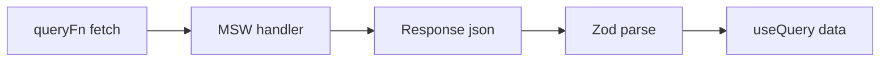

# Month 7 · Week 4 · Day 5
# MSW: HTTP Mocks That Match Production `fetch`

**Month index:** [../../README.md](../../README.md)  
**Week 4:** [1](day-01.md) · [2](day-02.md) · [3](day-03.md) · [4](day-04.md) · Day 5 (today) · [6](day-06.md) · [7](day-07.md)  
**Week rhythm today:** Tests + refactor + documentation  
**Study time:** 3–4 focused hours  
**Student state:** You mocked `fetch` with `vi.fn` or mocked `api.ts`. That still works. **Mock Service Worker (MSW)** intercepts at the **network** boundary so `queryFn` stays the real function. Project 4’s spec wants MSW **or equivalent**. Today you type **equivalent-or-better**: MSW handlers.

Do **not** paste Project 4. Practice on a lab (`week-04-features` / loans / tags). Tomorrow you **attach** the habit to `~/ops-dashboard/`.

---

## How to read this chapter

MSW registers **handlers**: “when GET `/api/tags`, return JSON.” In **Node/Vitest**, a worker intercepts `fetch`. In the **browser** (optional), a service worker does the same so the UI can run without a backend.



The test still uses Testing Library: loading then title. The new piece is **the handler**, not a new way to `getByRole`.

---

## Complete explanation (MSW this week)

### Why handlers beat `vi.mock("./api")`

| Approach | Risk |
|---|---|
| Mock `api.listTags` | Tests pass while `fetch` URL is wrong |
| Mock `global.fetch` | Easy to forget `ok` / headers |
| **MSW** | `queryFn` is real; you assert UI; you can return 500 |

**Wrong belief:** “MSW replaces Query.”  
**Correct:** Query still caches. MSW is the **fake HTTP**.

**Wrong belief:** “MSW is a backend.”  
**Correct:** it is a **stub**. FastAPI is Month 8+.

### Install (Vitest)

Follow current MSW v2 docs for your install. Typical:

```powershell
npm install -D msw
```

Node: `setupServer` from `msw/node`. Browser (optional): `setupWorker` from `msw/browser`.

v2 handler shape:

```ts
import { http, HttpResponse } from "msw";

export const handlers = [
  http.get("/api/tags", () => {
    return HttpResponse.json([{ id: 1, title: "Blue suitcase" }]);
  }),
  http.post("/api/tags", async ({ request }) => {
    const body: unknown = await request.json();
    return HttpResponse.json({ id: 2, title: "ok" }, { status: 201 });
  }),
];
```

**Relative URLs:** your `queryFn` must call the **same** origin/path the handler lists. If `queryFn` hits JSONPlaceholder, the handler must list that URL, or you point the lab at `/api/...` and MSW that.

For tests, **`/api/tags`** on a fake base is the clean lab. `fetch("/api/tags")` in Vitest + jsdom + MSW is the usual pattern. If it fails to match, log MSW’s unhandled request — **that** is the lesson.

### Test setup

```ts
import { setupServer } from "msw/node";
import { handlers } from "./handlers";

const server = setupServer(...handlers);

beforeAll(() => server.listen({ onUnhandledRequest: "error" }));
afterEach(() => server.resetHandlers());
afterAll(() => server.close());
```

`onUnhandledRequest: "error"` makes a missed URL a **failed test**, not a hang. Good.

Per-test override:

```ts
server.use(
  http.get("/api/tags", () => {
    return HttpResponse.json({ message: "desk offline" }, { status: 500 });
  }),
);
```

Then assert Query **error** UI.

Still: **new QueryClient**, **`retry: false`**, wrap `render`. Still `findBy` loading then title.

### Handler + test (same URL as `queryFn`)

```ts
import { http, HttpResponse } from "msw";
import { setupServer } from "msw/node";

export const handlers = [
  http.get("/api/tags", () => {
    return HttpResponse.json([{ id: 1, title: "Blue suitcase" }]);
  }),
];

const server = setupServer(...handlers);

beforeAll(() => server.listen({ onUnhandledRequest: "error" }));
afterEach(() => server.resetHandlers());
afterAll(() => server.close());
```

`queryFn` is the **real** `listTags` that `fetch("/api/tags")`s, checks `ok`, Zod-parses. The test does not `vi.mock("./api")`.

500 override:

```ts
server.use(
  http.get("/api/tags", () => {
    return HttpResponse.json({ message: "desk offline" }, { status: 500 });
  }),
);
```

Then `findByRole("alert")`. `retry: false` on the **test** client.

**Wrong belief:** “I’ll `vi.mock` `useQuery` because MSW is hard.”  
**Correct:** then you asserted a stub. Equivalent still exercises `queryFn`.

**Wrong belief:** “The handler already returns the right shape, so skip Zod.”  
**Correct:** a garbage-body test should be `isError`, not `title.toUpperCase()` throwing into the error boundary.

POST handler reads `request.json()` as **`unknown`**. You may `safeParse` in the handler to simulate a server. The client **also** parses. Two parsers is correct.

If `onUnhandledRequest` fires, **fix the URL mismatch**. Do not hide it with `vi.mock`.

Windows: `npm install -D msw` in the **lab**. Follow current MSW v2 docs if imports differ — `http` + `HttpResponse` is the v2 shape this chapter teaches.

### Zod still parses

MSW can return garbage. `queryFn` must `parse` and throw. A test that returns `{ nope: true }` should be **`isError`**, not a crash in `title.toUpperCase()`. That is Week 2 + Week 1.

### Browser worker (optional)

`src/mocks/browser.ts` + start in `main.tsx` **only in dev**. Document in README: “MSW in the browser is a switch; production build must not ship the worker as the real API.” `import.meta.env.DEV` gate.

Project 4 may use browser MSW **or** in-memory functions **or** JSONPlaceholder. Spec: mock or public API. MSW is the professional mock.

### What not to do

- Do not bypass Zod because the handler “already returns the right shape.”  
- Do not put MSW inside Redux.  
- Do not intercept **other origins** you did not mean to (be specific in `http.get` URLs).

---

## Today's contract

1. Handlers for **GET list** and **POST create** (or GET + GET 500).  
2. RTL: loading → success against **real** `queryFn`.  
3. RTL: 500 → error UI.  
4. `onUnhandledRequest: "error"`.  
5. MOCKS.md: which URLs exist.

**Today's gate**

> Tests hit HTTP that MSW answers. QueryClient is still per test. I did not mock away `queryFn`.

---

## Time box

| Block | Minutes | Work |
|---|---|---|
| A | 30 | Theory spoken |
| B | 55 | Server + GET success test |
| C | 45 | 500 test + POST/invalidate stretch |
| D | 25 | MOCKS.md + README |
| E | 15 | Recall |

---

# Block B — Type-along

Lab with a real `fetch` in `api.ts` (if your lab is in-memory only, **add** a `fetch("/api/...")` path for this day, or create `week-04-msw`).

1. Handlers + `setupServer`.  
2. `renderWithQuery`.  
3. Test: `findByRole("status")` / loading text, then title **Blue suitcase** (your handler body).  
4. Fail on purpose: change handler title, watch red. Restore.

If `onUnhandledRequest` fires, **fix the URL mismatch** — do not `vi.mock` to hide it.

---

# Block C — Independent

1. `server.use` 500 — alert/error heading. `retry: false`.  
2. Stretch: POST handler 201, user submits RHF form, list shows new title (invalidate).  
3. Stretch: 409 body `{ errors: { title: "Taken" } }` → `setError` test from Week 2.

---

# Block D — Docs

MOCKS.md: table method, path, success body, error body. README: `npm test` uses MSW.

```powershell
cd ~\fullstack-lab
git add month-07
git commit -m "Week 4 Day 5: MSW handlers for list Query tests."
```

---

### Browser worker vs leaking into production

```ts
if (import.meta.env.DEV) {
  const { worker } = await import("./mocks/browser");
  await worker.start({ onUnhandledRequest: "bypass" });
}
```

**Tests** use `error` for unhandled so you notice. **Browser demo** often uses `bypass` so unknown URLs (Vite HMR, sourcemaps) do not explode. Do not copy test settings blindly into `main.tsx`.

`worker.start` is async. If you `createRoot` before it starts, the first GET may hit the real network. Pattern: start worker, **then** render. Document that in MOCKS.md if you enable the browser worker.

**Wrong belief:** “MSW in the browser means I do not need Query error UI.”  
**Correct:** handlers can still return 500. The UI must show it. That is the point of the error test.

POST handler should read `request.json()` as **`unknown`** and not trust it. You may `safeParse` in the handler to decide 201 vs 400 — that **simulates a server**. The client **also** parses. Two parsers is correct (client UX + server authority).

---

# Recall

1. Why MSW vs `vi.mock` api module.  
2. Why `onUnhandledRequest: "error"`.  
3. Why Zod still runs.  
4. Why QueryClient is still fresh.  
5. Browser worker vs test server.

### Success test against real `queryFn`

```tsx
test("loads tags from MSW", async () => {
  renderWithQuery(<TagList />);
  expect(await screen.findByRole("status", { name: /loading/i })).toBeInTheDocument();
  expect(await screen.findByText("Blue suitcase")).toBeInTheDocument();
});
```

Change the handler title to `"Nope"` without changing the assertion — red. Restore. That proves the test is wired to HTTP, not to a hardcoded string in the component.

`queryFn` must use the **same** path: `fetch("/api/tags")`. Relative URL in jsdom + MSW is the usual lab. If unhandled, log the request and fix the handler — do not `vi.mock("./api")`.

Browser worker (optional) starts **before** `createRoot`, gated on `import.meta.env.DEV`. Tests use `onUnhandledRequest: "error"`. Browser demo often `"bypass"` so Vite HMR is not an error. Do not copy test settings into `main.tsx`.

Project 4 tomorrow: attach this habit to `~/ops-dashboard/`. This textbook will not give you that source.

### POST handler stretch

```ts
http.post("/api/tags", async ({ request }) => {
  const body: unknown = await request.json();
  const parsed = createTagSchema.safeParse(body);
  if (!parsed.success) {
    return HttpResponse.json({ message: "Invalid tag" }, { status: 400 });
  }
  return HttpResponse.json({ id: 2, title: parsed.data.title }, { status: 201 });
}),
```

Client still Zod-parses the 201 body. 400 maps with `setError` if you wire RHF. Invalidate the list only on 201. `MOCKS.md` table: method, path, success, error.

`onUnhandledRequest: "error"` in tests. Fix URL mismatches. New `QueryClient`, `retry: false`. Loading then title remains the floor.

Garbage JSON test (proves Zod still runs): handler returns `{ nope: true }`. UI is **error**, not a white screen from `title.toUpperCase()`. That is Week 2 sitting on Week 1.

Do not intercept origins you did not mean to. Be specific in `http.get`. MSW is not FastAPI.

---

## Definition of done

- [ ] `setupServer` + handlers
- [ ] Success test: loading then title
- [ ] Error test: 500 UI
- [ ] MOCKS.md exists
- [ ] `npm test` green
- [ ] Commit exists

### Relative URL mismatch (the usual first failure)

`queryFn` calls `fetch("https://jsonplaceholder.typicode.com/posts")` while the handler lists `http.get("/api/tags")`. MSW reports unhandled. Either point the lab at `/api/tags` or list the full URL in `http.get`. Do not `vi.mock` the module to silence it — that abandons today’s lesson.

`MOCKS.md` is the map. README: `npm test` uses MSW. Browser worker optional and DEV-gated.

---

## Optional review links

MSW is explained in this chapter.

- [MSW: Getting started](https://mswjs.io/docs/getting-started)
- [MSW: `http`](https://mswjs.io/docs/api/http)
- [TanStack Query: Testing](https://tanstack.com/query/latest/docs/framework/react/guides/testing)

---

## Tomorrow

**Finish Project 4** against the spec checklist: Query list/detail/mutation, RHF+Zod, tests, `STATE_ARCHITECTURE.md`, no unjustified Redux. This textbook still will not give you the dashboard source.
