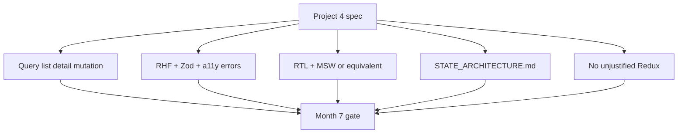

# Month 7 · Week 4 · Day 6
# Finish Project 4 — Checklist, Not a Template

**Month index:** [../../README.md](../../README.md)  
**Week 4:** [1](day-01.md) · [2](day-02.md) · [3](day-03.md) · [4](day-04.md) · [5](day-05.md) · Day 6 (today) · [7](day-07.md)  
**Week rhythm today:** Independent project work  
**Study time:** 3–4 focused hours (the repo may need a further session — finish before you claim the Month 7 gate)  
**Days 1–5 textbook files:** closed for the *product* work. Repair from **this recap** and from `full_stack_project_requirements_2026/project_04_react_admin_dashboard.md`.  
**You may not** open a GitHub admin dashboard clone. This textbook will **not** give you the dashboard source.

Work in **`~/ops-dashboard/`** (or the path you chose in Month 6). Labs stay in `~\fullstack-lab\month-07\`. Do not dump Project 4 into the lab folder.

---

## How to read this chapter

Today is **integration**. Month 6 gave you routes, mock auth, controlled forms, RTL. Month 7 replaces homemade fetch with **Query**, homemade form state with **RHF+Zod**, homemade list cache with **keys and invalidation**, and asks you to **write down** where state lives.



If a row is false, you are not done. Extra chrome (Tailwind, charts) does not buy a missing `invalidateQueries`.

---

## Complete explanation (what Project 4 must still own)

### Server state — TanStack Query v5

- `useQuery({ queryKey, queryFn })` object syntax.  
- List **and** detail keys (detail includes `id`).  
- `page` / `q` / filters **in the key**. Prefer **URL** as source of truth (Week 3).  
- `isPending` for first load; do not blank on `isFetching`. Empty vs error.  
- `useMutation({ mutationFn })`; **`queryClient.invalidateQueries({ queryKey: ['items'] })`** (your resource name) on **success**.  
- `placeholderData: keepPreviousData` if you paginate.  
- `enabled` when id/search must not fire.  
- `queryFn`: `ok` check, `unknown`, **Zod parse**.  
- Optimistic only if you can defend it; default off.

Do not also `useEffect` fetch the **same** resource.

### Forms — RHF + Zod

- Login, create, edit.  
- `zodResolver` from `@hookform/resolvers/zod`.  
- Field errors: `id`, `aria-describedby`, `aria-invalid`.  
- Simulated server error → `setError`.  
- `isPending` disables submit. No `reset()` on 400.

### State architecture

Root **`STATE_ARCHITECTURE.md`**: classify local UI, URL, Context (mock auth), server (Query), form (RHF), global client (**none**, or RTK with a **named** problem). **Do not** invent Redux for the list. If Redux exists, the file must say why simpler tools failed. Default: **delete** list-in-Redux if you added it for comfort.

### Auth

Context mock. Protected UI. Not security. No tokens in the URL.

### Errors and splitting

- Query `isError` pages.  
- **Error boundary** (class) around the outlet or shell.  
- `lazy` + `Suspense` **or** README sentence deferring with a reason.  
- Profiler: memo only if measured.  

### Tests

RTL: form flow, loading → success, error flow, one interaction. **MSW or equivalent**. QueryClient per test, `retry: false`. Roles and labels.

### A11y and CSS

Month 2 still applies. Tailwind **optional** after CSS. No `outline: none` without a visible focus replacement.

### Quality

lint / format / typecheck / tests green.

### What “finish” means in this repo (not a template)

Work in **`~/ops-dashboard/`**. Labs stay in `~\fullstack-lab\month-07\`. Never paste dashboard source from this textbook — there is none.

List query (your resource name):

```tsx
useQuery({
  queryKey: ["items", { q, page }],
  queryFn: () => listItems({ q, page }),
  placeholderData: keepPreviousData,
  enabled: /* id or search rules you can name */,
});
```

`q` / `page` from `useSearchParams` (`"react-router"`). Mutation:

```tsx
useMutation({
  mutationFn: createItem,
  onSuccess: () => {
    void queryClient.invalidateQueries({ queryKey: ["items"] });
  },
});
```

Do **not** also `useEffect` fetch the same resource. `isPending` for first load; keep rows on `isFetching`. Empty array is success, not error.

Forms: `zodResolver` from `@hookform/resolvers/zod`. Field errors associated. `setError` on simulated 409. `reset()` only on success. `isPending` disables submit.

**Wrong belief:** “I’ll finish ARCH markdown instead of invalidation.”  
**Correct:** a beautiful file that describes a list that lies after create fails the gate.

**Wrong belief:** “Redux Toolkit is on the spec, so the list goes in a slice.”  
**Correct:** default Project 4 is **no Redux for GET lists**. RTK literacy was the isolated counter. If `@reduxjs/toolkit` is in this repo without a named **client** problem, delete it.

**Wrong belief:** “Mocking `useQuery` is equivalent to MSW.”  
**Correct:** equivalent means `queryFn` still runs (MSW, stubbed `fetch`, or a fake HTTP module under `queryFn`). Mocking the hook asserts a stub.

`STATE_ARCHITECTURE.md` uses **your** entity names. Each piece: place **and** why not the runner-up. Session user → Context. Login draft → RHF. Rows → Query. Filters → URL. Create draft → RHF. Aggregates → derived from Query data. Nav open → `useState`. Redux → not used.

Error boundary is a **class** around the outlet. Query `isError` is a page branch. `lazy`/`Suspense` or a README sentence deferring with a reason.

Demo to an empty chair: login, search, page 2 refresh, detail, create, list updates, client validation, server error. If you cannot, the checklist is fiction.

---

## Today's contract

Walk the **Definition of Done** in the spec **and** the checklist below. Tick only what is **true in the repo**, not what you plan to do during the exam.

**Today's gate**

> Project 4 is a dashboard I can explain. Query, forms, tests, and STATE_ARCHITECTURE.md are true. Redux is absent or justified. I did not paste a template.

---

## Time box

| Block | Minutes | Work |
|---|---|---|
| 0 | 20 | Recap + open spec + ARCH file |
| 1 | 90 | Close the biggest gap (Query or forms or tests) |
| 2 | 40 | STATE_ARCHITECTURE.md honest pass |
| 3 | 30 | Tests + typecheck |
| 4 | 20 | README + git in **the project repo** |

If gaps remain, continue the same checklist after hours. Do not skip Day 7; take an incomplete self-mark rather than a fake one.

---

# Challenge — Checklist (tick in `~/ops-dashboard/MONTH7_CHECKLIST.md`)

Copy this list into the project and tick honestly:

- [ ] Login mock: RHF + Zod, loading, simulated failure with field or root error  
- [ ] Dashboard: summary + recent activity + derived metric (Query or derived from Query data, not a second cache)  
- [ ] Entity list: pagination, search, filter and/or sort, loading, error, empty  
- [ ] List query keys include `q` / `page` / filters  
- [ ] `q` / `page` in the **URL** (or ARCH explains a documented exception)  
- [ ] Entity detail: `useQuery` with id in the key  
- [ ] Create/edit: RHF + Zod, accessible field errors, server error mapped  
- [ ] Mutation invalidates list (and detail if needed)  
- [ ] No `useEffect` fetch for those same resources  
- [ ] Feature folders (or ARCH explains current tree and a follow-up)  
- [ ] Error boundary class exists; pages are functions  
- [ ] lazy/Suspense or written deferral  
- [ ] MSW (or equivalent) for tests  
- [ ] RTL: form, loading→success, error, interaction  
- [ ] `STATE_ARCHITECTURE.md` — no unjustified Redux  
- [ ] Redux Toolkit **not** wired to the entity list  
- [ ] 404 / error: no blank screen  
- [ ] a11y: labels, keyboard, focus, semantic table if you used a table  
- [ ] README: screenshots or flows, how to run, how to test, mock API, state decisions  
- [ ] `npm test` / typecheck green  

Forbidden: complete source from this textbook (there is none), cloning a dashboard, `any` on API data, `innerHTML`, Redux “because Month 7 mentioned it.”

---

# STATE_ARCHITECTURE.md — required sections

Use **your** entity names. Include a mermaid. For each piece: **place** and **why not the wrong place**.

Minimum pieces: session user, login draft, list rows, list filters, detail record, create draft, dashboard aggregates, nav open, theme if any, “Redux: not used” (or the justification).

---

# Git (project repo)

```powershell
cd ~/ops-dashboard
git add .
git status
git commit -m "Month 7: Query, forms, architecture, and tests for the ops dashboard."
```

Do not commit `.env` secrets. There should be none that matter; mock auth is not a secret.

Lab commits stay in `~\fullstack-lab`.

---

# Honest gaps — write them down

If pagination is client-side `slice` of a full dump, ARCH must say so and the checklist row for “page in the query key” is **false** until you fix it. Do not tick it because the UI has Next.

If tests mock `api.listItems` instead of MSW, that is **equivalent** if `queryFn` is still exercised **or** you document that the mock sits under `queryFn`. If you mock `useQuery` itself, the test is worthless — you asserted a stub.

If the error boundary is copied but never thrown at, add a **dev-only** crash control or a unit that renders a throwing child inside the class. Gate item 6 wants the net **real**.

Tailwind: optional. If you added it, Month 2 CSS skills must still show: focus visible, landmarks, not color-only errors.

**Wrong belief:** “I’ll finish architecture markdown instead of invalidation.”  
**Correct:** a beautiful ARCH that describes a list that lies after create fails item 2 and item 8.

Relative spec path from this file: `../../../../full_stack_project_requirements_2026/project_04_react_admin_dashboard.md` if the workspace root contains that folder next to `textbook/`. Open whatever path actually exists. The filename is the contract.

---

# Recall

1. Name four places state lives in *your* dashboard.  
2. What happens after create if you forget invalidate.  
3. Why the error boundary does not replace `isError`.  
4. Why Redux is off.

---

## Definition of done

- [ ] MONTH7_CHECKLIST.md ticked honestly  
- [ ] Spec Definition of Done ticked honestly  
- [ ] STATE_ARCHITECTURE.md exists in the project  
- [ ] Tests green  
- [ ] I can demo without reading a tutorial  
- [ ] Commit exists **in the project repo**

If any box is a wish, it is false. Stay here or take an honest incomplete into Day 7’s self-mark.

Demo once to an empty chair: login, list search, page 2 refresh, open detail, create, see the list, trigger a validation error, trigger a server error. If you cannot, the checklist is fiction.

### Query vs effect (delete the duplicate)

Search `~/ops-dashboard/src` for `useEffect` + `fetch` on the **same** resource Query already loads. Delete the effect. One cache. `queryFn` throws on `!ok`, Zod-parses `unknown`. `isPending` / `isError` / empty / rows. `useMutation({ mutationFn })` + `invalidateQueries({ queryKey: ["items"] })` on success only.

Windows: `cd ~\ops-dashboard`. Labs remain in `~\fullstack-lab\month-07\`.

Login, create, and edit: `zodResolver` from `@hookform/resolvers/zod`. Associated field errors. Simulated 409 → `setError`. `reset()` only on success. Mutation `isPending` disables submit. Detail `id` is `string | undefined` until you narrow it — no `as string`.

Dashboard aggregates are **derived** from Query data during render, not a second cache and not an effect that copies counts. Nav open is `useState`. Theme, if any, is Context or localStorage with a Month 3 guard — not Redux.

`STATE_ARCHITECTURE.md` lives in the **project repo**, with a mermaid and why-nots using **your** entity names. If Redux exists, the file must say why simpler tools failed. Default: it does not exist.

Error boundary: **class** around `Outlet`. Query `isError` is a page branch. `lazy` + `Suspense` or a README deferral sentence. Measure before `memo`.

### STATE_ARCHITECTURE.md minimum rows (your nouns)

| Piece | Place | Why not the runner-up |
|---|---|---|
| Mock user | Context | Not URL (`?email=`); not Query (no GET `/me` in the mock) |
| Login password draft | RHF | Not Query (unpublished); never the query string |
| List rows | Query `["items", { q, page }]` | Not Redux; not Context; not a second `useEffect` fetch |
| `q`, `page` | URL | Not `useState` (refresh/share) |
| Detail record | Query `["items", id]` | Not “the list cache but pick one” |
| Create/edit draft | RHF + Zod | Not Query keystrokes |
| Dashboard counts | Derived from Query data | Not a parallel cache |
| Menu open | `useState` | Not Redux |
| Redux | **Not used** | No large shared **client** graph |

If pagination is `slice` of a full dump, the “page in the query key” row is **false** until you fix it. Do not tick it because the UI has Next.

Git in **`~/ops-dashboard/`**, not in the lab dump. `node_modules` untracked. This textbook still will not give you the dashboard source.

### Scripts you should still run

```powershell
cd ~\ops-dashboard
npm run typecheck
npm test
npm run build
```

Tick `MONTH7_CHECKLIST.md` only when the command is green **and** the behavior is true. A skipped test is not a pass. Feature folders (`features/items/api.ts`, `queries.ts`, pages) or ARCH explains the current tree. Error boundary is a **class** around the outlet. Pages stay functions.

`lazy`/`Suspense` or a README sentence deferring with a reason. Profiler before `memo`. Tailwind optional after CSS you can still explain. Mock auth is not security. JSX text only.

Detail query: `queryKey: ["items", id]` after narrowing `useParams()`. Create/edit share a form component that receives values and `onSubmit` — still RHF, still not a 400-line page. `/items/new` is declared **before** `/items/:id`.

If tests mock `useQuery` itself, they are worthless. MSW or stub under `queryFn`. No dashboard clone. No `any` on API data.

Import router APIs from `"react-router"`. Query v5 object syntax: `isPending`, `gcTime`, `useMutation({ mutationFn })`, `invalidateQueries({ queryKey })`, `placeholderData: keepPreviousData`.

Vite scaffold if you ever rebuild a throwaway: `npm create vite@latest name -- --template react-ts` (extra `--` in PowerShell). Product work stays in `~/ops-dashboard/`. This textbook will not paste the dashboard.

Do not start Month 8 because the calendar moved. Day 7’s self-mark is the gate.

---

## Optional review links

Repair from this recap and the spec. These pages are for later checking.

- [Project 4 spec](../../../../full_stack_project_requirements_2026/project_04_react_admin_dashboard.md)  
- [Month 7 README — gate](../../README.md)  
- [TanStack Query: Mutations](https://tanstack.com/query/latest/docs/framework/react/guides/mutations)  
- [React Hook Form: `setError`](https://react-hook-form.com/docs/useform/seterror)

---

## Tomorrow

**Month 7 exam:** closed-book where state lives; a mini Query+form app; debug; self-mark the gate from the README. Textbook days stay closed except the exam file.
