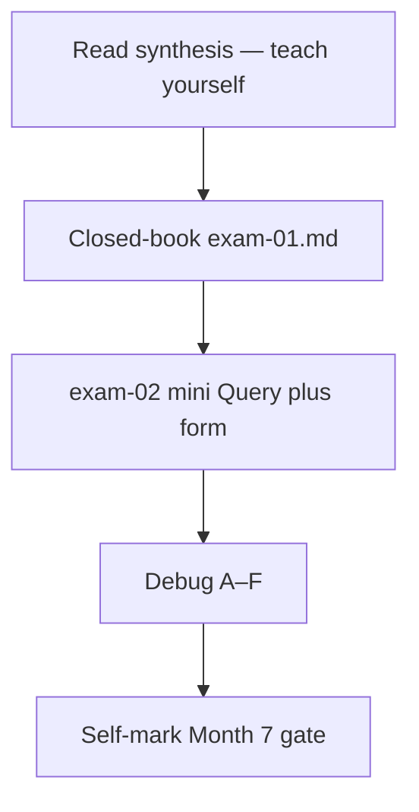
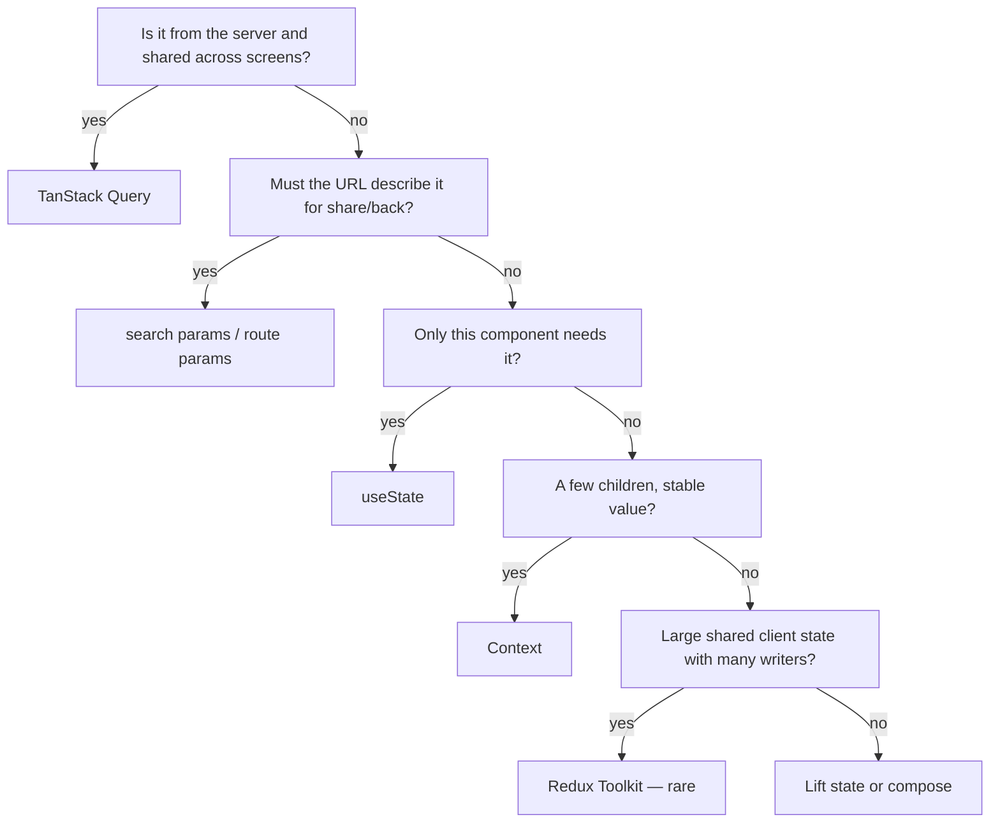

# Month 7 · Week 4 · Day 7
# Month 7 Exam + Gate

**Program:** Full-Stack Mastery · 18 months  
**Phase:** 2 — Modern frontend  
**Month index:** [../../README.md](../../README.md)  
**Week 4:** [1](day-01.md) · [2](day-02.md) · [3](day-03.md) · [4](day-04.md) · [5](day-05.md) · [6](day-06.md) · Day 7 (today)  
**Week rhythm today:** Monthly exam  
**Study time:** 3–4 focused hours

Textbook files stay **closed** except:

- **this file** (synthesis + exam blocks + self-mark),
- [Month 7 README](../../README.md) **for the gate table wording**,
- `full_stack_project_requirements_2026/project_04_react_admin_dashboard.md` **only** when self-marking Project 4 rows — not as a source to paste.

Repair forgotten facts from **this synthesis**, not from Week 1–4 day files and not from a dashboard tutorial.

Work in `~\fullstack-lab\month-07-exam\` for exam evidence. The mini-app is **not** Project 4 and is **not** copied from `~/ops-dashboard/`. Do **not** start Month 8 because the calendar moved.

---

## How to read this chapter

This file is the **exam and the teacher**. The synthesis is written so a student whose Weeks 1–4 notes are foggy can still re-learn the month from **today’s pages**, then prove it with the blocks and the gate.



During blocks 1–3, other day files stay closed. If you go blank, re-read **this synthesis**. AI may not write exam-01, the mini-app, or DEBUG answers.

---

## Today's contract

Teach Month 7 aloud from this synthesis and show evidence for every gate row.

**Today's gate** is the Month 7 Gate table at the end — not “I attended four weeks.”

---

## Time box

| Block | Minutes | Work |
|---|---|---|
| 0 | 25 | Read the complete explanation; speak it |
| 1 | 40 | Closed-book `exam-01.md` — where state lives |
| 2 | 50 | Mini Query + form app |
| 3 | 30 | Debug A–F |
| 4 | 20 | Project 4 evidence glance (repo, not rewrite) |
| 5 | 20 | Self-mark + retro |

---

## Month 7 synthesis (the lesson, in this book)

**Where state lives:** server shared → **TanStack Query**; share/back → **URL**; local widget → **useState**; few stable children → **Context** (mock auth); large shared client many writers → **Redux Toolkit (rare)**; drafts → **RHF**; JSON at the edge → **Zod**. Do not put GET lists in Redux or Context-as-cache. Do not `useEffect` fetch the same resource Query owns.

**Query v5:** `useQuery({ queryKey, queryFn, enabled })`. Keys include every input (`id`, `q`, `page`). **`isPending`:** no success data yet. **`isFetching`:** in flight, including background. **`staleTime`:** freshness. **`gcTime`:** unused memory (not `cacheTime`). **`useMutation({ mutationFn })`**. Success: **`queryClient.invalidateQueries({ queryKey: ['items'] })`**. **`setQueryData`** can lie. Pagination: page in the key; **`placeholderData: keepPreviousData`** from `@tanstack/react-query`. Optimistic UI is a bet; skip when ids are fake or GET will not match.

**Zod:** `unknown` in; `parse` throws; `safeParse` branches; **`z.infer<typeof schema>`**. In `queryFn` after `ok`.

**RHF:** `register` vs `control`/`Controller`; `handleSubmit`; **`zodResolver`** from `@hookform/resolvers/zod`. Errors: message **`id`**, **`aria-describedby`**, **`aria-invalid`**. Client Zod is UX; server is authority; **`setError`** maps parsed error JSON. No invalidate on 400. No `reset()` on 400.

**RTK literacy:** `configureStore`, `createSlice`, dispatch, selector, thunk. Query already cached the server. Isolated counter only. Project 4 default: **no Redux**.

**App structure:** `features/<name>/` (schema, api, queries, pages). Shared UI does not import features. **Error boundary is a class** (`getDerivedStateFromError`, `componentDidCatch`); pages stay functions; wrap `Outlet`. **`lazy` + `Suspense`** for route JS; Query `isPending` is still HTTP. Profiler before `memo`. **MSW** (or equivalent) intercepts `fetch` in tests. Tests: QueryClient per test, **`retry: false`**.

**Project 4:** `~/ops-dashboard/` — list/detail/mutation, forms, tests, `STATE_ARCHITECTURE.md`, no unjustified Redux. This textbook never contained that source.

**Wrong belief:** “Redux is how React apps store API data.”  
**Correct:** API data is server state. Query already caches, dedupes, and refetches.

---

# Complete explanation — Month 7 you must still own

## 1. Decision order (Week 3)



**Examples you must invent from *your* Project 4** in exam-01: list rows, `?q=`, `?page=`, mock user, login draft, “filters open,” detail `:id`. If any example is “I would put it in Redux” without surviving the tree, it is wrong.

Passwords never go in the URL. `queryClient.clear()` on logout is a privacy habit for a shared computer.

## 2. Query (Week 1)

One `QueryClient` — not `new QueryClient()` every `App` render. Provider in `main.tsx`.

```tsx
useQuery({
  queryKey: ["items", { q, page }],
  queryFn: () => listItems({ q, page }),
  enabled: true,
  placeholderData: keepPreviousData,
});
```

```tsx
useMutation({
  mutationFn: createItem,
  onSuccess: () => {
    void queryClient.invalidateQueries({ queryKey: ["items"] });
  },
});
```

Prefix invalidation refreshes filtered keys. `queryFn` throws on `!ok` and on Zod failure. Empty array is success.

**`keepPreviousData`** is passed as **`placeholderData`**, not as `keepPreviousData: true`.

Tests: wrap a **new** client, `retry: false`, mock HTTP (MSW or `fetch`), assert loading **then** success.

## 3. Forms (Week 2)

```tsx
useForm<CreateItem>({
  resolver: zodResolver(createItemSchema),
  defaultValues: { name: "" },
});
```

Native fields: `{...register("name")}` plus label `id` / `htmlFor`. Custom widgets: `Controller`. `handleSubmit(onValid)`. `noValidate` on the form.

```tsx
aria-invalid={errors.name ? true : undefined}
aria-describedby={errors.name ? "name-error" : undefined}
```

```tsx
<p id="name-error" role="alert">{errors.name.message}</p>
```

`setError("name", { type: "server", message })` after `safeParse` of an error DTO. `setError("root", ...)` for form-level failures.

## 4. RTK (Week 3 literacy)

Store + slice + action + reducer + selector. Thunk: async `dispatch`. A `fetchItems` thunk duplicates Query. Two `Counter` components share one store; two `useState` counters do not. That is the legitimate demo. The list is the illegitimate demo.

## 5. Boundaries, split, measure (Week 4)

**Class** `ErrorBoundary` only: render-phase descendant throws. Not events, not `queryFn`, not Promises. Wrap `Outlet`. Fallback heading + retry button.

**`lazy(() => import("./Page"))`** + **`Suspense` fallback `role="status"`**. Default export or map named export. Suspense waits for **JS**; `isPending` waits for **data**.

Profiler first. `memo` / `useMemo` / `useCallback` are not decorations. Cheaper: keys, context identity, not blanking on refetch, lazy routes.

MSW `http.get` / `http.post` + `setupServer`. `onUnhandledRequest: "error"`. Zod still parses.

Feature folders: `features/items/{itemSchema,api,queries,pages}`. Button does not import items API.

---

# Block 0 — Speak the synthesis (25 min)

Out loud, this file open once, then closed:

1. Four kinds of state + form state.  
2. Query flags and clocks.  
3. Mutation + invalidate.  
4. Zod parse vs `as`.  
5. RHF a11y trio.  
6. Client vs server validation.  
7. When Redux is unnecessary.  
8. Why the error boundary is a class.  
9. lazy vs isPending.  
10. Test wrapper rules.

If a topic is under two true sentences, it is weak — it will show up on the self-mark.

---

# Block 1 — Closed-book: where state lives (40 min)

Create `~\fullstack-lab\month-07-exam\exam-01.md`.

**No editor for code.** Prose. For **each** row, name the place and a **wrong** place you refuse:

| Piece | Your Project 4 (or a named fiction if Project 4 is incomplete — say so) |
|---|---|
| Entity list rows | |
| Entity detail | |
| Search `q` | |
| Page number | |
| Mock signed-in user | |
| Login password draft | |
| Create-form title draft | |
| “Advanced filters expanded” | |
| After-create list refresh mechanism | |
| GET cache identity | |

Then **two paragraphs**: (1) why Query is not Redux; (2) why URL `q` belongs in `queryKey`.

If Project 4 is incomplete, exam-01 must **say** which rows are lab-only. Honesty is part of the grade.

---

# Block 2 — Mini Query + form app (50 min)

`~\fullstack-lab\month-07-exam\gate-notices\` — new Vite `react-ts`. **Not** the ops dashboard.

**Northline campus notices** (new copy):

1. `QueryClientProvider`. One client.  
2. In-memory **or** MSW `/api/notices`. Zod `noticeSchema` / list schema.  
3. `useQuery({ queryKey: ["notices"], queryFn })`. `isPending` / `isError` / empty / list.  
4. RHF + `zodResolver` create form: `title` required. Accessible errors.  
5. `useMutation({ mutationFn })`; `onSuccess` → `invalidateQueries({ queryKey: ["notices"] })`.  
6. Duplicate title → mock 409 → `setError("title", ...)`.  
7. Optional: `ErrorBoundary` class around the main page; a hidden crash button.  
8. No Redux. No Project 4 files. CSS you type. One `h1`.

`gate-notices/NOTES.md`: keys you used; why invalidate lives in `onSuccess`.

```powershell
cd ~\fullstack-lab\month-07
# exam lives beside month-07 labs:
cd ~\fullstack-lab
mkdir month-07-exam -ErrorAction SilentlyContinue
cd month-07-exam
npm create vite@latest gate-notices -- --template react-ts
```

Serve HTTP. Do not `file://`.

---

# Block 3 — Debug (30 min)

`~\fullstack-lab\month-07-exam\exam-03-DEBUG.md` — **full sentences**.

**A. Missing key part** — `queryFn` uses `q` but key is `["notices"]`.  

**B. No invalidate** — POST 201, list unchanged.  

**C. `isPending` vs `isFetching`** — refetch blanks the table.  

**D. 400 treated as success** — no `ok` check; error JSON parsed as the created notice.  

**E. Missing `aria-describedby`** — red text, input not described.  

**F. List in Redux (or Context) “and Query”** — two caches; create updates one. Which tool to delete.

Stretch **G.** `cacheTime` in a v5 app.  
Stretch **H.** Function `ErrorBoundary` with `useEffect`.  

Labels are the exam. Write **your** causes and fixes.

---

# Block 4 — Project 4 glance (20 min)

Do **not** implement new features unless a gate row is a five-minute fix (typo, missing invalidate you already understand). Record in `exam-04-PROJECT.md`:

- Path to repo  
- Query list/detail/mutation: true/false  
- RHF+Zod + a11y errors: true/false  
- Tests + mock HTTP: true/false  
- STATE_ARCHITECTURE.md: true/false  
- Unjustified Redux: true/false (true means **fail**)  

Open the spec only to compare the Definition of Done list.

---

# Block 5 — Self-mark + retro (20 min)

Fill the table. **Pass** requires evidence (exam files + Project 4). Wishful ticking is a failed exam.

`exam-05-retro.md`: solid / weak / hours / whether Month 8 is allowed.

```powershell
cd ~\fullstack-lab
git add month-07-exam
git commit -m "Complete Month 7 exam evidence."
```

Project 4 commits stay in **its** repository.

---

# Self-mark — Month 7 Gate

From the [Month 7 README](../../README.md). True **without a tutorial**:

| # | Gate item | Evidence | Pass? |
|---|---|---|---|
| 1 | Explain server vs client vs URL vs form state with examples from *your* Project 4 | exam-01 | |
| 2 | Query: `queryKey`, `queryFn`, `staleTime`, invalidation after mutation, pagination in the key | exam-02 + Project 4 | |
| 3 | Parse unknown JSON with Zod at the boundary | exam-02 and/or Project 4 `api` | |
| 4 | Create/edit form with RHF + Zod and accessible field errors | exam-02 + Project 4 | |
| 5 | `STATE_ARCHITECTURE.md` classifies state and does **not** invent Redux for the list cache | `~/ops-dashboard/` | |
| 6 | Loading / empty / error; error boundary catches a render crash | Project 4 + optional exam-02 | |
| 7 | Measure before memo; route-level lazy exists **or** is honestly deferred | Project 4 README / PROFILE | |
| 8 | Project 4 Definition of Done: Query, forms, tests, mock API (MSW or equivalent) | spec checklist + exam-04 | |

All eight must be **pass** before Month 8. If Project 4 is almost done, finish it **before** you claim the gate — the exam mini-app does not replace item 8.

### How to fail honestly (examples)

- Gate 1 fail: exam-01 lists “items in Redux” as the plan.  
- Gate 2 fail: mini-app has `useEffect` fetch and no `queryKey`.  
- Gate 3 fail: `as Notice[]` with no Zod.  
- Gate 4 fail: errors are a red `div` with no `aria-describedby`.  
- Gate 5 fail: STATE_ARCHITECTURE.md missing or it puts the list in RTK “for practice.”  
- Gate 6 fail: no empty state; no class boundary.  
- Gate 7 fail: `memo` on every export and no PROFILE note; no lazy and no deferral sentence.  
- Gate 8 fail: no tests, or tests that `querySelector(".card")` only.

Passing is not a vibe. It is ticks with paths.

---

## Definition of done

- [ ] exam-01.md classifies state in prose
- [ ] gate-notices mini-app runs (Query + RHF + invalidate + a11y error)
- [ ] exam-03-DEBUG.md has A–F
- [ ] Self-mark table filled honestly
- [ ] Gate 8 false if create/edit is still Month 6 controlled-only with no Zod
- [ ] Commit exists in fullstack-lab for exam evidence

---

## If you passed

Month 8 is **Python** — a new language in the same program. Do not start it until this gate is true. Open [Month 8](../../month-08/README.md) only then. Frontend skills stay: you will consume APIs you write with the same Query/Zod habits.

## If you did not pass

Repair the failed rows. Re-run this file’s blocks that failed. Do not “move on and come back.” Month 8 will not teach `invalidateQueries`.

---

## Optional review links

Repair from this synthesis first. These pages are for later checking after the exam.

- [Month 7 README](../../README.md)
- [TanStack Query: Mutations](https://tanstack.com/query/latest/docs/framework/react/guides/mutations)
- [React Hook Form: Get started](https://react-hook-form.com/get-started)
- [React: Error boundaries](https://react.dev/reference/react/Component#catching-rendering-errors-with-an-error-boundary)
- [MSW: Getting started](https://mswjs.io/docs/getting-started)
