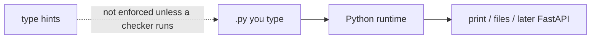

# Month 8 — Python Engineering Foundations

**Program:** Full-Stack Mastery Textbook  
**Phase:** 3 — Python and backend engineering  
**Length:** 4 weeks · 7 days each · 3–4 focused hours/day  
**Prereq:** Month 7 gate passed (Project 4 state architecture is honest). You do **not** need FastAPI yet.  
**This month’s job:** Make **Python** yours as a language and an engineering environment — not as “JavaScript with different punctuation,” and not as “the thing FastAPI uses.” Build **Project 5**, a tested CLI.

**Project 5:** `full_stack_project_requirements_2026/project_05_tested_python_cli.md`. This textbook will **not** give you the CLI source.

**This textbook is the lesson.** Syntax, data structures, modules, exceptions, typing, `uv`, Ruff, and pytest are explained in the day files. Optional review links at the end are for later rechecking, not first learning.

These files are written to render as **web pages**: relative links, tables, and **Mermaid** diagrams.

---

## How this textbook is organized

```
month-08/
  README.md     ← you are here
  week-01/      syntax, values, types, strings, conditions, loops
  week-02/      lists, tuples, dicts, sets, comprehensions, iterators
  week-03/      functions, modules, packages, exceptions, classes, composition
  week-04/      hints, dataclasses, decorators, generators, context managers,
                files, JSON, venv, uv, Ruff, pytest, async fundamentals
                + Project 5 + Month 8 exam
```

Labs: `~\fullstack-lab\month-08\`.  
Project 5: **its own Git repository** (e.g. `~/task-cli/`).

---

## Python is not JavaScript (learn this on Day 1, keep it all month)

| Idea | JavaScript | Python |
|---|---|---|
| Blocks | `{ }` | **Indentation** |
| Null | `null` / `undefined` | **`None`** |
| Booleans | `true` / `false` | **`True` / `False`** (capital) |
| Equality | `===` (this course) | **`==`** for values; **`is`** for identity (`None`) |
| Arrays | `[]`, mutate freely | **list**; **tuple** is immutable |
| Objects as maps | `{}` | **`dict`** |
| Export | `export function` | **modules** are files; `import` |
| `this` | messy | **`self`** on methods — explicit |
| Types | erased TS | **hints** + optional checker; runtime is still dynamic |

**Wrong belief:** “I’ll write Python by translating each JS line.”  
**Correct:** that produces `for i in range(len(items))` everywhere and classes for no reason. The Month 8 gate is that you **stopped** doing that.



---

## Month 8 Gate

True **without a tutorial** and **without leaning on JavaScript habits**:

1. Run Python in a **virtual environment** you can explain (`uv` this course).
2. Use lists, dicts, sets, tuples, and a **comprehension** on purpose.
3. Write functions and **modules**; raise and catch **exceptions** intentionally (not `except:` everything).
4. Use **type hints** and a **dataclass** where a bag of fields is the model.
5. Read/write **JSON** with missing/malformed file handling (Month 3 `localStorage` lesson, now files).
6. **pytest** covers create/update/delete/search and invalid data; at least one **fixture**.
7. Project 5 CLI: commands exist, business logic is **not** all in `print` statements.
8. Ruff (and tests) pass.

If any item is false, do not start Month 9.

---

## What this month must teach (complete list)

| Week | Must learn | Must practice |
|---|---|---|
| 1 | Syntax, names, types, strings, `if`/`elif`/`else`, `for`/`while`, `None`, `==` vs `is` | REPL + scripts; FizzBuzz without JS punctuation |
| 2 | list/tuple/dict/set, slicing, comprehensions, `for x in`, iterators | Transform collections without index soup |
| 3 | `def`, args, modules, packages, `try`/`except`/`else`/`finally`, classes, composition | Multi-file lab; a class only when it earns it |
| 4 | hints, dataclass, decorator idea, generator, `with`, files, JSON, `uv`, `pyproject.toml`, Ruff, pytest, `async` peek | Project 5 |

**Avoid:** Django this month; FastAPI this month; wrapping every line in `try`; a class for every noun; `from module import *`.

Horizontal:

- **Debugging:** read tracebacks from the **bottom**; `python -m pdb` optional.
- **Security:** do not `eval` user input; JSON is data not code.
- **Tests:** pytest from Week 4 (simple `assert` scripts may start earlier).
- **Git:** Project 5 from commit one.

---

## Tools this month

| Tool | Why |
|---|---|
| Python 3.12+ | Language. Check `python --version` / `py -3 --version` on Windows. |
| `uv` | Fast installer + venv + lock. Roadmap requires it. |
| `pyproject.toml` | Project metadata and tool config. |
| Ruff | Lint + format (replaces a pile of older tools). |
| pytest | Tests. |
| PowerShell | Windows. Use `uv run pytest`, not a mystery global Python. |

---

## Weekly rhythm

Same as Month 1. Week 4 Day 7 is the Month 8 exam + gate.

---

## Start

Open [week-01/day-01.md](week-01/day-01.md).

When Month 8’s gate is true, continue with [Month 9 — FastAPI](../month-09/README.md).
