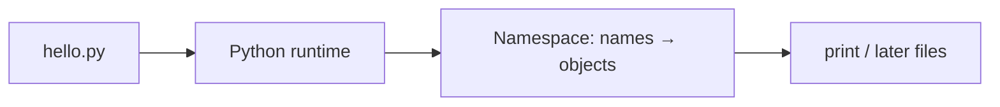

# Month 8 · Week 1 · Day 1
# Python as a Language: Names, Types, Scripts, and the REPL

**Program:** Full-Stack Mastery · 18 months  
**Phase:** 3 — Python and backend  
**Month index:** [../../README.md](../../README.md)  
**Week 1:** Day 1 (today) · [2](day-02.md) · [3](day-03.md) · [4](day-04.md) · [5](day-05.md) · [6](day-06.md) · [7](day-07.md)  
**Week rhythm today:** Learn + type-along  
**Student state:** Month 7 gate passed. You are fluent in TypeScript. That is a **liability** today if you translate line by line.  
**Study time:** 3–4 focused hours

**This week covers:** syntax, values/types, strings, conditions, loops.

Today: how Python **runs**, how you **name** values, how **types** work at runtime, `print`, the **REPL**, and a first script. Strings, `if`, and loops deepen on Day 2. Do not skip them.

Project 5 is **not** this week. Labs: `~\fullstack-lab\month-08\`.

---

## How to use this textbook

1. Read a section. Close it. Say it in Python words, not JS words.
2. Type every lab. Do not paste.
3. When the traceback appears, read it **from the bottom** (file, line, exception type).
4. Optional review links are for later rechecking.

---

## How to read this chapter

Python is a **programming language** with its own runtime. The file is `.py`. You run it with the **`python`** (or `py -3`) program. There is no browser `#root` today. There is a **terminal**.

If you have never used Python, use this picture. JavaScript in the browser is a guest in a tab. Python is a **program you start**, like `node file.js` — and this course will treat it that way: scripts, then modules, then (Month 9) a server.



---

## Today's contract

By the end of this day you will be able to:

1. Check **Python 3.12+** on Windows (`py -3 --version` or `python --version`).
2. Explain **indentation** as syntax, not style.
3. Bind names; use **`None`**, **`True`/`False`**, `int`/`float`/`str`.
4. Use **`==`** for equality and **`is`** for identity (especially `None`).
5. Run a **script** and the **REPL**.
6. State why this course uses **`uv`** (install Day 1 or Day 4 — today at least a working Python).

**Today's gate.** Closed-book:

> Python uses indentation for blocks. `None` is the empty object. `==` compares values; `is` asks “same object?” — use `is None`. Types exist at runtime but hints are optional until a checker runs. I will not write `{ }` blocks.

---

## Time box

| Block | Minutes | Work |
|---|---|---|
| A | 50 | Theory |
| B | 50 | REPL + first script |
| C | 70 | Independent drills |
| D | 20 | Git |
| E | 15 | Recall |

---

# Block A — Theory

## 1. What Python is (in this program)

**Python** is the language of Months 8–18’s backend: CLIs, FastAPI, tests, scripts.

It is **dynamically typed**: a name can point at an `int` and later a `str` unless you discipline yourself (Week 4 hints + Ruff/checker). It is **strongly typed**: `"3" + 1` is a **TypeError**, not `"31"`. That one fact will save you from JS’s `+` coercion.

**Wrong belief:** “Python is slower so it is for beginners.”  
**Correct:** we use it because the ecosystem for APIs, data, and ops is excellent. You will still care about complexity (Month 3 Big-O intuition).

**Wrong belief:** “I’ll run Python in the browser.”  
**Correct:** browser stays JS/TS. Python runs on your machine and later on a server.

---

## 2. How you run it on Windows

In PowerShell:

```powershell
py -3 --version
```

If that fails, try `python --version`. You want **3.12 or 3.13**. The Microsoft Store stub that says “install Python” is a trap — install from [python.org](https://www.python.org/downloads/) and tick **Add python.exe to PATH**, or use `uv` to install a Python (Week 4 will standardize on `uv`; if you already know `uv python install 3.12`, do that).

**REPL** (read-eval-print loop):

```powershell
py -3
```

You see `>>>`. Type `2 + 2`, Enter, see `4`. Exit: `exit()` or Ctrl+Z then Enter.

**Script:** a file `hello.py`. Run:

```powershell
py -3 hello.py
```

Not `node hello.py`. Not opening the file in a browser.

---

## 3. Indentation is syntax

```python
def greet(name):
    message = f"Hello, {name}"
    print(message)
```

The colon `:` starts a block. The **indented** lines are the block. Mix tabs and spaces and you get **TabError**. This course: **4 spaces**. Configure the editor.

There are no `{ }` for blocks. There is no `let`. A new name is created by **assignment**:

```python
title = "Harbor clinic"
title = "Harbor vet"  # rebound — like let, not const
```

Convention: `UPPER` for constants by culture, not by the compiler.

Comments: `# to the end of the line`.

---

## 4. Names and objects

In Python, **`title = "Harbor"`** means: create a string object, attach the name `title` to it.

Several names can point at the **same** object (you know this from JS references).

```python
a = []
b = a
b.append(1)  # a is [1] too
```

**`==`** asks: same **value**?  
**`is`** asks: same **object**?

```python
x = None
x is None       # True — the right way to check None
x == None       # works, linters hate it
[] == []        # True (equal values)
[] is []        # False (two lists)
```

**Wrong belief:** “I’ll use `===`.”  
**Correct:** there is no `===`. Use `==`. For `None`, use `is`.

---

## 5. Built-in types you must name today

| Type | Examples | Notes |
|---|---|---|
| `int` | `42`, `-1` | Unlimited size in practice |
| `float` | `3.14` | Binary floats; same caution as JS numbers |
| `str` | `"hi"`, `'hi'`, `f"hi {name}"` | Immutable |
| `bool` | `True`, `False` | Capitalized. `True` is a `int` subclass (1) — do not abuse that |
| `NoneType` | `None` | Only one `None` |

```python
type(42)        # <class 'int'>
isinstance(42, int)  # True
```

**Truthy/falsy (preview Day 2):** `False`, `None`, `0`, `0.0`, `""`, `[]`, `{}`, `set()` are falsy. Everything else is truthy. `"0"` is truthy (same trap as JS).

---

## 6. `print` and f-strings

```python
name = "Ada"
print("Hello,", name)
print(f"Hello, {name}")
```

`print` is a **function** (parentheses required). It is not `console.log` but it is the same *job* in a script.

f-strings: `f"...{expression}..."`. Prefer them over `%s` or `.format` in this course.

---

## 7. A program is statements

```python
"""hello.py — first script."""

course = "Full-stack"
week = 1
week = week + 1
print(f"Week {week} of {course}")
```

`"""docstring"""` at the top of a file or function is a string used as documentation. You will use it in Project 5.

There is no `const`. Discipline is yours. Week 4 type hints document intent.

---

## 8. `uv` in one paragraph (so Week 4 is not a surprise)

**`uv`** is a fast Python package and project manager. It creates virtual environments and installs dependencies from `pyproject.toml`. The roadmap requires it for Project 5. Today: a global `py -3` is enough to **learn syntax**. Do not `pip install` random packages globally. If `uv` is already installed (`uv --version`), you may `uv init` a lab folder today — optional.

---

# Block B — Type-along

```powershell
mkdir ~\fullstack-lab\month-08\week-01\day-01 -Force
cd ~\fullstack-lab\month-08\week-01\day-01
py -3 --version > VERSION.txt
```

### B1 — REPL

Start `py -3`. Type (do not paste a block if the REPL hates it — one line at a time):

```python
2 + 2
"3" + "1"
# then try "3" + 1  — read TypeError
True == 1
None is None
```

Write `REPL.txt`: what `"3" + 1` did; why that is *better* than JS `"3" + 1 === "31"` for catching bugs.

### B2 — Script

Create `hello.py` as in section 7. Run `py -3 hello.py`. Confirm output.

### B3 — Indentation error

Add a `def greet():` and a `print` that is **not** indented. Run. Read `IndentationError`. Fix.

---

# Block C — Independent

`values.py` — print labeled results:

1. Three names of different types (`int`, `str`, `bool`).
2. `type(None)`, `type(True)`.
3. Two lists `a` and `b = a`; append to `b`; print `a` — explain in a comment.
4. `==` vs `is` on two equal strings that are short (you may see `is` True because of interning — write that `is` is still the wrong tool for string equality).
5. An f-string with your Python version **typed from VERSION.txt**.

`HABITS.txt` (paragraphs): three JS habits you refuse this month (`===`, `{ }` blocks, `const`).

```powershell
cd ~\fullstack-lab
git add month-08
git commit -m "Month 8 Day 1: Python names, types, first script."
```

---

# Block E — Recall

1. How do you start the REPL on Windows?  
2. What does indentation mean?  
3. `==` vs `is`.  
4. Why `"3" + 1` throws.  
5. What is `None`?

---

## Definition of done

- [ ] `py -3 --version` recorded
- [ ] REPL experiment written
- [ ] `hello.py` runs
- [ ] I can explain a traceback’s last line
- [ ] HABITS.txt names JS translations I will not do
- [ ] Commit exists

---

## Optional review links

Python’s model is explained in this chapter.

- [Python tutorial: Using the interpreter](https://docs.python.org/3/tutorial/interpreter.html)
- [Python tutorial: Informal intro](https://docs.python.org/3/tutorial/introduction.html)

---

## Tomorrow

Strings, `if`/`elif`/`else`, `for` and `while`, truthiness — without `===` and without `{ }`.
